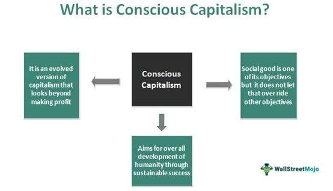

## Table of Contents

## What is conscious capitalism?

Conscious capitalism is a way of doing business that focuses on creating value for everyone involved. It's not just about making money for the company and its shareholders. Instead, it's about thinking about the needs of employees, customers, the community, and the environment. The idea is that when a business takes care of all these groups, it can be more successful and sustainable in the long run.

The main idea behind conscious capitalism is that businesses should have a higher purpose than just making profits. This purpose could be something like improving people's lives or helping the planet. When a business operates with this kind of purpose, it can inspire and motivate everyone involved, from employees to customers. This can lead to better products, happier workers, and a stronger community. By focusing on these broader goals, conscious capitalism aims to make the world a better place while still being profitable.

## What are the core principles of conscious capitalism?

Conscious capitalism is based on four main ideas. The first one is having a higher purpose. This means a company should aim to do more than just make money. It should try to make a positive impact on the world, like helping people or the environment. When a company has a clear purpose like this, it can inspire everyone involved, from workers to customers, to do their best.

The second idea is stakeholder orientation. This means a company should think about the needs of everyone it affects, not just the people who own the company. This includes employees, customers, suppliers, the community, and the environment. By taking care of all these groups, a company can be more successful and sustainable in the long run. The third idea is conscious leadership. Leaders in a conscious company should focus on serving others and creating a positive culture. They should lead with honesty and care about the well-being of everyone involved. The last idea is conscious culture. This means creating a workplace where everyone feels valued and respected. A good culture helps people work together well and feel happy and motivated.

## How does conscious capitalism differ from traditional capitalism?

Conscious capitalism and traditional capitalism are different in how they see the main goal of a business. Traditional capitalism focuses mainly on making money for the owners and shareholders of a company. The idea is that if a business makes a profit, it's doing well. But conscious capitalism believes that a business should have a bigger purpose than just making money. It should aim to do good things for people and the planet. This means thinking about the needs of everyone the business affects, not just the people who own it.

In traditional capitalism, the focus is often on short-term profits. Companies might do things that make money quickly, even if it's not good for employees, customers, or the environment in the long run. Conscious capitalism, on the other hand, looks at the big picture. It tries to create value for everyone involved, including workers, customers, the community, and the environment. This approach can lead to a more sustainable business that lasts longer and makes the world a better place. Conscious capitalism believes that by taking care of all these groups, a company can actually be more successful in the long run.

## Can you provide examples of companies practicing conscious capitalism?

One example of a company practicing conscious capitalism is Patagonia. This company makes outdoor clothing and gear. Patagonia's higher purpose is to save the environment. They do this by using recycled materials, giving money to environmental causes, and encouraging customers to fix their old clothes instead of buying new ones. They also treat their workers well and try to make sure their factories are safe and fair. This shows how Patagonia cares about more than just making money.

Another example is Southwest Airlines. This airline's purpose is to connect people and make travel fun and affordable. They focus on treating their employees well, which makes the employees happy and want to do a good job. Happy employees then make customers happy. Southwest also tries to help the communities they serve by supporting local charities and events. By thinking about everyone involved, Southwest shows how conscious capitalism can work in the airline industry.

A third example is The Container Store. This company sells storage and organization products. Their purpose is to help people live more organized lives. The Container Store focuses on treating employees well by paying them more than other stores and giving them good training. They also try to help their customers by offering great service and useful products. By taking care of employees and customers, The Container Store shows how conscious capitalism can make a business successful and helpful to people.

## What are the benefits of implementing conscious capitalism in a business?

Implementing conscious capitalism in a business can lead to many benefits. One big benefit is that it can make employees happier and more motivated. When a company has a higher purpose and treats its workers well, employees feel valued and respected. This can lead to lower turnover, meaning fewer people leave the job, and higher productivity, meaning workers do a better job. Happy employees also tend to provide better service to customers, which can lead to more loyal customers and more sales.

Another benefit is that conscious capitalism can help a business be more sustainable in the long run. By thinking about the needs of everyone involved, including the community and the environment, a company can build stronger relationships and avoid problems that might come up if it only focused on making money. This approach can also attract more customers who want to support businesses that do good things. Over time, this can lead to a stronger, more successful business that makes a positive impact on the world.

## How does conscious capitalism impact stakeholders, including employees and the community?

Conscious capitalism impacts employees by making them feel valued and respected. When a company has a higher purpose and treats its workers well, employees are happier and more motivated. This means they are less likely to leave their jobs and more likely to work hard. Happy employees also provide better service to customers, which can lead to more loyal customers and more sales. Overall, conscious capitalism can create a positive work environment where everyone feels like they are part of something important.

The community also benefits from conscious capitalism. Companies that follow this approach often give back to the places where they do business. They might support local charities, help with community projects, or try to reduce their impact on the environment. This can make the community a better place to live and work. When a business takes care of the community, it can build strong relationships and gain support from local people. This can help the business be more successful and sustainable in the long run.

## What challenges might a company face when transitioning to conscious capitalism?

When a company decides to switch to conscious capitalism, it might face some challenges. One big challenge is changing the way people think. In traditional capitalism, the focus is on making money for the owners and shareholders. But in conscious capitalism, the focus is on doing good for everyone involved, including employees, customers, and the community. It can be hard to get everyone in the company to understand and support this new way of thinking. Some people might worry that focusing on more than just profits could hurt the business.

Another challenge is the cost. Trying to do good things for the environment or the community can be expensive. For example, using eco-friendly materials or paying employees more can cost more money in the short term. This might make it harder for the company to make a profit right away. But if the company sticks with it, these costs can pay off in the long run by making the business more sustainable and attracting more customers who want to support a company that does good things.

## How can a company measure the success of its conscious capitalism initiatives?

A company can measure the success of its conscious capitalism initiatives by looking at how happy and motivated its employees are. When a company treats its workers well and has a higher purpose, employees feel valued. This can lead to lower turnover, which means fewer people leave their jobs, and higher productivity, which means workers do a better job. The company can ask employees how they feel through surveys or by talking to them directly. If employees are happier and staying longer, it's a sign that the conscious capitalism initiatives are working.

Another way to measure success is by looking at the impact on the community and the environment. A company can track how much it gives back to the community, like money donated to charities or time spent on community projects. It can also measure its environmental impact, like how much it reduces waste or uses eco-friendly materials. If the company is making a positive difference in these areas, it's a good sign that its conscious capitalism efforts are successful. By looking at these things, a company can see if it's really making the world a better place while still being profitable.

## What role does leadership play in fostering a culture of conscious capitalism?

Leadership is very important in making a culture of conscious capitalism. Leaders need to show everyone in the company what conscious capitalism means. They do this by talking about the company's higher purpose and making sure everyone understands it. Leaders also need to treat employees well and make them feel valued. When leaders act this way, it helps create a positive culture where everyone wants to do their best and help the company succeed.

Leaders also need to make decisions that think about everyone the company affects, not just the owners. This means considering the needs of employees, customers, the community, and the environment. When leaders focus on these groups, it helps the company be more successful in the long run. By leading with honesty and care, leaders can make the company a better place to work and help it make a positive impact on the world.

## How does conscious capitalism contribute to sustainable business practices?

Conscious capitalism helps businesses be more sustainable by focusing on more than just making money. It encourages companies to think about the needs of everyone they affect, like employees, customers, the community, and the environment. When a business takes care of these groups, it can avoid problems that might come up if it only focused on profits. For example, by using eco-friendly materials and reducing waste, a company can help the environment. This makes the business more sustainable because it can last longer and keep making a positive impact.

Also, conscious capitalism can lead to happier employees who stay with the company longer. When workers feel valued and respected, they are more likely to do a good job and help the company succeed. This can make the business more stable and successful over time. By treating everyone well and thinking about the big picture, conscious capitalism helps companies be more sustainable and make the world a better place.

## What are some criticisms or limitations of the conscious capitalism model?

Some people think that conscious capitalism might not work as well as it sounds. One big worry is that focusing on more than just making money could make it harder for a company to be profitable. Businesses need to make money to stay open, and trying to do good things for everyone might cost a lot. For example, using eco-friendly materials or paying employees more can be expensive. If a company spends too much on these things, it might not make enough profit to keep going.

Another criticism is that it can be hard to measure if conscious capitalism is really working. It's easy to see if a company is making money, but it's harder to know if employees are happier or if the community is better off. Some people think that companies might say they are doing good things just to look good, but not really change much. This can make it hard to trust that a company is truly following the principles of conscious capitalism.

## How can conscious capitalism be integrated into global business strategies?

Conscious capitalism can be integrated into global business strategies by making sure that a company's higher purpose guides all its decisions, no matter where it operates. This means thinking about the needs of employees, customers, the community, and the environment in every country where the business works. For example, a company might use eco-friendly materials in all its factories around the world or make sure its workers everywhere are treated well. By doing this, the company can build a strong, positive reputation globally and attract customers who want to support businesses that do good things.

Another way to integrate conscious capitalism into global strategies is by having leaders who understand and support this approach in every part of the business. These leaders need to talk about the company's purpose and make sure everyone in the company, from the headquarters to the smallest branch, knows what it means. They should also make decisions that consider the impact on all stakeholders, not just the shareholders. By having leaders who live these values, a company can create a global culture that helps it be successful and sustainable in the long run.

## References & Further Reading

[1]: ["Conscious Capitalism: Liberating the Heroic Spirit of Business"](https://archive.org/details/consciouscapital0000mack) by John Mackey and Raj Sisodia

[2]: ["The Responsible Company: What We've Learned from Patagonia's First 40 Years"](https://www.amazon.com/Responsible-Company-Learned-Patagonias-First/dp/0980122783) by Yvon Chouinard and Vincent Stanley

[3]: ["Sustainable Investing: Revolutions in Theory and Practice"](https://www.taylorfrancis.com/books/edit/10.4324/9781315558837/sustainable-investing-cary-krosinsky-sophie-purdom) edited by Cary Krosinsky and Sophie Purdom

[4]: Khan, M., Serafeim, G., & Yoon, A. (2016). ["Corporate Sustainability: First Evidence on Materiality."](https://papers.ssrn.com/sol3/papers.cfm?abstract_id=2575912) The Accounting Review, 91(6), 1697–1724.

[5]: Eccles, R. G., Ioannou, I., & Serafeim, G. (2014). ["The Impact of Corporate Sustainability on Organizational Processes and Performance."](https://www.jstor.org/stable/24550546) Management Science, 60(11), 2835–2857.