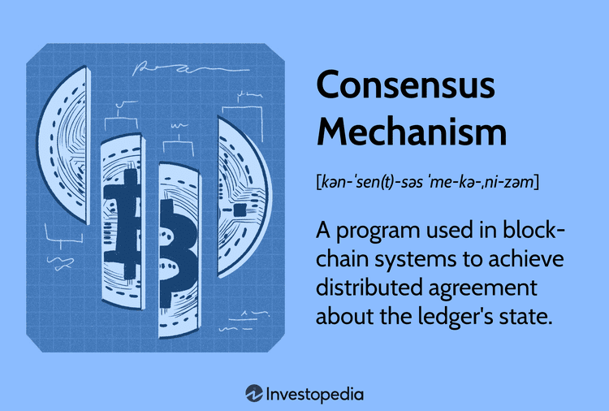

In the rapidly evolving world of cryptocurrencies, understanding the underlying technologies is paramount for success in the market. One of the foundational elements of these technologies is the blockchain consensus mechanism. These mechanisms are pivotal in ensuring that digital currencies function securely and efficiently. They provide a means for the distributed network of nodes to agree on the validity of transactions, thereby maintaining the integrity of the blockchain without the need for a central authority. Various types of consensus mechanisms, such as Proof of Work and Proof of Stake, each offer unique advantages and challenges, influencing factors like transaction speed, security, and energy consumption.

Alongside this, algorithmic trading has emerged as an essential tool for traders seeking to capitalize on the often volatile cryptocurrency market. By leveraging automated software, traders can execute trades based on pre-defined criteria, thus optimizing strategies to navigate the rapid price fluctuations typical of digital assets. This approach not only enhances the speed and efficiency of transactions but also incorporates complex data analysis and risk management strategies.



This article explores the intersection between blockchain consensus mechanisms and cryptocurrency algorithmic trading. It provides a comprehensive overview of how these technologies interact to influence trading activities. By understanding their interplay, traders and developers can better evaluate market opportunities and challenges, ultimately maximizing their success while minimizing risks. As both blockchain technology and algorithmic trading continue to evolve, staying informed and adaptable will be crucial for anyone involved in the cryptocurrency space.

## Table of Contents

## Understanding Blockchain Consensus Mechanisms

Blockchain technology relies on consensus mechanisms to validate and confirm transactions across its network without a central governing authority. These mechanisms are critical in maintaining the ledger's integrity and agreement among all participating nodes. A blockchain's structure is inherently decentralized, with consensus mechanisms serving to synchronize all nodes, ensuring they share the same state and history of transactions.

There are several types of consensus mechanisms, each with unique properties:

1. **Proof of Work (PoW):** This is the original consensus mechanism used by Bitcoin and several other cryptocurrencies. It requires participants — known as miners — to solve complex mathematical puzzles. Successfully solving these puzzles allows miners to add a block to the blockchain and receive cryptocurrency as a reward. While PoW is renowned for its security and robustness, it is criticized for being energy-intensive and relatively slow in transaction processing.

2. **Proof of Stake (PoS):** Unlike PoW, PoS relies on validators who hold and lock a certain amount of cryptocurrency as a stake. The probability of being chosen to validate a block and earn rewards often depends on the amount of cryptocurrency held. PoS is known for being energy-efficient and faster than PoW, but it also raises concerns about centralization as those with more wealth can potentially have more control over the network.

3. **Delegated Proof of Stake (DPoS):** This is a variation of PoS where stakeholders elect a small group of delegates to validate transactions and create new blocks. DPoS is highly efficient and can process transactions at a much higher speed than PoW and traditional PoS. However, its representative nature can lead to centralized control if not managed properly.

Each of these mechanisms offers distinct advantages and challenges. For instance, while PoW is lauded for its security, its low efficiency and high energy consumption are significant concerns. PoS offers efficiency but may lead to a concentration of power. DPoS provides speed and flexibility but risks centralization.

Consensus mechanisms not only enable decentralization by preventing any single entity from controlling the ledger but also protect against double-spending by ensuring that all transactions are accounted for and cannot be duplicated. By establishing a system of trust among anonymous participants, consensus mechanisms enhance the reliability of blockchain networks.

For traders, understanding these mechanisms is vital as they directly influence a [cryptocurrency](/wiki/cryptocurrency) network's efficiency, security, transaction speed, and scalability. Each mechanism's properties can affect a network's transaction fees and overall user experience, influencing the cryptocurrency's value and appeal to the market. Thus, a thorough grasp of consensus mechanisms empowers traders to assess the strengths and weaknesses of various cryptocurrencies, aiding informed decision-making based on a given blockchain's operational characteristics.

## The Importance of Consensus Mechanisms in Cryptocurrency Trading

The choice of consensus mechanism in a blockchain network is pivotal in shaping the transactional landscape of cryptocurrencies, significantly impacting transaction speed, fees, and overall network security. These aspects are critical considerations for traders in the cryptocurrency market as they directly influence trading efficiency and costs. For instance, Proof of Work (PoW), employed by Bitcoin, is robust in terms of security but often criticized for slower transaction times and higher energy consumption compared to alternatives such as Proof of Stake (PoS). PoS mechanisms offer the advantage of faster confirmation times and reduced energy demands, which can translate into lower transaction fees—a crucial [factor](/wiki/factor-investing) for traders focusing on maximizing profitability through frequent transactions. 

Shortcomings in consensus mechanisms can expose vulnerabilities within a blockchain network, which, in turn, may affect the price stability and viability of the associated cryptocurrency. If a network's consensus protocol is perceived as insecure or inefficient, it can deter users and traders, leading to decreased demand and lower market valuations. For instance, networks that suffer from 51% attacks—where a single entity gains control over the majority of the network's hash rate—experience a rapid loss in trust, causing their cryptocurrency value to plummet. 

Traders must, therefore, evaluate the reliability and resilience of a blockchain's consensus mechanism when formulating their trading strategies. A stable and secure mechanism indicates lower risk, while networks undergoing frequent upgrades or changes present a different set of considerations. Such modifications can introduce [volatility](/wiki/volatility-trading-strategies) in the market, offering both risks and emerging opportunities for traders. The ability to anticipate or rapidly respond to these changes can be a decisive edge in trading, as it requires staying informed about the technical and operational shifts within the blockchain environment.

Understanding consensus protocols is essential for traders to make informed decisions about which digital assets to invest in or hold. Knowledge of the underlying consensus mechanism allows traders to assess the long-term sustainability and security prospects of a cryptocurrency, aiding in the evaluation of its potential market growth or depreciation. This strategic understanding supports more calculated investment decisions, optimizing portfolio performance in a competitive and continuously evolving digital market.

## Algorithmic Trading in the Cryptocurrency Market

Algorithmic trading in the cryptocurrency market employs automated software systems to execute transactions based on predefined criteria and real-time market data. This approach is particularly advantageous in the highly volatile cryptocurrency markets, where the ability to rapidly process and act upon information can provide a significant competitive edge over manual trading strategies. 

One key advantage of [algorithmic trading](/wiki/algorithmic-trading) is its ability to deliver unparalleled speed and efficiency, surpassing human capabilities. Automated systems can quickly analyze large volumes of market data, identify patterns, and execute trades within milliseconds, which is crucial in fast-moving markets where conditions can change rapidly. For instance, during periods of market volatility, the ability of an algorithm to execute trades instantaneously can prevent potential losses while capitalizing on short-lived opportunities.

Algorithms can be engineered to achieve various objectives, such as analyzing market trends and executing [arbitrage](/wiki/arbitrage) strategies. Trend analysis algorithms can detect directional patterns over specified timeframes, enabling trades that align with broader market movements. Arbitrage strategies, on the other hand, exploit price differences across different exchanges or markets to generate profit, buying low in one market and selling high in another all within a split second. 

Risk management is another critical area where algorithmic trading excels. Algorithms can incorporate risk management protocols that adjust exposure based on the level of market volatility or predetermined risk thresholds. For example, by using techniques such as dynamic stop-loss orders or volatility-adjusted position sizing, algorithms can manage risk effectively, thereby safeguarding investments.

The integration of [artificial intelligence](/wiki/ai-artificial-intelligence) (AI) and [machine learning](/wiki/machine-learning) into algorithmic trading brings additional sophistication and adaptability. These technologies enable the development of self-learning algorithms that continuously improve their performance by learning from market conditions and adjusting their strategies accordingly. Machine learning models can identify complex patterns that are not readily apparent to human analysts, thus providing a deeper understanding of market dynamics and enhancing decision-making processes.

Traders often leverage [backtesting](/wiki/backtesting) and optimization techniques to refine their algorithms prior to deployment. Backtesting involves simulating an algorithm's performance using historical market data to evaluate its effectiveness. By testing against past market conditions, traders can identify potential weaknesses and make necessary adjustments. Optimization further enhances algorithm performance by fine-tuning parameters to maximize returns while controlling for risk.

In summary, algorithmic trading in the cryptocurrency market combines automation with advanced data analysis techniques to provide a strategic advantage. The use of AI, machine learning, and robust optimization methodologies enables traders to adapt to ever-changing market conditions and capitalize on opportunities with increased precision and reduced risk. As these technologies continue to evolve, they hold the potential to reshape the dynamics of the cryptocurrency trading landscape.

## Integrating Blockchain Consensus Mechanisms with Algo Trading

Incorporating knowledge of blockchain consensus mechanisms into algorithmic trading models is essential for optimizing performance in cryptocurrency markets. The choice and implementation of consensus protocols significantly affect the operational characteristics of a blockchain, including transaction speed, security, and throughput. Traders, therefore, benefit from integrating awareness of these factors into their algorithms to enhance decision-making.

Algorithms can be designed to respond dynamically to changes or irregularities in a blockchain's consensus mechanism. For instance, shifts from a Proof of Work (PoW) to a Proof of Stake (PoS) system can lead to variations in transaction confirmation times and network fees. By incorporating real-time monitoring and immediate response capabilities, such algorithms can adapt trading strategies accordingly to mitigate risks or exploit new opportunities. 

Moreover, data derived from blockchain networks serves as a valuable input for forecasting trends and recognizing trading opportunities. By analyzing patterns related to transaction [volume](/wiki/volume-trading-strategy), network latency, and block creation rates, these algorithms can infer potential market movements. This predictive ability relies on the algorithm's capacity to interpret consensus mechanism outputs and any resulting market behavior effectively. 

Understanding how blockchain mechanics and algo trading interact confers a strategic advantage. Traders can gain insights into market structure and behavior through the metrics generated by consensus mechanisms themselves, such as block time, fork frequency, or the hash rate in PoW systems. By programming algorithms to factor in these parameters, traders can anticipate and react to potential market shifts with greater precision.

Continuous learning and adaptation are crucial for maximizing the utility of both blockchain consensus information and algorithmic trading. As the crypto market and its underlying technologies evolve, algorithms must be continually refined to embrace new data inputs and adjust to emerging market patterns. This iterative improvement process ensures that trading strategies remain relevant and effective, securing a competitive edge in an ever-changing landscape.

For example, consider the implementation of a basic strategy in Python that utilizes blockchain consensus data:

```python
import requests
import numpy as np

def fetch_blockchain_data():
    response = requests.get('https://api.blockchain.info/stats')
    data = response.json()
    return data['market_price_usd'], data['hash_rate']

def trading_decision(price, hash_rate):
    if hash_rate > np.mean(hash_rate[-10:]):  # Assessing recent hash rate trend
        if price > np.mean(price[-10:]):  # Checking if price is also trending upward
            return "BUY"
        return "HOLD"
    else:
        return "SELL"

# Historical record of price and hash rate for decision-making
price_data = []
hash_rate_data = []

for _ in range(100):  # Simulate fetching data over time
    price, hash_rate = fetch_blockchain_data()
    price_data.append(price)
    hash_rate_data.append(hash_rate)
    decision = trading_decision(price_data, hash_rate_data)
    print(f"Trading Decision: {decision}")
```

This script fetches blockchain data to guide trading decisions based on recent hash rate trends and price movements. By expanding this basic framework, traders can incorporate complex consensus-related factors into their automated trading strategies, adapting to technological and market developments effectively.

## Challenges and Future Directions

The integration of blockchain consensus mechanisms and algorithmic trading is not without its challenges. One prominent issue is the security vulnerabilities inherent in blockchain networks. These vulnerabilities can stem from weaknesses in the consensus mechanisms themselves or from potential exploits that bad actors might leverage. For instance, a 51% attack, where a single entity gains control of the majority of the network's mining power, can disrupt the execution of trading algorithms by introducing fraudulent transactions or by reordering the blockchain.

Another significant hurdle comes from evolving regulatory landscapes. As regulatory bodies around the world begin to impose clearer guidelines on cryptocurrencies and trading activities, these developments can reshape both algorithmic trading strategies and blockchain technologies. For instance, compliance requirements may alter how data is used in algorithmic strategies, or restrict the types of assets that can be traded through these platforms.

Looking towards future innovations, the development of more sophisticated consensus mechanisms may help bridge gaps with algorithmic trading platforms. These innovations could provide more secure and efficient ways to process transactions, reducing latency and thereby enhancing the performance of trading algorithms. Additionally, improvements in AI and machine learning techniques used in algorithmic trading may better anticipate and react to changes in blockchain operation, such as forks or updates to the consensus protocol.

To remain successful amidst these challenges, staying informed and developing adaptive strategies is crucial. This involves continuously monitoring technological advancements and regulatory changes, as well as fostering a deep understanding of both blockchain and trading technologies. This knowledge will enable market participants to create more resilient trading systems that are well-equipped to handle future disruptions and capitalize on emerging opportunities.

## Conclusion

Blockchain consensus mechanisms and algorithmic trading are essential components of the cryptocurrency ecosystem, each bringing unique strengths that, when combined, can maximize trading success and mitigate risks. Understanding how these technologies interact is vital for traders seeking to navigate the complexities of the crypto markets.

The intersection of blockchain consensus mechanisms with algo trading presents numerous opportunities for innovation and a competitive edge in trading strategies. Consensus mechanisms, such as Proof of Work and Proof of Stake, form the backbone of blockchain security and transaction validation. Their attributes influence trading by affecting network speed, transaction costs, and security—all critical variables for algorithmic strategies. Traders who effectively integrate knowledge of consensus protocols into their algorithms can anticipate changes in trading conditions and capitalize on emerging opportunities.

As the cryptocurrency market continues to evolve and mature, the significance of these technologies is poised to grow. Advances in both blockchain technology and algorithmic trading offer a fertile ground for developing more sophisticated and efficient trading systems. Innovation in consensus mechanisms may lead to more scalable and secure networks, enhancing the trading environment, while advances in algorithmic trading, especially through the use of AI and machine learning, will enable more refined and adaptive strategies.

The dynamic nature of cryptocurrency markets demands that traders and developers remain adaptable and continuously informed. Staying abreast of technological advancements and regulatory changes is crucial in leveraging these developments for effective trading. As both blockchain mechanisms and trading algorithms advance, those who invest in understanding and adapting to these changes are likely to benefit from the enhanced capabilities and insights they offer, positioning themselves advantageously in the competitive crypto trading landscape.

## References & Further Reading

[1]: Nakamoto, S. (2008). ["Bitcoin: A Peer-to-Peer Electronic Cash System."](https://nakamotoinstitute.org/library/bitcoin/) 

[2]: Buterin, V. (2013). ["Ethereum Whitepaper."](https://ethereum.org/en/whitepaper/)

[3]: Proof of Stake Alliance. (2020). ["Proof of Stake: Frequently Asked Questions."](https://www.proofofstakealliance.org/key-issues)

[4]: "Mastering Bitcoin: Unlocking Digital Cryptocurrencies" by Andreas M. Antonopoulos

[5]: Treleaven, P., Galas, M., & Lalchand, V. (2017). ["Algorithmic trading review."](https://dl.acm.org/doi/10.1145/2500117) Communications of the ACM, 56(11), 76-85.

[6]: Gandal, N., & Halaburda, H. (2016). ["Can We Predict the Winner in a Market with Network Effects? Competition in Cryptocurrency Market."](https://papers.ssrn.com/sol3/papers.cfm?abstract_id=2832836) 

[7]: Chatterjee, R., & Misra, R. (2019). ["Factors affecting algorithmic trading adoption by Indian stock market traders: A qualitative study."](https://pmc.ncbi.nlm.nih.gov/articles/PMC9093649/) Academy of Accounting and Financial Studies Journal.

[8]: Wood, G. (2014). ["Ethereum: A secure decentralised generalised transaction ledger."](https://ethereum.github.io/yellowpaper/paper.pdf)

[9]: "Algorithmic Trading: Winning Strategies and Their Rationale" by Ernie Chan