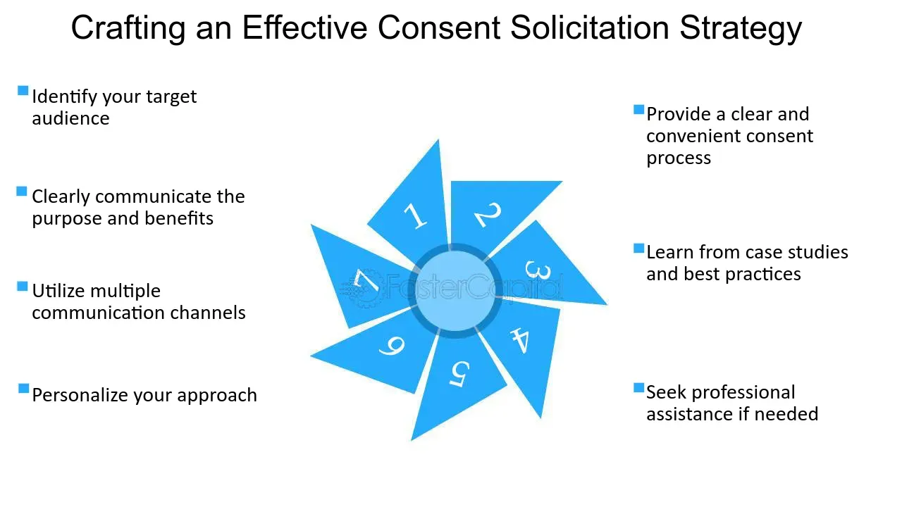

## Table of Contents

## What is consent solicitation?

Consent solicitation is when a company asks its shareholders for permission to do something important. This could be about changing the company's rules, merging with another company, or making big decisions that need shareholder approval. The company sends out a document explaining what they want to do and why. Shareholders then vote on whether they agree or not.

This process is important because it makes sure that big decisions are made with the approval of the people who own the company. It helps keep things fair and transparent. If most shareholders agree, the company can go ahead with the plan. If not, the company might have to rethink or change their proposal.

## Why is consent solicitation important in business and finance?

Consent solicitation is important in business and finance because it makes sure that big decisions are made with the agreement of the shareholders, who are the owners of the company. When a company wants to do something important like change its rules or merge with another company, it needs to ask its shareholders for permission. This process helps keep things fair and open. It gives shareholders a say in important decisions, which can affect the value of their investment and the direction of the company.

Without consent solicitation, companies could make big changes without telling or asking their shareholders. This could lead to decisions that might not be good for everyone involved. By having a formal process where shareholders vote on important issues, it helps build trust between the company and its investors. It also makes sure that the company thinks carefully about its plans and explains them clearly, so shareholders can make informed decisions.

## How does the process of consent solicitation work?

When a company wants to make a big change, like changing its rules or merging with another company, it starts the consent solicitation process. The company sends out a document called a consent solicitation statement to all its shareholders. This document explains what the company wants to do and why. It includes all the important details so shareholders can understand the change and decide if they agree with it.

Once shareholders get the document, they have a chance to vote on the proposal. They can either agree (give consent) or disagree (withhold consent). Shareholders usually have a set amount of time to send back their votes. If enough shareholders agree, the company can go ahead with the change. If not enough agree, the company might need to change its plan or try again later. This process makes sure that big decisions are made with the approval of the people who own the company.

## Who typically initiates a consent solicitation?

A consent solicitation is usually started by the company itself. The company's board of directors or management team decides that they want to make a big change, like changing the company's rules or merging with another company. They then start the process by sending out a document to all the shareholders. This document explains what they want to do and why.

Sometimes, a group of shareholders can also start a consent solicitation. If they think the company should do something different, they can work together to ask other shareholders for their support. They will also send out a document explaining their plan and why they think it's a good idea. This way, shareholders can vote on whether they agree with the group's idea or not.

## What are the common methods used to solicit consent?

Companies usually send out a document called a consent solicitation statement to all their shareholders. This document explains what the company wants to do and why. Shareholders can read the document and then vote on whether they agree or not. They can send their votes back by mail or through an online voting system. Sometimes, companies also hold meetings where shareholders can come and vote in person.

In some cases, a group of shareholders might want to make a change. They can start their own consent solicitation by sending out a document to other shareholders. This document explains their idea and why they think it's a good one. Other shareholders can then vote on whether they agree with the group's plan. This can be done by mail, online, or at a meeting. Both ways help make sure that big decisions are made with the approval of the shareholders.

## What are the legal requirements for a consent solicitation?

When a company wants to ask its shareholders for permission to do something big, like change its rules or merge with another company, it has to follow certain legal rules. These rules make sure that the process is fair and open. The company has to send out a document called a consent solicitation statement to all its shareholders. This document has to explain clearly what the company wants to do and why. It also has to give all the important details so shareholders can make a good decision. The company has to give shareholders enough time to read the document and send back their votes.

The law also says that the company has to be honest in the document. It can't leave out important information or say things that aren't true. If a group of shareholders wants to start their own consent solicitation, they have to follow similar rules. They also have to send out a document explaining their plan and why they think it's a good idea. Both the company and the group of shareholders have to make sure they follow all the legal steps so the process is fair for everyone.

## How can consent solicitation impact bondholders or shareholders?

Consent solicitation can have a big impact on bondholders and shareholders. When a company wants to make a big change, like changing its rules or merging with another company, it asks its shareholders for permission. If the shareholders agree, the company can go ahead with the change. This can affect the value of the shares or bonds they own. For example, if the change is good for the company, it might make the shares or bonds worth more. But if the change is bad, it could make them worth less.

Bondholders can also be affected by consent solicitation. Sometimes, a company might want to change the terms of its bonds, like the [interest rate](/wiki/interest-rate-trading-strategies) or when the bonds need to be paid back. If bondholders agree to these changes, it can change how much money they get from the bonds. If the changes are good for the bondholders, they might get more money. But if the changes are bad, they might get less money or have to wait longer to get paid.

## What are the potential risks associated with consent solicitation?

Consent solicitation can have some risks for both the company and its shareholders. For the company, if not enough shareholders agree to the proposed change, the company might not be able to go ahead with its plans. This can be a big problem if the change was important for the company's future. Also, the process of asking for consent can be expensive and take a lot of time. If the company doesn't explain the change well, shareholders might not understand it and vote against it, even if it's a good idea.

For shareholders, the main risk is that the change might not be good for them. If they agree to the change, it could make their shares or bonds worth less. They might also feel pressured to vote quickly without enough time to think about it carefully. Sometimes, a group of shareholders might try to push through a change that's good for them but bad for other shareholders. This can lead to disagreements and make it hard for the company to move forward.

## Can you explain a real-world example of consent solicitation?

In 2019, a big company called Occidental Petroleum wanted to buy another company called Anadarko Petroleum. To do this, Occidental needed money, so they decided to issue new bonds. But, they needed to change some rules about these bonds first. They sent a document to all their bondholders explaining what they wanted to do and why. The bondholders then had to vote on whether they agreed with the change or not. If enough bondholders said yes, Occidental could go ahead with the bond changes and use the money to buy Anadarko.

In the end, enough bondholders agreed, so Occidental was able to change the bond rules and complete the purchase of Anadarko. This example shows how consent solicitation works in real life. A company wants to make a big change, so they ask their shareholders or bondholders for permission. If most of them agree, the company can go ahead with the change. If not, the company might have to find another way to do what they want.

## How does consent solicitation differ from a tender offer?

Consent solicitation and a tender offer are two different ways a company can interact with its shareholders or bondholders. In a consent solicitation, the company wants to make a big change, like changing its rules or merging with another company. They send a document to all their shareholders or bondholders explaining what they want to do and why. The shareholders or bondholders then vote on whether they agree with the change. If enough of them say yes, the company can go ahead with the change. This process is about getting permission to do something.

A tender offer is different because it's about buying shares or bonds. In a tender offer, the company or another group offers to buy shares or bonds from the shareholders or bondholders at a specific price. They send out a document explaining the offer and how much they will pay. Shareholders or bondholders can choose to sell their shares or bonds if they want to. The goal of a tender offer is to get control of the company or to change who owns the shares or bonds. It's not about getting permission to make a change, but about buying ownership.

## What strategies can be employed to maximize the success of a consent solicitation?

To make a consent solicitation successful, a company needs to clearly explain what they want to do and why it's a good idea. They should use simple language in their document so everyone can understand it. It's also important to send the document to all shareholders or bondholders and give them enough time to read it and vote. The company can also talk to big shareholders or bondholders before sending out the document to get their support. This can help because if big investors agree, others might follow.

Another strategy is to make sure the proposal is good for the shareholders or bondholders. If they think the change will make their shares or bonds worth more, they are more likely to say yes. The company can also use meetings or calls to answer questions and explain the plan better. If a group of shareholders wants to start their own consent solicitation, they should work together and explain why their idea is better. By being clear, fair, and showing how the change will help, a company can increase the chances that enough people will agree to the proposal.

## What are the latest trends and innovations in consent solicitation practices?

The latest trends in consent solicitation show that companies are using more technology to make the process easier and faster. Many companies now use online voting systems instead of sending out paper documents. This makes it simpler for shareholders or bondholders to vote from anywhere. Also, companies are using social media and email to talk to shareholders or bondholders more often. This helps them explain their plans better and answer questions quickly. Using technology like this can make more people want to vote and help the company get the consent they need.

Another trend is that companies are trying to be more open and honest about what they want to do. They are putting more information in their documents and making sure it's easy to understand. This helps shareholders or bondholders make better decisions. Some companies are also working with groups of shareholders to make sure everyone's voice is heard. This can make the process fairer and more likely to succeed. By being clear and working together, companies can build trust and get more people to agree to their plans.

## References & Further Reading

[1]: Leland, H. E. (2007). ["Financial Synergies and the Optimal Scope of the Firm: Implications for Mergers, Spinoffs, and Structured Finance."](https://www.jstor.org/stable/4622286) The Journal of Finance, 62(2), 765-807.

[2]: Altman, E. I., & Hotchkiss, E. (2006). ["Corporate Financial Distress and Bankruptcy: Predict and Avoid Bankruptcy, Analyze and Invest in Distressed Debt"](https://onlinelibrary.wiley.com/doi/book/10.1002/9781118267806). John Wiley & Sons.

[3]: Hendershott, T., Jones, C. M., & Menkveld, A. J. (2011). ["Does Algorithmic Trading Improve Liquidity?"](https://onlinelibrary.wiley.com/doi/full/10.1111/j.1540-6261.2010.01624.x) The Review of Financial Studies, 24(8), 2757–2790.

[4]: Stulz, R. M. (2010). ["Credit Default Swaps and the Credit Crisis."](https://www.jstor.org/stable/pdf/25703483.pdf) Journal of Economic Perspectives, 24(1), 73-92.

[5]: Duffie, D. (2010). ["Dynamic Asset Pricing Theory."](https://www.semanticscholar.org/paper/Dynamic-Asset-Pricing-Theory-Duffie/baa776c75062e0506a8e739fda10dc409e340aad) Princeton University Press.