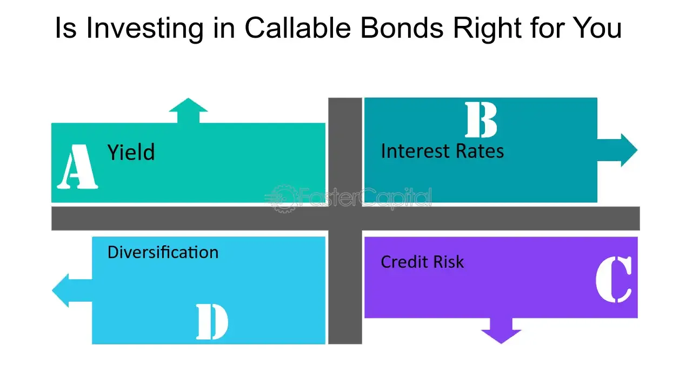

## Table of Contents

## What is a callable bond?

A callable bond is a type of bond that the issuer can choose to pay back before it reaches its due date. This means the company that issued the bond can decide to give the money back to the people who bought the bond earlier than planned. They usually do this when interest rates go down, so they can borrow money again at a lower rate.

When a bond is callable, it can be good for the issuer but not always for the bondholder. If the bond is called, the bondholder gets their money back, but they might not be able to find another investment that pays as much interest. Because of this risk, callable bonds often offer a higher interest rate than bonds that cannot be called early.

## Why do companies issue callable bonds?

Companies issue callable bonds because it gives them flexibility with their debt. If interest rates drop after they issue a bond, they can call it back and then issue new bonds at the lower rate. This saves them money on interest payments over time. It's like refinancing a home loan when rates go down; it can make their financial management easier and more cost-effective.

However, there's a trade-off. Callable bonds usually have to offer a higher [interest rate](/wiki/interest-rate-trading-strategies) to attract investors. This is because investors know there's a risk the bond could be called away from them early, and they might not be able to reinvest their money at the same high rate. So, while callable bonds can be a smart move for the company, they need to balance the benefits of potential savings against the higher cost of borrowing initially.

## What happens when a bond is called?

When a bond is called, the company that issued the bond decides to pay back the money to the investors before the bond's official end date. This usually happens when interest rates have gone down, so the company can borrow money again at a cheaper rate. The company will tell the bondholders that they are calling the bond and will give them their money back, plus any interest that's owed up to the call date.

For the people who own the bond, this can be a bit of a problem. They get their money back, but now they need to find a new place to invest it. If interest rates have gone down, they might not be able to find another investment that pays as well as the bond they just lost. So, while the company saves money, the bondholders might end up with less income from their investments.

## How does calling a bond affect the bondholder?

When a company calls a bond, it means the bondholder gets their money back earlier than expected. The company pays back the full amount of the bond plus any interest that's due up to the call date. This might sound good, but it can actually be a problem for the bondholder.

The reason it's a problem is that the bondholder now has to find a new place to put their money. If interest rates have gone down since they bought the bond, they might not be able to find another investment that pays as much interest. So, even though they get their money back, they might end up [earning](/wiki/earning-announcement) less on their investment than they were before the bond was called.

## What are the financial implications for the issuer when calling a bond?

When a company decides to call a bond, it usually means they want to save money. If interest rates have gone down since they issued the bond, they can call it back and then borrow new money at a lower rate. This helps them pay less in interest over time, which can be good for their finances. It's like getting a new, cheaper loan to replace an old, more expensive one.

However, calling a bond isn't free. The company might have to pay a fee to call the bond, and they need to have enough money on hand to pay back all the bondholders at once. This can be a big expense upfront, but if it saves them more money in the long run, it can still be worth it. So, while calling a bond can help a company save money, it also comes with some costs and planning.

## How can the yield to call be calculated for a callable bond?

Yield to call (YTC) is what you would earn if a callable bond is called back by the company before it fully matures. To find it, you need to know the bond's price, the call price (what the company pays to call the bond back), the coupon rate (the interest the bond pays), and how many years until the earliest possible call date. You then use a formula that figures out the rate of return that makes the present value of all the bond's future payments equal to its current price.

To calculate it, you can use a financial calculator or a spreadsheet. You start with the bond's current market price and the call price. Then, you add up all the interest payments you would get until the call date. You use these numbers in a formula that solves for the yield, which is the rate that makes the total of the discounted future payments equal to the bond's price today. This yield is what you would earn if the bond is called at the earliest possible date.

## What are the potential risks for investors in callable bonds?

When you invest in a callable bond, one big risk is that the company might call the bond back early. This happens if interest rates go down, and the company wants to borrow money again at a cheaper rate. If they call the bond, you get your money back, but now you need to find a new place to invest it. If interest rates are lower now, you might not be able to find another investment that pays as well as your old bond.

Another risk is that callable bonds usually have to offer a higher interest rate to make up for the chance that they could be called early. This means you might be tempted by the higher return, but you also take on more risk. If the bond is called, you might end up with less income than you planned, especially if you can't find a new investment that pays as well. So, while callable bonds can offer good returns, they come with the risk of being called away at a bad time for you.

## How does the call feature impact the bond's pricing and valuation?

The call feature on a bond can make it less valuable to investors because it adds risk. If a company can call the bond back early, it means the investor might not get to enjoy the high interest rate for as long as they hoped. Because of this risk, investors usually want a higher interest rate to buy a callable bond. This means the bond has to be priced to offer a higher yield than a similar bond that can't be called early. So, the call feature can push the bond's price down because investors need more incentive to take on the risk.

On the other hand, the call feature can also affect how the bond is valued over time. If interest rates go down, the chance that the bond will be called goes up. This makes the bond less attractive to new investors because they know it might be called away soon. As a result, the bond's market price might drop even more as the call date gets closer. But if interest rates stay the same or go up, the bond might be seen as safer because it's less likely to be called, and its price might not drop as much. So, the call feature adds a layer of uncertainty that can make the bond's price and value change more than a non-callable bond.

## What strategies can investors use to mitigate the risks of bond calls?

Investors can protect themselves from the risks of bond calls by choosing bonds with longer call protection periods. This means the bond can't be called back by the company for a certain amount of time after it's issued. By [picking](/wiki/asset-class-picking) bonds with longer call protection, investors can enjoy the higher interest rates for a while without worrying about the bond being called away too soon. Another strategy is to look at the bond's yield to call (YTC) instead of just the yield to maturity (YTM). The YTC shows what you would earn if the bond is called at the earliest possible date, which can help you understand the worst-case scenario and plan accordingly.

Another way to manage the risk is to diversify your investments. Instead of putting all your money into callable bonds, you can spread it out across different types of bonds and other investments. This way, if one bond gets called, it won't hurt your whole investment plan. You can also keep an eye on interest rates. If rates are going down, it might be a good time to sell your callable bonds before the company calls them back. By staying informed and adjusting your strategy, you can better handle the risks that come with callable bonds.

## How do interest rate changes influence the likelihood of a bond being called?

When interest rates go down, it becomes more likely that a company will call a bond. This is because the company can borrow money again at a lower rate, which saves them money on interest payments. If a company issued a bond when rates were high, and now rates are lower, they might decide to call the bond back and issue a new one at the lower rate. This is like refinancing a home loan to get a better deal.

On the other hand, if interest rates go up, it's less likely that a bond will be called. The company wouldn't want to pay off the old bond and issue a new one at a higher rate because that would cost them more money. So, they would usually keep the old bond in place and continue paying the interest at the rate they agreed on when they issued it. This means that the bondholders can keep earning the higher interest rate for longer.

## What are the tax consequences for bondholders when a bond is called?

When a bond is called, bondholders might have to pay taxes on the money they get back. If the bond was bought at a price lower than its face value, the difference between what they paid and the face value is called capital gain. This gain is usually taxed as regular income. Also, any interest payments received up to the call date are taxed as income in the year they are received.

However, if the bond was bought at a price higher than its face value, and it's called at the face value, the bondholder might have a capital loss. This loss can sometimes be used to reduce the taxes they owe on other income. It's important for bondholders to keep track of their bond purchases and sales to figure out their tax situation correctly when a bond is called.

## How do callable bonds fit into broader portfolio management and investment strategies?

Callable bonds can be a useful part of a broader investment strategy because they offer higher interest rates than non-callable bonds. This can make them attractive to investors looking for better returns. However, they also come with the risk that the company might call the bond back early, especially if interest rates drop. This means investors need to think carefully about how much of their portfolio they want to put into callable bonds. They might choose to balance these higher-risk bonds with safer investments to spread out their risk.

To manage this risk, investors often look at the bond's yield to call (YTC) to understand the worst-case scenario if the bond is called early. They might also choose bonds with longer call protection periods, which means the bond can't be called back for a while after it's issued. This gives them more time to enjoy the higher interest rates. By diversifying their investments and keeping an eye on interest rate changes, investors can use callable bonds to boost their returns while still managing the risks that come with them.

## What are Investment Strategies with Callable Bonds?

Callable bonds provide an intriguing dimension to investment strategies due to their unique characteristics, chiefly the issuer's option to redeem the bond before maturity. As such, investors employ specific strategies to maximize returns and mitigate potential risks. One such approach is the laddering strategy.

**Laddering Strategy**

The laddering strategy involves purchasing callable bonds with various maturities. This approach helps investors manage interest rate risk more effectively while ensuring a stable income stream. By staggering the maturity dates, investors can reinvest proceeds from maturing bonds at prevailing interest rates, potentially securing higher yields if rates increase. Conversely, if interest rates fall, the remaining bonds in the ladder provide protection against low reinvestment rates.

Mathematically, the laddering strategy can be expressed as follows: consider a sequence of bonds, $B_1, B_2, \ldots, B_n$, with respective maturities $T_1, T_2, \ldots, T_n$, where $T_1 < T_2 < \ldots < T_n$. The maturity distribution can be optimized based on expected interest rate movements and individual risk tolerance. This structured timeline provides regular intervals for reinvestment, leveraging the potential of changing economic conditions.

**Yield-to-Call Analysis**

Yield-to-call (YTC) analysis is crucial when evaluating callable bonds since these bonds may be called before their maturity date. The YTC is the yield an investor receives assuming the bond is called at the earliest opportunity. It is calculated as follows:

$$

YTC = \left( \frac{C + \left( \frac{CP - P}{t} \right)}{\frac{CP + P}{2}} \right) \times 100 
$$

where $C$ is the annual coupon payment, $CP$ is the call price, $P$ is the purchase price, and $t$ is the number of years until the call date. 

Through YTC analysis, investors can better estimate the potential returns and assess the viability of callable bonds within their portfolios. It helps in understanding the sensitivity of bond prices to interest rate changes, facilitating informed decision-making.

**Portfolio Diversification**

Integrating callable bonds with a range of asset classes enhances portfolio diversification, reducing overall investment risk. Diversification ensures that a portfolio is not overly reliant on any single asset type, protecting against unsystematic risks. Callable bonds, alongside equities, traditional non-callable bonds, real estate, and commodities, create a resilient investment mix. This diversification is critical in navigating varying market environments, particularly in volatile times.

By combining callable bonds structured through laddering strategies and analyzed via yield-to-call metrics, investors can optimize their portfolios for risk-adjusted returns. Callable bonds stand out not only for their potential to elevate yield through their higher interest rates compared to non-callable counterparts but also for their strategic role in safeguarding income streams against interest rate fluctuations.

## How can callable bonds be integrated with algorithmic trading?

The integration of callable bonds with [algorithmic trading](/wiki/algorithmic-trading) presents a unique opportunity to enhance portfolio management by swiftly identifying and exploiting undervalued or mispriced securities. Callable bonds, with their inherent option-like features, provide complex investment opportunities, and leveraging algorithmic trading can enhance decision-making and execution in this dynamic market environment.

Algorithmic trading utilizes sophisticated algorithms to automatically execute trades at speeds and frequencies that are impossible for a human trader. By applying these algorithms to callable bonds, investors can efficiently adjust their strategies in response to fluctuating market conditions. Given the interest rate sensitivity and unique call features of these bonds, algorithmic trading can optimize investment decisions by dynamically assessing market data, and recalibrating positions to optimize yields.

**Dynamic Strategy Adjustment**

Algorithms can dynamically adjust strategies by continuously analyzing market trends, interest rate movements, and bond valuations. For instance, consider an algorithm designed to calculate the yield-to-call (YTC) for a set of targeted callable bonds. The YTC is a crucial metric, especially when interest rates are volatile, as it estimates the return an investor can expect if the bond is called.

$$
\text{YTC} = \frac{C + \frac{(P - CP)}{t}}{\frac{(P + CP)}{2}}
$$

Where $C$ is the annual coupon payment, $P$ is the call price, $CP$ is the current price, and $t$ is the time in years until the call date.

By continuously calculating the YTC and comparing it to current interest rates and market yield curves, an algorithm can recommend buying or selling positions in callable bonds to maximize returns.

**Python Example:**

To illustrate this integration, consider the example of a Python-based algorithm designed to adjust holdings in callable bonds based on their YTC. This example uses the Pandas and NumPy libraries for financial data analysis:

```python
import pandas as pd
import numpy as np

# Sample data for callable bonds
data = {
    'bond_id': ['A', 'B', 'C'],
    'current_price': [102, 105, 101],
    'call_price': [100, 100, 100],
    'annual_coupon': [5, 4.5, 5.5],
    'years_to_call': [3, 5, 4]
}

# DataFrame creation
df = pd.DataFrame(data)

# Calculating YTC for each bond
df['ytc'] = (df['annual_coupon'] + 
             (df['call_price'] - df['current_price']) / df['years_to_call']) / \
            ((df['call_price'] + df['current_price']) / 2)

# Determine action based on YTC and a benchmark rate
benchmark_rate = 0.04
df['action'] = np.where(df['ytc'] > benchmark_rate, 'Buy', 'Sell')

print(df[['bond_id', 'ytc', 'action']])
```

This script calculates the YTC for a series of bonds and suggests buying a bond if its YTC is greater than a predefined benchmark rate (e.g., 4%). This decision-making process is automated, allowing for swift adjustments to the portfolio to capitalize on evolving opportunities.

**Synergies and Benefits**

The synergy between callable bonds and algorithmic trading lies in the ability to quickly process vast amounts of market data, enabling precise and informed investment decisions. Moreover, the use of algorithms reduces the potential for human-related errors and biases, ensuring that investment strategies are executed with precision and consistency.

In essence, integrating callable bonds with algorithmic trading allows investors to actively and efficiently manage their portfolio's exposure to interest rate risk and optimize returns on callable bond investments, making this combination a potent toolkit for modern finance.

## How does risk management apply to callable bonds and algo trading?

Callable bonds, while offering attractive yields, [carry](/wiki/carry-trading) specific risks, most notably reinvestment risk. This risk emerges because issuers may opt to call the bonds before maturity, often when interest rates decline, forcing investors to reinvest the principal at a lower interest rate. To quantify the potential return on such bonds, investors utilize yield-to-call (YTC) calculations. YTC takes into account the callable date and the call price, offering investors a metric to evaluate the return should the bond be redeemed early. The formula for yield-to-call is similar to yield-to-maturity but adjusted for the call date:

$$
YTC = \left( \frac{C + \frac{Call\ Price - P}{n}}{\frac{Call\ Price + P}{2}} \right)
$$

where $C$ is the annual coupon payment, $Call\ Price$ is the price at which the bond can be called, $P$ is the market price of the bond, and $n$ is the number of years until the call date. 

Algorithmic trading (algo trading), though advantageous for its speed and precision, is not devoid of risks. Key technological risks include software bugs, hardware failures, and network disruptions. Such issues can lead to incorrect order executions or missed trading signals, potentially resulting in significant financial losses. To mitigate these risks, rigorous testing and continuous system monitoring are essential. Backtesting with historical data helps ensure the reliability and effectiveness of the trading algorithms under various market conditions. Implementing real-time monitoring and redundant systems can safeguard against unexpected failures.

Risk management for portfolios leveraging callable bonds and algo trading techniques necessitates a diversified strategy. Integrating stress-testing procedures helps assess potential impacts from extreme market events on callable bonds. Hedging strategies, using financial derivatives like options, can protect against adverse movements in interest rates and market [volatility](/wiki/volatility-trading-strategies). This holistic approach helps in addressing both financial and technological risks, allowing investors to optimize their portfolios while minimizing potential downsides.

## References & Further Reading

[1]: ["Advances in Financial Machine Learning"](https://www.amazon.com/Advances-Financial-Machine-Learning-Marcos/dp/1119482089) by Marcos Lopez de Prado

[2]: ["Quantitative Trading: How to Build Your Own Algorithmic Trading Business"](https://www.amazon.com/Quantitative-Trading-Build-Algorithmic-Business/dp/1119800064) by Ernest P. Chan

[3]: ["Evidence-Based Technical Analysis: Applying the Scientific Method and Statistical Inference to Trading Signals"](https://www.amazon.com/Evidence-Based-Technical-Analysis-Scientific-Statistical/dp/0470008741) by David Aronson

[4]: ["Machine Learning for Algorithmic Trading"](https://github.com/stefan-jansen/machine-learning-for-trading) by Stefan Jansen

[5]: Fabozzi, F. J. (1999). ["Handbook of Fixed Income Securities."](https://www.amazon.com/Handbook-Fixed-Income-Securities-Ninth/dp/1260473899) McGraw-Hill. 

[6]: DeGennaro, R. P. (1990). ["The Quality Spread and Changes in the Callability of Bond Issues."](https://www.scirp.org/reference/referencespapers?referenceid=1232528) Journal of Financial Services Research.