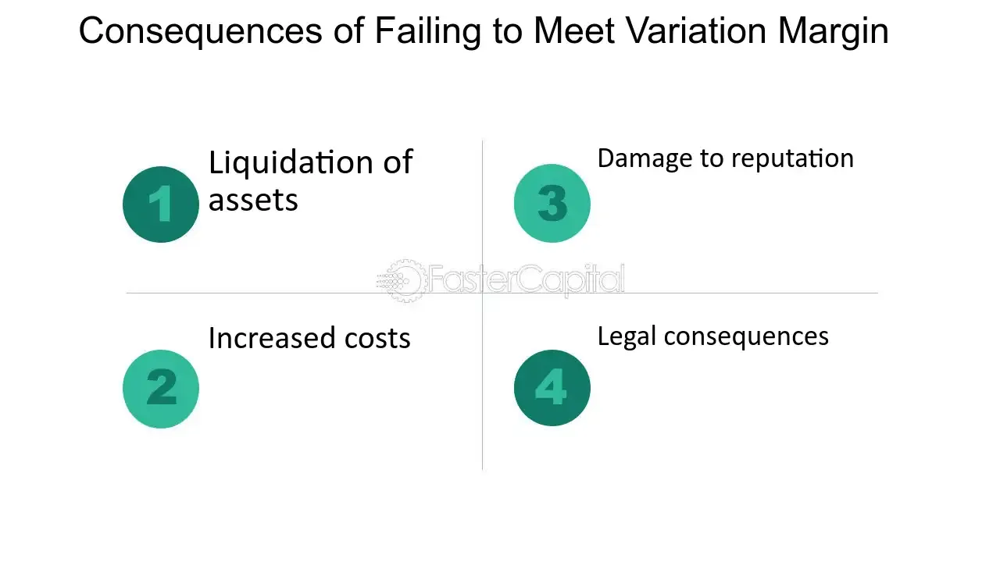

## Table of Contents

## What is a margin call?

A margin call happens when the value of the stocks you bought with borrowed money goes down a lot. When you use a margin account, you're borrowing money from your broker to buy more stocks than you could with just your own money. If the stocks you bought lose value, your broker might ask you to put more money into your account or sell some of your stocks to cover the loan. This is called a margin call.

If you don't meet the margin call by adding more money or selling stocks, your broker can sell your stocks without asking you. This is to make sure they get their money back. It's important to understand margin calls because they can lead to big losses if the market goes against you. Always be careful when using borrowed money to invest.

## Why do margin calls happen?

Margin calls happen when the value of the stocks you bought with borrowed money drops a lot. When you use a margin account, you're borrowing money from your broker to buy more stocks than you could with just your own money. If the stocks you bought lose value, the total worth of your account goes down. To protect themselves, brokers set a minimum account value that must be maintained. If your account value falls below this minimum, your broker will ask you to add more money or sell some of your stocks to bring the account back up to the required level.

If you don't meet the margin call by adding more money or selling stocks, your broker can sell your stocks without asking you. This is to make sure they get their money back. Margin calls are a way for brokers to manage the risk of lending money to investors. It's important for investors to understand margin calls because they can lead to big losses if the market goes against you. Always be careful when using borrowed money to invest, as the risks can be high.

## What happens if you ignore a margin call?

If you ignore a margin call, your broker can take action to protect themselves. They will sell some or all of the stocks in your account without asking you first. This is because they lent you money to buy those stocks, and they want to make sure they get their money back. When they sell your stocks, it's called a forced liquidation. This can happen quickly, often within a few days of the margin call.

Ignoring a margin call can lead to big losses. If the stocks your broker sells are worth less than what you owe, you could still owe money to the broker. This means you might have to pay back the difference out of your own pocket. It's important to take margin calls seriously and act quickly to avoid these kinds of problems. Always keep an eye on your account and be ready to add more money or sell stocks if needed.

## Can you lose more money than you invested if you fail to meet a margin call?

Yes, you can lose more money than you invested if you fail to meet a margin call. When you use a margin account, you're borrowing money from your broker to buy stocks. If the value of those stocks drops a lot, and you don't add more money or sell some stocks to meet the margin call, your broker can sell your stocks to get their money back. If the stocks are sold at a lower price than what you owe, you'll still owe the broker the difference.

This means you could end up owing money out of your own pocket. For example, if you borrowed $10,000 to buy stocks and their value drops to $5,000, your broker might sell them for $5,000. You would then owe the broker the remaining $5,000, plus any fees or interest. So, not only do you lose the money you invested, but you could also be in debt to your broker.

## What are the immediate financial consequences of not meeting a margin call?

If you don't meet a margin call, your broker will sell some or all of your stocks without asking you. This is called a forced liquidation. They do this to get back the money they lent you to buy the stocks. This can happen quickly, often within a few days of the margin call. When your broker sells your stocks, you lose control over which stocks are sold and at what price.

If the stocks your broker sells are worth less than what you owe, you could end up owing money to the broker. For example, if you borrowed $10,000 to buy stocks and their value drops to $5,000, your broker might sell them for $5,000. You would then owe the broker the remaining $5,000, plus any fees or interest. This means you could lose more money than you originally invested, and you might have to pay back the difference out of your own pocket.

## How does failing to meet a margin call affect your credit score?

Failing to meet a margin call can hurt your credit score. When you don't meet a margin call, your broker might sell your stocks to get their money back. If the money from selling your stocks isn't enough to cover what you owe, you'll still owe the broker money. If you don't pay this money back, the broker might send your debt to a collection agency. This can show up on your credit report and lower your credit score.

Having a lower credit score can make it harder to borrow money in the future. It can affect things like getting a loan for a car or a house, or even getting a credit card. A lower credit score might also mean you have to pay higher interest rates on loans. So, it's important to take margin calls seriously and try to meet them to avoid these problems.

## What are the long-term effects on your investment portfolio if you fail to meet a margin call?

Failing to meet a margin call can have big, long-lasting effects on your investment portfolio. When you don't meet a margin call, your broker will sell some or all of your stocks to get their money back. This means you lose control over which stocks are sold and at what price. If the stocks are sold at a low price, you could lose a lot of money. This can make your portfolio smaller and less diverse, which means you have fewer different kinds of investments. A smaller and less diverse portfolio can be riskier because it's not spread out across many different stocks or other investments.

Also, if you owe money to your broker after they sell your stocks, and you don't pay it back, it can hurt your credit score. A lower credit score can make it harder to borrow money in the future, which can affect your ability to invest. You might not be able to get a loan to buy more stocks, or you might have to pay higher interest rates. Over time, this can limit your ability to grow your portfolio and reach your investment goals. So, it's really important to manage your margin account carefully to avoid these long-term problems.

## Are there legal repercussions for not meeting a margin call?

If you don't meet a margin call, there might be legal problems. When you don't pay back what you owe to your broker, they can take you to court to get their money. If the court decides you have to pay, and you still don't, you could face more legal actions like wage garnishment, where money is taken from your paycheck, or liens on your property, which means you can't sell your house or car until you pay what you owe.

These legal actions can be stressful and take a long time to fix. They can also hurt your credit score, making it hard to borrow money in the future. It's important to take margin calls seriously and try to meet them to avoid these legal troubles. Always talk to your broker about what you can do if you're having trouble meeting a margin call.

## How can failing to meet a margin call impact your future borrowing ability?

Failing to meet a margin call can make it harder for you to borrow money in the future. When you don't meet a margin call, your broker might sell your stocks to get their money back. If the money from selling your stocks isn't enough to cover what you owe, you'll still owe the broker money. If you don't pay this money back, the broker might send your debt to a collection agency. This can show up on your credit report and lower your credit score. A lower credit score means banks and lenders see you as a bigger risk, so they might not want to lend you money.

A lower credit score can also mean you have to pay higher interest rates on loans. For example, if you want to borrow money to buy a car or a house, you might have to pay more interest because of your lower credit score. This can make borrowing money more expensive and harder to do. So, not meeting a margin call can affect your ability to borrow money for a long time, making it important to manage your investments carefully and meet margin calls when they happen.

## What strategies can be employed to avoid failing to meet a margin call?

One good way to avoid failing to meet a margin call is to keep a close eye on your investments. You should always know how much money you have in your account and how much you owe your broker. If you see that the value of your stocks is going down a lot, you might want to add more money to your account or sell some stocks before your broker asks you to. This way, you can keep your account above the minimum value your broker needs and avoid a margin call.

Another strategy is to use less borrowed money when you invest. If you borrow less, you won't need as much money to meet a margin call if your stocks go down. Also, setting up stop-loss orders can help. A stop-loss order tells your broker to sell a stock if it drops to a certain price. This can help you limit your losses and keep your account from falling below the minimum value. By being careful with how much you borrow and using tools like stop-loss orders, you can better manage your investments and avoid the stress of a margin call.

## How do different brokerage firms handle the consequences of failing to meet a margin call?

Different brokerage firms can handle the consequences of failing to meet a margin call in slightly different ways, but the main idea is the same. If you don't meet a margin call, your broker will usually sell some or all of your stocks to get their money back. This is called a forced liquidation. Some brokers might give you a little more time to add money to your account before they start selling your stocks, while others might act faster. It's important to read the rules of your brokerage firm so you know what to expect.

After your broker sells your stocks, if you still owe them money, they might send your debt to a collection agency. This can hurt your credit score, and different brokers might have different ways of dealing with this. Some might be more willing to work with you to set up a payment plan, while others might be stricter. No matter what, it's a good idea to talk to your broker as soon as you get a margin call to see if you can work something out and avoid these problems.

## What are the psychological impacts of failing to meet a margin call on an investor?

Failing to meet a margin call can be really stressful for an investor. When you get a margin call, it means your investments are losing money, and you have to act fast. If you can't add more money or sell stocks to meet the call, your broker will sell your stocks for you. This can make you feel like you've lost control over your investments. It's scary to see your money go down and not be able to do anything about it. This stress can make you feel anxious and worried about your financial future.

Over time, the stress from failing to meet a margin call can affect how you think about investing. You might start to feel scared to invest again because you don't want to go through the same thing. This fear can make you miss out on good investment chances. It can also make you doubt your own decisions and feel less confident about managing your money. It's important to learn from what happened and maybe talk to a financial advisor to help you feel better and make smarter choices in the future.

## What is Understanding Margin Calls?

A margin call is a fundamental concept in securities trading, occurring when the equity in a trading account falls below the required maintenance margin set by the broker. Equity is calculated using the formula:

$$
\text{Equity} = \text{Total Account Value} - \text{Total Borrowed Amount}
$$

When this equity dips below the broker's maintenance level, a margin call is issued, requiring the trader to deposit additional funds or liquidate positions to satisfy the margin requirement. This process is crucial as it mitigates risk for both brokers and investors by ensuring there is enough equity to cover leveraged positions and prevent large losses in volatile market conditions.

To further comprehend the mechanics of margin calls, consider an example. Suppose an investor has a $10,000 account with an initial margin requirement of 50% to buy $20,000 worth of stock using $10,000 in borrowed funds. If the broker's maintenance margin is set at 30%, the investor's equity must remain above $6,000 (30% of $20,000) at all times. Should the stock's value decline, reducing the total account value to $16,000, the equity will fall to $6,000, triggering a margin call. The investor would then be obligated to provide additional funds or sell part of their holdings to restore the required maintenance margin.

In various market conditions, the response to margin calls can differ significantly. In a rising market, the equity in a trading account is likely to increase, reducing the chance of a margin call. Conversely, during market downturns, the likelihood of margin calls increases as equity erodes faster, impacting trading strategies and decision-making processes. Understanding this mechanism allows traders to better manage their positions and navigate the complexities of the financial markets.

## What is the Role of Maintenance Margin?

Maintenance margin serves as a critical safety net within the practice of leveraged trading. It ensures that traders maintain a certain level of equity in their accounts to safeguard both the trader and broker from excessive risks associated with leveraged positions. A maintenance margin is defined as the minimum account balance that must be maintained to keep trading positions open. When the equity in a trading account drops below this prescribed level due to unfavorable price movements, a margin call is triggered. This requires the trader to either deposit additional funds or liquidate some of their positions to restore compliance.

The maintenance margin ratio can be expressed mathematically as follows:

$$
\text{Maintenance Margin} = \text{Market Value of Securities} \times \text{Maintenance Margin Requirement}
$$

For example, if the maintenance margin requirement is 25% and the market value of the securities is $10,000, the required maintenance margin would be $2,500. Should the trader's equity fall below this level, they would face a margin call.

Incorporating maintenance margin considerations into trading algorithms can significantly enhance risk management processes. By embedding these requirements, algorithms can automatically adjust trading positions to prevent the likelihood of margin calls. This can be achieved through pre-programmed actions such as reducing the size of positions or setting stop-loss orders to limit potential losses. Algorithmic strategies can incorporate real-time monitoring of margin levels, thereby enabling dynamic adjustments to align leveraged positions with current market conditions.

By considering maintenance margin in these algorithms, traders can strategically plan and optimize their leverage usage, balancing risk exposure with potential returns. This proactive approach to margin management minimizes the possibility of forced liquidations due to margin calls, ensuring a more stable and efficient trading experience.

## How can margin management be aligned with algorithmic strategies?

The integration of margin management with [algorithmic trading](/wiki/algorithmic-trading) provides a powerful framework for traders aiming to enhance risk management and optimize capital efficiency. By strategically incorporating margin requirements into algorithmic models, traders can develop strategies that avoid excessive leverage and mitigate the risk of margin calls, these being events where traders are compelled to deposit additional funds to meet minimum equity requirements.

Algorithmic trading systems are capable of continually monitoring the margin utilization ratio, which is a critical metric calculated as:

$$
\text{Margin Utilization Ratio} = \left( \frac{\text{Used Margin}}{\text{Account Equity}} \right) \times 100.
$$

By analyzing this ratio, algorithms can dynamically adjust trading positions in real-time to ensure compliance with the broker's margin requirements, reducing the likelihood of a margin call. This computation involves real-time data feeds and sophisticated risk assessment models, enabling traders to maintain a delicate balance between maximizing leverage and maintaining sufficient equity.

The practical implementation of this approach involves constructing algorithms that can respond adaptively to fluctuating market conditions. For instance, programs can be coded to automatically reduce position sizes or liquidate certain assets when the margin utilization ratio approaches critical levels. In Python, this could be implemented as a script that listens to market data and performs checks on margin levels, executing predefined trades if certain thresholds are met:

```python
def monitor_and_adjust_portfolio(market_data, portfolio, margin_threshold):
    account_equity = portfolio["cash"] + sum(asset["market_value"] for asset in portfolio["holdings"])
    used_margin = sum(asset["required_margin"] for asset in portfolio["holdings"])

    margin_utilization = (used_margin / account_equity) * 100
    if margin_utilization > margin_threshold:
        # Reduce position or liquidate assets
        for asset in portfolio["holdings"]:
            if asset["market_value"] > asset["required_margin"]:
                # Example logic to reduce a position
                asset["market_value"] -= sell_asset(asset, market_data)

def sell_asset(asset, market_data):
    # Logic to sell portion of asset
    portion_to_sell = asset["market_value"] * 0.1  # Sell 10% of the asset
    return portion_to_sell
```

Through such implementations, traders can remain resilient amidst market [volatility](/wiki/volatility-trading-strategies). Algorithms designed for margin management can preemptively identify potential risks, initiating adjustments proactively to safeguard against adverse financial outcomes. This synergy between margin management and algorithmic trading creates an environment where strategic resiliency is prioritized, aligning trading actions with robust risk management principles. Consequently, traders not only protect their investments but also harness the full potential of algorithmic trading to secure consistent, favorable trading results.

## References & Further Reading

Bergstra, J., Bardenet, R., Bengio, Y., & Kégl, B. (2011). "Algorithms for Hyper-Parameter Optimization." Advances in Neural Information Processing Systems 24. This paper details innovative methods for optimizing hyper-parameters used in [machine learning](/wiki/machine-learning) models, which can be applied in refining algorithmic trading strategies to enhance performance and scalability.

"Advances in Financial Machine Learning" by Marcos Lopez de Prado. This book provides advanced techniques and methodologies in financial machine learning. It is a crucial resource for understanding how to implement models that adapt to the complex and rapidly changing market environments, offering insights into developing more robust trading algorithms.

"Quantitative Trading: How to Build Your Own Algorithmic Trading Business" by Ernest P. Chan. A comprehensive guide for traders interested in developing their own quantitative trading systems. The book covers the entire process from identifying a strategy to implementing it using various algorithmic techniques, offering practical advice on risk management and system development.

These resources offer valuable insights and methodologies for anyone interested in enhancing their understanding and application of algorithmic trading and risk management in financial markets.

