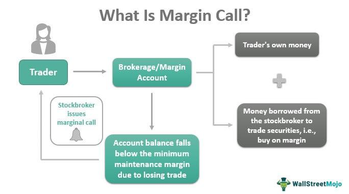

In securities trading, comprehending the financial implications of margin calls alongside the benefits of algorithmic trading is essential for both novice and seasoned traders. Margin calls represent a fundamental aspect of trading strategies, as they serve to maintain sufficient equity in trading accounts, thereby minimizing potential losses for both brokers and investors. This protective mechanism ensures that leverage does not exceed manageable levels, safeguarding against excessive financial risk.

Algorithmic trading, on the other hand, offers significant advantages in terms of speed, precision, and risk management. By utilizing sophisticated computer algorithms, traders can execute decisions efficiently, often capitalizing on market opportunities far more effectively than manual trading would allow. Algorithms can process vast data sets, executing trades based on pre-defined criteria such as timing, price, and quantity, thus minimizing human error and emotional bias in trading.



The intersection of margin calls and algorithmic trading provides a unique opportunity for risk mitigation and enhanced trading performance. By integrating algorithmic strategies with diligent margin management, traders can optimize their approach to capital efficiency, reduce the likelihood of triggering margin calls, and ensure more consistent trading outcomes. This synergy between human oversight and algorithmic precision is pivotal in navigating the ever-evolving financial markets, allowing traders to achieve both stability and profitability in their trading endeavors.

## Table of Contents

## Understanding Margin Calls

A margin call is a fundamental concept in securities trading, occurring when the equity in a trading account falls below the required maintenance margin set by the broker. Equity is calculated using the formula:

$$
\text{Equity} = \text{Total Account Value} - \text{Total Borrowed Amount}
$$

When this equity dips below the broker's maintenance level, a margin call is issued, requiring the trader to deposit additional funds or liquidate positions to satisfy the margin requirement. This process is crucial as it mitigates risk for both brokers and investors by ensuring there is enough equity to cover leveraged positions and prevent large losses in volatile market conditions.

To further comprehend the mechanics of margin calls, consider an example. Suppose an investor has a $10,000 account with an initial margin requirement of 50% to buy $20,000 worth of stock using $10,000 in borrowed funds. If the broker's maintenance margin is set at 30%, the investor's equity must remain above $6,000 (30% of $20,000) at all times. Should the stock's value decline, reducing the total account value to $16,000, the equity will fall to $6,000, triggering a margin call. The investor would then be obligated to provide additional funds or sell part of their holdings to restore the required maintenance margin.

In various market conditions, the response to margin calls can differ significantly. In a rising market, the equity in a trading account is likely to increase, reducing the chance of a margin call. Conversely, during market downturns, the likelihood of margin calls increases as equity erodes faster, impacting trading strategies and decision-making processes. Understanding this mechanism allows traders to better manage their positions and navigate the complexities of the financial markets.

## The Role of Maintenance Margin

Maintenance margin serves as a critical safety net within the practice of leveraged trading. It ensures that traders maintain a certain level of equity in their accounts to safeguard both the trader and broker from excessive risks associated with leveraged positions. A maintenance margin is defined as the minimum account balance that must be maintained to keep trading positions open. When the equity in a trading account drops below this prescribed level due to unfavorable price movements, a margin call is triggered. This requires the trader to either deposit additional funds or liquidate some of their positions to restore compliance.

The maintenance margin ratio can be expressed mathematically as follows:

$$
\text{Maintenance Margin} = \text{Market Value of Securities} \times \text{Maintenance Margin Requirement}
$$

For example, if the maintenance margin requirement is 25% and the market value of the securities is $10,000, the required maintenance margin would be $2,500. Should the trader's equity fall below this level, they would face a margin call.

Incorporating maintenance margin considerations into trading algorithms can significantly enhance risk management processes. By embedding these requirements, algorithms can automatically adjust trading positions to prevent the likelihood of margin calls. This can be achieved through pre-programmed actions such as reducing the size of positions or setting stop-loss orders to limit potential losses. Algorithmic strategies can incorporate real-time monitoring of margin levels, thereby enabling dynamic adjustments to align leveraged positions with current market conditions.

By considering maintenance margin in these algorithms, traders can strategically plan and optimize their leverage usage, balancing risk exposure with potential returns. This proactive approach to margin management minimizes the possibility of forced liquidations due to margin calls, ensuring a more stable and efficient trading experience.

## Algorithmic Trading: Revolutionizing Financial Markets

Algorithmic trading, commonly known as algo trading, has significantly transformed financial markets by utilizing advanced computer algorithms to execute trades at speeds and precision levels unattainable by human traders. These algorithms operate on complex mathematical models, allowing them to analyze and interpret vast amounts of data efficiently. By predefining criteria such as timing, price, and quantity, these algorithms can make real-time decisions, facilitating a systematic approach to trading.

One of the primary advantages of [algorithmic trading](/wiki/algorithmic-trading) is its ability to process extensive datasets and respond to market movements instantaneously. This capability not only enhances the speed of transactions but also improves accuracy, as algorithms can quickly identify trading opportunities and execute trades faster than any human trader. For instance, High-Frequency Trading ([HFT](/wiki/high-frequency-trading-strategies)), a subset of algorithmic trading, capitalizes on minute price discrepancies across different markets or securities, executing thousands of trades in fractions of a second.

Moreover, algorithmic trading minimizes the potential for human error and reduces the influence of emotions on trading decisions. Emotional biases, often detrimental in trading, are effectively eliminated, ensuring decisions are based solely on data and well-defined strategies. This objectivity enhances risk management, as algorithms can handle complex calculations and multiple variables to optimize trade outcomes without the emotional pitfalls that human traders might face.

Incorporating algorithmic strategies typically involves defining a set of rules or conditions that guide trading decisions. For example, a simple moving average crossover strategy might involve using two moving averages—a short-term and a long-term one—and executing a trade when the short-term average crosses the long-term average. This could be implemented in Python as follows:

```python
def moving_average(prices, window_size):
    return [sum(prices[i:i+window_size])/window_size for i in range(len(prices) - window_size + 1)]

def moving_average_crossover_strategy(prices, short_window, long_window):
    short_ma = moving_average(prices, short_window)
    long_ma = moving_average(prices, long_window)

    signals = []
    for i in range(1, min(len(short_ma), len(long_ma))):
        if short_ma[i] > long_ma[i] and short_ma[i-1] <= long_ma[i-1]:
            signals.append('Buy')
        elif short_ma[i] < long_ma[i] and short_ma[i-1] >= long_ma[i-1]:
            signals.append('Sell')
        else:
            signals.append('Hold')
    return signals

# Example usage with hypothetical price data
prices = [100, 102, 101, 103, 105, 107, 106, 108]
signals = moving_average_crossover_strategy(prices, 3, 5)
print(signals)
```

This algorithm sample illustrates how predefined rules can guide trading strategies, enhancing decision-making efficiency and consistency.

The systematic nature of algorithmic trading helps mitigate risks associated with manual trading, providing traders with a robust framework for handling market volatilities. This capability is particularly beneficial in highly dynamic financial markets, where rapid changes can have significant impacts on trading outcomes.

In summary, algorithmic trading leverages technology to revolutionize financial markets by offering unmatched speed, precision, and objectivity, making it an indispensable tool for modern traders seeking to optimize their trading strategies.

## Aligning Margin Management with Algorithmic Strategies

The integration of margin management with algorithmic trading provides a powerful framework for traders aiming to enhance risk management and optimize capital efficiency. By strategically incorporating margin requirements into algorithmic models, traders can develop strategies that avoid excessive leverage and mitigate the risk of margin calls, these being events where traders are compelled to deposit additional funds to meet minimum equity requirements.

Algorithmic trading systems are capable of continually monitoring the margin utilization ratio, which is a critical metric calculated as:

$$
\text{Margin Utilization Ratio} = \left( \frac{\text{Used Margin}}{\text{Account Equity}} \right) \times 100.
$$

By analyzing this ratio, algorithms can dynamically adjust trading positions in real-time to ensure compliance with the broker's margin requirements, reducing the likelihood of a margin call. This computation involves real-time data feeds and sophisticated risk assessment models, enabling traders to maintain a delicate balance between maximizing leverage and maintaining sufficient equity.

The practical implementation of this approach involves constructing algorithms that can respond adaptively to fluctuating market conditions. For instance, programs can be coded to automatically reduce position sizes or liquidate certain assets when the margin utilization ratio approaches critical levels. In Python, this could be implemented as a script that listens to market data and performs checks on margin levels, executing predefined trades if certain thresholds are met:

```python
def monitor_and_adjust_portfolio(market_data, portfolio, margin_threshold):
    account_equity = portfolio["cash"] + sum(asset["market_value"] for asset in portfolio["holdings"])
    used_margin = sum(asset["required_margin"] for asset in portfolio["holdings"])

    margin_utilization = (used_margin / account_equity) * 100
    if margin_utilization > margin_threshold:
        # Reduce position or liquidate assets
        for asset in portfolio["holdings"]:
            if asset["market_value"] > asset["required_margin"]:
                # Example logic to reduce a position
                asset["market_value"] -= sell_asset(asset, market_data)

def sell_asset(asset, market_data):
    # Logic to sell portion of asset
    portion_to_sell = asset["market_value"] * 0.1  # Sell 10% of the asset
    return portion_to_sell
```

Through such implementations, traders can remain resilient amidst market [volatility](/wiki/volatility-trading-strategies). Algorithms designed for margin management can preemptively identify potential risks, initiating adjustments proactively to safeguard against adverse financial outcomes. This synergy between margin management and algorithmic trading creates an environment where strategic resiliency is prioritized, aligning trading actions with robust risk management principles. Consequently, traders not only protect their investments but also harness the full potential of algorithmic trading to secure consistent, favorable trading results.

## Conclusion

A thorough understanding of margin calls and algorithmic trading is essential for successful trading in today’s financial markets. Margin calls, acting as a safeguard, compel traders to maintain adequate equity levels, thus mitigating the risks associated with leveraged trading. By recognizing the significance of margin calls, traders can better manage their capital, ensure account stability, and safeguard against market volatility.

Algorithmic trading complements this risk management strategy by providing traders with sophisticated tools to enhance trading performance. These algorithms execute trades with precision and speed, based on predefined parameters. By analyzing vast datasets and optimizing trading decisions, algorithmic trading reduces the emotional biases and errors that can hinder traditional trading approaches.

By integrating margin management with algorithmic strategies, traders can create a robust framework for navigating complex market dynamics. This synergy not only helps in preserving capital but also enhances the ability to seize profitable opportunities when they arise. The ability to dynamically manage margin requirements through algorithmic rules ensures that traders can maintain optimal leverage ratios, reducing the likelihood of experiencing unexpected margin calls.

Educating oneself on these concepts is crucial for developing adaptive strategies that not only respond to evolving market conditions but also align with individual financial goals. As financial markets continue to become more intricate, the knowledge and application of margin calls and algorithmic trading become indispensable tools for achieving consistent and favorable trading outcomes. By honing these skills, traders position themselves to capitalize on market opportunities while maintaining a disciplined approach to risk management.

## References & Further Reading

Bergstra, J., Bardenet, R., Bengio, Y., & Kégl, B. (2011). "Algorithms for Hyper-Parameter Optimization." Advances in Neural Information Processing Systems 24. This paper details innovative methods for optimizing hyper-parameters used in [machine learning](/wiki/machine-learning) models, which can be applied in refining algorithmic trading strategies to enhance performance and scalability.

"Advances in Financial Machine Learning" by Marcos Lopez de Prado. This book provides advanced techniques and methodologies in financial machine learning. It is a crucial resource for understanding how to implement models that adapt to the complex and rapidly changing market environments, offering insights into developing more robust trading algorithms.

"Quantitative Trading: How to Build Your Own Algorithmic Trading Business" by Ernest P. Chan. A comprehensive guide for traders interested in developing their own quantitative trading systems. The book covers the entire process from identifying a strategy to implementing it using various algorithmic techniques, offering practical advice on risk management and system development.

These resources offer valuable insights and methodologies for anyone interested in enhancing their understanding and application of algorithmic trading and risk management in financial markets.