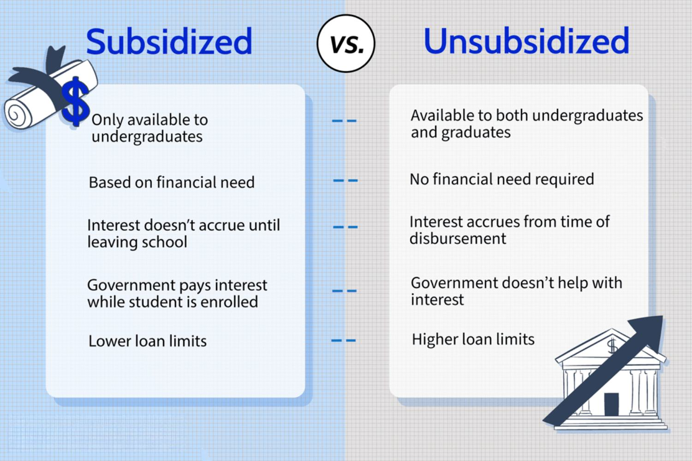

The financial landscape is rapidly transforming, driven by the impact of algorithmic trading and emerging financial technologies. These innovations are revolutionizing investment strategies and reshaping the way financial markets operate. Algorithmic trading, which uses complex algorithms and high-speed computing to execute trades, has become a cornerstone of modern financial markets, accounting for a significant portion of market transactions. This has led to increased efficiency, reduced transaction costs, and enhanced market liquidity.

Despite these advancements, student loans remain a significant and pressing issue, particularly in the United States. The burden of student loan debt has profound implications, both for individual borrowers and the broader economy. Defaulting on student loans can lead to severe financial consequences, including damaged credit scores and restricted access to future borrowing. As of recent reports, the student loan debt crisis has reached alarming proportions, affecting millions of borrowers and posing challenges to economic stability and growth.

This article seeks to explore the complex interplay between loan defaults, particularly those involving student loans, and the dynamics of financial markets influenced by algorithmic trading. It examines how these two seemingly disparate elements interact within the broader financial ecosystem, potentially impacting overall market sentiment and economic health. By analyzing these interactions, this exploration aims to shed light on the broader financial implications and suggest possible avenues for risk mitigation and policy intervention.

## Table of Contents

## Understanding Student Loan Defaults

Student loan default occurs when a borrower fails to make the required payments on their student loan according to the terms agreed upon in the loan contract. This typically happens after a prolonged period of non-payment, with specific timelines varying by lender and loan type. For federal student loans in the United States, a loan enters default status after a borrower has failed to make any scheduled payments for 270 days (approximately nine months). Once in default, the full balance of the loan becomes due immediately, and the borrower's credit rating can be significantly damaged, among other negative consequences.

Student loan defaults are a prevalent issue in the United States, with far-reaching societal impacts. As of recent data, approximately 1 in 5 federal student loan borrowers are in default, which translates to millions of individuals unable to manage their educational debts. This phenomenon affects not only the creditworthiness of individuals but also their ability to achieve financial stability. The societal impacts extend further, potentially increasing financial inequality and limiting economic mobility for a significant portion of the population.

Financial literacy plays a critical role in preventing defaults. Increased awareness and understanding of personal finance can empower borrowers to manage their student loans effectively. Financial literacy involves comprehensive knowledge of budgeting, interest rates, repayment options, and the long-term implications of borrowing. Educational programs aimed at improving financial literacy can significantly reduce the incidence of student loan defaults by equipping borrowers with the necessary skills to make informed financial decisions. Enhanced financial education can aid in demystifying complex financial products and encourage responsible borrowing and spending, ultimately lowering default rates. 

Therefore, improving financial literacy among students and prospective borrowers is a preventive measure that can mitigate the risk of default. Such efforts require collaborative approaches from educational institutions, government policies, and non-profit organizations focused on financial education. By fostering a financially literate society, the negative consequences associated with student loan defaults can be substantially minimized, leading to improved individual financial health and a more stable economic environment.

## Financial Consequences of Loan Defaults

Student loan defaults have significant financial consequences for borrowers, impacting their immediate financial health and long-term economic prospects. When a borrower defaults on a student loan, it means they have failed to make scheduled payments for a specified period, with Federal loans typically considering a loan in default after 270 days of non-payment. 

The immediate financial repercussions for individuals who default on student loans are severe. A primary consequence is damage to their credit score. Credit scores are vital for financial activities, and a default can significantly lower a borrower's credit score, making it challenging for them to access credit in the future. Furthermore, defaulted loans often lead to aggressive debt collection practices. Loan servicers may initiate collection activities, which can include wage garnishment, where a portion of the borrower's paycheck is automatically directed toward loan repayment, or even withholding of tax refunds through Treasury offsets.

In the long-term, the economic impacts of student loan defaults extend beyond personal finance. A default can deter potential employers, particularly in sectors where credit checks are part of the hiring process, thereby limiting employment opportunities. Additionally, once a borrower defaults, they will find it exceedingly difficult to secure future loans, whether for education, automobiles, or mortgages. This restricted access to credit can hinder an individual's ability to make significant life investments, potentially stalling personal and economic growth.

On a broader societal level, the social implications of student loan defaults are also considerable. Housing stability is often jeopardized as individuals with poor credit histories may face high-interest rates or denial of rental applications. Family stability can also be affected as financial strain due to loan repayments may lead to stress and conflicts. Employment is another area of concern; beyond the deterrent to hiring defaulted borrowers, the emotional and psychological stress of carrying a default can affect job performance and productivity.

Overall, the financial consequences of loan defaults are profound, necessitating effective management strategies and policy interventions to prevent defaults and mitigate their impacts.

## Algorithmic Trading and Financial Market Dynamics

Algorithmic trading has become a cornerstone of modern financial markets, leveraging computational algorithms to automate trading decisions and executions. This approach utilizes complex mathematical models to analyze market data, enabling rapid and often high-frequency trading that surpasses human capabilities in speed and precision. The significance of [algorithmic trading](/wiki/algorithmic-trading) can be seen in its widespread adoption among institutional investors, hedge funds, and investment banks, accounting for a significant portion of market trades.

Technological advancements have been pivotal in reshaping traditional investment strategies through the development of sophisticated algorithms that process vast datasets. Machine learning and [artificial intelligence](/wiki/ai-artificial-intelligence) have enhanced the predictive capabilities of these algorithms, allowing for more accurate forecasting of market movements. For example, algorithms now analyze historical data alongside real-time news feeds to detect patterns and sentiments that may influence stock prices.

The transition from conventional trading methods to algorithmic strategies offers various benefits, including increased market efficiency and [liquidity](/wiki/liquidity-risk-premium). By executing trades at high speeds, algorithmic trading reduces the bid-ask spread, contributing to tighter pricing and benefiting all market participants. Additionally, it minimizes human biases and emotions that can negatively impact trading decisions.

Despite its advantages, algorithmic trading introduces certain risks. The complexity of these algorithms can lead to unforeseen consequences, such as the 2010 Flash Crash, where a combination of algorithmic trades triggered a rapid and significant market drop. Moreover, algorithms can amplify market [volatility](/wiki/volatility-trading-strategies) and pose systemic risks, particularly when numerous traders employ similar strategies that lead to herding behavior.

In summary, algorithmic trading represents a significant evolution in financial market dynamics, driven by technological progress. While its benefits of efficiency and predictability are clear, the associated risks necessitate robust risk management strategies and regulatory oversight to ensure market stability and integrity.

## Interrelation Between Loan Defaults and Financial Markets

Student loan defaults represent a critical financial issue with the potential to impact the broader macroeconomic environment and market sentiment. High default rates can lead to increased risks for financial institutions, reduced consumer spending, and diminished investor confidence, creating a domino effect that exacerbates economic instability.

### Macroeconomic Environment and Market Sentiment

When student loan defaults increase significantly, financial institutions face heightened exposure to bad debt, potentially leading to tighter lending conditions. This reduction in credit availability can slow down overall economic growth, as households and businesses may find it more challenging to secure loans for consumption and investment. Consumer spending, a vital component of GDP, may decrease as a result of impaired financial positions among affected individuals, thereby stifling economic [momentum](/wiki/momentum).

Market sentiment also suffers in the wake of rising default rates. Investors may perceive heightened default rates as indicative of underlying economic fragility, which can lead to increased market volatility and decreased asset valuations. Stock markets may see declining trends, influenced by the reduced earnings outlook for banks and other companies reliant on consumer spending. Bond markets may experience shifts as demand for safer assets increases, affecting yields and the cost of borrowing for corporations and governments.

### Algorithmic Trading

Algorithmic trading, which employs complex algorithms to execute orders at speeds and volumes beyond human capabilities, plays a significant role in financial markets today. This automated approach can both exacerbate and mitigate financial downturns caused by loan defaults.

Algorithms are programmed to respond to market signals, including news about rising default rates. They can rapidly execute sell orders based on negative sentiment, potentially accelerating market declines. This phenomenon was observed during past financial crises when automated trading systems responded swiftly to adverse news, contributing to market volatility.

Conversely, algorithmic trading can also help stabilize markets. Sophisticated algorithms can detect underpriced assets during market downturns, providing liquidity and helping to correct mispriced securities. Moreover, the use of [machine learning](/wiki/machine-learning) and predictive analytics can improve the accuracy of algorithms, allowing traders to assess risks more effectively and take advantage of potential market recoveries.

### Insights from Past Financial Crises

The 2008 financial crisis serves as a pivotal case study in understanding the intersection of loan defaults and algorithmic trading. The crisis was sparked by high default rates on subprime mortgages, which led to the collapse of major financial institutions. As defaults mounted, algorithmic trading systems detected deteriorating market conditions, amplifying the sell-off in financial markets and intensifying the downturn.

Post-crisis analyses highlighted the need for improved risk management and the implementation of circuit breakers to manage excessive market volatility. Lessons from this crisis have informed current regulatory frameworks aimed at preventing similar systemic failures. The rise of machine learning in trading algorithms presents opportunities for more advanced risk assessment and management strategies, potentially mitigating the negative impact of future loan default surges on markets.

Ultimately, managing the intertwined dynamics of loan defaults and financial markets requires a multifaceted approach. While algorithmic trading offers tools for immediate market responses, thoughtful regulatory oversight and improved risk management strategies are essential to fostering market resilience and economic stability.

## Mitigating Financial Risks: Lessons from Algorithmic Trading

Algorithmic trading, with its reliance on quantitative models and automated decision-making, incorporates sophisticated risk management strategies that could prove beneficial in managing student loan portfolios. One such strategy is the use of predictive analytics, which involves using historical data to forecast future market trends. In the context of student loans, fintech companies can employ predictive modeling to identify borrowers at risk of default earlier, allowing for timely interventions. By leveraging machine learning algorithms, these models can analyze patterns in borrower behavior, economic indicators, and employment [statistics](/wiki/bayesian-statistics) to assess default probability.

Implementing such strategies can involve the deployment of financial wellness platforms designed to enhance borrowers' understanding and management of their student loan obligations. These platforms can offer features such as personalized payment plans, real-time tracking of financial obligations, and automated reminders for due dates, which can alleviate the risk of defaults. Additionally, educational resources embedded within these platforms can enhance financial literacy, enabling borrowers to make informed financial decisions.

On the policy front, government interventions can focus on enhancing regulatory frameworks to support fintech solutions that aid borrowers. One approach could be incorporating machine learning-driven credit assessments in the underwriting process, reflecting a borrower’s true ability to repay over the traditional credit scoring methods. Policymakers could also promote initiatives that provide greater transparency in loan terms and repayment options, reducing the likelihood of borrowers becoming overwhelmed by debt.

Moreover, regulatory bodies can consider incentivizing lenders to adopt these fintech solutions through tax benefits or grants, encouraging the development of more flexible repayment structures. Implementing such measures can help decrease default rates, stabilizing the broader economic environment.

These methods not only minimize financial risk but also create an ecosystem where borrowers are empowered with tools and knowledge, facilitating a more sustainable approach to managing student loans. The integration of algorithmic insights and fintech solutions in this sector signifies a forward-thinking strategy that aligns with broader efforts to mitigate financial risks and enhance economic stability.

## Conclusion

The interplay between student loan defaults and financial markets is increasingly becoming a focal point of economic discussions. Student loan defaults not only affect individual borrowers but also have far-reaching implications for the financial ecosystem. Defaulted loans contribute to economic instability by affecting consumer spending, credit markets, and investor confidence. Increased default rates can undermine macroeconomic stability, as they elevate financial risks that cascade through sectors, diminishing market liquidity and potentially altering monetary policy. 

Acknowledging the repercussions of loan defaults on financial markets highlights the necessity for proactive measures. Early intervention strategies, such as enhanced financial literacy programs and borrower support initiatives, are essential. Financial literacy equips borrowers with critical skills to manage debt effectively, reducing the likelihood of default. Additionally, lenders can benefit from leveraging data analytics and fintech solutions to assess borrower risk profiles more accurately and tailor repayment plans that align with the financial capabilities of the borrowers.

In considering potential future directions, research should focus on developing integrated fintech solutions that bridge gaps between borrowers and lenders, offering real-time insights and adaptive interfaces. Furthermore, policymakers are poised to play a significant role; revising regulatory frameworks to protect consumers while encouraging responsible lending practices remains crucial. Policy interventions might include implementing more robust income-driven repayment plans, introducing financial incentives for early repayments, and legislating borrower protections against predatory lending practices.

Ultimately, fostering a stable economic environment demands a coordinated effort across multiple fronts: advancing research, implementing targeted policy changes, and adopting innovative technology solutions. By addressing student loan challenges comprehensively, we can minimize financial risks and strengthen economic resilience, paving the way for sustainable growth.

## References & Further Reading

[1]: Looney, A., & Yannelis, C. (2015). ["A Crisis in Student Loans? How Changes in the Characteristics of Borrowers and in the Institutions They Attended Contributed to Rising Loan Defaults."](https://www.brookings.edu/wp-content/uploads/2015/09/LooneyTextFall15BPEA.pdf) Brookings Papers on Economic Activity.

[2]: Agarwal, S., Chomsisengphet, S., Mahoney, N., & Stroebel, J. (2018). ["Do Banks Pass Through Credit Expansions to Consumers Who Want to Borrow?"](https://www.nber.org/papers/w21567) American Economic Review.

[3]: Eubanks, V. (2018). ["Automating Inequality: How High-Tech Tools Profile, Police, and Punish the Poor."](https://www.researchgate.net/publication/337578410_Virginia_Eubanks_2018_Automating_Inequality_How_High-Tech_Tools_Profile_Police_and_Punish_the_Poor_New_York_Picador_St_Martin%27s_Press) St. Martin's Press.

[4]: Thesmar, D., & Sraer, D. (2008). ["Performance and Behavior of Family Firms: Evidence from the French Stock Market."](https://faculty.haas.berkeley.edu/dsraer/sraerthesmar.pdf) Journal of Economic Perspectives.

[5]: Biais, B., Foucault, T., & Moinas, S. (2015). ["Equilibrium High Frequency Trading."](https://papers.ssrn.com/sol3/papers.cfm?abstract_id=2024360) Econometrica.