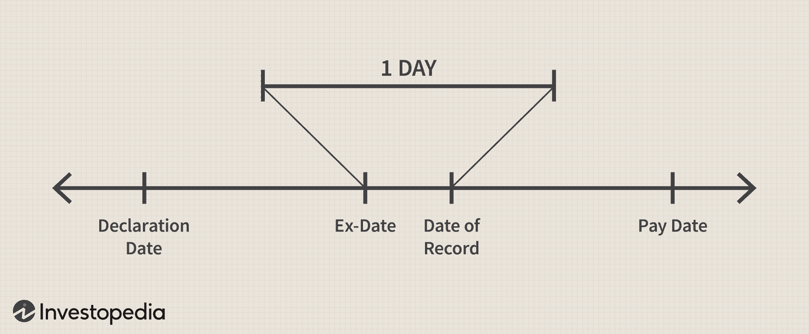

## Table of Contents

## What is an ex-dividend date?

The ex-dividend date is the first day a stock trades without its upcoming dividend. If you buy the stock on or after this date, you won't receive the next dividend payment. This date is important because it helps investors know when they need to own the stock to get the dividend.

Companies set the ex-dividend date one business day before the record date. The record date is when the company looks at its records to see who owns the stock and should get the dividend. If you own the stock before the ex-dividend date, you'll be on the company's list to receive the dividend.

## Why do companies pay dividends?

Companies pay dividends to share their profits with their shareholders. When a company makes money, it can choose to give some of that money back to the people who own its stock. This is a way to reward investors for putting their money into the company. By paying dividends, companies can show that they are financially healthy and have steady earnings.

Dividends can also attract more investors. People who want a regular income from their investments might be more likely to buy stocks that pay dividends. This can help the company's stock price stay stable or even go up. So, paying dividends is not just about sharing profits, but also about making the company more appealing to investors.

## What happens to the stock price on the ex-dividend date?

On the ex-dividend date, the stock price usually drops by about the amount of the dividend. This happens because the dividend is no longer included in the stock's price. If you buy the stock on or after this date, you won't get the next dividend, so the price adjusts to reflect that.

But the drop in price isn't always exactly the same as the dividend amount. Other things can affect the stock price too, like how the market is doing or news about the company. So, while the stock price often goes down by the dividend amount on the ex-dividend date, it can be a bit more or less depending on what else is happening.

## What are the benefits of selling shares before the ex-dividend date?

If you sell your shares before the ex-dividend date, you can still get the next dividend payment. This is because the company checks who owns the shares on the record date, which is the day after the ex-dividend date. So, if you sell before the ex-dividend date, you'll be on the list to receive the dividend.

Selling before the ex-dividend date can also help you avoid a drop in the stock's price. On the ex-dividend date, the stock price usually goes down by about the amount of the dividend. By selling before this happens, you might be able to sell at a higher price and then buy the stock back later at a lower price if you want to own it again.

## What are the risks of selling shares before the ex-dividend date?

Selling shares before the ex-dividend date has some risks. One big risk is that the stock price might go up after you sell. If the company does well or if there's good news about it, the price can rise. If you sell before the ex-dividend date and then the price goes up, you miss out on that increase.

Another risk is that you might not find a good time to buy the stock back. If you sell before the ex-dividend date and then want to buy the stock again, the price might be higher than when you sold it. This means you could end up paying more to own the stock again, even after getting the dividend. So, selling before the ex-dividend date can be risky if you want to keep owning the stock in the long run.

## How does selling shares before the ex-dividend date affect dividend eligibility?

If you sell your shares before the ex-dividend date, you can still get the next dividend. This is because the company looks at who owns the shares on the record date, which is the day after the ex-dividend date. So, if you sell before the ex-dividend date, you'll still be on the list to receive the dividend.

But, if you sell your shares on or after the ex-dividend date, you won't get the next dividend. The new owner of the shares will get it instead. This is why the ex-dividend date is important – it's the cutoff for who gets the dividend.

## Can you explain the concept of 'dividend capture strategy'?

A dividend capture strategy is when an investor buys a stock just before the ex-dividend date and then sells it soon after, aiming to collect the dividend without holding the stock for a long time. The idea is to make a quick profit from the dividend payment. For example, if a stock pays a $1 dividend, the investor wants to get that $1 without having to own the stock for months or years.

However, this strategy has risks. When a stock goes ex-dividend, its price usually drops by about the amount of the dividend. So, if you buy the stock right before the ex-dividend date, you might end up selling it for less than you paid, even after getting the dividend. Also, the stock price can go up or down for other reasons while you own it, which can affect whether you make a profit or not. So, while the dividend capture strategy sounds simple, it can be tricky to do it successfully.

## What tax implications should be considered when selling shares before the ex-dividend date?

When you sell shares before the ex-dividend date, you still get the dividend, but you need to think about taxes. The dividend you receive is usually considered taxable income. This means you'll have to pay taxes on it, just like you do with your regular income. The tax rate can depend on how much money you make overall and what kind of dividends they are, like qualified or ordinary dividends.

Also, if you sell the shares for more than you paid for them, you might have to pay capital gains tax. This tax is on the profit you make from selling the shares. If you've owned the shares for a year or less, it's a short-term capital gain, and you'll pay tax at your regular income tax rate. If you've owned them for more than a year, it's a long-term capital gain, and the tax rate is usually lower. So, selling shares before the ex-dividend date can affect your taxes in more than one way.

## How does the timing of selling shares before the ex-dividend date impact investment returns?

When you sell shares before the ex-dividend date, you can still get the dividend. This can add to your investment returns because you get extra money from the dividend. But, the stock price usually drops by about the amount of the dividend on the ex-dividend date. If you sell your shares right before this drop, you might sell at a higher price than if you waited until after the ex-dividend date. This can help your returns because you might make more money from selling the shares.

However, there are risks too. If the stock price goes up after you sell, you miss out on those gains. Also, if you want to buy the stock back later, it might cost more than what you sold it for. This could mean your overall returns are lower because you have to spend more to own the stock again. So, selling before the ex-dividend date can help your returns if everything goes right, but it can also hurt them if the stock price moves in ways you don't expect.

## What are the market conditions that might influence the decision to sell before the ex-dividend date?

Market conditions can really affect whether you should sell your shares before the ex-dividend date. If the market is doing well and the stock price is going up, you might not want to sell before the ex-dividend date. This is because you could miss out on more money if the price keeps rising. Also, if there's good news about the company or the economy, it might make the stock price go up even more. So, in a strong market, you might want to keep your shares to get both the dividend and any price increase.

On the other hand, if the market is not doing so well or if there's bad news about the company, selling before the ex-dividend date might be a good idea. If the stock price is likely to drop, selling before the ex-dividend date could let you get the dividend and avoid a bigger drop in the stock's value. Also, if you think the market might get worse, selling before the ex-dividend date can give you some money from the dividend to use elsewhere. So, understanding the market conditions can help you decide the best time to sell your shares.

## How do institutional investors typically approach selling shares before the ex-dividend date?

Institutional investors, like big funds that manage a lot of money, often have a smart way of deciding whether to sell shares before the ex-dividend date. They look at a lot of things, like how the market is doing, what's happening with the company, and their own investment goals. If they think the stock price will go up a lot after the ex-dividend date, they might keep the shares to get the dividend and the price increase. But if they think the stock price might go down or stay the same, they might sell before the ex-dividend date to get the dividend and then use that money for other investments.

Sometimes, institutional investors use a strategy called dividend capture. They buy the stock just before the ex-dividend date, get the dividend, and then sell the stock soon after. This can be tricky because the stock price usually drops by the amount of the dividend on the ex-dividend date. But if they do it right, they can make a little profit from the dividend without holding the stock for a long time. They have to be careful, though, because other things can affect the stock price, and they might end up losing money if they don't time it well.

## What advanced trading strategies can be employed around the ex-dividend date to optimize returns?

One advanced trading strategy around the ex-dividend date is called dividend capture. Investors buy a stock just before the ex-dividend date to get the dividend, then sell it soon after. The goal is to make a quick profit from the dividend without holding the stock for a long time. But it's tricky because the stock price usually drops by the amount of the dividend on the ex-dividend date. So, if you buy the stock right before this drop, you might end up selling it for less than you paid, even after getting the dividend. Investors need to time this right and consider other things that can affect the stock price, like market conditions and company news.

Another strategy is to use options trading around the ex-dividend date. Investors might buy call options on a stock before the ex-dividend date. If the stock price goes up after the dividend is paid, they can make money from the rise in the stock price without having to own the stock itself. Or, they might sell put options, betting that the stock price won't drop too much after the ex-dividend date. This can be a way to make money from the dividend and any changes in the stock price, but it's more complicated and risky than just buying and selling the stock.

Some investors also use a strategy called tax-loss harvesting around the ex-dividend date. If they have stocks that have lost value, they might sell those stocks before the ex-dividend date to get the dividend and use the loss to lower their taxes. Then, they might buy the stock back after the ex-dividend date, when the price has dropped. This way, they get the dividend, lower their taxes, and still own the stock. It's a smart way to manage both their investments and their taxes, but it needs careful planning and understanding of tax rules.

## What is the impact of the ex-dividend date on stock prices?

Stock prices often undergo a notable decrease on the ex-dividend date, typically reflecting a drop approximating the dividend amount. This decrease can be attributed to the cash outflow from the company's reserves, which realigns the stock's market valuation by adjusting for the funds paid out as dividends. The ex-dividend date marks the cutoff for determining which shareholders qualify for the dividend, and thus, when a stock begins trading without the dividend value.

The efficient market hypothesis posits that all available information, including upcoming dividend payments, is already priced into the stock. Hence, when a stock goes ex-dividend, the price adjustment aligns with the expected decrease due to the dividend payout. This adjustment is mathematically simplified by the formula:

$$
\text{New Price} = \text{Old Price} - \text{Dividend Amount}
$$

In practice, traders must anticipate these price movements to seize fleeting market opportunities. The price drop provides a predictable shift that can be strategically exploited, particularly by those adopting a short-term trading outlook. Traders engaged in such strategies are mindful of the ex-dividend date's impact, as it presents opportunities to purchase stocks at adjusted prices before potential market corrections or to sell before the anticipated drop.

The price adjustment is crucial for traders keen on short-term gains, as it introduces a momentary inefficiency in the market that can be leveraged. By predicting the stock's behavior around the ex-dividend date, traders can execute buy or sell orders to maximize profits or minimize losses. For instance, algorithmic strategies can be tailored to execute trades automatically upon detecting price shifts, thereby capitalizing on the continuity and predictability of ex-dividend price adjustments. This level of anticipation and quick execution is vital in an environment where market dynamics fluctuate in response to new dividend information becoming publicly acknowledged.

## What are Algorithmic Trading Strategies for Ex-Dividend Dates?

Algorithmic trading enhances the execution of dividend-focused strategies by maximizing precision and speed. This precision is vital when implementing the Dividend Capture Strategy, which aims to capitalize on the predictability surrounding ex-dividend dates. This strategy involves purchasing shares just before the ex-dividend date to secure the dividend payment and subsequently selling the shares after the date, often at a lower price due to the expected adjustment reflecting the paid dividend. The strategy assumes that the stock price will drop approximately by the amount of the dividend on the ex-dividend date, allowing traders to time their entry and [exit](/wiki/exit-strategy) points for potential profits.

Arbitrage opportunities also exist around the ex-dividend date due to possible market inefficiencies. Algorithms can quickly identify price discrepancies between securities or markets. For example, slight differences in stock prices across exchanges can be exploited, provided the trading fees do not outweigh potential gains. Advanced systems must be capable of processing large volumes of data to spot and capitalize on these fleeting discrepancies.

Developing efficient algorithms requires balancing profitability with associated transaction costs. The formula for net profit in such a scenario can be represented as:

$$
\text{Net Profit} = D - \Delta P - TC
$$

where $D$ is the dividend received, $\Delta P$ is the change in the stock's price post-dividend, and $TC$ includes all transaction costs. Traders must therefore fine-tune algorithms to ensure that $D > \Delta P + TC$ for the execution to be profitable.

Optimal execution of these trading strategies involves fine-tuning algorithms to ensure rapid decision-making and trade execution, adjusting for the high-speed nature of [algorithmic trading](/wiki/algorithmic-trading). Python, with libraries such as NumPy and pandas, supports the development of such algorithms:

```python
import numpy as np
import pandas as pd

def calculate_expected_profit(dividend, price_change, transaction_cost):
    return dividend - price_change - transaction_cost

# Example of setting up a hypothetical trade scenario

dividend = 2.0  # Dividend received per share
price_change = 1.8  # Expected drop in share price
transaction_cost = 0.15  # Total transaction cost per share

expected_profit = calculate_expected_profit(dividend, price_change, transaction_cost)
if expected_profit > 0:
    print("Proceed with the trade, expected profit:", expected_profit)
else:
    print("Trade not profitable")
```

These strategies, if executed well, enable traders to leverage technology to execute trades with speed and precision, exploiting the systematic nature of ex-dividend events.

## References & Further Reading

Graham and Dodd's "Security Analysis" (2008) is a foundational text that provides deep insights into various aspects of investment analysis, including the assessment of dividends and their implications for stock valuation. This book, with a foreword by Warren Buffett, offers timeless principles essential for understanding the intrinsic value of stocks, a key consideration for dividend-focused traders.

Bodie, Kane, and Marcus's "Investments" (2014) offers a comprehensive exploration of investment principles, including an examination of dividend policies and their effect on stock prices. This text is instrumental for grasping the theoretical underpinnings of stock valuation and how dividends impact investor decisions.

Lawrence G. McMillan's "Options as a Strategic Investment" (2011) provides an in-depth guide to options trading strategies, which can be particularly useful for traders looking to hedge against risks associated with ex-dividend date price movements. This work expands on the strategic use of options in volatile markets.

"Options, Futures, and Other Derivatives" by John C. Hull (2021) is a critical reference for those interested in derivatives, offering insights into their use in managing the risk that can arise from changes in stock prices around dividend events. Hull's text is well-regarded for its clarity and comprehensive coverage of complex trading strategies.

Lastly, "Handbook of Fixed-Income Securities" by Frank J. Fabozzi (2013) offers a detailed examination of fixed-income markets, which can provide perspective on how dividend strategies interact with broader financial markets. This handbook is valuable for understanding the role of different types of securities in a diversified investment strategy.

These resources collectively provide a robust knowledge base for investors and traders seeking to deepen their understanding of dividend strategies and their application in algorithmic trading.

