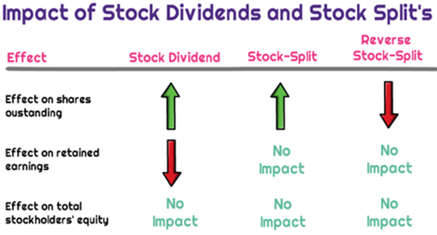

## Table of Contents

## What is a stock split?

A stock split is when a company decides to increase the number of its shares by dividing each existing share into multiple shares. For example, in a 2-for-1 stock split, each shareholder gets an additional share for every share they already own. The total value of the company stays the same, but the price per share goes down because there are more shares now.

Companies often do stock splits to make their shares more affordable to smaller investors. If a share costs $100 and the company does a 2-for-1 split, the price drops to $50 per share. This can make the stock seem more accessible and might encourage more people to buy it. Even though the price per share is lower, the total value of the shares a person owns doesn't change right after the split.

## Why do companies perform stock splits?

Companies perform stock splits to make their shares cheaper. If a share costs $100 and the company does a 2-for-1 split, the price drops to $50 per share. This makes it easier for more people to buy the stock. When the price is lower, smaller investors might feel like they can afford to buy the shares. This can help the company attract more investors and increase the demand for their stock.

Another reason for stock splits is to make the stock seem more attractive. When a company splits its stock, it often sends a message that the company is doing well and expects its stock price to keep going up. This can boost investor confidence. Even though the total value of the company doesn't change right after the split, the lower price per share can make the stock look like a better deal. This can lead to more trading and potentially higher stock prices in the future.

## How does a stock split affect the price of a stock?

When a company does a stock split, it makes the price of each share go down. This happens because the company is creating more shares. For example, in a 2-for-1 split, each share is split into two, so the price per share is cut in half. If a share was $100 before the split, it would be $50 after. The total value of the company stays the same, but the price per share is lower.

The lower price can make the stock more attractive to investors. More people might buy the stock because it's cheaper. This can increase demand for the stock, which might push the price up over time. But right after the split, the price per share is lower, even though the total value of the shares someone owns doesn't change.

## What is the impact of a stock split on a shareholder's total investment value?

When a company does a stock split, it doesn't change the total value of a shareholder's investment right away. If you own one share worth $100 and the company does a 2-for-1 split, you'll get two shares, but each will be worth $50. So, the total value of your investment is still $100.

Over time, the stock split might affect the value of your investment. A lower price per share can make the stock more attractive to new investors, which could increase demand and push the price up. But this isn't guaranteed, and the total value of your investment will go up or down based on how the stock price changes after the split.

## Can a stock split influence a company's market capitalization?

A stock split does not change a company's market capitalization right away. Market capitalization is the total value of all the company's shares. When a stock splits, the price per share goes down, but the number of shares goes up. So, if you multiply the new number of shares by the new price per share, you get the same market capitalization as before the split.

Over time, a stock split might influence the company's market capitalization. If the lower price per share attracts more investors and increases demand for the stock, the price could go up. This would make the market capitalization go up too. But this isn't guaranteed, and it depends on how the stock price changes after the split.

## How might a stock split affect the liquidity of a stock?

A stock split can make a stock more liquid. Liquidity means how easy it is to buy or sell shares without affecting the price too much. When a company does a stock split, the price of each share goes down. This can make the stock more attractive to more people, especially smaller investors. More people might want to buy and sell the stock, which means more trading. When more people are trading, it's easier to find someone to buy or sell shares with, so the stock becomes more liquid.

Over time, this increased [liquidity](/wiki/liquidity-risk-premium) can be good for the company. If more people are trading the stock, it can help keep the price stable. When a stock is more liquid, it's less likely to have big price swings because there are more buyers and sellers in the market. This can make investors feel more confident about the stock, which might attract even more investors. So, while a stock split doesn't change the total value of the company right away, it can lead to more trading and better liquidity in the long run.

## What are the psychological effects of a stock split on investors?

A stock split can make investors feel good about the company. When a company does a stock split, it often means the company thinks its stock price will keep going up. This can make investors feel more confident and happy about their investment. They might think the company is doing well and that it's a good time to buy more shares.

The lower price after a stock split can also make investors feel like they can buy more shares. If a share was $100 and now it's $50 after a split, it seems cheaper and easier to buy. This can make investors feel like they're getting a good deal, even though the total value of the company hasn't changed. This feeling of getting a bargain can encourage more people to buy the stock, which can make the stock price go up over time.

## How do stock splits potentially impact the stock's volatility?

A stock split can make a stock more volatile right after it happens. When a company does a stock split, the price of each share goes down. This can make the stock more attractive to more people, especially smaller investors. More people might want to buy and sell the stock, which means more trading. When there's more trading, the price can go up and down more quickly, making the stock more volatile.

Over time, though, a stock split might make the stock less volatile. If more people are trading the stock because of the lower price, it can become more liquid. When a stock is more liquid, it's easier to buy and sell shares without big changes in the price. This can help keep the price more stable and reduce the big ups and downs in the stock's price. So, while a stock split might make the stock more volatile right after it happens, it could lead to less [volatility](/wiki/volatility-trading-strategies) in the long run.

## What are the tax implications of a stock split for investors?

A stock split doesn't usually have any immediate tax implications for investors. When a company does a stock split, it changes the number of shares you own but not the total value of your investment right away. You just get more shares, but each one is worth less. Since nothing really changes in terms of the total value, there's no tax to pay at the time of the split.

However, if you decide to sell some of your shares after a stock split, you might have to pay taxes on any profit you make. The tax you owe depends on how long you've owned the shares and how much money you make from selling them. If you sell the shares for more than you paid for them originally, you'll have to pay capital gains tax. The stock split itself doesn't change how much tax you owe when you sell, but it might make you think about selling because the lower price per share can seem more attractive.

## How do stock splits fit into a company's long-term strategy?

Stock splits are part of a company's long-term plan to make their stock more attractive and easier for people to buy. When a company splits its stock, it makes the price of each share go down. This can bring in more investors, especially smaller ones who might not have been able to afford the stock before. By making the stock cheaper, the company hopes to get more people interested in buying it. This can help the company grow its list of shareholders and increase the demand for its stock.

Over time, having more investors can help the company in many ways. More people trading the stock can make it easier to buy and sell, which means the stock can become more liquid. This can make the stock's price more stable and attract even more investors. Also, when a company does a stock split, it sends a message that it's doing well and expects its stock price to keep going up. This can make investors feel good about the company and more likely to buy its stock. So, stock splits can be a smart move for a company's long-term strategy to grow and keep investors happy.

## What are the differences between a forward stock split and a reverse stock split?

A forward stock split is when a company decides to split each of its shares into more shares. For example, in a 2-for-1 forward split, if you own one share, you get another one for free. The price of each share goes down, but the total value of your investment stays the same right after the split. Companies do forward splits to make their stock cheaper and more attractive to more people, especially smaller investors. This can increase the number of people who want to buy the stock and might help the stock's price go up over time.

A reverse stock split is the opposite. It's when a company decides to combine its shares into fewer shares. For example, in a 1-for-2 reverse split, if you own two shares, they get combined into one share. The price of each share goes up, but again, the total value of your investment doesn't change right after the split. Companies usually do reverse splits when their stock price is very low and they want to make it look more valuable. This can happen if they want to meet the minimum price requirements to stay listed on a stock exchange or to make the stock seem more attractive to investors.

Both forward and reverse stock splits change the number of shares and the price per share, but they don't change the total value of the company right away. Forward splits are often seen as a good sign because they can attract more investors, while reverse splits might be seen as a warning sign because they can happen when a company is struggling.

## How do stock splits affect options and other derivative instruments?

When a company does a stock split, it changes how many shares there are and the price of each share. This can affect options and other derivatives like futures and warrants. For options, if a company does a 2-for-1 split, the number of options you own doubles, but the price per option gets cut in half. So, if you had an option to buy one share at $100, after the split, you'd have two options to buy one share each at $50. The total value of your options stays the same right after the split, but the number of options and the price per option change.

For other derivatives like futures and warrants, the same idea applies. If a company does a stock split, the number of contracts or warrants you own might change, and the price per contract or warrant will go down. The total value of your investment in these derivatives doesn't change right after the split, but the terms of the contracts get adjusted to match the new number of shares and the new price per share. This helps keep everything fair and balanced for people who own these derivatives.

## References & Further Reading

[1]: Fama, E. F., Fisher, L., Jensen, M. C., & Roll, R. (1969). ["The Adjustment of Stock Prices to New Information."](https://www.jstor.org/stable/2525569) International Economic Review.

[2]: Ikenberry, D., Rankine, G., & Stice, E. (1996). ["What Do Stock Splits Really Signal?"](https://asu.elsevierpure.com/en/publications/what-do-stock-splits-really-signal) Financial Analysts Journal.

[3]: ["Advances in Financial Machine Learning"](https://www.amazon.com/Advances-Financial-Machine-Learning-Marcos/dp/1119482089) by Marcos Lopez de Prado

[4]: ["Machine Learning for Algorithmic Trading"](https://github.com/stefan-jansen/machine-learning-for-trading) by Stefan Jansen

[5]: ["Quantitative Trading: How to Build Your Own Algorithmic Trading Business"](https://www.amazon.com/Quantitative-Trading-Build-Algorithmic-Business/dp/1119800064) by Ernest P. Chan