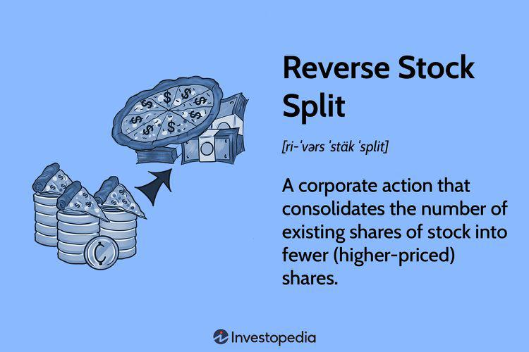

A stock split is a corporate action wherein a company divides its existing shares into multiple new shares to enhance the stock's liquidity. The total value of the shares remains unchanged when viewed collectively, as the action does not fundamentally alter the company's market capitalization. For example, in a 2-for-1 stock split, a shareholder with one share worth $100 pre-split will hold two shares, each worth $50 post-split. Companies engage in stock splits primarily to make shares more affordable and attractive to a broader base of investors, potentially boosting market activity by allowing retail investors easier access.

The implications of stock splits on shareholders extend beyond mere adjustments in share quantity and price. While the proportional ownership of a shareholder in the company remains unchanged, the market perception often experiences a positive shift. Historically, stock splits have been associated with favorable signals about a company’s future prospects, sometimes leading to a short-term rise in the stock price post-split. The psychological impact of the perceived lower share price can attract increased investor interest, positively affecting shareholder sentiment and potentially driving up demand.



Algorithmic trading, a method of executing orders using automated and pre-programmed trading instructions, has become a cornerstone of modern investment strategies. This type of trading employs sophisticated algorithms to analyze market data and execute trades at speeds and efficiencies unattainable by human traders. It accounts for a significant portion of trading volume in major markets. The agility and precision of these algorithms are crucial in arbitraging minute price differences and capitalizing on market inefficiencies.

The intersection of stock splits with algorithmic trading represents a nuanced domain of financial strategy. Algorithms can be designed to detect stock split announcements and adjust trading strategies accordingly, potentially exploiting the resultant changes in stock price behavior and volatility. The impact of stock splits on shareholder value is not only immediate but can trigger algorithmic responses that reinforce or mitigate market trends.

This article aims to dissect the intricate relationships between stock splits, their effects on shareholders, and the role of algorithmic trading within this context. By exploring these connections, we seek to provide a comprehensive understanding of how these elements interplay in the financial markets, ultimately empowering investors with insights to navigate the complexities involved.

## Table of Contents

## Understanding Stock Splits

A stock split is a corporate action in which a company divides its existing shares into multiple shares, thereby increasing the total number of shares while maintaining the same overall market capitalization. This procedure makes individual shares more affordable to a broader range of investors without changing the company’s underlying value. Stock splits are purely an accounting exercise that affect the number of shares and their individual price, but leave the market value for shareholders unchanged.

There are primarily two types of stock splits: forward splits and reverse splits. A forward split, commonly referred to simply as a stock split, is when a company increases its share count by issuing additional shares to current shareholders. For example, in a 2-for-1 split, shareholders receive an additional share for every share they own, thus doubling the number of shares and halving the price per share. Conversely, a reverse stock split reduces the number of shares outstanding by combining multiple shares into a single one. In a 1-for-5 reverse split, every five shares owned by investors are consolidated into one, increasing the price per share.

Companies may choose to conduct a stock split for several reasons. Primarily, it improves the [liquidity](/wiki/liquidity-risk-premium) of the stock by lowering its price, thereby making it more accessible to retail investors. This can broaden the shareholder base and enhance marketability. Additionally, stock splits can be used as a tool by management to signal confidence in future growth prospects. A lower share price can also make the stock more attractive to investors psychologically, despite the lack of change in intrinsic value.

History has seen numerous major stock splits with varying outcomes. Notably, in 2014, Apple Inc. executed a 7-for-1 stock split, which significantly increased its trading [volume](/wiki/volume-trading-strategy) and helped make it one of the most widely held stocks globally. Similarly, in 2020, Tesla executed a 5-for-1 split, which was followed by a surge in its stock price as more individual investors were able to purchase shares.

Several misconceptions surround stock splits. One common misunderstanding is that a stock split inherently increases the value of the company, which is false; the value remains unchanged as it merely redistributes the existing value into a different number of shares. Another misconception is that stock splits are automatically positive indicators of a company's future performance. While splits can reflect management’s positive outlook, they do not guarantee future stock performance or financial health. Understanding these nuances can help investors make informed decisions regarding their portfolios.

## Impact on Shareholders

Stock splits are corporate actions where a company increases the number of its outstanding shares by issuing more shares to current shareholders, usually at a set ratio, without changing the underlying value of the company. This action directly impacts shareholders by adjusting the price per share and the number of shares they own.

### Influence on Shareholder Value and Portfolio Positioning

Although the total market capitalization of a company remains unchanged by a stock split, it can affect perceived shareholder value. Primarily, stock splits are often conducted by companies with rapidly appreciating stock prices, which can lead to enhanced investor interest due to the perceived affordability of shares post-split. This perceived affordability often results in increased liquidity and marketability of the stock, potentially leading to a narrowing of bid-ask spreads and lowering trading costs.

Mathematically, the change in price per share and share quantity keeps the overall investment value the same. For example, in a 2-for-1 stock split:

- Let $P$ be the pre-split share price
- Let $N$ be the number of shares before the split

Post-split:

- New price per share = $\frac{P}{2}$
- New number of shares = $2N$

The total investment value remains $P \times N = \frac{P}{2} \times 2N$. However, this adjusted share composition can influence portfolio diversification and rebalancing strategies.

### Psychological Effects on Investor Perception and Behavior

Stock splits can have significant psychological effects on investor perception. They often signal management's confidence in a company's future performance, which can lead to increased investor optimism. This phenomenon, sometimes referred to as the "signaling effect", may influence buying behavior, potentially driving demand up and thus temporarily elevating share prices even in absence of fundamental changes.

### Case Studies of Significant Stock Splits

Examining historical examples, Apple Inc.'s (AAPL) stock splits have notably impacted shareholder wealth. Apple's 4-for-1 split in August 2020 came amidst a technology sector boom, which contributed to its rising share price and increased accessibility for retail investors. Despite the unchanged intrinsic value, Apple's stock post-split saw a significant rise due to heightened market activity and investor interest.

Similarly, Tesla Inc. (TSLA) executed a 5-for-1 split in the same month. The stock split preceded a surge in share price, attracting a broader investor base. The psychological boost and market accessibility post-split revealed how splits could enhance shareholder wealth beyond initial mathematical valuation.

### Strategies for Shareholders

Shareholders can use multiple strategies to take advantage of stock splits:

1. **Portfolio Rebalancing**: Post-split, investors should assess their portfolio to maintain desired asset allocation, especially if the split stock's portion becomes disproportionately large or small.

2. **Timing Trades**: Capitalizing on post-split price increases by strategically selling part of their holdings can lock in gains.

3. **Enhanced Monitoring**: With increased liquidity and potential volatility, vigilant market monitoring allows shareholders to react promptly to any subsequent price adjustments.

4. **Long-term Hold**: Recognizing that splits often occur in growth-centric firms, maintaining a long-term position might yield benefits as the company continues to expand. 

Understanding these dynamics allows shareholders to align their investment decisions with company actions, optimizing their portfolio’s responsiveness to stock splits for potential financial gains.

## Algorithmic Trading and Stock Splits

Algorithmic trading is a sophisticated approach to executing orders using automated and pre-programmed trading instructions. These algorithms make decisions based on variables such as timing, price, and volume, efficiently handling complex strategies at a speed and frequency beyond human capabilities. The implementation of algorithms is crucial in contemporary financial markets, significantly affecting liquidity, reducing transaction costs, and enhancing the speed of trade execution.

When a company announces a stock split, [algorithmic trading](/wiki/algorithmic-trading) systems play a pivotal role in market reactions. Stock splits involve dividing existing shares into multiple new shares, reducing the price per share while retaining the overall market capitalization. Algorithms can be programmed to detect announcements of stock splits by scanning news releases, regulatory filings, or changes in stock price patterns. Upon detection, these algorithms might execute trades aimed at capitalizing on the [volatility](/wiki/volatility-trading-strategies) or adjustments in valuation metrics following the split.

A typical algorithm might involve utilizing natural language processing (NLP) to process large volumes of financial news or employing [machine learning](/wiki/machine-learning) models to predict price movements associated with stock splits. An elementary Python snippet illustrating a simple algorithm to detect a stock split based on price change might look like this:

```python
def detect_stock_split(prices):
    for i in range(1, len(prices)):
        if prices[i-1] / prices[i] == 2 or prices[i-1] / prices[i] == 3: 
            return True
    return False

# Example 
prices = [100, 50, 50]  # indicative of a 2-for-1 stock split
print(detect_stock_split(prices))
```

Algorithmic trading contrasts with traditional trading methods, which require manual evaluation and decision-making. Traditional traders may experience delays and emotional biases, while algorithms act swiftly and impartially. However, algorithmic trading is not devoid of disadvantages. While algorithms can swiftly capitalize on transient market inefficiencies post-split, they may also inadvertently contribute to market anomalies. For instance, their collective actions might amplify price volatility in the short term.

The advantages of utilizing algorithmic trading strategies in the context of stock splits include improved efficiency in trade execution and the ability to process vast quantities of data at high speeds. These algorithmic systems can swiftly adapt to market conditions post-split, optimizing portfolio positions with minimal human intervention.

Conversely, there are inherent risks in algorithmic trading around stock splits. Algorithms may misinterpret data or react to unforeseen market conditions, leading to flawed decision-making. Moreover, in low-liquidity environments typical of smaller-cap stocks undergoing splits, algorithmic trading can exacerbate volatility.

In summary, the role of algorithmic trading in the context of stock splits is multifaceted. By processing high volumes of data at lightning-fast speeds, algorithms can provide significant advantages in terms of efficiency and reaction times. However, the potential for increased volatility and unexpected outcomes necessitates careful algorithm design and oversight. As market dynamics continually evolve, understanding how algorithmic strategies respond to events like stock splits remains critical for investors and financial technologists.

## Investment Strategies Post-Stock Split

Stock splits, a corporate action wherein a company divides its existing shares into multiple ones, often bring about shifts in trading dynamics and investor behavior. Following a stock split, investors may adopt various strategies, taking advantage of potential changes in market trends and leveraging algorithmic trading.

### Short-term and Long-term Investment Strategies Following a Stock Split

In the short term, investors often capitalize on the increased liquidity and psychological appeal of a lower stock price. Lower prices can attract retail investors who perceive the stock as more attainable or undervalued. A common short-term strategy is to buy the stock immediately after the split announcement to benefit from a potential price appreciation as more investors enter the market.

For long-term strategies, investors consider the fundamentals of the company and the rationale behind the split. If the split is a sign of positive corporate health and growth potential, long-term investors might increase their holdings post-split, anticipating sustained future growth. Additionally, a stock split can indicate the company’s intention to keep the stock price within an optimal trading range, thus appealing to institutional investors.

### Analysis of Market Trends and Patterns Post-Stock Split

Market trends in the aftermath of a stock split often exhibit increased trading volumes and price fluctuations. Historically, companies that split their stocks might experience a temporary boost in stock price. According to a study by Fama, Fisher, Jensen, and Roll (1969), a positive abnormal return is often observed around the announcement date and on the actual execution of the split, primarily attributed to improved marketability and perceived growth prospects.

However, this trend is not universal, and the impact may vary depending on the broader economic environment, the industry sector, and the company's operational performance. Observing past data indicates that effective trend analysis should incorporate both historical performance and real-time market indicators to project potential stock behavior post-split.

### Insights into Algorithmic Trading Adjustments

Algorithmic trading systems are designed to exploit market inefficiencies, and stock splits present a plethora of opportunities. Algorithms can be programmed to detect split announcements through natural language processing and predict short-term price movements using machine learning models. For instance, a basic algorithm might employ historical pricing patterns to adjust trading strategies automatically when a split is announced.

```python
# Example Python pseudo-code for a simple algorithm detecting stock split announcements

import pandas as pd
from sklearn.ensemble import RandomForestClassifier

# Load historical stock data
data = pd.read_csv('historical_stock_data.csv')

# Define features and target
features = data[['market_cap', 'volume', 'previous_splits']]
target = data['split_announcement']

# Train a simple model to predict potential stock splits
model = RandomForestClassifier()
model.fit(features, target)

# Predict and adjust strategies based on new data
new_data = pd.read_csv('new_stock_data.csv')
new_predictions = model.predict(new_data[['market_cap', 'volume', 'previous_splits']])

```

Algorithmic traders might adjust their buy/sell orders based on these predictions, optimizing for speed and precision, considerably outperforming manual trading methods.

### Expert Opinions and Statistical Data on Successful Strategies

Research supports the notion that tactical approaches to stock splits can yield rewards, yet they require a nuanced understanding of market forces. Experts recommend that while split-related gains are plausible, investors should maintain focus on a stock's underlying value. According to studies by Ikenberry, Rankine, and Stice (1996), long-term returns post-split can be significant but are contingent upon the firm's subsequent performance.

### Risks and Challenges in Investing After a Stock Split

Despite the potential for profit, investing post-stock split is not without risk. Market overreaction can lead to inflated stock prices that may not be sustainable. Additionally, psychological biases such as the attraction to 'cheaper' stocks can result in irrational investment decisions. Moreover, in the presence of algorithmic trading, individual investors might find themselves at a disadvantage due to latency and resource constraints.

Investors are encouraged to evaluate splits within the context of broader market conditions and perform due diligence on the company's market position and growth strategies. Diversification remains a key risk mitigation strategy, regardless of corporate actions such as stock splits.

## Conclusion

Stock splits represent a crucial maneuver in corporate finance, impacting both company valuation perceptions and shareholder portfolios. Throughout the exploration of stock splits, it is evident that these events can realign a company's stock price to more market-friendly levels, often stimulating increased trading activity and liquidity. For shareholders, understanding the implications of a stock split extends beyond mere arithmetic changes in share count and price to encompass psychological effects that can influence market sentiments and investor behavior.

Algorithmic trading emerges as a dynamic component in the analysis and exploitation of stock splits. By employing sophisticated algorithms, traders can rapidly and efficiently capitalize on the volatility and opportunities presented by stock splits. These technological tools enable a nuanced approach to trading, distinguishing them from more traditional methods through their speed, precision, and ability to process vast datasets.

Awareness and understanding of stock splits, algorithmic trading, and their mutual interactions can substantially benefit investors. By acknowledging the potential of stock splits to alter market landscapes and the capability of algorithms to respond to these changes, investors are better equipped to make informed decisions. As technological advancements continue to refine algorithmic trading, the symbiotic relationship between stock splits and automated strategies is poised to evolve, potentially offering new avenues for optimizing investment returns.

Investors are encouraged to remain informed and adaptive, leveraging data-driven insights and technological tools in their trading endeavors. With the landscape of trading continuously shifting, influenced by both corporate actions and technological innovations, it is imperative for investors to consider how their strategies might need to adjust in anticipation of, or in response to, stock splits. Embracing a proactive approach in the light of potential stock splits will ensure readiness to capitalize on emerging investment opportunities.

## References & Further Reading

[1]: Fama, E. F., Fisher, L., Jensen, M. C., & Roll, R. (1969). ["The Adjustment of Stock Prices to New Information."](https://www.jstor.org/stable/2525569) International Economic Review.

[2]: Ikenberry, D., Rankine, G., & Stice, E. (1996). ["What Do Stock Splits Really Signal?"](https://asu.elsevierpure.com/en/publications/what-do-stock-splits-really-signal) Financial Analysts Journal.

[3]: ["Advances in Financial Machine Learning"](https://www.amazon.com/Advances-Financial-Machine-Learning-Marcos/dp/1119482089) by Marcos Lopez de Prado

[4]: ["Machine Learning for Algorithmic Trading"](https://github.com/stefan-jansen/machine-learning-for-trading) by Stefan Jansen

[5]: ["Quantitative Trading: How to Build Your Own Algorithmic Trading Business"](https://www.amazon.com/Quantitative-Trading-Build-Algorithmic-Business/dp/1119800064) by Ernest P. Chan