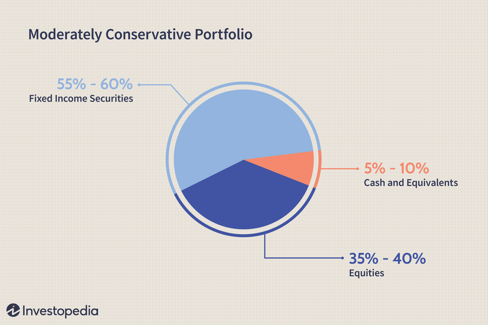

Balancing growth and risk is a paramount consideration in investment practice. Investment strategies cover a spectrum ranging from aggressive tactics, which seek high returns at greater risk, to conservative approaches that prioritize capital preservation. Conservative growth strategies specifically aim for long-term capital appreciation with minimized risks. This involves a calculated approach to asset allocation, often tapping into stable and reliable investment vehicles that provide steady, albeit modest, growth over time.

Algorithmic trading, or algo-trading, has transformed the investment landscape by employing sophisticated computer algorithms to execute trades with high speed and accuracy. While often associated with high-frequency trading and aggressive strategies, algo-trading has also shown substantial potential in supporting conservative growth objectives. Its precision and the ability to process large volumes of data have made it a valuable tool for investors looking to implement conservative strategies.



This article discusses the convergence of conservative growth strategies and algorithmic trading, shedding light on how they can complement each other to foster financial growth. Combining the cautious and risk-averse approach of conservative investing with the technological prowess of algo-trading provides a novel pathway for achieving stability and consistent returns in the ever-evolving financial markets.

## Table of Contents

## Understanding Conservative Growth Investment Strategies

Conservative growth investment strategies aim to grow capital while minimizing risk, typically involving a diversified portfolio of stable assets. These strategies are designed to prioritize wealth preservation while still offering the potential for capital gains. This balance is achieved by careful selection and allocation of investments that traditionally exhibit lower volatility and steady performance over time.

A typical conservative growth portfolio might include assets such as bonds, dividend-paying stocks, and broad-market exchange-traded funds (ETFs). Bonds are generally less volatile than stocks and provide regular interest income, which can cushion a portfolio during market downturns. Dividend-paying stocks offer the dual benefits of potential capital appreciation and income generation, contributing to portfolio stability. Broad-market ETFs provide diversification across various sectors and geographic regions, helping to reduce unsystematic risk.

Investors often favor conservative growth strategies for their retirement plans due to their stability and focus on long-term objectives. These strategies align with the needs of individuals seeking to preserve capital while still achieving moderate growth to outpace inflation and meet future financial obligations. By maintaining a disciplined approach to asset allocation and regularly rebalancing portfolios, conservative growth investors can manage risk effectively and pursue steady, sustainable returns over time.

## The Role of Algorithmic Trading in Conservative Growth

Algorithmic trading utilizes sophisticated computer algorithms to execute trades rapidly and with high accuracy, a capability that holds significant potential for conservative growth investment strategies. In the context of conservative growth, where the priority is on long-term capital appreciation with minimal risk, [algorithmic trading](/wiki/algorithmic-trading) can enhance strategy execution in several key ways.

Firstly, for conservative investors utilizing buy-and-hold strategies, algo-trading ensures precision and discipline in trade execution. The automated nature of algorithmic systems allows them to adhere strictly to predefined entry and [exit](/wiki/exit-strategy) criteria, which may be based on historical data or technical indicators. This eliminates human emotions that often lead to impulsive decision-making, thereby maintaining the integrity of a conservative growth strategy.

Moreover, algorithmic trading effectively supports the implementation of dollar-cost averaging, a favored strategy among conservative investors. By investing a fixed amount of capital into a particular asset at regular intervals, regardless of its price, investors can mitigate the effects of market [volatility](/wiki/volatility-trading-strategies) on their portfolios. Algorithmic systems can automate these periodic investments with exact timing, reducing the manual effort required and ensuring that the strategy is implemented consistently and without deviation.

Additionally, algorithms can process vast data sets from global financial markets to identify low-risk investment opportunities, aligning with the conservative growth objective of balancing stability with potential for capital gains. Through the integration of real-time market data, historical trends, and other financial indicators, algorithmic trading systems can swiftly assess multiple investment scenarios and execute trades that align with the investor's risk tolerance and growth expectations.

In summary, while the core aim of conservative growth strategies is to secure stable long-term returns, the incorporation of algorithmic trading offers enhanced precision, efficiency, and data-driven decision-making, making it a valuable tool for executing these strategies effectively in today's dynamic financial markets.

## Benefits of Combining Conservative Growth with Algorithmic Trading

Combining conservative growth strategies with algorithmic trading offers several compelling benefits that can enhance investment outcomes. One primary advantage is enhanced efficiency. Algorithmic trading systems can automate the execution of conservative strategies, ensuring trades are executed consistently and in a timely manner. This automation minimizes the manual intervention required in trade execution, reducing the potential for human error and allowing faster response times to market conditions.

Risk management is another significant benefit. Algorithms can seamlessly integrate stop-loss orders and optimize position sizing, which helps mitigate potential risks associated with market fluctuations. Through precise calculations and adherence to predefined risk parameters, algorithms can minimize losses and protect the portfolio from adverse market movements. For example, if an algorithm is designed to never lose more than 2% of the portfolio's value on a single trade, it can dynamically adjust position sizes to stay within this limit, ensuring controlled risk exposure.

Consistent returns are achievable through the disciplined approach that algorithmic trading enforces. By strictly following a set of conservative growth objectives, algorithms can execute trades that align with long-term capital appreciation goals. This systematic approach reduces emotional biases that often lead to erratic investment decisions, contributing to steadier performance over time.

Finally, diversification is facilitated by the ability of algorithms to quickly execute trades across a vast array of asset classes and geographical markets. This capability enables the construction of well-diversified portfolios, which is a hallmark of conservative growth strategies. For instance, a diversification algorithm can be programmed to allocate a certain percentage of the portfolio to different sectors or regions, adjusting allocations based on market conditions to optimize returns while maintaining a balanced risk profile.

Incorporating algorithmic trading into conservative growth strategies thus offers a comprehensive suite of tools for improving investment performance, risk mitigation, and strategic alignment with long-term financial goals.

## Challenges and Risks in Algo-Trading for Conservative Investors

Algorithmic trading, while offering significant benefits in executing conservative growth strategies, presents a range of challenges and risks that investors must carefully consider. These risks can broadly be categorized into technical risks, market risks, over-reliance on technology, and regulatory concerns.

### Technical Risks
Algorithmic trading systems are fundamentally dependent on technology, including hardware, software, and network connections. As a result, technical malfunctions, such as software bugs, server crashes, or connectivity issues, can disrupt trading operations, potentially leading to substantial financial losses. For instance, a sudden software glitch might execute erroneous trades or fail to execute trades as intended. Therefore, rigorous testing, regular maintenance, and system redundancy are crucial to mitigating such risks.

### Market Risks
Market risks are inherent to all trading activities, including algorithmic trading. Algorithms designed for conservative strategies may not be versatile enough to adapt to rapid market fluctuations. For example, during a market downturn or sudden volatility, an algorithm based on historical data might not adjust quickly enough, leading to unexpected outcomes and potential losses. This highlights the necessity of incorporating adaptive models that can respond to real-time market data and adjust strategies accordingly.

### Over-reliance on Technology
While algorithms are designed to eliminate emotional biases, an over-reliance on these systems can overlook crucial qualitative factors that require human judgment. For conservative investors, who typically value a cautious approach, integrating human oversight into algorithmic systems is vital. This can ensure that qualitative assessments, such as the impact of geopolitical events or shifts in economic policy, are considered alongside quantitative analyses, maintaining a balanced investment strategy.

### Regulatory Concerns
Algo-trading is subject to stringent regulatory standards, which vary across different jurisdictions. Changes in regulations, such as those related to data privacy or trading transparency, can significantly influence how algorithms are developed and executed. For conservative investors, staying abreast of regulatory changes is essential to ensure compliance and to adjust trading strategies accordingly. This may involve collaborating with legal experts to navigate the complexities of financial regulations effectively.

To address these challenges and risks, conservative investors utilizing algorithmic trading must adopt a multi-faceted approach. This includes employing robust risk management protocols, maintaining a balanced interplay between algorithmic precision and human insight, and staying informed about regulatory developments. By doing so, they can leverage the full potential of algorithmic trading while minimizing the associated risks.

## Case Studies: Successful Integration of Algo-Trading in Conservative Portfolios

The Vanguard LifeStrategy Conservative Growth Fund serves as a prominent example of successfully integrating algorithmic models to maintain asset balance. This fund employs algorithms to systematically rebalance its portfolio, ensuring a consistent alignment with its conservative growth objectives. By leveraging rule-based algorithms, the fund efficiently manages investment allocation, reducing human error and emotional trading biases. These algorithms are designed to monitor market conditions continuously and adjust the balance between asset classes such as equities and fixed income, aiming for optimal risk-adjusted returns.

Several other funds mirror this approach, incorporating algorithmic strategies to execute low-risk trades and optimize asset allocation. For instance, robo-advisors like Betterment and Wealthfront utilize algorithmic trading to manage portfolios aligned with conservative growth strategies. These platforms apply algorithms that perform tasks like dollar-cost averaging and tax-loss harvesting automatically, thereby optimizing returns while managing risks efficiently. This automation ensures that portfolios remain diversified and aligned with individual risk tolerances, catering to investors seeking stability and gradual capital appreciation.

Real-world examples reinforce the efficacy of algorithmic trading for conservative growth investors. The integration of algorithmic components allows for rapid data analysis and decision-making, enhancing responsiveness to market shifts without deviating from conservative principles. For example, the use of moving average crossovers or mean reversion strategies in trading can provide signals that guide conservative investors in timing their trades effectively. 

Python code demonstrating a simple moving average crossover strategy might look like this:

```python
import pandas as pd
import numpy as np

def moving_average_strategy(prices, short_window=40, long_window=100):
    signals = pd.DataFrame(index=prices.index)
    signals['price'] = prices

    # Create the set of short and long simple moving averages
    signals['short_mavg'] = prices.rolling(window=short_window, min_periods=1).mean()
    signals['long_mavg'] = prices.rolling(window=long_window, min_periods=1).mean()

    # Create signals
    signals['signal'] = 0.0
    signals['signal'][short_window:] = np.where(signals['short_mavg'][short_window:] 
                                                 > signals['long_mavg'][short_window:], 1.0, 0.0)   

    # Generate trading orders
    signals['positions'] = signals['signal'].diff()
    return signals
```

Such strategies illustrate how algorithms can automate complex decision-making processes while adhering to conservative growth objectives. Importantly, the success of these integrations depends on the continuous calibration of algorithmic models to adapt to changing market conditions and regulatory environments. By embracing these technologies, conservative portfolios not only enhance their efficiency but also uphold their commitment to minimizing risk and ensuring steady growth.

## Future Trends in Conservative Growth and Algo-Trading

The future landscape of conservative growth investing is poised to experience significant shifts with the increasing incorporation of algorithmic trading. This evolution is largely driven by advancements in technology and regulatory changes, impacting how conservative investment strategies are formulated and executed. 

### Increased Adoption

More conservative investors are expected to turn to algorithmic trading as its precision and efficiency become increasingly apparent. Algorithmic trading minimizes human error and emotional bias, facilitating disciplined adherence to conservative investment strategies such as buy-and-hold and dollar-cost averaging. Algorithms enable rapid execution of trades, ensuring that portfolios remain balanced according to predefined strategic objectives. As investors seek reliability and consistency in returns, the automation provided by algorithmic solutions offers an attractive alternative to traditional methods.

### Integration with AI

A key trend is the integration of Artificial Intelligence (AI) into algorithmic trading systems. AI-driven algorithms can significantly enhance decision-making processes by analyzing vast datasets to uncover patterns and trends that may not be immediately apparent to human analysts. For conservative growth strategies, AI can help identify low-risk investment opportunities by evaluating historical data and predicting future market behaviors with greater accuracy. The implementation of [machine learning](/wiki/machine-learning) techniques allows these algorithms to continually improve their performance and adapt to changing market conditions. Python, with its robust libraries such as TensorFlow and Scikit-learn, is frequently used to develop AI-enhanced trading models. For example, a simple machine learning model for predicting stock price trends might look like this:

```python
from sklearn.model_selection import train_test_split
from sklearn.ensemble import RandomForestClassifier
import numpy as np

# Assuming features and labels are prepared
features = np.array([...])
labels = np.array([...])

# Split data into training and test sets
X_train, X_test, y_train, y_test = train_test_split(features, labels, test_size=0.2, random_state=42)

# Initiate and train the model
model = RandomForestClassifier(n_estimators=100)
model.fit(X_train, y_train)

# Predict and evaluate
predictions = model.predict(X_test)
accuracy = np.mean(predictions == y_test)
print(f"Model Accuracy: {accuracy}")
```

### Regulatory Evolution

As algorithmic trading becomes more prevalent, regulatory frameworks are expected to evolve to ensure fair and transparent market practices. Regulatory bodies may introduce new guidelines and compliance requirements specific to algorithmic processes, which could influence how conservative strategies are developed and executed. The evolving regulatory landscape will necessitate that investment firms and individual investors stay informed and adaptable to maintain compliance while optimizing their algo-trading strategies. As regulations become more sophisticated, they could drive innovation in algorithmic trading practices, fostering a more robust investment environment for conservative growth.

In summary, the fusion of algorithmic trading and conservative growth strategies will likely grow stronger in the coming years, bolstered by technological advancements and a responsive regulatory framework. Investors who stay ahead in adopting these trends will position themselves to achieve steady capital appreciation while mitigating risks in an ever-evolving financial market.

## Conclusion

Conservative growth strategies and algorithmic trading can work together to create a stable yet adaptable approach to investing. By integrating algorithmic trading, conservative investors can benefit from precise execution and the ability to manage trades efficiently. This combination allows for a disciplined approach that can enhance returns while maintaining a focus on stability and risk management.

However, embracing technology in investment strategies also introduces specific challenges. Managing the associated risks, such as technical errors or market volatility, is crucial. Investors need to ensure that their chosen algo-trading tools not only align with their risk tolerance but also complement their strategic objectives. 

Given the dynamic nature of financial markets and technological advancements, continuous monitoring and strategy adaptation are essential. Investors should regularly assess the performance of algorithmic approaches within their portfolios, making necessary adjustments to account for changing market conditions or technological updates. By doing so, they can ensure that their investment strategies remain effective in navigating the evolving landscape of conservative investment.

## References & Further Reading

[1]: Bergstra, J., Bardenet, R., Bengio, Y., & Kégl, B. (2011). ["Algorithms for Hyper-Parameter Optimization."](https://dl.acm.org/doi/10.5555/2986459.2986743) Advances in Neural Information Processing Systems 24.

[2]: ["Advances in Financial Machine Learning"](https://www.amazon.com/Advances-Financial-Machine-Learning-Marcos/dp/1119482089) by Marcos Lopez de Prado

[3]: ["Evidence-Based Technical Analysis: Applying the Scientific Method and Statistical Inference to Trading Signals"](https://www.amazon.com/Evidence-Based-Technical-Analysis-Scientific-Statistical/dp/0470008741) by David Aronson

[4]: ["Machine Learning for Algorithmic Trading"](https://github.com/stefan-jansen/machine-learning-for-trading) by Stefan Jansen

[5]: ["Quantitative Trading: How to Build Your Own Algorithmic Trading Business"](https://www.amazon.com/Quantitative-Trading-Build-Algorithmic-Business/dp/1119800064) by Ernest P. Chan