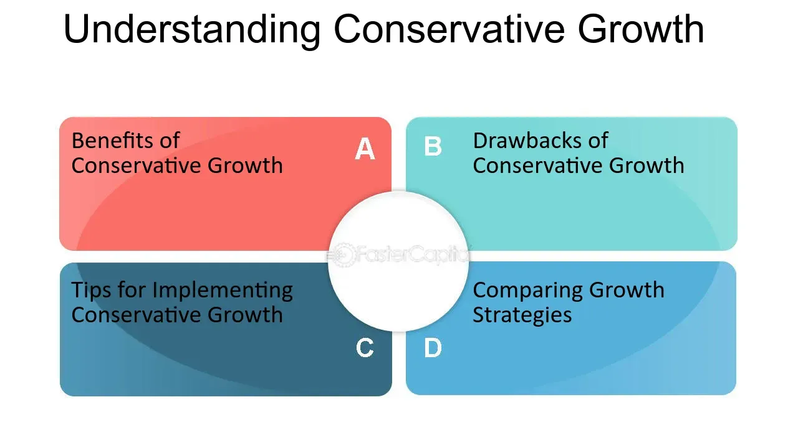

## Table of Contents

## What is a conservative growth strategy?

A conservative growth strategy is a careful way for a business to grow slowly and safely. Instead of taking big risks, the business focuses on steady progress. This means making small, safe investments and trying to keep costs low. The goal is to grow the business without putting it in danger. For example, a company might choose to expand to new areas slowly, one at a time, rather than trying to grow quickly in many places at once.

This strategy is often used by businesses that want to avoid big losses. They might be in industries where things can change quickly, or they might not have a lot of money to spend on risky projects. By growing slowly, the business can learn from each step and make better decisions for the future. This approach can help the business stay strong and stable, even if the economy is not doing well. It's like building a strong foundation before adding more to the structure.

## Why might a business choose a conservative growth strategy over more aggressive approaches?

A business might choose a conservative growth strategy because it's safer. Instead of taking big risks that could lead to big losses, a business grows slowly and carefully. This approach helps the business stay stable, even when the economy is not doing well. For example, if a company only expands to new areas one at a time, it can learn from each step and avoid making big mistakes. This way, the business can keep its costs low and avoid running out of money.

Another reason a business might choose a conservative growth strategy is if it doesn't have a lot of money to spend. Aggressive growth often needs a lot of investment, and not all businesses can afford that. By growing slowly, a business can use the money it makes to fund its growth, instead of borrowing a lot or spending all its savings. This helps the business stay financially healthy and avoid the stress of trying to pay back big loans. In the end, a conservative approach can lead to steady, reliable growth that keeps the business strong over time.

## What are the key principles of a conservative growth strategy?

A conservative growth strategy focuses on slow and steady growth. Instead of taking big risks, the business makes small, safe investments. This helps keep costs low and avoids big losses. The business grows one step at a time, learning from each move. This way, the company can make better decisions and stay stable, even if the economy changes.

Another key principle is to use the money the business makes to fund its growth. This means not spending all the savings or borrowing a lot of money. By growing slowly, the business can stay financially healthy. It avoids the stress of big loans and keeps money in reserve for tough times. This approach helps the business stay strong and grow steadily over time.

## How does a conservative growth strategy impact financial stability?

A conservative growth strategy helps a business stay financially stable by growing slowly and safely. Instead of taking big risks, the business makes small, safe investments. This keeps costs low and avoids big losses. By growing one step at a time, the business can learn from each move and make better decisions. This slow and steady approach helps the business stay strong, even if the economy changes.

Another way a conservative growth strategy impacts financial stability is by using the money the business makes to fund its growth. This means the business doesn't spend all its savings or borrow a lot of money. By growing slowly, the business can keep its finances healthy. It avoids the stress of big loans and keeps money in reserve for tough times. This approach helps the business stay strong and grow steadily over time.

## What are some examples of conservative growth strategies in different industries?

In the restaurant industry, a conservative growth strategy might look like a small family-owned restaurant deciding to open a second location only after the first one has been successful for several years. They might choose a location close to the original one to keep an eye on both and share resources like staff and suppliers. This way, they grow slowly, making sure each step is solid before taking the next one. They might also focus on keeping costs low by not spending a lot on advertising and instead relying on word-of-mouth from happy customers.

In the tech industry, a software company might choose a conservative growth strategy by focusing on improving their existing product instead of rushing to create new ones. They might listen to their current customers and make small updates to meet their needs better. Instead of spending a lot of money on big marketing campaigns, they might grow their customer base slowly through referrals and by offering good customer service. This helps them stay financially stable and build a strong foundation for future growth.

In the retail industry, a small boutique might adopt a conservative growth strategy by expanding its product line slowly. Instead of adding many new items at once, they might introduce a few new products each season and see how customers react. They might also choose to open an online store before opening new physical locations, as it's less expensive and allows them to reach more customers without big investments. This careful approach helps them keep costs down and maintain financial stability while growing their business.

## How can a company measure the success of a conservative growth strategy?

A company can measure the success of a conservative growth strategy by looking at its financial health. This means checking if the company is making steady profits and not spending too much money. If the company is growing slowly but surely, without taking big risks, it's a sign that the strategy is working. The company should also see if it has enough money saved up for tough times, which shows that it's financially stable.

Another way to measure success is by looking at customer satisfaction and loyalty. If customers are happy with the company's products or services and keep coming back, it means the company is doing well. The company can also check if it's slowly growing its customer base through word-of-mouth or small, targeted marketing efforts. If the number of loyal customers is increasing over time, it's a good sign that the conservative growth strategy is paying off.

## What are the potential risks associated with a conservative growth strategy?

One risk of a conservative growth strategy is that the company might grow too slowly. While this approach helps avoid big losses, it can also mean missing out on big opportunities. If other companies in the same industry are growing faster, they might take away customers and leave the conservative company behind. This can make it hard for the company to catch up later, especially if the market changes quickly.

Another risk is that the company might become too focused on staying safe and not take any risks at all. This can lead to a lack of innovation, which is important for staying competitive. If the company doesn't try new things or adapt to changes in the market, it might struggle to keep up with new trends and technologies. Over time, this could make the company less relevant and less able to attract new customers.

## How does a conservative growth strategy affect a company's market position?

A conservative growth strategy can help a company keep a strong market position by growing slowly and safely. Instead of taking big risks, the company makes small, safe moves. This helps the company stay stable and avoid big losses. By growing one step at a time, the company can learn from each move and make better decisions. This way, the company can stay strong in the market, even when other companies are growing faster. The company's customers might see it as reliable and trustworthy, which can help keep them loyal.

But, a conservative growth strategy can also make it hard for a company to keep up with its competitors. If other companies are growing faster and taking more risks, they might attract more customers and leave the conservative company behind. This can make it hard for the company to catch up later, especially if the market changes quickly. Also, if the company doesn't try new things or adapt to changes in the market, it might struggle to keep up with new trends and technologies. Over time, this could make the company less relevant and less able to attract new customers.

## Can a conservative growth strategy be combined with other growth strategies? If so, how?

Yes, a conservative growth strategy can be combined with other growth strategies. For example, a company might use a conservative approach for its core business, focusing on slow and steady growth. At the same time, it might set up a separate division to try out more aggressive growth strategies, like investing in new technologies or expanding into new markets quickly. This way, the company can keep its main business stable while also taking some risks to grow faster in other areas.

Another way to combine strategies is by using a conservative approach for financial planning but being more aggressive in marketing. The company might keep its costs low and avoid big loans, but it could also invest in targeted marketing campaigns to reach new customers faster. This balanced approach helps the company stay financially healthy while still trying to grow its customer base more quickly. By mixing conservative and aggressive strategies, a company can aim for steady growth while also looking for new opportunities.

## What role does innovation play in a conservative growth strategy?

Innovation can still be important in a conservative growth strategy, but it needs to be managed carefully. Instead of rushing to create new products or services, a company might focus on making small, safe improvements to what they already offer. They can listen to their customers and make changes that meet their needs better. This way, the company can keep growing slowly and steadily without taking big risks. By innovating in small steps, the company can stay competitive and keep its customers happy without spending too much money or putting the business in danger.

But, a conservative growth strategy can also make it hard for a company to keep up with big changes in the market. If the company is too focused on staying safe and doesn't try new things, it might miss out on important new trends and technologies. This can make the company less relevant over time and less able to attract new customers. So, while innovation should be cautious in a conservative approach, the company still needs to keep an eye on the market and be ready to adapt when necessary. By finding a balance between safety and innovation, the company can stay strong and grow steadily over time.

## How should a company adapt its conservative growth strategy in response to economic downturns?

During an economic downturn, a company following a conservative growth strategy should focus even more on keeping costs low and staying financially stable. Instead of trying to grow quickly, the company should make sure it has enough money saved up to get through tough times. This might mean cutting back on some expenses or delaying plans to expand. By being careful with money, the company can avoid big losses and keep its business running smoothly, even when the economy is not doing well.

At the same time, the company should keep an eye on the market and be ready to adapt if things change. If there are new opportunities that come up during the downturn, the company might want to take small, safe steps to take advantage of them. This could mean offering new products or services that meet the changing needs of customers. By staying flexible and making small changes, the company can keep growing slowly and steadily, even in tough economic times.

## What advanced metrics and models can be used to refine a conservative growth strategy?

To refine a conservative growth strategy, a company can use advanced metrics like the Return on Investment (ROI) and the Net Present Value (NPV) to make sure their small investments are paying off. ROI helps the company see how much money they are making from each investment compared to what they spent. If the ROI is good, it means the company is growing slowly but making smart choices. NPV looks at the future money the company might make from an investment and compares it to the cost today. This helps the company decide if an investment is worth it, even if it's small.

Another useful tool is the Customer Lifetime Value (CLTV) model, which helps the company understand how much money they can expect to make from each customer over time. By focusing on keeping customers happy and loyal, the company can grow steadily without spending a lot on new customers. The company can also use scenario analysis to plan for different situations, like an economic downturn. This helps them see how their conservative strategy might work in different conditions and make adjustments to stay stable and keep growing slowly.

## References & Further Reading

[1]: Bergstra, J., Bardenet, R., Bengio, Y., & Kégl, B. (2011). ["Algorithms for Hyper-Parameter Optimization."](https://dl.acm.org/doi/10.5555/2986459.2986743) Advances in Neural Information Processing Systems 24.

[2]: ["Advances in Financial Machine Learning"](https://www.amazon.com/Advances-Financial-Machine-Learning-Marcos/dp/1119482089) by Marcos Lopez de Prado

[3]: ["Evidence-Based Technical Analysis: Applying the Scientific Method and Statistical Inference to Trading Signals"](https://www.amazon.com/Evidence-Based-Technical-Analysis-Scientific-Statistical/dp/0470008741) by David Aronson

[4]: ["Machine Learning for Algorithmic Trading"](https://github.com/stefan-jansen/machine-learning-for-trading) by Stefan Jansen

[5]: ["Quantitative Trading: How to Build Your Own Algorithmic Trading Business"](https://www.amazon.com/Quantitative-Trading-Build-Algorithmic-Business/dp/1119800064) by Ernest P. Chan