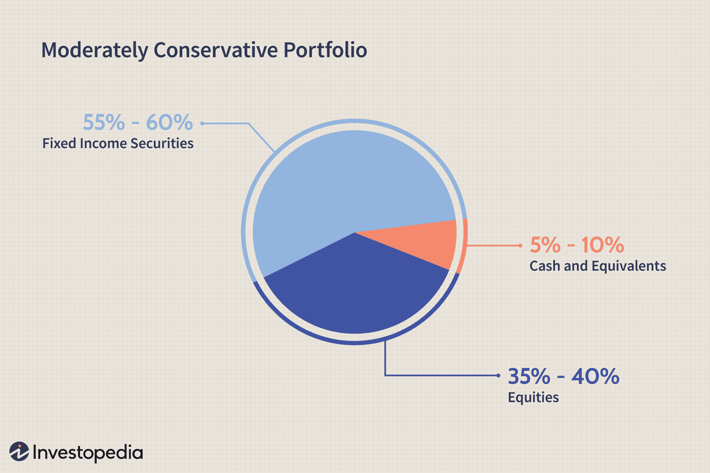

## Table of Contents

## What is a conservative investment strategy?

A conservative investment strategy is a way of investing money that focuses on keeping it safe and steady, rather than trying to grow it quickly. People who use this strategy usually want to avoid big risks and protect their money. They often choose investments like government bonds, savings accounts, or certificates of deposit (CDs). These options are less likely to lose value over time, which makes them a good choice for someone who wants to keep their money secure.

This strategy is popular with people who are close to retirement or those who need their money to be available and safe. Instead of putting money into stocks or other high-risk investments, they prefer to have a stable income and peace of mind. While the returns might be lower compared to riskier investments, the main goal is to preserve the money they have and avoid big losses. This approach can help investors sleep better at night, knowing their savings are protected.

## Why might someone choose a conservative investment approach?

Someone might choose a conservative investment approach because they want to keep their money safe. They might be worried about losing money in the stock market or other risky investments. By choosing things like savings accounts, government bonds, or CDs, they can feel more secure. These options are less likely to go down in value, so their money stays safe and they can use it when they need to.

Another reason is that some people are close to retiring or need their money soon. They don't want to take big risks with their savings because they can't afford to lose it. A conservative approach helps them keep their money steady and available. Even though they might not make as much money as they would with riskier investments, they value the peace of mind that comes with knowing their money is protected.

## What are the key characteristics of conservative investments?

Conservative investments are all about keeping your money safe and not taking big risks. They usually include things like savings accounts, government bonds, and certificates of deposit (CDs). These types of investments don't change in value a lot, so you don't have to worry about losing a lot of money. They are a good choice if you want to make sure your money stays safe and you can use it when you need to.

Another key characteristic of conservative investments is that they give you steady, but small, returns. You won't see your money grow quickly, but it will grow slowly and surely. This is perfect for people who don't want to take chances with their money, like those who are close to retiring or need their money soon. The main goal is to keep your money safe and avoid big losses, even if it means you won't make as much money as you might with riskier investments.

## How do conservative investment strategies differ from aggressive ones?

Conservative investment strategies focus on keeping your money safe and avoiding big risks. People who use this approach usually choose investments like savings accounts, government bonds, and certificates of deposit (CDs). These options don't change in value a lot, so you don't have to worry about losing a lot of money. The main goal is to keep your money steady and available, especially for those who are close to retiring or need their money soon. While the returns might be small, the focus is on preserving the money you have and avoiding big losses.

On the other hand, aggressive investment strategies are all about trying to make your money grow quickly. People who use this approach often invest in stocks, mutual funds, and other high-risk options. They are willing to take big risks because they want to see big returns. This can lead to big gains, but it also means there's a chance of losing a lot of money. Aggressive investors are usually younger or have money they can afford to lose, and they are okay with the ups and downs of the market because they hope to make more money in the long run.

## What are some common conservative investment options for beginners?

For beginners who want to keep their money safe, savings accounts are a good choice. You can open a savings account at a bank or credit union. The money in your savings account earns a little bit of interest over time. This means your money grows slowly, but it's very safe because banks are protected by the government. You can take your money out whenever you need it, which makes savings accounts a good option if you might need your money soon.

Another common conservative investment for beginners is a certificate of deposit, or CD. When you put your money into a CD, you agree to leave it there for a certain amount of time, like six months or a year. In return, the bank gives you a bit more interest than you would get from a regular savings account. CDs are safe because they are also protected by the government. The only thing to remember is that if you take your money out before the time is up, you might have to pay a fee.

Government bonds are another safe choice for beginners. When you buy a government bond, you are lending money to the government. They promise to pay you back with interest over time. Government bonds are very safe because the government is unlikely to go bankrupt. They are a good way to keep your money growing slowly and steadily without taking big risks.

## How can risk be managed effectively in a conservative portfolio?

Managing risk in a conservative portfolio is all about keeping your money safe. One way to do this is by spreading your money across different types of safe investments, like savings accounts, government bonds, and CDs. This way, if one type of investment doesn't do well, the others can help balance it out. It's like not putting all your eggs in one basket. By diversifying, you can lower the chance of losing money and keep your portfolio stable.

Another important way to manage risk is by checking your investments regularly. Even though conservative investments are safe, things can change. For example, interest rates can go up or down, which affects how much money you earn from your investments. By keeping an eye on your portfolio and making small adjustments when needed, you can make sure your money stays safe and continues to grow slowly. This helps you avoid big surprises and keeps your investments working well for you.

## What role do bonds play in a conservative investment strategy?

Bonds are a big part of a conservative investment strategy because they are very safe. When you buy a bond, you are lending money to a government or a company. They promise to pay you back with interest over time. Government bonds, especially from stable countries, are the safest because the government is unlikely to go bankrupt. This makes them a good choice if you want to keep your money safe and still earn a little bit of interest.

In a conservative portfolio, bonds help balance out risk. They don't change in value a lot, so you don't have to worry about losing a lot of money. This is different from stocks, which can go up and down a lot. By including bonds in your portfolio, you can make sure your money stays steady and grows slowly. This is perfect for people who are close to retiring or need their money to be safe and available when they need it.

## How important is diversification in a conservative investment approach?

Diversification is very important in a conservative investment approach because it helps keep your money safe. When you spread your money across different types of safe investments, like savings accounts, government bonds, and CDs, you lower the risk of losing money. If one type of investment doesn't do well, the others can help balance it out. It's like not putting all your eggs in one basket. By diversifying, you make sure your portfolio stays stable and your money stays safe.

Even though conservative investments are safe, things can still change. For example, interest rates can go up or down, which affects how much money you earn from your investments. By diversifying, you can handle these changes better. If one investment is affected by a change in interest rates, the others might not be affected as much. This way, your overall portfolio stays strong and you can feel more secure about your money.

## Can conservative strategies still provide growth, and if so, how?

Yes, conservative strategies can still provide growth, but it happens slowly and steadily. When you invest in things like savings accounts, government bonds, and certificates of deposit (CDs), you earn a little bit of interest over time. This interest adds up and makes your money grow, even if it's not as fast as with riskier investments. The key is to be patient and let the small, steady returns build up over time.

For example, if you put your money in a savings account, the bank pays you interest for keeping your money there. This interest might be small, but it's safe and reliable. The same goes for government bonds, where the government pays you back with interest over time. By choosing these safe investments, you can see your money grow without taking big risks. It's all about keeping your money safe while still seeing it increase little by little.

## What are advanced techniques for optimizing a conservative investment portfolio?

One advanced technique for optimizing a conservative investment portfolio is laddering. This means you spread out when your investments, like CDs or bonds, mature. Instead of putting all your money into one CD that matures in a year, you could put some money into a CD that matures in three months, some in six months, and some in a year. This way, you can take advantage of different interest rates over time and have regular access to your money without having to pay early withdrawal fees. Laddering helps you balance the safety of your investments with the chance to earn a bit more interest.

Another technique is to keep an eye on interest rates and adjust your portfolio accordingly. Interest rates can change, and when they do, it affects how much money you earn from your investments. If you think interest rates are going to go up, you might want to invest in shorter-term bonds or CDs so you can reinvest at a higher rate when they mature. On the other hand, if rates are going down, longer-term investments might be better because they lock in the current rate for a longer time. By staying informed and making small changes to your portfolio, you can make sure your money keeps growing safely and steadily.

## How do economic conditions affect conservative investment strategies?

Economic conditions can change how well conservative investments do. For example, when the economy is doing well, interest rates might go up. This is good for people with savings accounts, CDs, and bonds because they can earn more interest. But if the economy is not doing well, interest rates might go down. This means you earn less interest on your money, so your investments grow more slowly. It's important to keep an eye on the economy and adjust your investments if needed to make sure your money stays safe and keeps growing.

Inflation is another thing that can affect conservative investments. Inflation means prices go up over time, which can make your money worth less. If inflation is high, the interest you earn from your investments might not keep up with the rising prices. This can make it hard for your money to grow in real terms. To deal with this, you might want to look for investments that can at least keep up with inflation, like certain types of bonds called TIPS (Treasury Inflation-Protected Securities). By understanding how economic conditions can affect your investments, you can make better choices to keep your money safe and growing.

## What are the long-term benefits and potential drawbacks of sticking to conservative investments?

Sticking to conservative investments has some good long-term benefits. One big benefit is that your money stays safe. You don't have to worry about losing a lot of money because conservative investments like savings accounts, government bonds, and CDs are very safe. They might not grow as fast as riskier investments, but they grow slowly and steadily. This is perfect for people who need their money to be there when they retire or need it for something important. Another benefit is that conservative investments give you peace of mind. You can sleep better at night knowing your money is protected and not going up and down a lot like the stock market.

However, there are also some potential drawbacks to sticking with conservative investments. One big drawback is that you might not make as much money as you could with riskier investments. The interest you earn from conservative investments is usually small, so your money grows slowly. Over a long time, this can mean you end up with less money than if you had taken some risks. Another drawback is that inflation can be a problem. If prices go up a lot, the interest you earn might not keep up, which means your money could lose value over time. So, while conservative investments keep your money safe, they might not help it grow as much as you need in the long run.

## What is Understanding Conservative Investing?

Conservative investing is a financial strategy that prioritizes the preservation of capital while seeking modest growth. This approach is typically characterized by low-risk investments such as government bonds, blue-chip stocks, and cash equivalents. These asset classes are chosen for their stability, consistent returns, and lower volatility compared to higher-risk investments.

Investors who prefer conservative investing often have a low risk tolerance. This category includes individuals nearing or in retirement who prioritize capital preservation over growth. They focus on ensuring their principal investment remains intact and aims to create a steady, reliable income stream through dividends or interest payments. This stability allows them to meet regular financial needs without being overly exposed to market fluctuations.

The key objectives of conservative investing are maintaining the stability of the investment's principal and generating a reliable income stream. Bonds, for instance, offer fixed income through periodic interest payments, while blue-chip stocks provide dividends from established companies with strong financial histories. These components contribute to a portfolio that emphasizes income retention and risk mitigation.

To illustrate, consider the investment of $10,000 in a government bond with an annual [interest rate](/wiki/interest-rate-trading-strategies) of 3%. The annual income from this bond would be:

$$
\text{Income} = \text{Principal} \times \text{Interest Rate} = \$10,000 \times 0.03 = \$300
$$

This calculation showcases the predictable income potential of conservative investments.

Understanding the nature of conservative investing is vital for determining its suitability based on individual financial goals and stages in life. A young investor with long-term growth ambitions may find conservative investing too limiting, whereas someone in retirement may value the security and income reliability it offers. Therefore, assessing this investment strategy involves a careful consideration of one's financial objectives, risk tolerance, and current life circumstances.

## References & Further Reading

[1]: Bodie, Z., Kane, A., & Marcus, A. J. (2018). ["Essentials of Investments"](https://www.amazon.com/Investments-Zvi-Bodie/dp/1260013839). McGraw-Hill Education.

[2]: Fabozzi, F. J. (2007). ["Fixed Income Analysis"](https://www.amazon.com/Fixed-Income-Analysis-Frank-Fabozzi/dp/047005221X), CFA Institute Investment Series.

[3]: Aldridge, I. (2013). ["High-Frequency Trading: A Practical Guide to Algorithmic Strategies and Trading Systems"](https://onlinelibrary.wiley.com/doi/pdf/10.1002/9781119203803.fmatter). Wiley Trading.

[4]: Chan, E. P. (2009). ["Quantitative Trading: How to Build Your Own Algorithmic Trading Business"](https://github.com/ftvision/quant_trading_echan_book). Wiley Trading.

[5]: Grinold, R. C., & Kahn, R. N. (1999). ["Active Portfolio Management: A Quantitative Approach for Producing Superior Returns and Controlling Risk"](https://www.amazon.com/Active-Portfolio-Management-Quantitative-Controlling/dp/0070248826). McGraw-Hill Education.