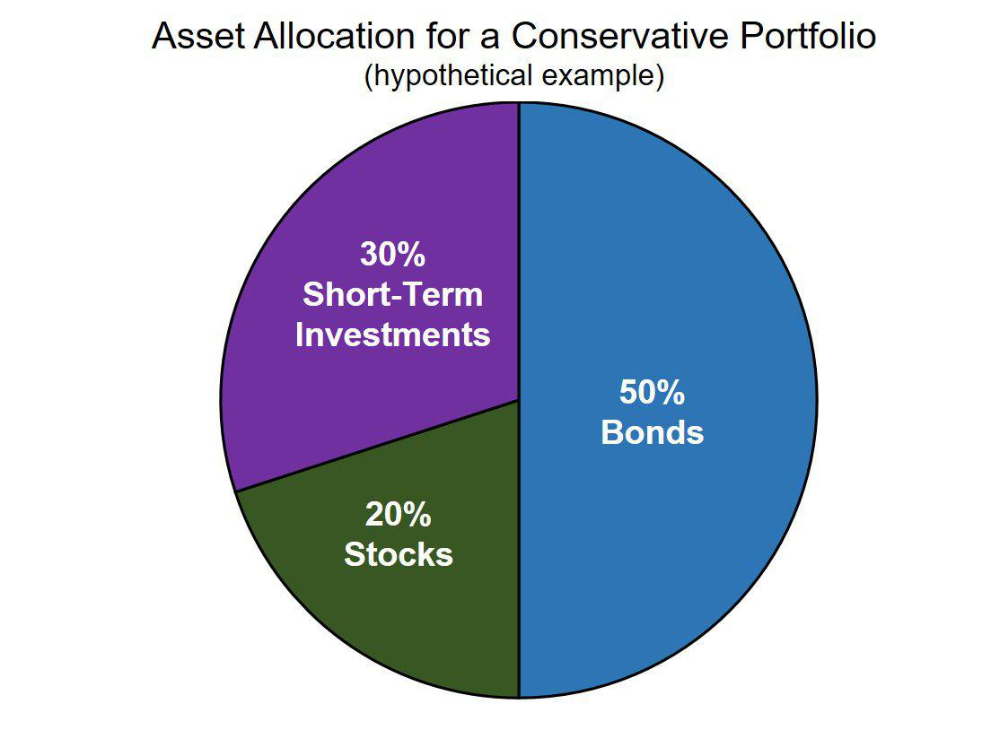

Investors often seek ways to optimize their portfolios by balancing risk and reward. Understanding the pros and cons of different investment strategies is essential for crafting an approach that aligns with one’s financial goals and risk tolerance. This article explores the key aspects of investment strategies, particularly highlighting conservative investing and algorithmic trading. By examining the strengths and weaknesses of these approaches, investors can make more informed decisions and tailor their investment plans more effectively. We begin by providing an overview of conservative investing, discuss the merits and drawbacks of algorithmic trading, and conclude with comparisons and recommendations.

In any investment strategy, the ultimate aim is to achieve an ideal balance where the potential rewards justify the assumed risks. This balance is influenced by several factors, including personal financial goals, risk tolerance, and market conditions. Crafting a sound strategy requires investors to have comprehensive knowledge of the available options, understanding not only their potential for profit but also the risks involved and the way they align with broader financial objectives.

Conservative investing is characterized by its focus on preserving capital and achieving modest, consistent growth over time. This strategy is well-suited for individuals with a low risk tolerance who prioritize capital preservation, such as retirees or those nearing retirement. It primarily involves low-risk investments like government bonds, blue-chip stocks, and cash equivalents, aiming to maintain the stability of the principal investment while generating reliable income through dividends or interest.

On the other hand, algorithmic trading leverages technology to execute trades based on predefined criteria. Through the use of complex mathematical models and high-speed computation, algo trading can conduct trades more efficiently than human traders. While prevalent among institutional investors, this approach is now becoming increasingly accessible to retail investors. The rise of algorithmic trading presents an opportunity to harness technological advancements for potentially higher profits while minimizing emotional bias in trading decisions.

This article aims to provide a comprehensive comparison between conservative investing and algorithmic trading. Investors can better assess how these strategies align with their personal financial situation and market outlook. By doing so, they can create a more sophisticated and tailored investment plan, potentially incorporating elements from both strategies to achieve a balance between capital preservation and growth potential.

## Table of Contents

## Understanding Conservative Investing

Conservative investing is a financial strategy that prioritizes the preservation of capital while seeking modest growth. This approach is typically characterized by low-risk investments such as government bonds, blue-chip stocks, and cash equivalents. These asset classes are chosen for their stability, consistent returns, and lower volatility compared to higher-risk investments.

Investors who prefer conservative investing often have a low risk tolerance. This category includes individuals nearing or in retirement who prioritize capital preservation over growth. They focus on ensuring their principal investment remains intact and aims to create a steady, reliable income stream through dividends or interest payments. This stability allows them to meet regular financial needs without being overly exposed to market fluctuations.

The key objectives of conservative investing are maintaining the stability of the investment's principal and generating a reliable income stream. Bonds, for instance, offer fixed income through periodic interest payments, while blue-chip stocks provide dividends from established companies with strong financial histories. These components contribute to a portfolio that emphasizes income retention and risk mitigation.

To illustrate, consider the investment of $10,000 in a government bond with an annual [interest rate](/wiki/interest-rate-trading-strategies) of 3%. The annual income from this bond would be:

$$
\text{Income} = \text{Principal} \times \text{Interest Rate} = \$10,000 \times 0.03 = \$300
$$

This calculation showcases the predictable income potential of conservative investments.

Understanding the nature of conservative investing is vital for determining its suitability based on individual financial goals and stages in life. A young investor with long-term growth ambitions may find conservative investing too limiting, whereas someone in retirement may value the security and income reliability it offers. Therefore, assessing this investment strategy involves a careful consideration of one's financial objectives, risk tolerance, and current life circumstances.

## Pros and Cons of Conservative Investing

Conservative investing is an approach that focuses on minimizing risk by selecting investments with stable and predictable returns. This strategy is suitable for individuals with low-risk tolerance, such as retirees who prioritize capital preservation and steady income streams. Here, we explore the advantages and disadvantages of conservative investing.

### Pros

1. **Lower Risk**:
   Conservative investing prioritizes stability over high returns, focusing on assets like government bonds, blue-chip stocks, and cash equivalents. These investments typically exhibit less [volatility](/wiki/volatility-trading-strategies), reducing the likelihood of substantial losses. For example, U.S. Treasury bonds are considered low-risk as they are backed by the government, providing a safe haven for capital.

2. **Steady Income**:
   This strategy provides a consistent income stream, primarily through dividends from equities and interest payments from fixed-income securities. Such income stability is crucial for retirees who may rely on investment proceeds to supplement their living expenses. For instance, a portfolio including dividend-paying stocks of large, established companies can offer regular income without high risk.

3. **Stability Over Time**:
   Conservative investments often exhibit resilience during market downturns, helping investors to maintain the value of their portfolios with less stress. The focus on long-term stability allows investors to weather economic cycles without significant capital depreciation. This characteristic is particularly advantageous during financial crises when the preservation of principal becomes paramount.

### Cons

1. **Limited Growth Potential**:
   While conservative investing minimizes risk, it inherently limits the growth potential of a portfolio. The focus on low-risk assets means investors might forgo opportunities for higher returns associated with more aggressive strategies. The trade-off between risk and return is pronounced, as conservative portfolios typically underperform in bull markets compared to those containing a higher proportion of equities.

2. **Inflation Risk**:
   One significant drawback of conservative investing is the potential inability to keep pace with inflation. Over time, if investment returns do not outstrip inflation, the purchasing power of capital erodes. For instance, if inflation averages 3% annually and an investment yields 2%, the real value of the investment diminishes, affecting long-term financial plans.

3. **Opportunity Cost**:
   By opting for stability, conservative investors potentially miss out on substantial gains from more aggressive investment strategies. This opportunity cost can be considered in scenarios where market conditions favor high-return assets. Investors should weigh the security offered by conservative strategies against potential significant returns from riskier, growth-oriented investments. This consideration is essential, especially in prolonged bullish markets, where the opportunity cost could impact long-term wealth accumulation objectives.

## Algorithmic Trading: An Introduction

Algorithmic trading, commonly referred to as algo trading, utilizes computer programs to execute trades based on a set of predefined conditions. These programs rely on sophisticated mathematical models and high-speed computation to process vast amounts of market data and execute trades with greater efficiency and speed than human traders. The automation of the trading process allows for a systematic and controlled approach to investing, minimizing human error and emotional bias that can detract from performance.

One of the main advantages of [algorithmic trading](/wiki/algorithmic-trading) is its ability to operate at speeds inaccessible to human traders. Algorithms can scan multiple markets and securities instantaneously, identifying [arbitrage](/wiki/arbitrage) opportunities or price discrepancies as they occur. This characteristic is particularly advantageous in high-frequency trading environments, where the speed of execution is critical.

While algorithmic trading has traditionally been the domain of institutional investors, technological advances have made it increasingly accessible to retail investors. Platforms and tools available today enable individuals to construct and implement their own trading algorithms, expanding participation beyond large institutions to include smaller, individual traders. This democratization of access has widened the scope of algorithmic trading but also necessitates a deeper understanding of both technology and market dynamics.

To effectively leverage algorithmic trading, it is imperative to understand its mechanisms and potential implications for investment strategies. This includes recognizing the critical role of algorithms in executing trades based on complex conditions without the emotional and psychological influences that often characterize human decision-making in trading environments. As technology continues to progress, the potential applications and benefits of algorithmic trading in creating efficient and profitable investment strategies will likely continue to expand, offering diverse opportunities for both institutional and retail investors.

## Pros and Cons of Algorithmic Trading

Algorithmic trading, widely known for its speed and precision, presents a unique set of advantages and disadvantages. Understanding these can help investors decide whether to incorporate such strategies into their portfolios.

**Pros:**

1. **Speed and Efficiency:** Algorithms can process large datasets and execute trades in milliseconds. This rapid execution ensures that trading opportunities are captured at the optimal moments, which is crucial in markets where conditions change swiftly.

2. **Reduced Emotional Bias:** One of the significant benefits of algorithmic trading is its ability to remove human emotions from the trading process. Emotions such as fear and greed can lead investors to make impulsive decisions. By automating trades with pre-set criteria, algorithmic trading ensures that decisions are based on data and logic rather than psychological influences.

3. **Backtesting Capabilities:** Algorithms provide the ability to test trading strategies against historical market data before deploying them in live markets. This backtesting allows traders to refine their strategies, ensuring better performance and minimizing potential losses when operating in real-time markets. It evaluates whether a trading strategy is likely to be profitable using past data.

**Cons:**

1. **Technical Challenges:** Implementing algorithmic trading systems often requires a high level of expertise in both programming and financial markets. This complexity can present a barrier to entry for some investors who may not possess the necessary technical skills. Developing and maintaining an algorithmic trading system requires substantial resources and expertise in the fields of mathematics, statistics, and computer science.

2. **System Reliability:** The dependence on technology for executing algorithmic trades means that these systems are vulnerable to technical failures and cyber risks. Any malfunction in the system can lead to substantial financial losses, making it imperative for traders to have robust backup and security measures in place.

3. **Market Impact Risks:** The high frequency and large volume of trades executed by algorithmic systems can sometimes impact market prices, contributing to increased volatility. For instance, certain algorithms might trigger unintended market movements by reacting to the same signals in the data, causing disruptions in the market.

In considering algorithmic trading, investors must weigh these pros and cons in the context of their specific goals and capabilities. While algorithms offer potentially lucrative opportunities through speed and data-driven decisions, they also require careful management to mitigate associated risks.

## Comparison of Conservative Investing and Algorithmic Trading

Conservative investing and algorithmic trading represent two distinct approaches on the investment strategy spectrum, catering to different investor needs and market perspectives. Conservative investing focuses on preserving capital and generating stable income through low-risk investments such as government bonds and blue-chip stocks. This strategy is favored by those with low risk tolerance, such as retirees, as it emphasizes safety and income stability over aggressive growth. By prioritizing predictable returns, conservative investing offers protection against market volatility, though it may yield lower long-term gains compared to more aggressive strategies.

In contrast, algorithmic trading leverages computer programs to execute trades based on pre-defined criteria, prioritizing speed and efficiency. This approach can identify and exploit market opportunities rapidly, potentially resulting in higher profits. It reduces emotional bias in trading decisions by automating the process, which can appeal to investors seeking to optimize returns through technological means. Nonetheless, algorithmic trading involves significant technical know-how and is susceptible to system failures and market impact risks due to high trading volumes.

Choosing between these strategies requires a thorough assessment of one's risk tolerance, investment goals, and market understanding. Conservative investing suits individuals seeking capital preservation and stable income, while algorithmic trading is better suited to those willing to embrace technological advancements and endure the inherent risks associated with automated trading.

A balanced investment approach may incorporate elements from both strategies, offering a comprehensive risk-reward balance. Incorporating conservative investments can provide a safety net and steady income, while algorithmic trading can enhance growth opportunities through efficient market participation. This hybrid strategy can cater to diverse investor needs, allowing for capital preservation while seizing growth potential in dynamic markets.

## Conclusion and Recommendations

Navigating the complexities of investment strategies requires careful consideration of both short-term goals and long-term financial objectives. For investors prioritizing stability and consistent income, particularly those in or approaching retirement, conservative investing proves advantageous. By focusing on low-risk investments like government bonds or blue-chip stocks, this strategy aims to preserve capital and generate a reliable income stream through dividends or interest payments. Such an approach aligns well with individuals who possess a low risk tolerance and seek to protect their savings from substantial losses.

On the other hand, algorithmic trading presents an opportunity to harness technological advancements for capturing rapid market movements. Through the implementation of computer algorithms, investors can execute trades based on pre-defined criteria at high speeds, offering a distinct edge in market efficiency. The automation inherent in this strategy reduces emotional bias in decision-making, ensuring a systematic and objective approach to trading. However, it demands a robust understanding of both technology and financial markets, as well as vigilance against system reliability issues and cyber threats.

When selecting the best-suited approach, investors should assess their individual circumstances, financial literacy, and forecasts of market conditions. Factors such as risk tolerance, investment goals, and technological capability must be weighed to determine the optimal investment strategy. Importantly, a diversified portfolio that incorporates elements of both conservative investing and algorithmic trading can provide a holistic risk-reward balance. By blending the strengths of capital preservation with those of growth potential, investors can craft a robust strategy that adapts to varying market dynamics while safeguarding their financial future.

## References & Further Reading

[1]: Bodie, Z., Kane, A., & Marcus, A. J. (2018). ["Essentials of Investments"](https://www.amazon.com/Investments-Zvi-Bodie/dp/1260013839). McGraw-Hill Education.

[2]: Fabozzi, F. J. (2007). ["Fixed Income Analysis"](https://www.amazon.com/Fixed-Income-Analysis-Frank-Fabozzi/dp/047005221X), CFA Institute Investment Series.

[3]: Aldridge, I. (2013). ["High-Frequency Trading: A Practical Guide to Algorithmic Strategies and Trading Systems"](https://onlinelibrary.wiley.com/doi/pdf/10.1002/9781119203803.fmatter). Wiley Trading.

[4]: Chan, E. P. (2009). ["Quantitative Trading: How to Build Your Own Algorithmic Trading Business"](https://github.com/ftvision/quant_trading_echan_book). Wiley Trading.

[5]: Grinold, R. C., & Kahn, R. N. (1999). ["Active Portfolio Management: A Quantitative Approach for Producing Superior Returns and Controlling Risk"](https://www.amazon.com/Active-Portfolio-Management-Quantitative-Controlling/dp/0070248826). McGraw-Hill Education.