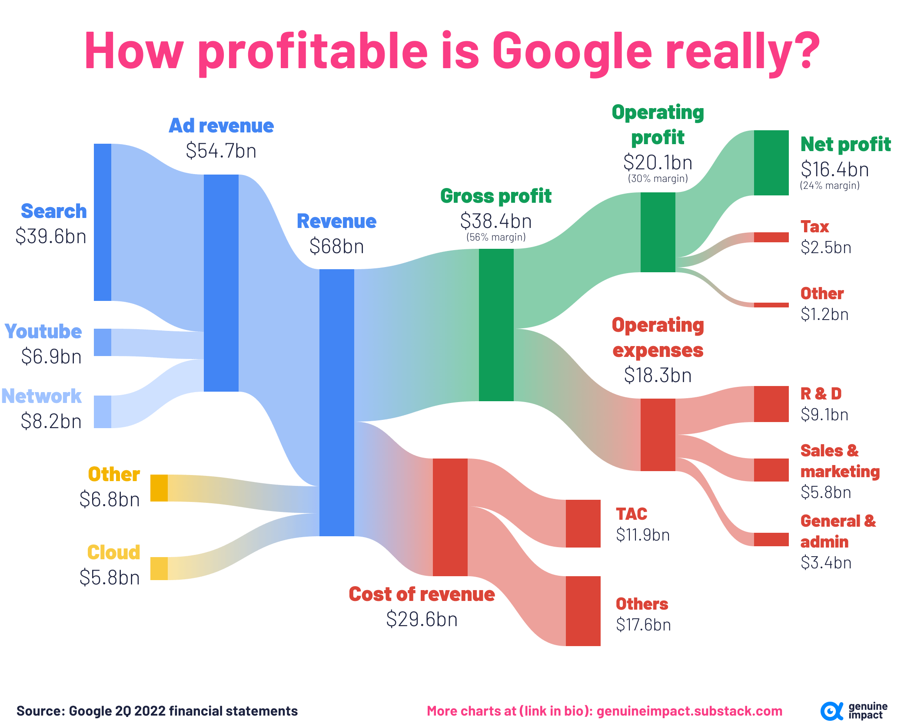

## Table of Contents

## What are dividends and how do they work?

Dividends are payments that companies give to their shareholders from their profits. When a company makes money, it can choose to share some of that money with the people who own its stock. This payment is called a dividend. Companies usually pay dividends a few times a year, and the amount each shareholder gets depends on how many shares they own.

When a company decides to pay a dividend, it announces the amount and the date when it will be paid. Shareholders who own the stock on a specific date, called the record date, will receive the dividend. The dividend can be paid in cash, which means you get money directly into your bank account, or in more shares of the company's stock. Many investors like dividends because they provide a regular income from their investments, and it's a way for companies to share their success with their owners.

## Has Google ever paid dividends to its shareholders?

No, Google, which is now part of Alphabet Inc., has never paid dividends to its shareholders. Instead, the company focuses on using its profits to grow the business and invest in new projects. This approach is common among tech companies that want to keep their money to fund new ideas and expand.

Alphabet Inc. believes that by not paying dividends, it can increase the value of the company over time. This means that instead of getting regular payments, shareholders might see the price of their stock go up as the company grows. Many investors are okay with this because they believe in Google's long-term potential and are happy to wait for bigger gains in the future.

## What factors influence a company's decision to pay dividends?

A company's decision to pay dividends depends on many things. One big [factor](/wiki/factor-investing) is how much money the company is making. If a company has a lot of profit, it might decide to share some of it with shareholders as dividends. But if the company is not making much money, or if it needs that money to grow or fix problems, it might not pay dividends. Another thing that matters is what the company wants to do with its money. Some companies like to keep their money to spend on new projects or to buy other companies. This can help them grow bigger and maybe make more money in the future.

Another factor is what the shareholders want. Some shareholders like getting regular dividend payments because it gives them money they can use right away. Other shareholders might be okay with not getting dividends if they think the company's stock price will go up a lot over time. The company also looks at what other companies in the same industry are doing. If most companies in the industry pay dividends, it might feel more pressure to do the same. But if the industry is growing fast and everyone is using their money to grow, the company might choose not to pay dividends.

## How does Google's business model affect its dividend policy?

Google's business model focuses a lot on growth and innovation. They want to keep their money to invest in new projects, like developing new technologies or buying other companies that can help them grow. This is why Google, now part of Alphabet Inc., has never paid dividends. They believe that using their profits to expand the business will make the company more valuable over time. This approach is common in the tech industry where companies are always looking for the next big thing.

Because Google is not paying dividends, the money they make stays in the company. This can be good for shareholders who believe in Google's long-term potential. They might see the value of their stock go up as the company grows and becomes more successful. Some shareholders might prefer this to getting regular dividend payments because they think they will make more money in the long run. So, Google's focus on growth and innovation directly affects their decision not to pay dividends, as they aim to increase the company's value in other ways.

## What are the advantages of paying dividends for a company like Google?

If Google decided to pay dividends, it could make their shareholders happy. People who own Google's stock would get some money every few months. This can be good for people who need money now, like retirees who want a regular income. It can also make more people want to buy Google's stock because they know they will get some money back.

Paying dividends can also make Google look more stable and reliable. If other big companies in the same industry pay dividends, Google might want to do the same to keep up. This can make investors feel more confident about Google, knowing that the company is doing well enough to share its profits. But, Google would have to balance this with their need to keep money for new projects and growth.

## What are the potential drawbacks of Google starting to pay dividends?

If Google started paying dividends, it might not have as much money to spend on new projects. Google likes to use its money to create new things and buy other companies to grow bigger. If they start giving money to shareholders as dividends, they might not be able to do as much of this. This could slow down their growth and make it harder for them to stay ahead in the tech world.

Also, if Google starts paying dividends, it might change what people think about the company. Right now, people see Google as a company that is always growing and investing in the future. If they start paying dividends, some people might think Google is not growing as fast anymore. This could make the price of Google's stock go down because people might not want to buy it if they think the company is not doing as well.

## How do Google's reinvestment strategies compare to paying dividends?

Google likes to take the money it makes and put it back into the company. They use this money to create new things, like better search tools or self-driving cars. They also use it to buy other companies that can help them grow bigger and stronger. This way, Google can keep coming up with new ideas and stay ahead in the tech world. By not paying dividends, Google keeps all its money to make the company even better.

If Google started paying dividends, they would have to give some of their money to shareholders instead of using it all for new projects. This could mean they might not be able to grow as fast. Also, if people see Google paying dividends, they might think the company is not growing as much anymore. This could make the stock price go down because people might not want to buy it if they think Google is slowing down. So, Google's choice to reinvest its money instead of paying dividends helps them keep growing and stay strong in the tech industry.

## What impact would initiating a dividend policy have on Google's stock price?

If Google started paying dividends, it could change how people see the company. Right now, many people think of Google as a company that's always growing and investing in new ideas. If they start paying dividends, some people might think Google is not growing as fast anymore. This could make the stock price go down because people might not want to buy it if they think the company is slowing down.

On the other hand, paying dividends could make some people happier with Google. People who like getting regular money from their investments might want to buy Google's stock more. This could make the stock price go up because more people want to own it. But Google would have to balance this with their need to keep money for new projects and growth, which is what has helped them become so successful in the past.

## How do Google's competitors handle dividend payments?

Google's big tech competitors like Amazon and Meta (formerly Facebook) also don't pay dividends. They are like Google because they want to use their money to grow bigger and come up with new ideas. Amazon spends a lot on things like making their delivery faster and building new technology. Meta puts money into making their apps better and trying new things like virtual reality. They think that not paying dividends will help them stay strong and keep growing in the tech world.

But not all tech companies are the same. Some, like Microsoft and Apple, do pay dividends. Microsoft has been paying dividends for a long time, and they also use their money to buy other companies and make new things. Apple started paying dividends a few years ago, and they also buy back their own stock to make it more valuable. These companies can pay dividends because they make a lot of money and still have enough left to keep growing. So, even in the tech industry, different companies have different ways of handling their money and dividends.

## What are the tax implications for shareholders if Google were to pay dividends?

If Google started paying dividends, shareholders would have to pay taxes on the money they get. In the United States, dividends are usually taxed as income. This means that if you get a dividend from Google, you have to add it to your other income and pay taxes on it. The tax rate can be different depending on how much money you make in a year. For people who make less money, the tax on dividends might be lower, but for people who make more money, it could be higher.

Another thing to think about is that the tax rules can change depending on where you live. If you live in a different country, the tax on dividends from Google might be different. Some countries have special agreements with the United States that can change how much tax you pay. It's a good idea to talk to a tax expert to understand exactly how much you would have to pay in taxes if Google started paying dividends.

## How might Google's future growth prospects influence its dividend decisions?

Google's future growth prospects are a big reason why they don't pay dividends right now. They believe that using their money to create new things and buy other companies will make them bigger and better in the future. If Google thinks they can keep growing a lot, they will want to keep all their money to do that. Paying dividends would mean giving some of that money away, which could slow down their growth.

If Google's future growth starts to slow down, they might think about paying dividends. If they don't see as many good opportunities to spend their money on new projects, they might decide to share some of it with shareholders. But right now, Google sees a lot of ways to grow, so they are keeping their money to make the company even stronger in the future.

## What would be the potential effects on Google's corporate strategy if it decided to start paying dividends?

If Google started paying dividends, it would change how they use their money. Right now, Google keeps all its profits to spend on new projects and to buy other companies. This helps them grow bigger and stay ahead in the tech world. If they started paying dividends, they would have to give some of that money to shareholders instead. This could mean they might not have as much money to spend on new ideas and growth, which could make them grow slower.

Also, paying dividends could change what people think about Google. Right now, people see Google as a company that is always growing and investing in the future. If they start paying dividends, some people might think Google is not growing as fast anymore. This could make the stock price go down because people might not want to buy it if they think the company is slowing down. But, it could also make some people happier with Google because they would get regular money from their investment.

## References & Further Reading

[1]: Lintner, J. (1956). ["The Distribution of Incomes of Corporations Among Dividends, Retained Earnings, and Taxes."](https://www.semanticscholar.org/paper/DISTRIBUTION-OF-INCOMES-OF-CORPORATIONS-AMONG-AND-Lintner/143efffe75d830c56a943b1098016341e2f17c3c) The American Economic Review.

[2]: Fama, E. F., & French, K. R. (2001). ["Disappearing Dividends: Changing Firm Characteristics or Lower Propensity to Pay?"](https://www.sciencedirect.com/science/article/pii/S0304405X01000381) Journal of Financial Economics.

[3]: Malkiel, B. G. (2016). ["A Random Walk Down Wall Street: The Time-tested Strategy for Successful Investing."](https://www.amazon.com/Random-Walk-Down-Wall-Street/dp/0393358380) W. W. Norton & Company.

[4]: Chan, E. P. (2013). ["Algorithmic Trading: Winning Strategies and Their Rationale."](https://github.com/ftvision/quant_trading_echan_book) Wiley.

[5]: Hendershott, T., Jones, C. M., & Menkveld, A. J. (2011). ["Does Algorithmic Trading Improve Liquidity?"](https://onlinelibrary.wiley.com/doi/full/10.1111/j.1540-6261.2010.01624.x) The Review of Financial Studies.

[6]: Hall, B. H. (2002). ["The Financing of Research and Development."](https://www.jstor.org/stable/23606869) NBER Working Paper No. 8773.

[7]: Christensen, C. M. (1997). ["The Innovator's Dilemma: When New Technologies Cause Great Firms to Fail."](https://www.hbs.edu/faculty/Pages/item.aspx?num=46) Harvard Business Review Press.