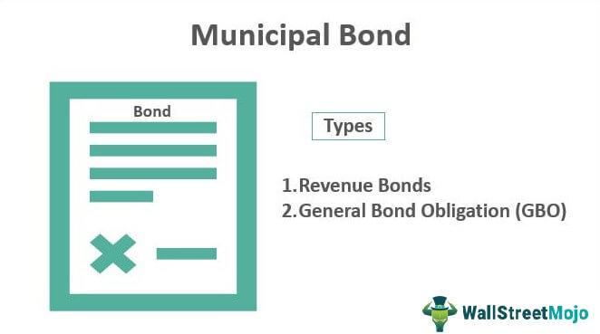

Understanding the avenues of investment is crucial in today's complex financial landscape, as investors seek strategies that balance risk, return, and tax efficiency. Municipal bonds, often referred to as 'munis,' provide an intriguing investment alternative that offers significant tax advantages. These debt securities, issued by states, cities, and other governmental entities, help finance public infrastructure and services. Their backing by government entities generally positions them as low-risk investments, attractive to risk-averse individuals and institutional investors alike.

In particular, municipal bonds hold appeal due to their potential tax-exempt status. At the federal level, the interest earned is usually exempt from income taxes, and, depending on the issuer and the investor's location, it might also be free from state and local taxes. This tax structure benefits high-income investors, who are particularly sensitive to tax liabilities, by potentially increasing their net returns on investments.



Innovations in trading technologies, particularly algorithmic trading, have opened new horizons for optimizing returns on municipal bonds. Algorithmic trading, which uses computer-driven processes to execute trades at optimal conditions, can unlock efficiencies in the bond market, traditionally known for its relative inefficiencies and illiquidity. By employing algorithms in trading municipal bonds, investors can not only manage risks more effectively but also exploit price movements in a manner that enhances yield.

This article aims to provide an in-depth analysis of municipal bonds as an investment strategy and their synergy with algorithmic trading. Through this exploration, we seek to equip investors with the knowledge necessary to make informed decisions that align with their financial goals and risk tolerance.

## Table of Contents

## What are Municipal Bonds?

Municipal bonds, commonly referred to as "munis," are debt securities issued by various governmental entities such as states, cities, counties, and other local agencies. These bonds are utilized to finance public projects, including infrastructure development, schools, and transportation systems, thereby contributing to the overall community welfare and development.

Munis are generally perceived as low-risk investments primarily because they are backed by government bodies. This backing often assures a certain level of security for investors regarding the repayment of the principal and interest, although it is essential to remember that these securities are not entirely risk-free.

There are two primary categories of municipal bonds: General Obligation Bonds and Revenue Bonds. General Obligation Bonds (GOs) are supported by the full faith and credit of the issuing municipality. This implies that the issuer commits to using its taxing power to generate the necessary revenue for bond repayments. In contrast, Revenue Bonds are secured by specific income streams generated from the projects they finance, such as tolls from a bridge or fares from a public transit system. Due to these distinct funding structures, Revenue Bonds might [carry](/wiki/carry-trading) a higher risk compared to GOs, depending on the financial success of the associated projects.

Municipal bonds serve different investment needs based on their types and the projects they finance. They attract investors who are typically seeking stable income streams and potential tax benefits—qualities that make them an appealing option for certain categories of investors. Understanding the nuances and classifications of municipal bonds is crucial for making informed investment choices.

## Tax Advantages of Muni Bonds

Municipal bonds offer compelling tax advantages that are among their primary appeals to investors. Their interest income is typically exempt from federal income tax, a benefit that distinguishes them from many other types of investments. This federal tax exemption is applicable because the interest earned on these bonds supports public projects and infrastructures, aligning with federal public service priorities.

Additionally, certain municipal bonds may qualify for state and local tax exemptions if the investor resides in the state where the bond was issued, enhancing the tax benefits. For high-income investors, these exemptions can translate into more substantial savings, making municipal bonds a strategic choice for minimizing overall tax liabilities.

However, while the tax-exempt status is a significant advantage, investors need to be aware of the Alternative Minimum Tax (AMT) implications. Some municipal bonds, particularly private activity bonds, may trigger AMT, subjecting the interest income to taxation. Therefore, investors should evaluate whether their holdings align with their tax situation and investment strategy.

Local tax regulations can vary significantly, and understanding these laws is essential for optimizing the tax benefits of municipal bonds. Consulting with a tax professional or financial advisor can provide clarity on how these exemptions apply to a specific portfolio and how to leverage them for maximum tax efficiency.

In summary, municipal bonds are an attractive option for those seeking to reduce tax exposure while maintaining a steady income stream. Proper understanding and strategic planning are essential for ensuring that investors capitalize on the tax advantages that municipal bonds offer.

## Evaluating Muni Bond Performance

Municipal bonds, commonly known as "munis," are a popular investment option due to their comparatively low-risk profile and tax-exempt status. However, evaluating their performance necessitates a comprehensive understanding of several financial factors, including [liquidity](/wiki/liquidity-risk-premium), credit risk, and [interest rate](/wiki/interest-rate-trading-strategies) fluctuations.

Muni bonds generally offer lower returns than corporate bonds, reflecting their lower risk. This trade-off is important for investors who prioritize stability and are willing to accept modest returns. Liquidity risk is a key consideration with munis. The municipal bond market is less liquid than the corporate bond market, potentially making it more challenging to buy or sell bonds quickly without affecting the price. This illiquidity can impact the attractiveness of municipal bonds for certain investors who require more flexibility in their investment portfolios.

A critical component in assessing muni bond performance is credit risk, which refers to the possibility that the issuer may default on its payment obligations. Municipal bonds typically have lower credit risk due to governmental backing, but investors must still evaluate the financial health of the issuing entity. Agencies like Moody’s, S&P Global Ratings, and Fitch Ratings provide credit ratings that can guide investors in assessing this risk. A higher credit rating generally indicates lower risk and vice versa.

Interest rates play a significant role in determining bond prices and yields. When interest rates rise, the price of existing bonds tends to fall, and conversely, when interest rates decrease, bond prices generally rise. This inverse relationship is crucial for investors trying to forecast bond performance. Investors should keep an eye on economic indicators and Federal Reserve policies that signal potential changes in interest rates.

The [volatility](/wiki/volatility-trading-strategies) of muni bonds is generally lower compared to other investment vehicles. This reduced volatility is beneficial for risk-averse investors who seek a stable source of income. Moreover, the relatively stable demand for public services funded by municipal bonds adds to their appeal.

In summary, the performance evaluation of municipal bonds involves balancing the intrinsic lower return against liquidity constraints, credit quality, and interest rate sensitivity. Proper assessment entails analyzing these factors collectively to gauge the overall risk and expected return on investment.

 to Algorithmic Trading

Algorithmic trading, often referred to as algo trading, employs sophisticated algorithms to automate the process of buying and selling securities, such as bonds, to exploit specific market conditions. This trading strategy leverages pre-defined criteria, statistical models, and historical data to execute trades with minimal human intervention. In the bond market, including municipal bonds, [algorithmic trading](/wiki/algorithmic-trading) serves as a crucial tool to address the complexities of risk and price inefficiencies.

Central to algorithmic trading is the ability to manage risks associated with bond investments. Bond prices are sensitive to several factors, including interest rate fluctuations, credit risk, and market liquidity. Algorithms can quickly analyze these parameters to determine optimal trading strategies. By pre-programming these algorithms with risk assessment models, traders can mitigate potential losses and maintain desired portfolio balances.

Algorithmic trading in the municipal bond market specifically offers opportunities to enhance yield. Municipal bonds, although low-risk, generally provide lower returns compared to corporate bonds. Algorithms can be designed to execute trades at the exact moments when the market conditions are most favorable. For instance, they can identify price anomalies and [arbitrage](/wiki/arbitrage) opportunities, thereby optimizing the yield outcomes.

Moreover, the automation inherent in algorithmic trading facilitates prompt execution of trades, which is vital for capitalizing on transient market inefficiencies. The speed and scale at which algo-trading operates enable investors to process vast datasets, identify trends, and execute trades that a human trader might miss. This capability is particularly beneficial in the less liquid municipal bond market, where rapid execution can lead to substantial cost savings and improved financial outcomes.

In summary, algorithmic trading in the bond market provides investors with a sophisticated toolkit for managing risks and optimizing returns. For municipal bonds, it offers distinct advantages by enhancing yield potentials and improving risk management practices. As the financial landscape continues to evolve, the integration of algorithmic trading in muni bond investments is likely to become increasingly pivotal.

## Combining Muni Bonds with Algo Trading

Integrating algorithmic trading strategies with municipal bond investments can significantly enhance portfolio returns by automating the process of buying and selling, enabling investors to capitalize on market inefficiencies. Algorithmic trading, employing advanced quantitative models, can swiftly analyze vast datasets to uncover opportunities that may not be perceivable through traditional means.

An essential aspect of algorithmic trading in muni bonds is the ability to automate trading decisions based on predefined criteria. Through automation, trading can be executed at lightning speed, reducing latency and ensuring optimal order execution. For municipal bonds, which may not have the liquidity of more widely traded securities, this speed can be advantageous in capturing favorable prices.

Algorithmic trading also allows for the efficient handling of large volumes of data. By using algorithms, traders can process historical price data, yield curves, and credit ratings, conducting a comprehensive analysis of potential investments. Algorithms can apply complex calculations, such as assessing yield spreads or interest rate differentials, which might be cumbersome and error-prone if done manually.

For example, a Python-based algorithm may look like the following:

```python
import numpy as np
import pandas as pd

# Function to calculate potential fair value of muni bonds
def calculate_fair_value(interest_rate, credit_risk, current_price):
    # Simple formula to determine fair value
    fair_value = (1 / (1 + interest_rate + credit_risk)) * 100
    return fair_value - current_price

# Sample dataframe with muni bond data
data = {'Bond': ['Bond1', 'Bond2', 'Bond3'],
        'Interest Rate': [0.05, 0.04, 0.06],
        'Credit Risk': [0.01, 0.02, 0.01],
        'Current Price': [95, 98, 92]}

df = pd.DataFrame(data)

# Apply the function to calculate fair values and potential profits
df['Fair Value'] = df.apply(lambda row: calculate_fair_value(row['Interest Rate'], row['Credit Risk'], row['Current Price']), axis=1)
df['Potential Profit'] = df['Fair Value'] - df['Current Price']

print(df)
```

Here, the algorithm calculates the fair value of municipal bonds based on interest rates and credit risk, comparing it to the current price to identify potential profit opportunities. Such algorithms can be further optimized and scaled for real-time trading, allowing traders to react instantly to changes in market conditions.

By enabling the execution of trading strategies at scale, algorithmic trading ensures that even small inefficiencies in the municipal bond market can be exploited effectively. This level of automation is a powerful tool for investors looking to optimize their portfolios, allowing for precise control over trading operations and the ability to respond to market changes with minimal human intervention.

Ultimately, while algorithmic trading offers significant advantages, its success relies on sophisticated models and continual adjustments in response to market dynamics and regulatory changes. Thus, investors must remain vigilant, ensuring their strategies are well-researched and adaptable to the evolving financial landscape.

## Opportunities and Challenges

The municipal bond market presents a unique set of opportunities and challenges shaped by its structural inefficiencies and distinct characteristics. This market's inefficiencies arise primarily from regional variations, a plethora of issuers, and the relatively low transparency in bond pricing and availability. These factors combine to offer astute investors opportunities to capitalize on pricing discrepancies and yield enhancements.

One of the most prominent opportunities is the potential for higher tax-adjusted returns. Due to the tax-exempt nature of most municipal bonds, investors in higher tax brackets can achieve yields comparable to, or even exceeding, taxable bonds once tax benefits are considered. This tax-efficient yield is particularly advantageous in a low-interest-rate environment.

Algorithmic trading offers further opportunities by leveraging computational tools to exploit market inefficiencies. Automated algorithms can quickly identify mispricings and arbitrage opportunities that manual trading processes might overlook. This allows investors to execute trades rapidly, locking in favorable prices and optimizing return potential.

Despite these opportunities, challenges persist. Accurately modeling municipal bond price movements is complex due to the market's fragmented and illiquid nature. Many bonds do not trade frequently, leading to difficulties in obtaining real-time pricing data. This lack of liquidity can result in significant bid-ask spreads, impacting investor returns. Mathematical models and analytical tools must be continuously refined to account for these market idiosyncrasies.

Further complicating the landscape are external factors such as policy changes and shifts in municipal credit ratings. Investors must stay vigilant about legislative developments that could alter the tax status of municipal bonds or affect municipal creditworthiness. Proactive monitoring and analysis of these factors are essential to minimizing risks and maximizing potential gains.

Additionally, municipal bond investments require careful consideration of credit risk. Municipalities face various economic pressures that can impact their ability to meet debt obligations. Investors must rigorously evaluate the financial health and stability of issuers to mitigate default risks.

To successfully navigate these challenges, investors should employ a comprehensive strategy that integrates algorithmic trading insights with traditional credit analysis and market research. This holistic approach can help investors capitalize on the opportunities within the municipal bond market while effectively managing its inherent risks.

## Conclusion

Municipal bonds offer an attractive option for investors prioritizing tax-free income and capital preservation. These debt securities, issued by local government entities, are particularly valuable for high-income individuals seeking to mitigate tax liabilities. Their relatively stable performance, combined with tax benefits, make them a dependable component of an investment portfolio focused on reducing risk.

The integration of algorithmic trading into municipal bond investment strategies provides a sophisticated mechanism to optimize returns. Algorithmic trading utilizes advanced computer algorithms to execute trades, leveraging data analysis and market conditions to identify optimal buy and sell opportunities. This technological approach can capitalize on the unique inefficiencies present in the municipal bond market, allowing for enhanced portfolio performance through better timing and execution of trades.

To achieve success in combining municipal bonds with algorithmic trading, investors need a meticulously crafted strategy backed by continuous market assessment and adaptability to regulatory environments. Understanding the nuanced behavior of muni bonds, keeping abreast of changes in municipal credit ratings, and anticipating policy shifts are vital for maintaining a competitive edge. Moreover, the complex nature of algorithmic systems necessitates robust modeling of muni bond price movements to address market liquidity challenges effectively.

In essence, while municipal bonds alone offer substantial benefits, their strategic pairing with algorithmic trading can unlock additional value by refining investment precision and expanding opportunities for yield enhancement. Investors equipped with the requisite knowledge and tools can harness these advantages to achieve superior and more consistent investment outcomes.

## References & Further Reading

[1]: "Investing in Municipal Bonds: How to Balance Risk and Reward for Success in Today's Market" by Philip Fischer

[2]: Hildreth, B., & Zorn, C. (2005). ["Municipal Bonds and the Impact of the Alternative Minimum Tax."](https://onlinelibrary.wiley.com/doi/abs/10.1111/j.1540-5850.2005.00007.x) Public Budgeting & Finance.

[3]: "Fixed Income Analysis" by Frank J. Fabozzi

[4]: Lopez de Prado, M. (2018). ["Advances in Financial Machine Learning"](https://www.amazon.com/Advances-Financial-Machine-Learning-Marcos/dp/1119482089)

[5]: Mayo, H. B. (2012). ["Investments: An Introduction"](https://www.amazon.com/Investments-Introduction-Stock-Trak-Herbert-Mayo/dp/1305638417)  

[6]: Phalippou, L. (2020). ["Private Equity Laid Bare"](https://www.amazon.com/Private-Equity-Laid-Ludovic-Phalippou/dp/1973918927) 

[7]: Rosenberg, M, R. (2012). ["A Practical Guide to Business Processes Modeling"](https://dl.acm.org/doi/10.5555/318907) 

[8]: "Algorithmic Trading: Winning Strategies and Their Rationale" by Ernie Chan