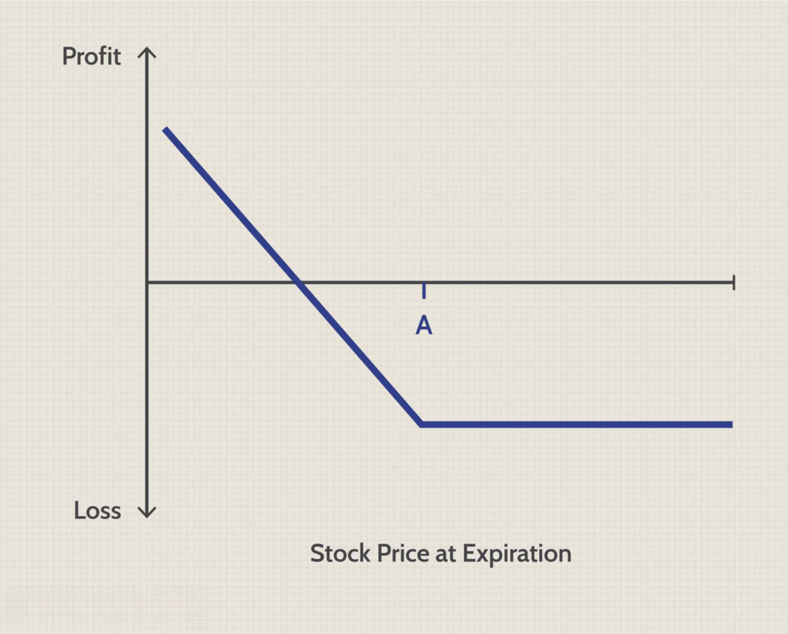

## Table of Contents

## What is a put option?

A put option is a type of contract in finance that gives you the right, but not the obligation, to sell a specific asset, like a stock, at a set price before a certain date. Think of it as an insurance policy for your stocks. If you own a stock and you think its price might go down, you can buy a put option to sell it at a higher price than the market might offer later.

For example, if you have a stock worth $50 and you buy a put option with a strike price of $50, you can sell that stock for $50 even if the market price drops to $40. This can help you limit your losses. However, you have to pay a fee, called a premium, to buy the put option. If the stock price stays above $50, you might not use the put option, and you would lose the premium you paid.

## How does a put option work?

A put option is like a safety net for your stocks. Imagine you own a stock that's currently worth $50. You're worried it might drop in value, so you buy a put option. This option gives you the right to sell your stock at $50, even if the market price falls below that. You pay a fee, called a premium, for this right. If the stock price stays above $50, you don't need to use the put option, but you'll lose the premium you paid.

If the stock price does drop, say to $40, you can use your put option to sell the stock at the higher $50 price. This way, you limit your loss to just the premium you paid for the option, instead of losing $10 per share. The person who sold you the put option, usually a big investor or a financial institution, is obligated to buy the stock from you at $50 if you decide to use the option. They hope the stock price stays above $50 so they keep the premium and don't have to buy the stock at a loss.

## Why might someone consider buying a put option when stock prices are declining?

When stock prices start to fall, buying a put option can be a smart move. It's like buying insurance for your stocks. If you think the price of your stock is going to keep dropping, a put option lets you sell it at a higher price than what it might be worth later. This can help you avoid losing a lot of money. For example, if your stock goes from $50 to $40, but you have a put option to sell at $50, you can still get that higher price.

The downside is that you have to pay for the put option, which is called a premium. If the stock price doesn't fall as much as you thought, or if it goes back up, you might not use the put option. In that case, you lose the money you paid for it. But if the stock price drops a lot, the put option can save you from bigger losses. It's a way to protect yourself when you're worried about your stocks losing value.

## What are the basic terms involved in a put option contract?

A put option contract has a few key terms that you need to know. The first is the strike price, which is the price at which you can sell the stock if you use the put option. If the stock's market price falls below the strike price, you can use the put option to sell it at the higher strike price. The expiration date is another important term. This is the last day you can use the put option. If you don't use it by this date, the option expires and becomes worthless.

The premium is the price you pay to buy the put option. This is like an insurance fee, and you pay it upfront. If the stock price stays above the strike price, you won't use the put option, and you'll lose the premium. But if the stock price drops below the strike price, the put option can save you money by letting you sell at the higher strike price. The underlying asset is the stock or other security that the put option is based on. Understanding these terms helps you know how a put option works and when it might be useful.

## How can put options be used as a hedge against declining stock prices?

Put options can be a great way to protect your stocks when you think their prices might go down. Imagine you own a stock that's currently worth $50, but you're worried it might drop to $40. You can buy a put option with a strike price of $50. This means you have the right to sell your stock at $50, even if the market price falls below that. By doing this, you're creating a safety net. If the stock price does drop to $40, you can use your put option to sell it at $50, saving you from a bigger loss.

The downside is that you have to pay a fee, called a premium, to buy the put option. If the stock price stays above $50 or goes up, you might not use the put option, and you'll lose the premium you paid. But if the stock price drops a lot, the put option can save you more money than the premium cost. It's like buying insurance for your stocks. You hope you don't need to use it, but it's there to protect you if things go wrong.

## What are the risks associated with buying put options during a stock price decline?

When you buy a put option during a stock price decline, one big risk is losing the money you paid for the option, called the premium. If the stock price doesn't drop as much as you thought or if it goes back up, you might not use the put option. In that case, the option expires worthless, and you lose the premium. This is like buying insurance you never use; it's a cost without any benefit.

Another risk is that the stock price might not fall enough to cover the cost of the premium. Even if the stock price goes down, it needs to drop below the strike price by more than the premium you paid for you to make a profit or break even. If the stock price falls just a little bit, you might still end up losing money because the gain from selling at the strike price won't be enough to cover the premium. So, timing and the size of the price drop are crucial when using put options as a hedge.

## How does the timing of buying a put option affect its effectiveness as a hedge?

The timing of buying a put option can make a big difference in how well it works as a hedge. If you buy the put option too early, you might pay a higher premium because the option has more time until it expires. This means you'll need a bigger drop in the stock price to make the option worth using. But if you buy it just before the stock price starts to fall, you might pay a lower premium because the option has less time left. This can make the put option more cost-effective, but you have to be good at predicting when the stock price will drop.

If you wait too long to buy the put option, you might miss your chance to protect your stock. The stock price could drop suddenly, and you might not find a put option with a strike price that's high enough to be useful. Or, the premium might go up because more people want to buy put options when the stock price is falling. So, timing is tricky. You need to find a balance between buying the option early enough to get a good strike price and not paying too much for the premium.

## What are the key factors to consider when selecting a put option for a declining stock?

When [picking](/wiki/asset-class-picking) a put option for a stock that's going down, you need to think about the strike price and the expiration date. The strike price is the price you can sell the stock at if you use the put option. You want to choose a strike price that's close to the current stock price but still gives you room to make money if the stock keeps falling. The expiration date is when the put option stops working. If you think the stock will drop fast, you might pick a shorter expiration date. But if you think it will take longer, you might choose a longer one. The longer the time until the option expires, the more you'll pay for it, but it gives you more time to be right about the stock price dropping.

Another thing to consider is the premium, which is the price you pay for the put option. The premium depends on how far away the strike price is from the current stock price and how much time is left until the option expires. If the premium is too high, it might not be worth it, because the stock would need to drop a lot for you to make money. You also need to think about how much you're willing to lose if the stock price doesn't drop as much as you thought. The premium is like an insurance fee; you hope you don't need to use it, but it's there to protect you if the stock price falls a lot.

## How do implied volatility and time decay impact the pricing of put options?

Implied [volatility](/wiki/volatility-trading-strategies) and time decay are two big things that affect how much you pay for a put option. Implied volatility is like a guess about how much the stock price might move around in the future. If people think the stock price will swing a lot, the implied volatility goes up, and so does the price of the put option. That's because the option is more likely to be worth something if the stock price moves a lot. On the other hand, if people think the stock price will stay pretty steady, the implied volatility goes down, and the put option costs less.

Time decay is another thing to think about. It's like a clock ticking down on your put option. The longer you have until the option expires, the more time there is for the stock price to move in your favor, so the option costs more. But as time goes by, the value of the put option goes down because there's less time left for the stock price to drop enough for you to use the option. This means that if you're holding onto a put option and the stock price isn't moving much, the option will lose value every day until it expires. So, you need to think about both implied volatility and time decay when deciding if a put option is worth buying.

## What advanced strategies can be employed with put options during significant stock price declines?

One advanced strategy you can use with put options during big stock price drops is called a protective put. Imagine you own a stock and you're worried it might keep falling. You can buy a put option to lock in a price to sell the stock if it goes down even more. This way, you're protected from losing too much money. It's like buying insurance for your stock. If the stock price keeps dropping, you can use the put option to sell at a higher price than the market is offering. But if the stock price goes up, you can just let the put option expire and keep your stock. The downside is that you have to pay for the put option, which can be expensive if the stock is very volatile.

Another strategy is called a bear put spread. This is when you buy a put option with a higher strike price and sell another put option with a lower strike price. Both options should have the same expiration date. This strategy can help you make money if the stock price goes down, but it also limits how much you can lose. You pay less for the put option you buy because you're also selling another one. If the stock price falls between the two strike prices, you can make a profit. But if it falls below the lower strike price, your profit is capped. This strategy is a bit more complicated, but it can be a good way to bet on a stock price decline without risking too much money.

## How can an investor use put options to generate income during periods of stock price declines?

An investor can use a strategy called selling cash-secured puts to make money when stock prices are going down. This means you agree to buy a stock at a certain price if the person who buys the put option from you decides to use it. You get paid a fee, called a premium, for agreeing to this. If the stock price stays above the agreed price, the put option expires worthless, and you keep the premium as income. This works well if you're okay with buying the stock at the agreed price, because you have the cash ready to do so if needed.

Another way to make money is by using a strategy called a put credit spread. Here, you sell a put option with a higher strike price and buy another put option with a lower strike price, both with the same expiration date. You get paid for selling the first put option, but you have to pay for the second one. The difference between what you get and what you pay is your potential income. If the stock price stays above the higher strike price, both options expire worthless, and you keep the difference as income. This strategy can be useful during stock price declines because it lets you make money even if the stock price goes down a bit, as long as it doesn't fall below the lower strike price.

## What are the tax implications of trading put options during stock price declines?

When you trade put options during stock price declines, you need to think about taxes. If you make money from selling put options, that money is usually taxed as ordinary income. This means it's taxed at your regular income tax rate, which can be high. But if you use put options to hedge and you lose money, you might be able to use those losses to lower your taxes. You can deduct those losses from your income, but there are rules about how much you can deduct each year.

If you hold onto put options for less than a year before you sell them, any profit you make is considered a short-term capital gain. This is also taxed at your regular income tax rate. But if you hold them for more than a year, any profit is a long-term capital gain, which usually has a lower tax rate. So, it's important to keep track of how long you own the put options and how you use them, because it can affect how much tax you pay. Talking to a tax professional can help you understand all the rules and make the best choices for your situation.

## What are Put Options and How Do They Work?

Put options are financial derivatives that confer upon the holder the right, but not the obligation, to sell an underlying asset at a predetermined strike price before the option's expiration date. This flexibility allows investors to hedge against potential declines in the market value of the asset or to adopt speculative positions anticipating such declines.

### Components of Put Options

1. **Premium**: This is the cost paid by the investor to purchase the put option. It reflects the option's current market value and is influenced by factors such as the underlying asset's price, volatility, time to expiration, and the difference between the strike price and the asset's current price.

2. **Expiration Date**: The expiration date marks the deadline by which the holder must exercise the option if they choose to do so. Options lose value as they approach expiration, a phenomenon known as time decay.

3. **Strike Price**: This is the price at which the holder can sell the underlying asset. A put option is considered in-the-money if the asset's market price is below the strike price, which would be profitable if exercised.

### Uses of Put Options

Put options serve dual purposes:

- **Hedging**: Investors holding significant positions in an asset may buy put options to protect against potential losses in value. By securing a minimum sale price, the investor can mitigate the financial impact of market downturns.

- **Speculation**: Traders might purchase put options when they anticipate a decline in the asset’s market price, aiming to capitalize on the difference between the strike price and the lower market price.

### Profitability and Strategic Advantages

To illustrate profitability, consider the formula for the intrinsic value (IV) of a put option at expiration: 

$$
IV = \max(0, K - S)
$$

where $K$ is the strike price, and $S$ is the current market price of the underlying asset. An investor profits from the option if the intrinsic value exceeds the premium paid.

Effectively employing put options can result in significant strategic advantages in portfolio management. By safeguarding assets against adverse price movements and enabling profit generation during bearish conditions, put options enhance an investor's ability to navigate complex financial markets. 

Understanding these dynamics is critical for leveraging put options to their fullest potential, aligning investment strategies with market conditions and individual risk tolerance.

## References & Further Reading

[1]: Hull, J. C. (2018). ["Options, Futures, and Other Derivatives"](https://www.semanticscholar.org/paper/Options%2C-Futures%2C-and-Other-Derivatives-Hull/89bdee500c8623864fc9eb7a471546aa713acc44). Pearson Education. 

[2]: Natenberg, S. (1994). ["Option Volatility and Pricing: Advanced Trading Strategies and Techniques"](https://www.amazon.com/Option-Volatility-Pricing-Strategies-Techniques/dp/0071818774). McGraw-Hill Education.

[3]: Chan, E. P. (2009). ["Quantitative Trading: How to Build Your Own Algorithmic Trading Business"](https://github.com/ftvision/quant_trading_echan_book). Wiley.

[4]: De Prado, M. L. (2018). ["Advances in Financial Machine Learning"](https://www.amazon.com/Advances-Financial-Machine-Learning-Marcos/dp/1119482089). Wiley.

[5]: Shreve, S. E. (2004). ["Stochastic Calculus for Finance I: The Binomial Asset Pricing Model."](https://www.archive.org/download/derivatives_books/Stochastic%20Calculus%20for%20Finance%20I%20-%20S.%20E.%20Shreve.pdf) Springer.

[6]: Dreman, D. (2001). ["Contrarian Investment Strategies: The Next Generation"](https://www.amazon.com/Contrarian-Investment-Strategies-David-Dreman/dp/0684813505). Simon & Schuster.

[7]: Taleb, N. N. (2007). ["The Black Swan: The Impact of the Highly Improbable"](https://archive.org/details/10.1.1.695.4305). Random House.