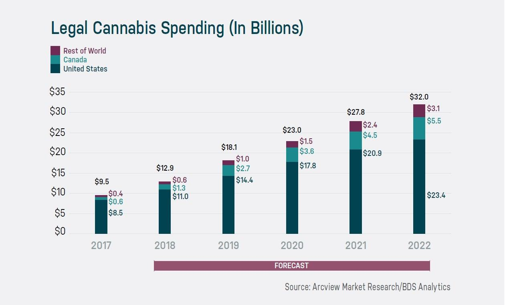

The marijuana industry has emerged as a significant sector within both the pharmaceutical and recreational markets, characterized by its rapid growth and expansive potential for investment. With the legalization wave sweeping across several countries, marijuana stocks have captivated investors due to the alluring promise of high returns. The industry's growth trajectory is underpinned by shifting public perceptions, legislative changes, and evolving consumption trends, leading to an influx of capital into marijuana-focused businesses and stocks.

Marijuana stocks have witnessed remarkable popularity as investors look to capitalize on the burgeoning market. The advent of large-scale legalization, coupled with the diversification of marijuana products and services, has fueled the explosive growth of these stocks. Investors are drawn to the sector not only by the prospects of medical and recreational marijuana but also by ancillary services such as distribution, marketing, and technology-based marijuana solutions, which contribute to the industry's dynamic and broadening landscape.

However, investing in marijuana stocks is not without its challenges, and navigating through the associated financial risks demands thorough understanding and strategic planning. Financial risk in stock investments hinges on various factors, including market volatility, regulatory changes, and company-specific developments. High volatility, often seen within the marijuana sector, implies that stock prices can experience significant fluctuations in a short period, presenting both opportunities and risks for investors. Understanding the balance between potential returns and inherent risks is crucial for those considering investments in this burgeoning field.

Algorithmic trading has become an integral component of modern financial markets, transforming the way investments are approached and managed. This technology-driven method uses complex algorithms to make trading decisions based on market data, trends, and predetermined strategies. The incorporation of algorithmic trading in the marijuana stock market represents an evolving synergy between technology and investment, promising enhanced efficiency and risk management capabilities. By leveraging real-time data and systematic strategies, algorithmic trading offers investors tools to navigate market complexities, optimize profits, and mitigate risks.

This article aims to provide a comprehensive analysis of the marijuana investment sector, focusing on the potential risks and rewards while exploring the intersection of technology and market dynamics. The structure will guide readers through an understanding of marijuana stocks, highlight associated financial risks, present strategies for risk mitigation, and explore the role of algorithmic trading within this industry. Through this exploration, readers will gain valuable insights into achieving informed and responsible investment decisions in the context of the rapidly evolving marijuana industry.

## Table of Contents

## Understanding Marijuana Stocks

The marijuana industry has experienced significant transformation over recent years, characterized by rapid expansion and diversification. This sector can broadly be categorized into two primary segments: medical and recreational marijuana. Medical marijuana involves the use of cannabis and its components for therapeutic purposes, catering to patients with conditions such as chronic pain, epilepsy, and multiple sclerosis. Recreational marijuana, conversely, refers to cannabis used for personal enjoyment rather than health benefits. These segments, although distinct, often overlap in legislative considerations and market operations.

Major companies in the marijuana industry have emerged to dominate the market, with Canopy Growth Corporation, Aurora Cannabis Inc., and Cronos Group Inc. being prominent players. These companies have primarily benefitted from early entry into the market, extensive production capacities, and strategic partnerships. Concurrently, numerous emerging players are entering the scene, fostering innovation and increasing competition. These emerging companies often focus on niche markets or technological advancements, including cannabis-infused products, cultivation technology, and genomic improvements.

The historical performance of marijuana stocks has been characterized by notable [volatility](/wiki/volatility-trading-strategies). Initially, public listings of cannabis companies generated widespread investor enthusiasm, leading to sharp increases in stock valuations. However, this initial euphoria often led to corrections as regulatory challenges and operational hurdles became apparent. The economic impact of the marijuana industry remains profound, with significant contributions to job creation, tax revenues, and ancillary sectors such as security, packaging, and distribution.

Current trends indicate a growing acceptance and legalization of cannabis, contributing to positive projections for the sector. The emergence of cannabis markets in new geographical regions, such as Europe and parts of Asia, is expected to drive demand further. Additionally, technological advancements in cultivation and production processes continue to enhance efficiency and output quality, fostering potential growth.

Valuation of marijuana stocks is influenced by various factors, including regulatory developments, market positioning, and financial performance. Regulatory frameworks, often variable and complex, significantly impact market access and operational capabilities. Market positioning, particularly the ability to establish brand recognition and secure distribution channels, is crucial in attaining competitive advantage. Financial performance, reflected in revenue growth, profitability, and balance sheet strength, plays a fundamental role in investor confidence and stock valuation.

In summary, understanding the marijuana industry requires recognizing its bifurcated nature, observing key players and new entrants, analyzing stock performance and economic contributions, and considering factors affecting stock valuation. Each component offers insights into the intricate dynamics of this rapidly evolving sector.

## Financial Risks Associated with Marijuana Stock Investments

Marijuana stocks have emerged as a significant area of interest for investors due to the rapid growth and legalization trends. However, this sector also presents unique financial risks, primarily due to its high volatility. The intrinsic volatility of marijuana stocks is largely driven by fluctuating market demands, legislative shifts, and societal attitudes towards cannabis products. The legal landscape surrounding marijuana remains complex and often inconsistent, contributing to uncertainty and risk for investors. Although several jurisdictions have legalized cannabis either for medicinal or recreational use, federal laws in places like the United States still classify it as a controlled substance. This disparity poses a substantial risk, as changes in regulations can dramatically affect market access and growth for marijuana companies. 

Furthermore, the marijuana industry faces intense market competition. Established companies vie with numerous emerging startups, all seeking to capture a share of the market. This competitive environment can lead to price wars, margin pressures, and even potential overvaluation of stocks due to speculative investments. The stability of stocks is affected as companies continuously strive to differentiate their products and secure consumer loyalty.

Public perception plays a crucial role in the valuation of marijuana stocks. Societal trends and consumer attitudes towards cannabis influence demand, affecting stock prices. For instance, increasing acceptance and legalization efforts positively impact stock performance, whereas any negative press or lobbying against legalization can trigger stock price declines. Public sentiment can thus create unpredictable fluctuations, contributing to the overall risk profile of marijuana stock investments.

When considering these factors, the potential return versus risk ratio for marijuana stock investors often appears skewed towards higher risk. Investors looking at marijuana stocks must weigh the possibility of high returns due to rapid industry growth against the backdrop of significant volatility and uncertainty. Calculating expected returns involves considering both the potential for large gains and the probability of substantial losses due to the aforementioned risks. This reflects a classic high-risk, high-reward scenario, necessitating careful consideration and strategic planning for those involved in the marijuana stock market.

## Navigating Financial Risks in Marijuana Stocks

To navigate the financial risks associated with investing in marijuana stocks, investors must employ a variety of strategies tailored to the unique challenges of this burgeoning sector. 

Diversification is a fundamental risk management strategy in the financial world, particularly pertinent in the volatile landscape of marijuana stocks. A diversified portfolio reduces exposure to the failure or underperformance of any single stock by spreading investment across a range of companies and sectors within the marijuana industry. For instance, an investor might consider allocating their investments among companies specializing in different aspects of the marijuana supply chain, such as cultivation, distribution, and ancillary services. This approach can help mitigate the individual risks associated with each segment, offering a buffer against market fluctuations.

Due diligence and thorough market research are critical components for any investor in the marijuana sector. Given the evolving legal and regulatory frameworks, investors must stay informed about the companies they invest in, examining financial statements, growth prospects, and competitive positioning. Reliable sources of market analysis and financial news can offer valuable insights into the inner workings of the industry and individual marijuana firms.

Monitoring legislative changes is equally crucial, as the legal landscape for marijuana continues to evolve rapidly across jurisdictions. Regulatory shifts can significantly impact stock prices and market dynamics. Investors should remain vigilant regarding policy developments, such as changes in marijuana legalization status, amendments to taxation, or new industry regulations that could affect market conditions. By staying abreast of such changes, investors can anticipate potential market disruptions or opportunities.

The debate between long-term and short-term investment strategies is particularly relevant in the marijuana industry, characterized by volatility and rapid growth. Long-term investing typically involves holding stocks for several years, allowing investors to weather short-term market fluctuations and benefit from the overall growth trajectory of the marijuana sector. This approach can be advantageous given the present expansion and increasing acceptance of marijuana. In contrast, short-term trading may capitalize on market volatility and sudden price movements, but it requires careful timing and risk management due to the sector's unpredictability.

In conclusion, navigating the financial risks in marijuana stock investments demands a robust strategy incorporating diversification, due diligence, legislative awareness, and a thoughtful approach to investment timeframes. These strategies collectively empower investors to better manage the inherent risks while exploring the potential within the marijuana industry.

## The Emergence of Algorithmic Trading in Marijuana Stocks

Algorithmic trading refers to the use of computer algorithms to manage the trading process by executing orders based on predetefined criteria and instructions. It offers advantages such as speed, precision, and the ability to process large volumes of data rapidly, thereby enabling informed decision-making in volatile markets like that of marijuana stocks. 

In the context of the marijuana stock market, [algorithmic trading](/wiki/algorithmic-trading) has begun to play a significant role. With the industry's rapid growth and inherent volatility, algorithms can help investors respond swiftly to market changes, analyze trends, and optimize their portfolios. Algorithms can identify patterns and predict potential price movements by analyzing historical data and current market conditions. 

One of the main benefits of algorithmic trading is its ability to manage risk. Through techniques such as statistical [arbitrage](/wiki/arbitrage), mean reversion, and [momentum](/wiki/momentum) strategies, algorithms can mitigate the risks associated with the highly volatile marijuana stock market. For instance, an algorithm might detect a mean reversion opportunity, where a stock's price deviates significantly from its historical average, suggesting a potential investment opportunity. 

Successful examples of algorithmic trading strategies in the marijuana sector include pairs trading, where algorithms identify pairs of correlated stocks and execute trades based on changes in their correlation. Another strategy is [trend following](/wiki/trend-following), where algorithms capitalize on anticipated long-term price movements. Momentum-based strategies are also popular, taking advantage of stocks that show a strong trend in a specific direction with high trading [volume](/wiki/volume-trading-strategy). 

Despite its advantages, algorithmic trading presents ethical considerations and challenges. The rapid decision-making capabilities of algorithms can lead to market manipulation, such as "spoofing" or placing false orders to create artificial demand. Regulatory bodies monitor these activities closely to prevent unethical practices. Additionally, the reliance on technology brings challenges such as system glitches, code errors, and the risk of overfitting algorithms to specific data sets, which can lead to poor performance in live trading scenarios.

To promote ethical algorithmic trading, firms often employ measures such as stringent testing, constant monitoring, regular auditing, and compliance with regulatory standards. As the marijuana industry continues to evolve, algorithmic trading is likely to become increasingly sophisticated, offering both new opportunities and challenges for investors.

## Algorithmic Trading Tools and Platforms for Marijuana Stocks

Algorithmic trading has become a crucial component in the financial sector, offering advanced tools and platforms that cater to a range of investment strategies, including those in the marijuana stock market. Algorithmic trading platforms serve as the backbone for executing trades efficiently and with precision, thus aiding investors in optimizing their portfolios while managing risk.

### Overview of Popular Algorithmic Trading Platforms and Tools

Several algorithmic trading platforms have gained prominence for their sophisticated features and user-friendly interfaces. Some popular platforms include:

1. **MetaTrader 5 (MT5)**: Widely used for its versatility and support for various asset classes, MT5 offers comprehensive tools for technical analysis, a flexible trading system, and algorithm development using the MQL5 programming language.

2. **QuantConnect**: Known for its open-source algorithmic trading engine, QuantConnect allows users to design, backtest, and deploy trading strategies using Python or C#. It supports multiple asset classes, including equities like marijuana stocks.

3. **TradingView**: Renowned for its dynamic charting capabilities and community-driven scripts, TradingView facilitates technical analysis, custom indicators, and automated strategies via Pine Script, making it suitable for both novice and experienced traders.

4. **AlgoTrader**: This institutional-grade trading software is tailored for automated trading, supporting complex strategies and offering seamless integration with brokers and exchanges. AlgoTrader caters to traders looking for high-frequency trading and arbitrage opportunities in the marijuana stock domain.

### Key Features to Look for in an Algorithmic Trading Platform

When selecting an algorithmic trading platform, investors should assess several key features:

- **Robust Backtesting Capabilities**: Effective platforms offer backtesting environments to validate strategies against historical data, helping traders optimize performance before risking capital.

- **Data Availability**: Access to real-time and historical market data is essential for crafting informed trading algorithms.

- **Customization and Extensibility**: The ability to customize algorithms and integrate third-party libraries or data sources is crucial for developing tailored strategies.

- **Execution Speed and Reliability**: Efficient execution and minimal latency are critical for capturing opportunities and achieving competitive pricing.

- **Security and Compliance**: Platforms must adhere to regulatory standards and ensure data protection and secure transactions.

### Comparing Different Software and Services Available to Investors

Investors seeking algorithmic trading solutions have a variety of options, each with its strengths:

- **Open-source vs. Proprietary Software**: Open-source platforms offer flexibility and community-driven development, while proprietary software provides dedicated support and advanced features.

- **Cloud-based vs. On-premise Solutions**: Cloud-based platforms provide accessibility and scalability, whereas on-premise solutions offer complete control and customization capabilities.

- **Beginner vs. Advanced Trader Tools**: Beginners might prefer platforms with intuitive interfaces and educational resources, while experienced traders might seek advanced analytical tools and scripting capabilities.

### Tips for Beginners in Algorithmic Trading in Marijuana Stocks

For novice traders eager to enter algorithmic trading within the marijuana sector, the following tips may be beneficial:

- **Start Simple**: Focus on developing straightforward strategies before progressing to more complex algorithms.

- **Education and Training**: Leverage online resources, tutorials, and forums to build expertise in algorithm design and financial markets.

- **Paper Trading**: Utilize paper trading accounts to test strategies in a risk-free environment, honing skills without financial exposure.

- **Continuous Optimization**: Algorithms require ongoing refinement and adaptation to respond to changing market conditions and emerging trends.

### Future Trends and Potential Developments in Fintech for Marijuana Investments

The evolution of fintech is poised to drive further innovation in algorithmic trading for marijuana stocks. Key trends include:

- **Artificial Intelligence and Machine Learning**: AI-driven tools are expected to enhance predictive analytics and strategy development, offering investors deeper insights into market movements.

- **Blockchain Technology**: As blockchain gains traction, its potential for increasing transparency and reliability in trade execution could reshape trading infrastructures.

- **Integration with Environmental, Social, and Governance (ESG) Criteria**: With growing emphasis on sustainability, algorithmic trading may increasingly incorporate ESG factors into strategy formulation, aligning with investor values and societal norms.

Overall, the intersection of technology and finance is paving the way for advanced trading methodologies, enabling investors to navigate the volatile marijuana stock market more effectively.

## Conclusion

The exploration of the marijuana industry has revealed significant opportunities and risks inherent in investing in marijuana stocks. The industry continues to expand, driven by increasing legalization and acceptance, which positions marijuana stocks as potentially lucrative investment options. However, these investments are fraught with high volatility and regulatory challenges. Such risks necessitate a well-informed approach to investment, highlighting the importance of strategic risk management.

The ascendance of algorithmic trading has transformed the dynamics of financial markets, offering innovative tools for managing the inherent risks of marijuana stock investments. By leveraging complex algorithms and high-frequency trading, investors can potentially achieve better precision and efficiency in trading. These technological advancements have substantial implications for risk management and trading success, making algorithmic trading a valuable discussion within the investment community.

Investors are encouraged to make informed decisions by conducting thorough market research, staying updated on legislative developments, and adopting sound risk mitigation strategies. The importance of being well-informed cannot be overstated, as it enables traders to navigate the complexities of the marijuana stock market responsibly.

In conclusion, the intersection of technology and investment within the marijuana industry presents a unique combination of opportunities and challenges. As the marijuana sector propels forward, with technology steering the investment methods, the potential for high returns persists. Nonetheless, this potential is accompanied by pronounced risks that require careful consideration and prudent decision-making. Just as algorithmic trading exemplifies the innovative strides of financial markets, it serves as a reminder for investors to integrate technology and intelligence into their approach, ensuring responsible and informed trading in the ever-evolving landscape of marijuana stocks.

## References & Further Reading

[1]: Bergstra, J., Bardenet, R., Bengio, Y., & Kégl, B. (2011). ["Algorithms for Hyper-Parameter Optimization."](https://papers.nips.cc/paper/4443-algorithms-for-hyper-parameter-optimization) Advances in Neural Information Processing Systems 24.

[2]: ["Advances in Financial Machine Learning"](https://www.amazon.com/Advances-Financial-Machine-Learning-Marcos/dp/1119482089) by Marcos Lopez de Prado

[3]: ["Evidence-Based Technical Analysis: Applying the Scientific Method and Statistical Inference to Trading Signals"](https://www.amazon.com/Evidence-Based-Technical-Analysis-Scientific-Statistical/dp/0470008741) by David Aronson

[4]: ["Machine Learning for Algorithmic Trading"](https://github.com/PacktPublishing/Machine-Learning-for-Algorithmic-Trading-Second-Edition) by Stefan Jansen

[5]: ["Quantitative Trading: How to Build Your Own Algorithmic Trading Business"](https://www.amazon.com/Quantitative-Trading-Build-Algorithmic-Business/dp/1119800064) by Ernest P. Chan