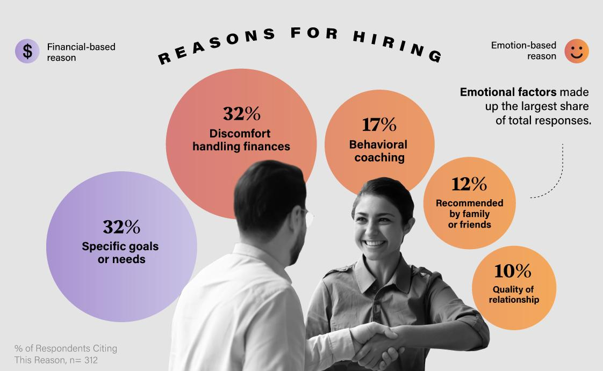

In today's complex financial landscape, managing personal finances is a challenging task that requires a strategic approach to effectively navigate various financial elements. The significance of financial advisors and technologies like algorithmic (algo) trading has increased substantially, offering innovative solutions for handling investments. Financial advisors provide expertise in planning and decision-making, ensuring individuals can make informed choices about savings, investments, and future financial goals. Meanwhile, algorithmic trading represents a technological leap by using computer programs to execute trades based on pre-defined criteria without the influence of human emotions. This approach can enhance the precision and speed of trading decisions, optimizing financial outcomes.

The integration of financial advisors and algo trading allows for a comprehensive approach to financial planning. Advisors contribute personalized strategies and risk assessments tailored to individual needs, while algo trading leverages data-driven techniques to optimize investment portfolios and manage risk efficiently. Together, they contribute to financial stability and growth by utilizing advanced tools and personalized financial solutions. As technology continues to advance, personal finance management evolves, offering more sophisticated and tailored strategies to help individuals achieve their financial objectives.



## Table of Contents

## Understanding Personal Finance

Personal finance involves the comprehensive management of individual or household financial activities, vital for ensuring both immediate monetary needs and future financial security. Key components of personal finance include budgeting, managing debt, saving for emergencies, tax planning, and making informed investment choices. Each aspect plays a crucial role in maintaining and enhancing financial well-being.

**Budgeting** is the foundational element of personal finance. It involves tracking and planning expenditures in alignment with income to avoid debt and ensure monetary balance. Effective budgeting helps individuals prioritize their spending and savings goals. Commonly used budgeting approaches include the 50/30/20 rule, where 50% of income is allocated to needs, 30% to wants, and 20% to savings and debt repayment.

**Managing debt** is another critical aspect. This involves organizing and strategizing the repayment of loans and credit card balances, which can often accumulate due to overspending or emergencies. Prioritizing higher interest debts and understanding loan terms can significantly reduce financial strain. Mathematical strategies, such as the debt avalanche or debt snowball methods, can be effective tools.

**Saving for emergencies** is essential to cushion unexpected financial challenges, such as medical emergencies or job loss. A recommended practice is to maintain an emergency fund covering three to six months’ worth of living expenses. This fund acts as a financial buffer to avoid accruing further debt during unforeseen crises.

In **tax planning**, individuals seek to manage their finances in ways that maximize tax efficiency, ensuring that tax obligations are met without compromising financial goals. Understanding tax credits and deductions can significantly reduce taxable income, enabling more efficient utilization of personal resources.

**Wise investing** is fundamental to growing one's wealth over time. It involves strategically placing resources into various securities, real estate, or other assets to achieve a return on investment (ROI). Diversifying investments based on risk tolerance and time horizon is crucial in mitigating potential losses and capitalizing on market opportunities.

Numerous personal finance tools and resources are available to aid individuals in optimizing their financial decisions. These include budgeting apps, investment platforms, and educational resources that provide guidance tailored to personal needs and circumstances. By leveraging these tools, individuals can enhance their financial literacy, achieve better control of their finances, and work towards economic stability and growth.

## The Role of Financial Advisors

Financial advisors are critical in guiding individuals and businesses toward their financial objectives. Through their expertise, they help navigate the intricate landscape of personal and corporate finance by providing well-founded advice in several crucial areas.

One of the primary functions of financial advisors is to assist with investment strategies. This involves evaluating the client's financial situation, risk tolerance, and long-term goals to formulate a suitable investment plan. Advisors may use a diversified portfolio approach, considering various asset classes such as stocks, bonds, and mutual funds to mitigate risk and enhance potential returns. Portfolio management often includes rebalancing investments to maintain the desired allocation, which is crucial in adapting to market changes.

Retirement planning is another critical area where financial advisors offer substantial value. By estimating future financial needs and considering factors like inflation and healthcare costs, advisors guide clients in selecting appropriate retirement accounts such as 401(k)s or IRAs. They help in determining contribution levels and investment choices to ensure sufficient savings for retirement years.

Tax optimization is integral to maximizing net returns on investments and savings. Financial advisors employ strategies to minimize tax liabilities for their clients. This may involve recommending tax-efficient investment vehicles, utilizing tax loss harvesting, or ensuring proper timing of asset sales to take advantage of favorable tax rates.

Estate planning is concerned with managing the transfer of a person's wealth and assets after their death. Advisors assist in creating plans that minimize estate taxes and ensure that their client's wishes are honored. This often involves the preparation of legal documents like wills, trusts, and powers of attorney, tailored to meet specific family needs and circumstances.

Choosing to work with a financial advisor can be influenced by an individual's current financial status, goals, and the complexity of their financial needs. For those with intricate financial situations or significant assets, the expertise of an advisor can provide immense benefit in navigating the myriad financial considerations essential to achieving personal and business goals. Conversely, those with simpler financial situations may not require extensive advisory services but still benefit from periodic consultations.

## Financial Planning for the Future

Effective financial planning is a process that involves setting long-term goals and establishing strategies to fulfill them. This approach not only provides guidance for financial decision-making but also equips individuals for future uncertainties. A comprehensive financial plan typically encompasses retirement savings, children’s education funds, and long-term investment strategies, among other components.

1. **Retirement Savings Plans**: Planning for retirement is a crucial part of financial planning. Individuals need to determine their retirement age, lifestyle aspirations, and estimate the corresponding financial requirements. Various savings vehicles such as 401(k) plans, IRAs (Individual Retirement Accounts), and pensions can be utilized. For example, a 401(k) plan allows employees to save a portion of their paycheck before taxes are taken out, which can grow tax-deferred until withdrawal during retirement. 

2. **Children’s Education Funds**: Education costs are substantial and require thorough planning. Options such as 529 savings plans offer tax advantages when funds are used for qualified education expenses. These plans vary by state, offering different investment options and tax benefits. 

3. **Long-term Investment Strategies**: Developing an investment strategy that aligns with one’s risk tolerance, time horizon, and financial goals is essential. This might involve a diversified portfolio of stocks, bonds, ETFs, and real estate. Proper allocation and diversification help mitigate risks and improve potential returns. The formula for calculating expected portfolio return ($E(R_p)$) is:
$$
   E(R_p) = \sum_{i=1}^{n} w_i \cdot E(R_i)

$$

   where $w_i$ is the weight of each asset, and $E(R_i)$ is the expected return of each asset.

Financial planning is paramount in preparing individuals for life's uncertainties like medical emergencies, economic downturns, or unexpected expenses. By engaging in effective financial planning, individuals can make informed decisions, foresee potential challenges, and take proactive steps to counter them.

A comprehensive approach to financial planning should cover all aspects of an individual's financial life, from cash flow management and risk assessment to tax optimization and estate planning. This ensures not just financial stability but also the achievement of financial independence and prosperity. It's crucial to review and adjust financial plans periodically to reflect changes in personal circumstances, economic conditions, or tax laws. By maintaining a flexible yet consistent strategy, individuals can secure a prosperous future and mitigate risks associated with financial uncertainties.

 to Algo Trading

Algorithmic trading, commonly referred to as algo trading, is a modern practice in financial markets where computer programs and software execute trades based on predetermined criteria without human intervention. This approach capitalizes on speed, efficiency, and the removal of emotional factors affecting human traders.

At its core, algo trading relies on sets of rules that dictate the buying and selling of securities. These rules can be based on various factors such as timing, price, quantity, or any mathematical model. For instance, a simple algorithm might be designed to buy a stock when its 50-day moving average crosses above the 200-day moving average, known as a moving average crossover strategy.

Algo trading provides several advantages. One key benefit is its ability to enable faster execution of trades. In financial markets where opportunities can vanish within fractions of a second, the speed offered by algorithms ensures that trades occur at optimal times and prices. This high-speed decision-making process is crucial in maintaining a competitive edge, especially in volatile market conditions.

Moreover, the elimination of human emotion from trading decisions is a significant advantage of [algorithmic trading](/wiki/algorithmic-trading). Human traders are often susceptible to cognitive biases that can lead to suboptimal decisions, such as panic selling during market downturns or overconfidence during a rising market. Algorithms execute strategies consistently, adhering strictly to the predefined rules without deviations caused by external psychological factors.

Algorithmic trading is versatile, capable of supporting diverse strategies, including [arbitrage](/wiki/arbitrage), [market making](/wiki/market-making), and trend-following. Arbitrage strategies attempt to exploit price differences of identical or similar financial instruments on different markets or in different forms. Market making involves purchasing and selling securities to provide [liquidity](/wiki/liquidity-risk-premium) to the market. Trend-following, on the other hand, aims to capitalize on market [momentum](/wiki/momentum) by following established price trends.

While initially the domain of institutional investors and large hedge funds due to the significant infrastructure and resources required, algorithmic trading is increasingly accessible to individual retail investors. This democratization of technology has been facilitated by various platforms and fintech solutions, which offer tools for retail traders to develop and implement their own trading algorithms. Popular fintech platforms often provide APIs and scripting environments for users to create automated trading strategies in languages like Python. Here is a simple example of a moving average crossover strategy using Python:

```python
import pandas as pd
import numpy as np

# Sample DataFrame with stock prices
data = {'Price': [100, 102, 104, 101, 107, 110, 115, 108, 112]}
df = pd.DataFrame(data)

# Calculate moving averages
df['50_MA'] = df['Price'].rolling(window=50, min_periods=1).mean()
df['200_MA'] = df['Price'].rolling(window=200, min_periods=1).mean()

# Determine buy/sell signals
df['Signal'] = np.where(df['50_MA'] > df['200_MA'], 'Buy', 'Sell')

print(df)
```

This example demonstrates the simplicity with which individual traders can implement algorithmic trading models. As algorithmic trading continues to evolve, its role in both institutional and retail investing is likely to expand, driven by ongoing technological advancements and an increasing demand for efficient, automated trading solutions.

## Benefits of Algo Trading in Personal Finance

Algorithmic trading, commonly known as algo trading, has become an important tool for personal finance by significantly enhancing portfolio management. In automated trading, algorithms follow pre-set rules to assess investment opportunities, leading to more arguably precise and efficient trading operations. 

One of the primary benefits of algo trading in personal finance is its capacity to optimize investment portfolios through automatic rebalancing and risk management. Algorithmic systems continually evaluate market conditions and adjust asset allocations to align with investment strategies and risk profiles. For instance, a typical portfolio might be reallocated based on predefined conditions such as market [volatility](/wiki/volatility-trading-strategies) indices or price fluctuations, allowing for dynamic risk management without the need for constant manual intervention.

Algo trading also provides advantages in identifying market opportunities which may be unnoticed by human traders. Algorithms can analyze vast quantities of data across multiple markets to execute trades with remarkable precision and speed. This capability is particularly valuable in high-frequency trading environments where the speed of execution can significantly affect returns. The sophisticated analytics capabilities of algorithms can be used to capture arbitrage opportunities, implement trend-following strategies, and time trades effectively, enhancing potential returns while reducing risks associated with delayed decision-making.

In the context of personal finance, the strategic use of algo trading can potentially increase investment returns. Automated systems can execute trades based on complex statistical models that might be too intricate for individual investors to apply manually. By adhering strictly to these models, algo trading minimizes emotional biases that often impair human judgment, such as panic selling during market declines or making impulsive investment decisions based on market hype.

Moreover, combining algo trading with traditional financial advice offers a balanced approach to modern investing. While algorithmic systems handle the data-driven aspect of trading, human financial advisors add value through personalized insights and holistic strategy development. This hybrid approach allows investors to leverage technological precision while still benefiting from the experience and intuition of seasoned financial professionals. By enabling better risk-adjusted returns and facilitating more informed investment decisions, the integration of algo trading with human expertise creates a comprehensive framework for effective personal finance management.

In conclusion, the strategic implementation of algo trading in personal finance can substantially bolster both portfolio management and decision-making efficiency. Embracing algorithmic solutions, while still valuable, traditional financial advisory services position investors advantageously in the quest for financial growth and stability in an evolving market landscape.

## Combining Traditional Financial Advice with Technology

The collaboration of traditional financial advisors with advanced technologies like robo-advisors and algorithmic trading is revolutionizing financial strategies. Financial advisors have long been relied upon for personalized guidance, offering insights tailored to individual financial goals, risk tolerance, and life circumstances. However, with the advent of sophisticated technologies, these advisors can now enhance their services by leveraging automated systems to achieve higher efficiency and better decision-making processes.

Robo-advisors and algorithmic trading systems both utilize complex algorithms and data analytics to provide users with optimized financial strategies. For instance, algorithmic trading automatically executes orders as per pre-defined criteria without human intervention, ensuring precision and reducing emotional influences in investment decisions. By integrating such technology, financial advisors can offer clients a more holistic investment approach, balancing human intuition with data-driven precision.

This combination results in significantly improved portfolio management. Automated systems can continuously monitor and adjust portfolios to maintain optimal asset allocation, adhering to each client's specified risk preferences. Furthermore, the integration of technology facilitates personalized financial insights by analyzing vast amounts of financial data to derive insights that were previously unimaginable. This data-driven approach allows for refined and adaptive investment strategies tailored to market changes and individual circumstances.

Additionally, the adoption of technology by financial advisors enhances their service offerings, making them more competitive. For instance, they can provide clients with detailed simulations of potential investment outcomes, empowering them with the information needed to make informed decisions. By utilizing technology, advisors can also offer round-the-clock services that meet the needs of tech-savvy clients who prefer interacting with digital platforms.

In conclusion, the fusion of traditional financial advice with technology is shaping a new era of financial planning. The capabilities of automated systems, coupled with personalized advice, create a balanced, efficient, and highly customizable financial strategy. This approach ensures clients receive the best of both worlds—human insight that understands personal needs and cutting-edge technology that optimizes financial outcomes.

## Conclusion

As personal finance evolves, integrating financial advisors and technology is becoming crucial for achieving financial success. The synergy between human expertise and technological advancements opens up opportunities for more effective and efficient management of personal finances. By leveraging the specialized knowledge of financial advisors alongside the precision and speed of algorithmic trading, individuals can enhance their financial planning strategies.

Financial advisors provide invaluable insights into complex financial landscapes, offering tailored advice that addresses unique personal goals and risk profiles. Their human touch is essential in understanding the nuances of each individual's financial situation and creating comprehensive strategies that align with long-term objectives. Combining this expertise with algorithmic trading allows for precision in executing trades and optimizing investment portfolios.

Algorithmic trading introduces a level of automation and efficiency that traditional methods simply cannot match. By using pre-defined criteria to execute trades, algorithmic systems can monitor market conditions continuously and react instantaneously, minimizing human error and emotion-driven decisions. This ability to execute complex strategies with speed and accuracy is transforming how individuals can approach investing, making sophisticated techniques accessible even to retail investors.

Modern financial planning is increasingly dependent on embracing these innovations. Whether you choose to manage your finances independently or consult with a financial professional, utilizing contemporary financial tools is vital for staying competitive. The balance of human insight and technology harnesses both intuition and data-driven analytics, offering a comprehensive approach to managing the multifaceted dynamics of personal finance. As the landscape continues to shift, those who adapt by integrating both traditional advice and innovative technologies will likely navigate their financial future with greater success.

## References & Further Reading

[1]: Bergstra, J., Bardenet, R., Bengio, Y., & Kégl, B. (2011). ["Algorithms for Hyper-Parameter Optimization."](https://dl.acm.org/doi/10.5555/2986459.2986743) Advances in Neural Information Processing Systems 24.

[2]: ["Advances in Financial Machine Learning"](https://www.amazon.com/Advances-Financial-Machine-Learning-Marcos/dp/1119482089) by Marcos Lopez de Prado

[3]: ["Evidence-Based Technical Analysis: Applying the Scientific Method and Statistical Inference to Trading Signals"](https://www.amazon.com/Evidence-Based-Technical-Analysis-Scientific-Statistical/dp/0470008741) by David Aronson

[4]: ["Machine Learning for Algorithmic Trading"](https://github.com/stefan-jansen/machine-learning-for-trading) by Stefan Jansen

[5]: ["Quantitative Trading: How to Build Your Own Algorithmic Trading Business"](https://www.amazon.com/Quantitative-Trading-Build-Algorithmic-Business/dp/1119800064) by Ernest P. Chan