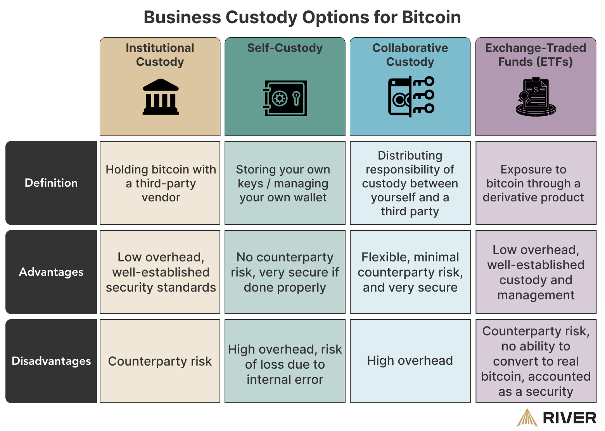

The world of cryptocurrency investment can be both thrilling and daunting, particularly with the rise of Bitcoin. Since its inception in 2009 by an anonymous entity known as Satoshi Nakamoto, Bitcoin has consistently captured the attention of investors worldwide. It's a decentralized digital currency designed to function as a medium of exchange without relying on a central authority, ensuring its independence from traditional financial systems.

Despite its significant price volatility, Bitcoin remains a favorite for investors who aim to hold onto their investments over extended periods. This enduring appeal is largely due to a strategy colloquially referred to as HODLing. Originating from a misspelled forum post, "HODL" has become emblematic of a steadfast investment philosophy. It involves retaining Bitcoin despite inevitable market fluctuations, driven by a belief in the currency's potential for long-term appreciation.



As interest in digital assets continues to grow, the need for sophisticated trading strategies has also increased. Algorithmic trading has emerged as a crucial tool for investors looking to automate and enhance their trading approaches. By leveraging complex algorithms and software, investors can execute trades based on pre-defined conditions and criteria.

This article explores the complex landscape of Bitcoin investment, examining both the enduring principles of HODLing and the innovative capabilities of algorithmic trading. These tools and strategies not only offer insight into managing cryptocurrency investments effectively but also provide a foundation for investors seeking to navigate the evolving landscape of digital finance. This exploration aims to equip both novice and seasoned investors with the knowledge necessary to master Bitcoin investments amid ongoing market transformations.

## Table of Contents

## Understanding Bitcoin Investment

Bitcoin was launched in 2009 by an entity known as Satoshi Nakamoto with the overarching goal of establishing a decentralized digital currency to serve as a global medium of exchange. Unlike traditional fiat currencies issued by governments, Bitcoin operates on a decentralized network using blockchain technology, enabling peer-to-peer transactions without the need for intermediaries like banks. The architecture of Bitcoin relies on cryptographic principles to secure transactions and control the creation of new units, fostering a level of transparency and security that traditional financial systems cannot easily provide.

Since its inception, Bitcoin has undergone substantial price volatility influenced by various factors. Market sentiment, encompassing the collective attitudes and emotions of traders and investors, plays a significant role in Bitcoin's price movements. News of regulatory developments across different jurisdictions can lead to rapid fluctuations in its valuation. For instance, announcements of regulatory crackdowns often result in price drops, while news of legal acceptance can drive the price up. Furthermore, technological advancements or the perception of Bitcoin's technological robustness can also impact its market value, as they either bolster or weaken investor confidence.

Investing in Bitcoin necessitates a comprehensive understanding of its market dynamics and an assessment of the associated risks and opportunities. Investors must evaluate Bitcoin’s potential for growth against the backdrop of its inherent risks, such as regulatory risks, cybersecurity threats, and market [volatility](/wiki/volatility-trading-strategies). Tools for analysis include both technical analysis, which examines past market data, and [fundamental analysis](/wiki/fundamental-analysis), which focuses on factors like technological development and adoption rates. A prudent investment strategy often involves balancing these analyses to make informed decisions.

The development of Bitcoin Exchange-Traded Funds (ETFs) has introduced more stable avenues for investment. Bitcoin ETFs are investment funds traded on stock exchanges, mirroring the price movements of Bitcoin without requiring direct ownership of the [cryptocurrency](/wiki/cryptocurrency). This mode of investment offers potential investors exposure to Bitcoin without the perceived risks of holding the asset directly, like storage and security concerns. ETFs also facilitate the inclusion of Bitcoin in traditional investment portfolios, granting broader access to institutional investors and contributing to the mainstream adoption of cryptocurrency investments.

## The HODL Strategy in Cryptocurrency

The term 'HODL' emerged from a misspelled post titled "I AM HODLING" on a Bitcoin forum in 2013, and it has since evolved into a widely-recognized investment strategy within the cryptocurrency community. HODLing, an abbreviation for "Hold On for Dear Life," involves maintaining possession of Bitcoin regardless of market volatility or price fluctuations. The core principle behind this approach is to anticipate substantial long-term gains by retaining Bitcoin holdings over extended periods.

HODLing reflects a deep-rooted confidence among investors in the long-term value and dominance of Bitcoin as a digital asset. This strategy capitalizes on the belief that, despite market ups and downs, Bitcoin will appreciate significantly over time due to its scarcity, increasing adoption, and technological advancements.

The rationale for HODLing is anchored in the pursuit of future profitability by disregarding short-term market turbulence. The strategy is especially appealing in the context of Bitcoin's historical price patterns, where significant growth has often followed periods of sharp declines. Investors employing the HODL strategy aim to avoid the pitfalls of emotional decision-making that can arise from reacting to daily price changes.

By focusing on the long-term potential of Bitcoin, HODLers sidestep the complexities and risks associated with frequent trading activities. Instead of actively monitoring the markets to make buy or sell decisions based on short-term trends, they adopt a passive approach, preserving their holdings through market cycles. This patience-oriented mindset is a defining characteristic of the HODL strategy, aligning with the belief that Bitcoin's ultimate potential lies ahead.

## Algorithmic Trading in Crypto Investment

Algorithmic trading is an increasingly pivotal practice in cryptocurrency investment, utilizing sophisticated software to automate the execution of trades. The process is guided by pre-determined conditions and strategies that allow for the efficient handling of the cryptocurrency’s notoriously volatile market. Algorithms can process large datasets and execute trades at an optimal speed and price, substantially reducing the risk posed by human error and emotional decision-making. For example, the implementation of a trading algorithm might utilize [momentum](/wiki/momentum) indicators to identify buy and sell signals, thereby capitalizing on short-term market movements that may be missed through manual trading.

An algorithm often incorporates a variety of trading strategies, such as [arbitrage](/wiki/arbitrage), [trend following](/wiki/trend-following), and [market making](/wiki/market-making). Consider an algorithm designed for arbitrage: it can simultaneously buy Bitcoin on one exchange where the price is low and sell it on another where the price is higher, ultimately profiting from the price discrepancies. The rapid execution made possible by [algorithmic trading](/wiki/algorithmic-trading) is vital here, as the available arbitrage window can be very narrow.

Additionally, [backtesting](/wiki/backtesting) plays a crucial role in algorithmic trading, allowing traders to simulate the algorithm's performance on historical data before actual deployment. Python, with libraries such as NumPy, pandas, and [backtrader](/wiki/backtrader), is commonly used for this purpose. An example of a simple backtest script would involve loading historical price data, applying the trading strategy, and evaluating the outcomes:

```python
import backtrader as bt

class SimpleStrategy(bt.Strategy):
    def __init__(self):
        self.sma = bt.indicators.SimpleMovingAverage(self.data.close, period=15)

    def next(self):
        if not self.position:  # not in the market
            if self.data.close[0] > self.sma[0]:  # buy signal
                self.buy()
        elif self.data.close[0] < self.sma[0]:  # sell signal
            self.sell()

cerebro = bt.Cerebro()
data = bt.feeds.YahooFinanceData(dataname='BTC-USD', fromdate=datetime.date(2020, 1, 1),
                                 todate=datetime.date(2021, 1, 1))
cerebro.adddata(data)
cerebro.addstrategy(SimpleStrategy)
cerebro.run()
cerebro.plot()
```

The platforms that support algorithmic trading in cryptocurrencies provide APIs for direct exchange access, with popular providers like Binance and Coinbase offering robust APIs for trader interaction. Algorithmic trading is not exclusive to professionals; it is increasingly accessible to both novice investors and seasoned traders, enabling them to optimize their trading strategies and manage risks more effectively. By automating trades, investors can maintain positions without the exhaustive need for constant market observation, making it an invaluable tool in their investment arsenal.

## HODL vs. Algorithmic Trading: Finding the Balance

While HODLing promotes a straightforward approach to investment by minimizing trading activity, algorithmic trading offers strategic flexibility. Both strategies present distinct advantages and limitations, often leaving investors to deliberate on which approach aligns best with their financial goals.

HODLing, derived from an early Bitcoin forum post, encourages a long-term approach to cryptocurrency investment. By holding onto assets regardless of market volatility, investors who HODL place their trust in the potential for significant long-term gains. This strategy reduces the need for constant market monitoring and minimizes transaction fees, offering peace of mind for those who believe in the enduring value of cryptocurrencies like Bitcoin. However, one key limitation of HODLing is the opportunity cost—investors might miss out on potential short-term gains that active trading could capture.

Algorithmic trading, on the other hand, utilizes advanced software to execute trades based on predefined criteria. This method provides investors with the ability to capitalize on short-term market dynamics and price inefficiencies. One major advantage of algorithmic trading is the removal of emotional bias, as trading decisions are based solely on data and programmed strategies. Additionally, algorithms can operate 24/7, which is particularly beneficial in the round-the-clock cryptocurrency market. However, this approach requires technical expertise and a deep understanding of market indicators and trends. The initial setup and ongoing maintenance of trading algorithms can also be resource-intensive.

To strike a balance between the two strategies, investors might consider a hybrid approach. Long-term investors can continue to HODL a portion of their portfolio, ensuring they benefit from potential enduring gains. Simultaneously, they can allocate a smaller portion of their investments to algorithmic trading to exploit short-term market opportunities. This dual strategy allows investors to leverage the stability and potential high returns of HODLing, while also gaining from the agility and precision of algorithmic trading.

Ultimately, the choice between HODLing and algorithmic trading depends on individual risk tolerance, investment goals, and resources. Balancing both strategies can provide a comprehensive approach to cryptocurrency investment, adapting to both market conditions and personal financial objectives.

## Conclusion

Cryptocurrency investment encompasses a variety of strategies, each designed to maximize returns in the dynamic digital economy. Understanding these strategies is critical for investors looking to navigate the complexities of the market. HODLing and algorithmic trading are two primary strategies that offer unique insights into managing Bitcoin investments effectively.

HODLing advocates for holding onto Bitcoin through market fluctuations, betting on its enduring value and future dominance. This strategy focuses on the long-term potential and seeks to minimize the emotional impacts of short-term volatility. In contrast, algorithmic trading enables investors to automate and customize trades based on specific conditions, allowing for strategic flexibility and precision. This approach can mitigate risks while capitalizing on short-term market opportunities, providing an edge in a highly volatile environment.

As digital finance evolves, staying informed and adaptable to emerging trends and technologies becomes imperative. The rapid advancements in blockchain technology, regulatory shifts, and global economic factors continuously reshape the investment landscape. Therefore, investors must periodically reassess and adjust their strategies to remain aligned with market changes.

In light of Bitcoin's maturation process, adopting a well-rounded approach that incorporates both HODLing and active trading could yield significant benefits. While long-term holders might leverage the stable appreciation of Bitcoin, algorithmic trading can exploit short-term market inefficiencies to boost returns. In blending these two strategies, investors can optimize their portfolios, balancing the security of long-term investments with the dynamism of active trading, ultimately enhancing their overall investment potential.

## References & Further Reading

[1]: Nakamoto, S. (2008). ["Bitcoin: A Peer-to-Peer Electronic Cash System."](https://nakamotoinstitute.org/library/bitcoin/) Bitcoin.org.

[2]: Antonopoulos, A. M. (2014). ["Mastering Bitcoin: Unlocking Digital Cryptocurrencies."](https://books.google.com/books/about/Mastering_Bitcoin.html?id=IXmrBQAAQBAJ) O'Reilly Media.

[3]: Burniske, C., & Tatar, J. (2017). ["Cryptoassets: The Innovative Investor's Guide to Bitcoin and Beyond."](https://www.amazon.com/Cryptoassets-Innovative-Investors-Bitcoin-Beyond/dp/1260026671) McGraw-Hill Education.

[4]: Chan, E. P. (2009). ["Quantitative Trading: How to Build Your Own Algorithmic Trading Business."](https://github.com/ftvision/quant_trading_echan_book) Wiley.

[5]: Narang, R. K. (2013). ["Inside the Black Box: A Simple Guide to Quantitative and High-Frequency Trading."](https://onlinelibrary.wiley.com/doi/book/10.1002/9781118662717) Wiley.

[6]: Vasant, P. (2013). ["Handbook of Research on Computational Intelligence for Engineering, Science, and Business."](https://igiprodst.blob.core.windows.net/ancillary-files/6cf85589-2313-4491-b62b-8ba2ad744a94_978-1-4666-2518-1_bhattacharyya.pdf) IGI Global.

[7]: Tapscott, D., & Tapscott, A. (2016). ["Blockchain Revolution: How the Technology Behind Bitcoin Is Changing Money, Business, and the World."](https://dl.acm.org/doi/10.5555/3051781) Penguin.