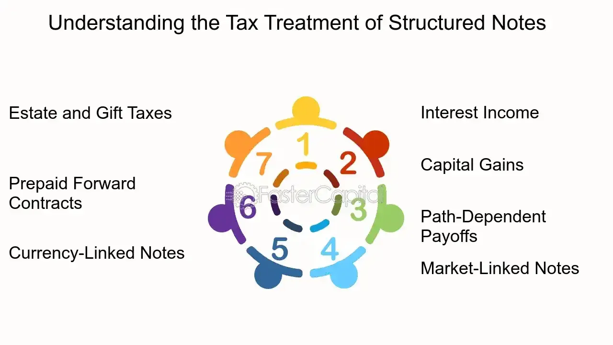

## Table of Contents

## What are structured notes?

Structured notes are investments that combine a bond with a derivative component. This means they have a fixed income part, like a bond, which gives you regular interest payments, and a part that depends on the performance of something else, like a stock or an index. This other part can make the value of the note go up or down based on how well that stock or index does.

These notes can be useful because they let you invest in a way that can be customized to your needs. For example, you might want to protect your investment from big losses while still having a chance to make more money if the market does well. But, structured notes can also be complicated and risky. It's important to understand them well before you decide to invest, because they might not be right for everyone.

## How do structured notes differ from traditional investments?

Structured notes are different from traditional investments like stocks or bonds because they mix both. A traditional bond gives you regular interest payments and returns your money at the end. A stock's value goes up and down with the company's performance. But a structured note combines a bond's steady payments with a part that depends on something else, like a stock index. This means your money's growth can be tied to how well that other thing does, not just the bond part.

This mix makes structured notes more complex than traditional investments. With a stock or bond, you mostly know what you're getting into. But with structured notes, the payoff can be hard to predict because it depends on the performance of the linked asset. This can be good if you want to customize your investment to fit your needs, like protecting against big losses while still aiming for gains. But it also means they can be riskier and harder to understand than straightforward stocks or bonds.

## What are the common types of structured notes?

Structured notes come in different types, but some are more common than others. One type is the principal protected note. This kind of note promises to give you your money back at the end, no matter what happens to the linked asset. It's like a safety net. But to get this protection, you might get less potential profit than with riskier investments.

Another common type is the autocallable note. This note can end early if the linked asset does well. If it does, you get your money back plus some extra. But if the asset doesn't do well, you might have to wait until the end of the note's term, and then what you get depends on how the asset performed. Autocallable notes can be good if you think the market will do well, but they can be tricky if it doesn't.

There are also reverse convertible notes. These notes can give you higher interest payments than regular bonds, but there's a catch. If the linked asset falls a lot, you might get the asset instead of your money back. This can be risky because the value of the asset might be less than what you put in. So, reverse convertible notes can be good for high interest but come with the chance of losing money.

## What are the key components of a structured note?

Structured notes have two main parts: a bond part and a derivative part. The bond part is like a regular bond that gives you fixed interest payments over time. This part is usually safer because you know what you're going to get. The derivative part, on the other hand, is tied to the performance of something else, like a stock or an index. This means the value of your note can go up or down depending on how well that other thing does.

The derivative part is what makes structured notes different and sometimes more complicated. It can be set up in many ways. For example, it could give you more money if the stock goes up, or it could protect your money if the stock goes down. This part can make your investment more customizable, but it also adds risk because the payoff can be hard to predict. Understanding how these two parts work together is important before you decide to invest in a structured note.

## How are returns calculated on structured notes?

Returns on structured notes are calculated based on how the two main parts of the note perform: the bond part and the derivative part. The bond part gives you fixed interest payments over time, just like a regular bond. This part of your return is predictable because you know how much interest you'll get. It's like getting a steady paycheck from the note.

The derivative part of the note is what makes things more interesting and sometimes more complicated. This part of your return depends on something else, like a stock or an index. If that thing does well, you could get more money. If it doesn't do well, you might not get as much, or even lose money. How the derivative part is set up can change how your returns are calculated. It could give you more money if the stock goes up, or it could protect your money if the stock goes down. Understanding both parts helps you know what to expect from your structured note.

## What are the risks associated with investing in structured notes?

Investing in structured notes comes with several risks. One big risk is that they can be hard to understand. Because structured notes mix a bond with a part that depends on something else, like a stock or an index, figuring out how much money you might make or lose can be tricky. If you don't understand how the note works, you might end up with a surprise at the end, and it might not be a good one. Also, structured notes can be less liquid than other investments. This means it can be hard to sell them before they end, so you might have to keep your money tied up longer than you want.

Another risk is that structured notes can lose value if the thing they're linked to doesn't do well. For example, if the note is tied to a stock and that stock goes down a lot, your note could be worth less than what you paid for it. Some structured notes promise to give your money back at the end, but these usually offer less chance for big gains. And even with that promise, there's still a risk that the company that issued the note could go bankrupt, and then you might not get your money back at all. So, while structured notes can be a way to customize your investment, they come with risks that you need to think about carefully.

## How can liquidity issues impact structured note investments?

Liquidity issues can really affect your investment in structured notes. When something is liquid, it means you can easily sell it and get your money back. But structured notes are often not very liquid. This means if you need your money back before the note ends, it can be hard to sell it. You might have to wait until the end of the term, which could be years. If you do find someone to buy it, they might not pay you as much as you paid for it, especially if the thing the note is tied to, like a stock, isn't doing well.

This lack of [liquidity](/wiki/liquidity-risk-premium) can be a big problem if you need your money for something else. Let's say you have an emergency or a good investment opportunity comes up. If your money is stuck in a structured note, you might miss out. It's important to think about how long you can afford to have your money tied up before you invest in a structured note. If you might need the money sooner, a more liquid investment might be a better choice.

## What role does credit risk play in structured notes?

Credit risk is important when you invest in structured notes. It's the risk that the company that issued the note might not be able to pay you back. If the company goes bankrupt, you might lose your money, even if the thing the note is tied to, like a stock, does well. This is different from the risk of the stock or index going down, which is called market risk. Credit risk is about the company's ability to keep its promise to pay you.

Structured notes often promise to give you your money back at the end, especially if they are principal protected. But that promise depends on the company's financial health. If the company's credit rating is low, it means there's a bigger chance they might not be able to pay. So, before you invest, it's a good idea to check the credit rating of the company that issued the note. This can help you understand how safe your investment might be.

## How do market conditions affect the performance of structured notes?

Market conditions can have a big impact on how well structured notes do. Structured notes have a part that depends on things like stocks or indexes. If the stock market goes up, and your note is tied to a stock that does well, you could make more money. But if the market goes down, and the stock or index your note is linked to falls, you might lose money or not make as much as you hoped. It's like riding a roller coaster that goes up and down with the market.

Also, market conditions can affect how easy it is to sell your structured note before it ends. If the market is doing badly, fewer people might want to buy your note, which means it could be hard to sell it without losing money. This is called liquidity risk. So, when you're thinking about investing in a structured note, it's important to look at what's happening in the market and how it might change in the future. That way, you can have a better idea of what might happen to your investment.

## What are the tax implications of investing in structured notes?

When you invest in structured notes, the tax rules can be a bit complicated. The way you're taxed depends on how the note is set up and what it's linked to. Usually, the interest payments you get from the bond part of the note are taxed as ordinary income, just like the interest from a regular bond. But the part of the note that depends on a stock or an index might be taxed differently. If you make money from that part, it could be taxed as capital gains, which might be at a lower rate than ordinary income.

Also, if you sell your structured note before it matures, you might have to pay capital gains tax on any profit you make. And if the note is considered a "constructive sale" by the IRS, it could change how you're taxed. A constructive sale happens if the note is set up in a way that's too similar to directly owning the stock or index it's linked to. It's a good idea to talk to a tax advisor before you invest in structured notes, because they can help you understand how the taxes might work for your specific situation.

## How can an investor assess the suitability of structured notes for their portfolio?

To figure out if structured notes are a good fit for your investment portfolio, start by looking at your goals and how much risk you can handle. Structured notes can be customized to fit different needs, like protecting your money from big losses while still giving you a chance to make more if the market does well. But they can also be complicated and risky. Think about how long you can keep your money tied up, because structured notes can be hard to sell before they end. Also, check if you're okay with the possibility of losing money if the thing the note is tied to, like a stock, doesn't do well.

Another thing to consider is the credit risk of the company that issued the note. If the company goes bankrupt, you might not get your money back, even if the market does well. It's a good idea to look at the company's credit rating to see how safe your investment might be. Also, think about how structured notes fit with the other investments you already have. They might help you spread out your risk, but they can also make things more complicated. Talking to a financial advisor can help you understand if structured notes are right for you and how they might affect your taxes.

## What advanced strategies can be employed to optimize returns from structured notes?

To get the most out of structured notes, you can use a few smart strategies. One way is to mix different types of structured notes in your portfolio. For example, you could have some principal protected notes that promise to give your money back at the end, and some autocallable notes that can end early if the market does well. This mix can help you balance the chance of making more money with the safety of getting your money back. Another strategy is to pay attention to the thing the note is tied to, like a stock or an index. If you think that stock or index will do well, you might pick a note that gives you more money if it goes up. But if you're worried it might go down, you could choose a note that protects your money if it falls.

Another important strategy is to keep an eye on market conditions and adjust your investments as needed. If you think the market will be up and down a lot, you might want to pick structured notes that can handle that. Also, think about how long you can keep your money tied up. If you might need your money soon, look for notes that you can sell easily or that end sooner. And don't forget about taxes. Some structured notes might be taxed in a way that's better for you than others. Talking to a financial advisor can help you understand all these things and pick the right structured notes to make the most of your investment.

## References & Further Reading

[1]: Das, S. (2011). ["Credit Risk Modeling, Valuation and Hedging."](https://link.springer.com/book/10.1007/978-3-662-04821-4) Springer.

[2]: Fabian, T. (2008). ["Structured Products and Related Credit Derivatives: A Comprehensive Guide for Investors."](https://onlinelibrary.wiley.com/doi/book/10.1002/9781119197836) Wiley Finance.

[3]: Aldridge, I. (2013). ["High-Frequency Trading: A Practical Guide to Algorithmic Strategies and Trading Systems."](https://onlinelibrary.wiley.com/doi/pdf/10.1002/9781119203803.fmatter) Wiley.

[4]: Chan, E. P. (2009). ["Quantitative Trading: How to Build Your Own Algorithmic Trading Business."](https://github.com/ftvision/quant_trading_echan_book) Wiley.

[5]: Lo, A. W., & Hasanhodzic, J. (2013). ["The Evolution of Technical Analysis: Financial Prediction from Babylonian Tablets to Bloomberg Terminals."](https://archive.org/details/evolutionoftechn0000loan) Bloomberg Press.