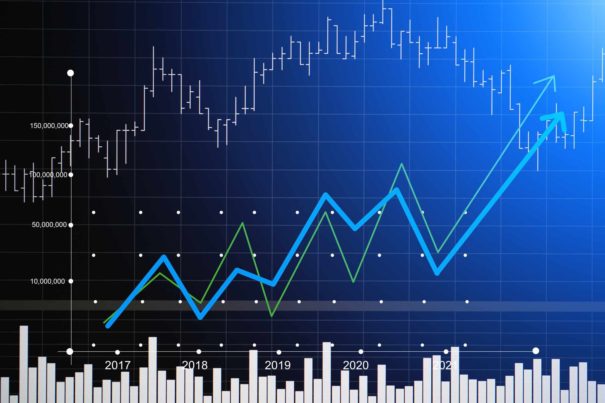

## Table of Contents

## What is free stock trading?

Free stock trading means you can buy and sell stocks without paying a fee to the company that helps you trade. These companies are called brokerages. In the past, brokerages always charged a fee, called a commission, every time you made a trade. But now, many brokerages offer free trading to attract more customers. This makes it easier and cheaper for people to invest in the stock market.

Even though the trading is free, there are still some costs to think about. For example, some brokerages might charge for other services, like transferring money or closing your account. Also, if you're trading stocks from other countries, there might be extra fees. It's important to read the fine print and understand all the costs before you start trading.

## How does free stock trading work?

Free stock trading lets you buy and sell stocks without paying a fee to the brokerage company. These companies used to charge a fee, called a commission, every time you traded. But now, many brokerages offer free trading to get more people to use their services. This makes it easier and cheaper for people to invest in the stock market. All you need to do is sign up with a brokerage that offers free trading, put money into your account, and then you can start buying and selling stocks without any trading fees.

Even though the trading itself is free, there might be other costs to think about. Some brokerages might charge for things like transferring money out of your account or closing your account. Also, if you want to trade stocks from other countries, there might be extra fees. It's important to read all the details and understand any other costs before you start trading. This way, you can make sure you're really saving money and not getting surprised by hidden fees.

## What are the benefits of free stock trading for beginners?

Free stock trading is great for beginners because it lets them start investing without worrying about paying fees every time they buy or sell a stock. This means beginners can try out different investments and learn how the stock market works without losing money to fees. It's like practicing without the extra cost, which can make it easier for new investors to feel confident and learn at their own pace.

Another benefit is that free stock trading makes it easier for beginners to start with small amounts of money. In the past, the fees could be a big part of a small investment, but now beginners can invest even just a little bit without worrying about fees eating into their money. This can help them build a habit of investing regularly and grow their savings over time, all while learning how to manage their investments.

## Are there any hidden costs associated with free stock trading?

Even though free stock trading sounds great, there can be some hidden costs. Some brokerages might charge you for things like moving your money out of your account or closing your account. They might also charge you if you want to trade stocks from other countries. These fees can add up, so it's important to read all the details and understand any other costs before you start trading.

Another thing to think about is that some brokerages might make money in other ways, like by lending your stocks to other people or by selling your information to other companies. This doesn't cost you money directly, but it's still something to be aware of. It's a good idea to ask questions and make sure you understand how the brokerage makes money, so you can be sure you're really saving money and not getting surprised by hidden fees.

## How do free stock trading platforms make money?

Free stock trading platforms make money in different ways, even though they don't charge you to buy or sell stocks. One way they make money is by earning interest on the money you keep in your account. When you put money into your account and don't invest it right away, the platform can use that money to make loans or invest it themselves, and they earn interest on it.

Another way free stock trading platforms make money is by selling your trading information to other companies. When you trade, the platform can see what you're buying and selling, and they can share that information with other businesses that might want to know about your trading habits. This helps those businesses make better decisions, and the platform gets paid for sharing the information. Also, some platforms might offer other services or products that you can pay for, like premium research tools or account management services, which adds to their income.

## What should you consider when choosing a free stock trading platform?

When choosing a free stock trading platform, it's important to look at what the platform offers. Some platforms might have easy-to-use apps or websites that make it simple for you to buy and sell stocks. Others might have tools and information that can help you make better decisions about your investments. You should also check if the platform lets you trade the kinds of stocks you're interested in, like stocks from other countries or smaller companies. It's a good idea to see if the platform has good customer service, so you can get help if you have questions or problems.

Another thing to consider is how the platform makes money. Even though they don't charge you to trade, they might make money in other ways, like by earning interest on the money in your account or by selling your trading information to other companies. You should read the fine print to see if there are any hidden fees for things like moving your money out of your account or closing your account. It's important to understand all the costs and how the platform makes money, so you can make sure you're really saving money and not getting surprised by hidden fees.

## How does free stock trading impact market dynamics?

Free stock trading has changed how people buy and sell stocks. Before, when people had to pay a fee every time they traded, they might not have traded as often. But now, with free trading, more people can trade without worrying about fees. This means more people are buying and selling stocks, which can make the market more active. More trading can lead to more ups and downs in stock prices, because there are more people making decisions about when to buy and sell.

Also, free stock trading has made it easier for new investors to start. More people are trying out investing because they don't have to worry about losing money to fees. This can bring more money into the market, which can help it grow. But it can also mean that the market might be more affected by what new investors do, because they might not have as much experience and could make choices based on what they see happening right now, rather than looking at the long term.

## What are the risks involved in free stock trading?

Free stock trading can make it easy to start investing, but there are still risks to think about. One big risk is that you might trade too much because it's free. When you don't have to pay a fee, you might buy and sell stocks more often, which can lead to bad decisions. Trading a lot can make you focus too much on short-term changes in the market instead of thinking about your long-term goals. This can lead to losing money if you're not careful.

Another risk is that you might not think about the other costs that can come with free stock trading. Even though you don't pay to trade, there might be fees for other things like moving money out of your account or closing it. Some platforms might also make money in ways that you don't see, like by lending your stocks to others or selling your trading information. It's important to understand all the costs and how the platform makes money, so you don't get surprised by hidden fees.

## How can experienced traders leverage free stock trading platforms?

Experienced traders can use free stock trading platforms to save money on fees, which means they can keep more of their profits. Since they don't have to pay to trade, they can make more trades without worrying about losing money to commissions. This can help them take advantage of small changes in the market, like buying stocks when they're a little cheaper and selling them when they go up a bit. They can also use the money they save on fees to invest in other things, like different stocks or other investments.

Another way experienced traders can use free stock trading platforms is by trying out new trading strategies without the extra cost. They can experiment with different ways of buying and selling stocks to see what works best for them. Since they don't have to pay to trade, they can make more trades and learn from their mistakes without losing money to fees. This can help them get better at trading and find new ways to make money in the market.

## What advanced features do some free stock trading platforms offer?

Some free stock trading platforms offer advanced features like real-time market data. This means you can see what's happening in the market right away, which can help you make quick decisions about buying or selling stocks. They might also have tools for technical analysis, which let you look at charts and patterns to predict what might happen next with stock prices. These tools can be really helpful for experienced traders who want to find the best times to trade.

Another advanced feature is the ability to set up custom alerts. You can tell the platform to let you know when a stock reaches a certain price or when something important happens in the market. This can help you stay on top of your investments without having to watch the market all the time. Some platforms also offer options trading, which lets you buy and sell options on stocks. This can be a more complex way to invest, but it can also give you more ways to make money if you know what you're doing.

## How does regulation affect free stock trading?

Regulation is really important for free stock trading because it makes sure that everyone plays by the same rules. In the United States, the Securities and Exchange Commission (SEC) is the main group that watches over the stock market. They make rules to keep things fair and safe for people who are trading. For example, they make sure that brokerages tell you everything about any fees or costs, even if trading is free. This helps you know exactly what you're getting into and protects you from hidden surprises.

Regulations also help to stop bad things from happening in the market, like fraud or people trying to cheat. The rules make sure that everyone has the same information and that no one can use secret information to make money unfairly. This is important for free stock trading because more people are trading, and it's easier for them to start. By having strong rules, regulators help keep the market honest and fair for everyone, no matter if they're new to trading or have been doing it for a long time.

## What future trends might influence the development of free stock trading?

In the future, technology will probably change free stock trading a lot. More and more people might use their phones to trade, so apps will get even better and easier to use. There could also be new tools that use artificial intelligence to help people make better trading decisions. These tools might look at a lot of information really fast and tell you when it's a good time to buy or sell a stock. This could make trading easier for everyone, even people who are just starting out.

Another big trend could be more rules and laws about free stock trading. As more people start trading, governments might want to make sure it's safe and fair for everyone. They might make new rules to stop bad things from happening, like people cheating or losing money because they don't understand what they're doing. This could mean that free stock trading platforms have to be more careful about how they work and what they tell their customers. It's all about making sure that everyone can trade without worrying too much.

## References & Further Reading

[1]: Ferriss, T. (2020). ["What Drives Free Stock Trading Services Like Robinhood and Others?"](https://podcast.creatorscience.com/vm-simple-complex/) Forbes.

[2]: Lewis, M. (2015). ["Flash Boys: A Wall Street Revolt"](https://en.wikipedia.org/wiki/Flash_Boys) W. W. Norton & Company. 

[3]: Vlastelica, R. (2021). ["The Hidden Costs of Robinhood and Other Free Investment Apps"](https://www.morningstar.com/columns/rekenthaler-report/hidden-costs-free-investment-services) MarketWatch.

[4]: Dion, M. J. (2020). ["How Algorithmic Trading Has Changed Investing"](https://www.sciencedirect.com/science/article/abs/pii/S0040162520312476) Investopedia.

[5]: Securities and Exchange Commission. (2022). ["Payment for Order Flow"](https://www.sec.gov/files/rules/sro/finra/2023/34-97039.pdf) U.S. Securities and Exchange Commission. 

[6]: Arnold, T., & Lewis, D. (2021). ["A Deep Dive into the World of Commission-Free Trading"](https://www.facebook.com/chet.d.arnold/posts/10163093571666414/) Harvard Business Review.