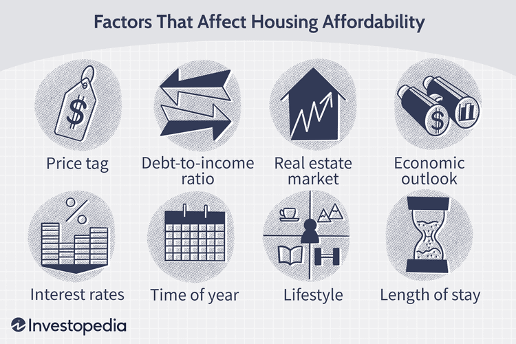

In the evolving landscape of property investment, co-ownership of vacation homes and the application of algorithmic trading have emerged as compelling trends reshaping traditional investment paradigms. These developments allow investors to access new opportunities and rethink strategies to enhance portfolio optimization.

Co-ownership of vacation homes provides an innovative strategy by allowing multiple investors to share the cost and benefits of property ownership. This model helps individuals overcome high entry barriers in real estate markets, making property investment more accessible and affordable. Through shared and fractional ownership models, investors can participate in high-value markets previously beyond their financial reach, enabling a broader diversification of their investment portfolio.



In parallel, algorithmic trading has begun to influence the real estate sector, borrowing insights from its success in financial markets. Algorithmic trading employs advanced algorithms and data analytics to automate investment decision-making, offering enhanced precision and efficiency. This data-driven approach enables investors to quickly identify trends and optimize their real estate investment strategies based on rigorous quantitative analysis.

This article will explore how these concepts—property co-ownership, vacation home investments, and algorithmic trading—can be effectively integrated to present unique investment opportunities. A focus will be placed on understanding shared and fractional ownership models, examining the role of algo trading, and evaluating their combined potential to transform property investment dynamics. Through this exploration, investors can gain insights into leveraging these trends to remain competitive in an ever-changing market environment.

## Table of Contents

## Shared Ownership in Property Investments

Shared ownership in property investments provides a unique approach for individuals seeking to enter the real estate market without bearing the full financial burden of a traditional property purchase. This model facilitates ownership by allowing multiple parties to hold a portion of the property, blending the benefits of renting with the advantages of ownership. The concept is particularly appealing as it lowers the barrier to entry, making property ownership more accessible.

One of the primary benefits of shared ownership is its affordability. By distributing the cost of a property among several owners, the financial commitment for each individual is significantly reduced. This reduced upfront investment enables individuals to invest in properties that would otherwise be financially out of reach. Additionally, by sharing financial responsibilities such as maintenance, utilities, and property taxes, co-owners can alleviate some of the ongoing costs associated with property ownership.

However, shared ownership demands careful planning and clear agreements among co-owners. Legal frameworks need to be established to delineate rights and responsibilities clearly, ensuring that all parties are aligned in their understanding and objectives. Common agreements typically cover aspects such as decision-making processes, usage rights, profitability distribution, and [exit](/wiki/exit-strategy) strategies. 

Case studies across various real estate markets illustrate the successful application of shared ownership. For instance, in urban areas where property prices are prohibitively high, shared ownership schemes have enabled individuals to secure housing that would otherwise be unaffordable. These schemes often operate through housing associations or cooperatives, providing support and structure to potential buyers.

Moreover, shared ownership is not confined to residential properties. In commercial real estate, this approach can be seen in the collaborative investment in office buildings or retail spaces, allowing smaller investors to participate in higher-value markets. By pooling resources, investors can take advantage of opportunities, diversify their investment portfolios, and leverage the potential appreciation of high-demand property sectors.

In conclusion, shared ownership presents an innovative model of property investment, balancing affordability with the benefits of ownership. While it requires collaboration and robust legal agreements, it enables a broader demographic to partake in real estate investment, supporting property market democratization.

## Fractional Ownership of Vacation Homes

Fractional ownership is a property investment model where investors purchase shares in a specific property, often applied to high-end vacation and commercial properties. This approach democratizes access to properties that might be beyond the reach of individual investors due to high cost barriers. By purchasing fractions of a property, investors can own a share of valuable assets, benefit from potential rental incomes, and appreciation in property value over time.

The main advantage of fractional ownership is the ability to partake in revenue generated from the property's rental while also potentially benefiting from capital appreciation, similar to owning traditional real estate but on a smaller scale. This model permits investors to have a more diversified portfolio across different asset classes and geographical locations, effectively mitigating investment risks. 

Diversification reduces [volatility](/wiki/volatility-trading-strategies) and is essential for risk management. It allows investors to spread potential risk across various properties, potentially resulting in more stable returns. By holding fractional shares in multiple properties, investors can avoid the adverse impacts of market downturns in a single geographic area or property type.

However, fractional ownership requires thorough legal and financial frameworks to function smoothly. Clear, pre-determined rules regarding management duties, profit sharing, and selling shares are critical. Conflict avoidance mechanisms, such as mediation processes, are advisable to handle disputes among co-owners. Transparency in operations and financial status is pivotal to maintaining investor trust.

Establishing a solid legal foundation is crucial before proceeding with fractional ownership investments. This involves drafting comprehensive agreements that clearly outline each partner's rights and obligations. Legal mechanisms can be employed to ensure that decisions regarding the use, distribution of income, and potential sale of the property are made fairly and efficiently, minimizing the potential for disputes and conflicts among co-owners. 

Financial considerations include understanding the costs involved, such as maintenance fees, property management expenses, and taxes, which should be shared among all owners. Proper financial due diligence must be performed to assess the property's potential return on investment, factoring in these recurring expenses.

In summary, fractional ownership offers an innovative approach to real estate investment, providing access to high-value properties and the benefits of diversified portfolios. However, it necessitates careful planning and legal structuring to establish transparent and effective co-ownership arrangements.

## Algorithmic Trading in Real Estate Investment

Algorithmic trading, commonly referred to as algo trading, uses complex algorithms to automate and enhance investment decisions. While traditionally dominant in the equity markets, its application within real estate investments is witnessing significant growth. Algorithms process large volumes of data to identify patterns and forecast trends, thus optimizing the investment process.

In real estate, algo trading facilitates access to data-driven insights and enables precision in investment decisions. These algorithms utilize vast datasets that include market trends, property values, rental yields, and demographic information. By leveraging these datasets, algorithms can generate predictive models that suggest optimal investment opportunities. This predictive capability transforms how investors approach real estate, moving from intuition-based decisions to ones supported by quantitative analysis.

A primary advantage of algo trading in real estate is its ability to provide trend predictions. For instance, [machine learning](/wiki/machine-learning) models can predict property value fluctuations by analyzing variables such as interest rates, local economic conditions, and historical price movements. These predictions help investors make informed decisions about buying or selling properties at opportune times, aiming to maximize returns or minimize losses.

Despite these advantages, [algorithmic trading](/wiki/algorithmic-trading) in real estate also faces limitations. A significant challenge is the potential oversight of qualitative aspects of property investments. Factors such as neighborhood quality, property aesthetics, and tenant behavior, which are pivotal in real estate dealings, may not be fully captured by algorithms. This limitation necessitates a hybrid approach where quantitative tools are complemented by qualitative assessments to achieve a comprehensive investment strategy.

The integration of [artificial intelligence](/wiki/ai-artificial-intelligence) (AI) and machine learning further amplifies the capabilities of algo trading in real estate. Platforms that incorporate these technologies are able to perform automated property assessments and execute transactions autonomously. For example, AI algorithms can evaluate property images to estimate condition and value, while machine learning models can assess rental market dynamics to forecast rental income.

Python, a dominant language in data science and machine learning, enables the implementation of such algorithms in real estate. A simple illustration of a real estate price prediction using Python might use the following code to train a model:

```python
import pandas as pd
from sklearn.model_selection import train_test_split
from sklearn.linear_model import LinearRegression

# Sample data
data = pd.DataFrame({
    'area': [1200, 1500, 1700, 2000, 2500],
    'price': [300000, 350000, 380000, 430000, 500000]
})

# Splitting data into features and target variable
X = data[['area']]
y = data['price']

# Train/test split
X_train, X_test, y_train, y_test = train_test_split(X, y, test_size=0.2)

# Linear regression model
model = LinearRegression()
model.fit(X_train, y_train)

# Predicting prices
predictions = model.predict(X_test)
print(predictions)
```

This code demonstrates a basic approach to predict property prices based on their size, an essential attribute in real estate. Though simplistic, it illustrates the potential of machine learning in processing real estate data.

The ongoing sophistication of technology platforms that harness AI and machine learning signifies a transformative shift in the landscape of real estate investment. As algorithms continue to evolve, they will enable more refined, efficient, and transparent investment processes, shaping the future of property investment strategies.

## Integrating Co-Ownership and Algo Trading

Combining shared and fractional ownership with algorithmic trading offers a potent strategy for real estate investments, especially in vacation homes and commercial properties. Technology, particularly algo trading, significantly enhances decision-making by providing data-driven insights essential for optimizing investment choices. By leveraging complex algorithms, investors can analyze vast datasets to predict market trends and automate transactions, thereby managing risks more effectively and improving transparency across investment portfolios.

The integration of these methods is exemplified in several case studies where investors successfully merged shared or fractional ownership with algorithmic tools to achieve superior returns. For instance, a group of investors might acquire shares in multiple vacation properties, using algorithms to monitor market conditions and rental yields, adjusting their investment positions dynamically.

Implementing blockchain technology further enhances this integration by ensuring that all transactions and ownership records are immutable and transparent. Blockchain creates a decentralized ledger of property ownership, which mitigates disputes and fosters trust among co-owners. This is particularly advantageous in fractional ownership scenarios, where numerous stakeholders are involved.

Future trends in real estate investments are increasingly centering around tech-driven platforms. These platforms simplify the complexities associated with property investments by offering user-friendly tools for managing fractional shares and executing algorithmic trades. Additionally, there is a growing emphasis on Environmental, Social, and Governance ([ESG](/wiki/esg-investing)) considerations in investment decisions. Investors are leveraging AI and machine learning to assess properties based on ESG criteria, thus aligning their portfolios with sustainable investment practices.

In summary, the synergy between co-ownership models and algorithmic trading is poised to transform property investment strategies, reducing barriers and enhancing portfolio diversity. Investors adopting these technologies stand to gain a competitive edge, with improved risk management and investment returns.

## Conclusion

The fusion of property co-ownership and algorithmic trading presents a promising approach for modern investors seeking innovative and accessible entry points into the real estate market. By utilizing shared and fractional ownership models, investors can democratize access to high-value properties, effectively reducing traditional barriers and capital constraints previously limiting participation in property investment. 

This democratization expands opportunities to enhance portfolio diversity—a key consideration in prudent investment management. By diversifying across multiple property types and geographical locations, investors can mitigate risks associated with market volatility, economic fluctuations, and sector-specific downturns. The incorporation of algorithmic trading further enhances this strategy by introducing data-driven insights and precision investment decision-making, enabling more adept market positioning and responsiveness to trends.

Technological advancements are facilitating transformative shifts within property investment. Automated platforms utilizing artificial intelligence and machine learning foster increased transparency, efficiency, and accuracy in property assessments, acquisitions, and management. These technologies also facilitate a more streamlined and user-friendly investment process, appealing to tech-savvy investors and expanding the potential for scalable investment strategies.

Given such benefits, investors are encouraged to explore co-ownership and algorithmic trading strategies to remain competitive. By adopting these models, investors can not only optimize their real estate strategies but also adapt to rapidly changing market dynamics. Such adaptability is crucial for capitalizing on emerging opportunities and navigating the complexities of the modern investment landscape.

## References & Further Reading

- Walton, D. (2018). 'Fractional Ownership: The Financial World’s Best Kept Secret'. Forbes. This article offers insights into the financial dynamics and benefits associated with fractional ownership, especially in sectors where high capital investment poses a barrier.

- Miller, G. (2021). 'Shared Ownership: A Comprehensive Guide to Property Ownership'. Expert Law Review. Miller provides a thorough analysis of shared ownership models, discussing legal, financial, and practical considerations crucial for potential investors.

- Lo, A. W. (2010). 'Hedging Your Bets in Real Estate with Algorithmic Trading'. Real Estate Finance Journal. Lo explores the application of algorithmic trading techniques in real estate, emphasizing their potential to transform investment strategies through data-driven decision-making.

- Chan, E. P. (2009). 'Quantitative Trading: How to Build Your Own Algorithmic Trading Business'. This resource serves as a foundational guide for anyone interested in creating an algorithmic trading enterprise, covering essential strategies and technological implementations.

- Lopez de Prado, M. (2018). 'Advances in Financial Machine Learning'. This book investigates into machine learning techniques applied to financial investments, offering a modern approach to algorithmic trading based on rigorous data analysis.

- Jansen, S. (2020). 'Machine Learning for Algorithmic Trading'. Jansen elaborates on the integration of machine learning algorithms in trading systems, enhancing the precision and effectiveness of investment methodologies through real-world applications and examples.

