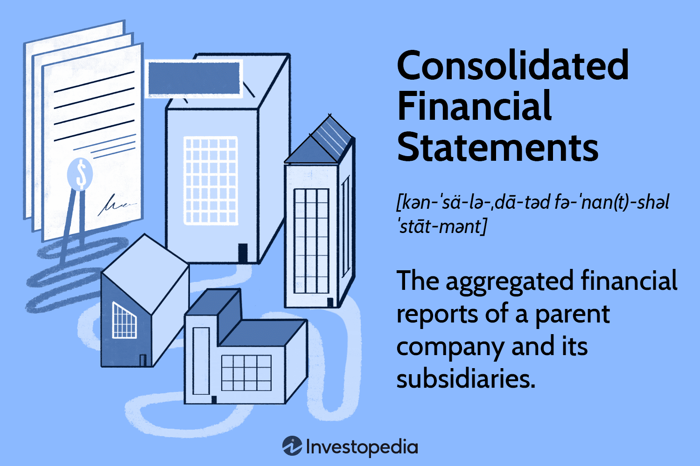

Understanding the financial health of a corporation involves analyzing various reports and statements. Among these, consolidated financial statements are paramount. They serve as comprehensive records that encapsulate the financial position of a business, merging the assets, liabilities, and operational outcomes of a parent company with its subsidiaries. This consolidation is essential for a transparent depiction of the entire corporate group's financial health.

Consolidated financial statements play a crucial role in financial reporting and are indispensable for adherence to stringent accounting standards. Financial reporting is not merely a regulatory requirement; it establishes a framework for corporate accountability and transparency, ensuring that management and investors are accurately informed about a company's financial wellbeing. These detailed reports are vital for stakeholders who rely on them to evaluate the financial performance and prospects of enterprises.



In today’s fast-paced financial markets, algo trading, or algorithmic trading, is significantly dependent on robust financial disclosures. This form of trading involves the use of advanced algorithms to execute trades based on pre-set criteria. Accurate and timely financial statements are critical for these algorithms to make informed trading decisions. Therefore, quality financial reporting directly influences market dynamics and trading outcomes, underscoring the importance of precision and reliability in financial disclosures.

This article aims to explore the intersection between consolidated financial statements, financial reporting, accounting standards, and algorithmic trading. It examines how these components collectively enhance transparency and efficiency in corporate financial decision-making. By employing these financial tools and systems, companies are better positioned to uphold integrity and foster trust among stakeholders. As financial markets continue to evolve, the integration of precise financial reporting and innovative trading technologies will remain a cornerstone of sound financial governance and market efficiency.

## Table of Contents

## Understanding Consolidated Financial Statements

Consolidated financial statements provide a comprehensive overview of a company's financial position by amalgamating the assets, liabilities, and operations of a parent company and its subsidiaries. This consolidation process is vital for presenting a unified financial picture to stakeholders, who rely on these documents to assess the overall financial health and performance of a corporate group.

The key components of consolidated financial statements include:

1. **Balance Sheet**: This provides a snapshot of the company's financial position at a specific point in time, listing assets, liabilities, and shareholders' equity. For instance, if Company A owns 80% of Company B, Company A's balance sheet will reflect 100% of Company B's assets and liabilities, along with any necessary adjustments for minority interest.

2. **Income Statement**: This details the company's financial performance over a reporting period, highlighting revenues, expenses, and net income. Consolidation here involves combining the revenues and expenses of the parent and its subsidiaries while eliminating intercompany transactions to avoid double-counting.

3. **Cash Flow Statement**: This section outlines the cash inflows and outflows from operating, investing, and financing activities. The consolidated cash flow statement provides insights into how well the group generates and utilizes cash across its entities.

4. **Statement of Shareholders' Equity**: This statement shows changes in the equity section of the balance sheet over the reporting period. It includes components such as issued share capital, retained earnings, and other reserves while accounting for any changes resulting from subsidiary operations, dividends, or stock issuance.

Preparing accurate consolidated financial statements necessitates adherence to specific accounting standards, ensuring both accuracy and comparability. For instance, the International Financial Reporting Standards (IFRS) and Generally Accepted Accounting Principles (GAAP) provide frameworks for recognizing and measuring financial items consistently. Compliance with these standards is crucial, as it allows stakeholders to compare financial statements across different companies and jurisdictions reliably.

In summary, consolidated financial statements are indispensable tools for portraying the financial activities of a corporate group as a single economic entity, offering essential insights into its financial position and ensuring informed decision-making by stakeholders.

## The Role of Financial Reporting

Financial reporting involves systematically disclosing financial information to both internal management and external stakeholders like investors, regulators, and financial analysts. The primary purpose of financial reporting is to convey the economic activities and conditions of a business, providing stakeholders with insights necessary for making informed decisions.

An integral aspect of financial reporting is maintaining transparency and accountability. Businesses are expected to present a true and fair view of their financial status, which requires a detailed portrayal of their performance and financial health. This includes delivering key information on revenue, expenses, assets, liabilities, and equity changes, encapsulated in financial statements like the income statement, balance sheet, and cash flow statement. These documents form the backbone of reliable financial reporting and enable stakeholders to assess the profitability, operational efficiency, and overall financial health of the company.

One of the key objectives of financial reporting is the provision of accurate information regarding changes in a company's financial position. This involves not only presenting historical data but also offering forward-looking statements that can guide future expectations. For example, cash flow analyses can project the company's ability to generate cash and meet financial obligations, a critical [factor](/wiki/factor-investing) for investors and creditors.

Quality financial reporting is essential to fostering trust in the market. Trustworthy financial reports provide a foundation for the confidence that investors, creditors, and other stakeholders place in the company. When financial information is reliable and presented transparently, it reduces the asymmetry of information between a company and its stakeholders. This transparency leads to more rational investment decisions, ultimately contributing to the stability and efficiency of financial markets.

Furthermore, financial reports have to conform to established accounting standards, such as the International Financial Reporting Standards (IFRS) or Generally Accepted Accounting Principles (GAAP). These standards ensure the consistency and comparability of financial statements across different companies and industries, further enhancing their credibility and utility for decision-making processes.

In conclusion, financial reporting is not simply about fulfilling regulatory requirements; it plays an indispensable role in maintaining transparency, accountability, and trust within the business ecosystem. Quality financial disclosures enable stakeholders to make sound decisions, supporting the efficient functioning of financial markets and contributing to overall economic stability.

## Accounting Standards: Ensuring Consistency and Reliability

Accounting standards serve as a fundamental framework that guides companies in the preparation of their financial statements. These guidelines are indispensable for ensuring that financial documents are consistent, reliable, and comparable across different organizations and industries. The International Financial Reporting Standards (IFRS) and the Generally Accepted Accounting Principles (GAAP) are among the prominent accounting standards widely adopted by companies globally.

IFRS, developed by the International Accounting Standards Board (IASB), provides a common accounting language, thereby facilitating greater transparency and comparability in the financial reporting process. It is employed predominantly outside the United States and is known for its principle-based approach, allowing some degree of interpretation which can lead to variations across entities. Conversely, GAAP, mainly used in the United States, offers a more rule-based framework, which can potentially limit flexibility but ensures a higher degree of uniformity in financial reports.

Adhering to these standards is fundamentally important for achieving credible financial reporting. Through consistent application, companies are able to provide stakeholders, including investors, regulators, and financial analysts, with a true and fair view of their financial position and performance. This transparency fosters investor confidence, as stakeholders rely on the integrity of these financial statements to make informed decisions.

Non-compliance with accounting standards can have significant repercussions. Financial misstatements may arise, leading to misinformation and potentially causing financial and reputational damage. Companies may face penalties from regulatory bodies, which can include fines or the suspension of trading activities. More subtly, any deviation from standardized accounting practices may erode trust from stakeholders, as inconsistencies can create perceptions of unreliability or potential manipulation of financial data.

To prevent these issues, many organizations invest in regular audits and updates to their accounting practices with the aim to align with the prevailing accounting standards. Additionally, training staff and employing advanced accounting software can help ensure that financial data is recorded and reported correctly, minimizing the risk of non-compliance. Thus, maintaining rigorous adherence to accounting standards is a critical component for safeguarding the integrity of financial reporting and supporting stable financial markets.

## Impact of Algo Trading on Financial Reporting

Algorithmic trading, often involving high-frequency and automated trade execution, demands access to timely and accurate financial information. Traders use sophisticated algorithms to parse financial reports, thereby guiding their trading strategies and decisions. The algorithms are designed to quickly analyze data from various financial statements such as income statements, balance sheets, and cash flow statements, which serve as critical inputs for developing profitable trading algorithms.

The quality of financial reporting directly influences trading decisions and market outcomes. Accurate and timely reports allow for enhanced decision-making, enabling traders to swiftly capitalize on market opportunities. Conversely, inadequate reporting can result in suboptimal trading strategies, potentially leading to significant financial losses. Therefore, maintaining current and reliable financial data is imperative to ensure these trading systems perform optimally.

Algorithmic trading represents a growing segment of the financial markets, underscoring the need for stringent accounting practices and consistent financial reporting. The automation and speed associated with these trading activities accentuate the importance of eliminating any inaccuracies or delays in financial data dissemination. As algorithms are reliant on structured data, deviations or errors in financial statements can distort analytical processes, impacting market efficiency and trader profitability.

As this trading approach continues to expand, the emphasis on robust financial reporting becomes more critical. Firms must ensure adherence to accounting standards like IFRS and GAAP, thereby providing transparency and accountability that foster trust in market systems. Enhanced financial reporting not only aids algo traders but also contributes to a more transparent and efficient market environment, ultimately benefiting the broader investor community.

## Challenges and Opportunities

One of the substantial challenges in financial reporting is maintaining the accuracy and timeliness of consolidated financial statements, especially within complex corporate structures. When conglomerates operate across multiple sectors and geographical boundaries, it can lead to intricate financial interrelations, making the consolidation process more demanding. Ensuring that all subsidiary operations are accurately reflected in the parent's financial statement requires rigorous reconciliation and verification processes.

In response to these challenges, technological advancements in financial reporting software provide significant opportunities for improving financial disclosures. Modern software solutions automate various aspects of financial reporting, from data collection to report generation. This automation can enhance both the efficiency and accuracy of disclosures. For example, Enterprise Resource Planning (ERP) systems can integrate financial data across multiple subsidiaries in real-time, enabling timely preparation of consolidated statements.

Moreover, the integration of advanced analytics and [machine learning](/wiki/machine-learning) models into financial reporting and [algorithmic trading](/wiki/algorithmic-trading) practices presents another promising opportunity. Machine learning algorithms, capable of processing vast datasets, can identify patterns and anomalies that may not be immediately apparent through traditional analysis. This capability can be particularly beneficial for algorithmic trading, which requires precise and systematic analysis of financial data to inform trading strategies. 

To illustrate, consider the following simple Python example that uses machine learning for detecting financial reporting anomalies:

```python
import pandas as pd
from sklearn.ensemble import IsolationForest

# Assume df is a DataFrame containing financial report metrics
df = pd.read_csv('financial_data.csv')

# Instantiate and train the model
model = IsolationForest(contamination=0.05)
model.fit(df[['Metric1', 'Metric2', 'Metric3']])

# Predict anomalies
anomalies = model.predict(df[['Metric1', 'Metric2', 'Metric3']])
df['Anomaly'] = anomalies

# Output the anomalous records
anomalous_df = df[df['Anomaly'] == -1]
print(anomalous_df)
```

This script can identify outliers in financial data, indicating possible anomalies in reporting that warrant further investigation.

Additionally, ongoing efforts to harmonize global accounting standards play an essential role in addressing the challenges of financial reporting. By aligning standards such as the International Financial Reporting Standards (IFRS) and Generally Accepted Accounting Principles (GAAP), financial information becomes more consistent and comparable across borders. This harmonization aids international investors, who benefit from greater clarity and confidence in cross-border financial analyses, encouraging foreign investment and fostering global economic connectivity.

In summary, while challenges like complex corporate structures create difficulties in financial reporting accuracy and timeliness, advancements in technology and analytics, coupled with standardization efforts, offer avenues for improvement, enhancing transparency and reliability in financial markets.

## Conclusion

Consolidated financial statements are essential for providing a holistic view of a corporate group's financial situation, ensuring that stakeholders have access to comprehensive and accurate information. Assessing the combined assets, liabilities, and operations of a parent company and its subsidiaries allows for a clearer understanding of financial health and performance. The stringent adherence to accounting standards, such as IFRS and GAAP, ensures the accuracy, consistency, and reliability of these statements, which in turn bolsters investor confidence and market integrity.

The growing reliance on algorithmic trading underscores the critical need for precise and prompt financial data. Algorithms depend heavily on these financial disclosures to make informed trading decisions, placing unprecedented demands on financial reporting. High-frequency trading strategies can significantly shift market dynamics based on the quality and timeliness of reported data. Thus, maintaining the integrity of financial information is paramount in influencing market outcomes and supporting informed investor decision-making.

As financial markets continue to evolve at a rapid pace, embracing consolidated financial statements, adhering to rigorous accounting standards, and providing timely, reliable data are vital to sustaining market trust. By prioritizing these elements, companies can ensure they meet the heightened expectations of modern financial ecosystems, ultimately fostering transparency and stability in global markets.

## References & Further Reading

[1]: ["International Financial Reporting Standards (IFRS)"](https://www.investopedia.com/terms/i/ifrs.asp) - IFRS Foundation.

[2]: ["Generally Accepted Accounting Principles (GAAP)"](https://www.investopedia.com/terms/g/gaap.asp) - Financial Accounting Standards Board (FASB).

[3]: ["Algorithmic Trading and DMA: An Introduction to Direct Access Trading Strategies"](https://www.amazon.com/Algorithmic-Trading-DMA-introduction-strategies/dp/0956399207) by Barry Johnson.

[4]: ["Financial Reporting and Analysis"](https://www.cfainstitute.org/en/membership/professional-development/refresher-readings/introduction-financial-statement-analysis) by Lawrence Revsine, Daniel W. Collins, and Bruce Johnson.

[5]: ["Financial Statements: A Step-by-Step Guide to Understanding and Creating Financial Reports"](https://books.google.com/books/about/Financial_Statements.html?id=V9tEDwAAQBAJ) by Thomas Ittelson.