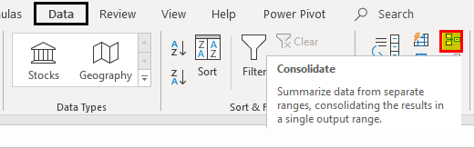

The financial markets have seen profound changes with the advancement of technology. At the forefront of these changes are the consolidated tape, algorithmic trading, and tickers. These components play a pivotal role in how market participants access, analyze, and act upon trading data. Understanding these elements is crucial for traders seeking to navigate modern markets effectively.

The consolidated tape serves as a comprehensive digital system, aggregating real-time data on stocks traded across exchanges. With detailed information like price, volume, and ticker symbols, it forms the backbone of informed trading. Managed by entities like the Consolidated Tape Association in the United States, this system ensures that trade reports from major exchanges are distributed efficiently. The transparency it fosters helps traders interpret market trends and sentiments, allowing for more accurate investment decisions.



Algorithmic trading represents another significant advancement in financial markets, utilizing computer algorithms to automate trading processes. These algorithms use real-time data, including insights from the consolidated tape, to execute trades with precision. By optimizing execution and minimizing human error, algorithmic trading strategies have become indispensable for modern traders aiming for efficiency and better market outcomes.

Additionally, tape tickers have enhanced the decision-making process for traders by offering real-time updates on price changes of specific securities. This real-time visualization supports timely decisions, reduces market fragmentation, and enhances transaction efficiency.

Ultimately, these technological advancements in financial markets foster greater transparency, efficiency, and trust. As markets continue to evolve, staying informed about the latest tools and strategies is vital for success in trading.

## Table of Contents

## Understanding the Consolidated Tape

The consolidated tape is a digital infrastructure crucial for the modern trading landscape, as it enables the aggregation and dissemination of real-time stock data from various exchanges. This data is comprehensive, encompassing essential elements such as stock prices, trade volumes, and ticker symbols, all of which are pivotal for investors aiming to obtain an accurate overview of market dynamics.

Managed by the Consolidated Tape Association, the system unifies trade reports from major stock exchanges, thereby ensuring a consistent and comprehensive flow of information. This association's governance is essential in standardizing how data is collected and distributed, thereby enhancing the reliability and accessibility of financial information across different platforms. By relaying trade reports from exchanges to investors, it plays a key role in maintaining market transparency.

Transparency in the market allows traders and investors to make informed decisions based on the latest and most accurate data available. Analyzing this real-time data helps investors discern market sentiment and conduct technical evaluations to assess potential trading opportunities. The continuous stream of consolidated data minimizes discrepancies between information from various sources, thus reducing the likelihood of errors in trading decisions.

For example, traders can utilize historical price and [volume](/wiki/volume-trading-strategy) data to perform statistical analyses or backtest trading algorithms. Consider a simple moving average strategy that an investor might test using historical price data streamed from the consolidated tape:

```python
def calculate_moving_average(prices, window_size):
    return [sum(prices[i-window_size:i])/window_size for i in range(window_size, len(prices)+1)]

historical_prices = [100, 101, 102, 103, 104, 105]  # Example price data
moving_average = calculate_moving_average(historical_prices, window_size=3)
print(moving_average)  # Output: [101.0, 102.0, 103.0, 104.0]
```

In this pseudo-code example, a trader could utilize the moving average to identify potential buying or selling points based on price trends.

Thus, the consolidated tape acts as a vital tool for investors and traders who depend on its comprehensive data for evaluating market conditions. By fostering a well-informed trading environment, it contributes significantly to more effective trading strategies and decision-making processes.

## The Mechanics of Algorithmic Trading

Algorithmic trading refers to the use of computer algorithms to automate the process of executing trades in financial markets. This method has transformed the landscape of trading by capitalizing on the speed and precision of computers to act on real-time data feeds, including those from consolidated tape systems. These systems provide continuous updates on stock prices, volumes, and other vital information, which are crucial for [algorithmic trading](/wiki/algorithmic-trading) systems to operate effectively.

At its core, algorithmic trading involves the creation of strategies that dictate when and how trades are executed. These strategies can be based on various quantitative measures, such as statistical [arbitrage](/wiki/arbitrage), [market making](/wiki/market-making), or [trend following](/wiki/trend-following). By predefining rules and criteria for trades, algorithms aim to optimize execution outcomes. For instance, they can minimize market impact and transaction costs, thereby enhancing profitability. Furthermore, the elimination of human intervention in the decision-making process helps to reduce potential human errors and biases.

As technological advancements continue to progress, the market for algorithmic trading is expanding at a rapid pace. High-frequency trading ([HFT](/wiki/high-frequency-trading-strategies)) is one of the most prominent forms of algorithmic trading, characterized by extremely high speeds and order execution within fractions of a second. HFT strategies often rely on proprietary data analysis and sophisticated algorithms to identify fleeting market inefficiencies that can be exploited for profit.

Below is an example of a simple algorithmic trading strategy using Python, which depicts a basic moving average crossover strategy:

```python
import numpy as np
import pandas as pd

# Sample data frame containing stock prices
data = pd.DataFrame({
    'price': [100, 102, 104, 103, 105, 106, 107, 106, 108, 110]
})

# Calculate the simple moving averages (SMA)
data['SMA_5'] = data['price'].rolling(window=5).mean()
data['SMA_10'] = data['price'].rolling(window=10).mean()

# Generate trading signals based on the moving average crossover
data['signal'] = np.where(data['SMA_5'] > data['SMA_10'], 'Buy', 'Sell')

print(data)
```

This code chunk generates 'Buy' signals when the short-term moving average crosses above the long-term moving average, indicating a potential upward trend, and 'Sell' signals when the inverse occurs.

Algorithmic trading has several advantages, such as improved market [liquidity](/wiki/liquidity-risk-premium) and tighter bid-ask spreads due to increased trading activity. However, it also poses challenges, including the risk of market instability and the potential for algorithm-driven market manipulation. Regulatory bodies and exchanges continually address these concerns through guidelines and oversight to ensure fair market practices.

In conclusion, algorithmic trading represents a significant evolution in trading methodologies, offering enhanced efficiency, precision, and potential profitability. As technology continues to progress, traders employing algorithmic strategies will likely gain a substantial edge in navigating the complexities of modern financial markets.

## How Tape Tickers Enhance Trading Decisions

Tape tickers, integral components of the trading ecosystem, serve as vital tools for traders by offering real-time visibility into market activities. They are instrumental in facilitating timely trading decisions through instantaneous updates on price changes, allowing traders to respond promptly to fluctuations and emerging trends.

Tape tickers display critical information such as the last sale price, bid and ask prices, and the number of shares traded. This constant stream of data empowers traders to monitor specific securities effectively, enabling the identification of potential investment opportunities and the detection of patterns that might indicate future price movements. By analyzing these data points, traders can make informed decisions that enhance their trading strategies and outcomes.

Moreover, ticker data is crucial in evaluating overall market performance. By aggregating data from various exchanges, tape tickers provide a comprehensive perspective that mitigates price fragmentation. This consolidation allows traders to gain a unified view of market dynamics, contributing to more consistent and accurate pricing. The reduction in price fragmentation ensures that traders have access to precise information, thereby fostering a more transparent and efficient trading environment.

Incorporating tape tickers into trading strategies not only enhances decision-making but also drives improved efficiency and profitability. By leveraging real-time data, traders can execute trades that are aligned with market movements, minimizing exposure to risks associated with delayed information. The instantaneous nature of ticker data helps in seizing optimal entry and [exit](/wiki/exit-strategy) points, which translates into better execution of trades and maximized returns.

Overall, the strategic use of tape tickers enriches the trading process by offering clarity and precision, making them indispensable tools for both individual and institutional investors aiming to optimize their trading performance.

## Benefits of Trading Data Consolidation

Consolidated trading data plays a crucial role in modern financial markets by offering a comprehensive view of market dynamics. This holistic perspective allows for the aggregation of data from various exchanges, leading to a reduction in fragmentation and inconsistencies in security pricing. By having a unified view of market activities, traders and investors can make more informed decisions.

One of the primary benefits of trading data consolidation lies in its ability to standardize information, which is pivotal for ensuring accurate pricing. This standardization prevents disparities that might arise from the isolated reporting of prices across different platforms. By diminishing fragmentation, consolidated data enhances the ability of traders to assess the true market value of securities, thereby facilitating more reliable pricing strategies.

Furthermore, consolidated trading data greatly aids in regulatory compliance. As regulatory standards demand transparency and accuracy, consolidated data ensures that traders and firms can access precise data needed for adhering to legal requirements. This is particularly significant in a jurisdiction where failure to comply with regulations can lead to severe penalties.

The transparency provided by consolidated trading data is another essential benefit. By integrating data from multiple sources, consolidated systems foster an environment of trust and reliability in market transactions. Stakeholders, both individual and institutional, can thus engage with an assurance that the data reflects real-time market conditions.

Overall, the consolidation of trading data enhances the trading experience for all market participants. For individual investors, this means improved access to comprehensive market insights, allowing for more informed investment decisions. Institutional investors benefit from streamlined data flow, which supports large-scale trading operations with improved certainty and reduced operational risk.

This integrated approach signifies an evolution in trading methodologies, providing an efficient infrastructure that supports the accurate representation of market activities. Consequently, market participants can navigate the complexities of trading with greater competence and confidence, contributing to a dynamic and efficient market environment.

## Conclusion

Financial markets are becoming increasingly data-driven, with consolidated tape and algorithmic trading playing pivotal roles in transforming the trading landscape. These tools enable traders to tap into the vast potential of real-time data, enhancing their decision-making capabilities. Understanding and effectively utilizing these technologies are essential for achieving success in today's trading environment.

By adopting algorithmic strategies, traders can process immense amounts of market data efficiently, minimizing human errors and biases in execution. This computational power allows for rapid analysis and swift response to market fluctuations, leading to improved trade outcomes. The capacity to harness real-time data from sources such as the consolidated tape streamlines the trading process, providing critical insights into price movements, trading volumes, and market liquidity.

As financial markets evolve, so will the methodologies for analyzing and executing trades. The proliferation of data and continual advancements in technology suggest that traders must remain adaptable to emerging trends and innovations. Keeping abreast of developments in data analytics, [machine learning](/wiki/machine-learning), and [artificial intelligence](/wiki/ai-artificial-intelligence) will be vital in staying competitive.

A commitment to ongoing education and skill development in these areas is imperative. By staying informed, traders can better position themselves to capitalize on market opportunities and navigate challenges. Mastery of these tools not only enhances trading prowess but also builds the resilience necessary for long-term success in an ever-changing market landscape.

## References & Further Reading

[1]: Rasekhschaffe, K. C., & Jones, R. (2019). ["Machine Learning for Stock Selection"](https://www.semanticscholar.org/paper/Machine-Learning-for-Stock-Selection-Rasekhschaffe-Jones/93f4d3262d51785f7efdb4138f78ccdfa97444b1). Financial Markets, Institutions & Instruments, 28(3).

[2]: Hasbrouck, J. (2007). ["Empirical Market Microstructure: The Institutions, Economics, and Econometrics of Securities Trading"](https://academic.oup.com/book/52241). Oxford University Press.

[3]: Aldridge, I. (2013). ["High-Frequency Trading: A Practical Guide to Algorithmic Strategies and Trading Systems"](https://www.amazon.com/High-Frequency-Trading-Practical-Algorithmic-Strategies/dp/1118343506). Wiley.

[4]: O'Hara, M. (1995). ["Market Microstructure Theory"](https://www.wiley.com/en-us/Market+Microstructure+Theory-p-9780631207610). Wiley-Blackwell.

[5]: Bouchaud, J. P., & Potters, M. (2003). ["Theory of Financial Risk and Derivative Pricing"](https://www.cambridge.org/core/books/theory-of-financial-risk-and-derivative-pricing/5BBBA04CE72ED9E5E7C1C028D9A94FCB). Oxford University Press.