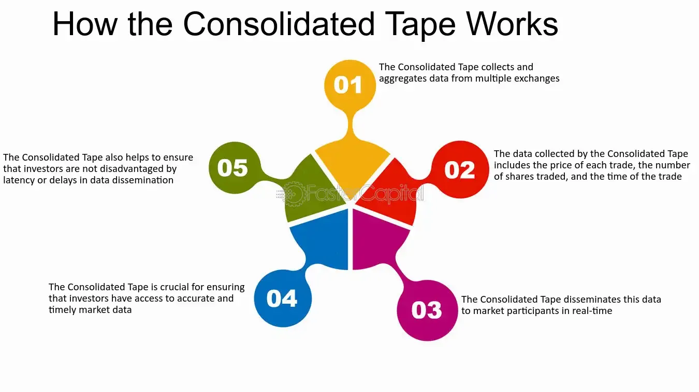

## Table of Contents

## What is a Consolidated Tape?

A Consolidated Tape is a system that shows the prices of stocks and other financial products from different places where they are traded. It helps people see all the buying and selling information in one place, so they can make better choices about their investments. This system is important because it makes the market more open and fair for everyone.

In the United States, there are two main Consolidated Tapes. One is called Tape A, which shows the prices of stocks listed on the New York Stock Exchange. The other is Tape B, which shows the prices of stocks listed on other exchanges. There is also a Tape C, which shows the prices of stocks listed on the Nasdaq. By having these tapes, investors can see all the important information they need to understand how the market is doing.

## Why was the Consolidated Tape created?

The Consolidated Tape was created to make the stock market easier to understand and more fair for everyone. Before it existed, people had to look at different places to see the prices of stocks. This was hard and could lead to some people knowing more than others. By having one place to see all the prices, the Consolidated Tape helps everyone have the same information at the same time.

This system also helps make the market more open and honest. When everyone can see the same prices, it's harder for some people to trick others or do things that are not fair. The Consolidated Tape makes sure that the stock market works well for everyone, not just a few people who might have secret information.

## How does the Consolidated Tape work?

The Consolidated Tape works by collecting all the buying and selling information from different stock exchanges and showing it in one place. When someone wants to buy or sell a stock, they do it at an exchange like the New York Stock Exchange or Nasdaq. The Consolidated Tape takes this information and puts it together so everyone can see the latest prices and how many stocks were bought or sold.

This helps everyone have the same information at the same time. For example, if a stock is being traded on both the New York Stock Exchange and Nasdaq, the Consolidated Tape will show the best price from both places. This way, people can make better choices about buying or selling stocks because they can see all the important details in one spot.

## What types of financial instruments are included in the Consolidated Tape?

The Consolidated Tape includes different kinds of financial products that people can buy and sell. Mostly, it shows the prices of stocks, which are shares in companies. These stocks can come from big companies listed on the New York Stock Exchange or smaller ones on other exchanges like Nasdaq.

Besides stocks, the Consolidated Tape also includes other financial instruments like exchange-traded funds (ETFs). ETFs are like baskets of different investments that you can buy and sell like stocks. By showing the prices of these instruments, the Consolidated Tape helps everyone see what is happening in the market and make smart choices about their money.

## Who regulates the Consolidated Tape?

The Consolidated Tape is regulated by the Securities and Exchange Commission (SEC) in the United States. The SEC makes sure that the information on the Consolidated Tape is fair and correct. They do this by making rules that everyone has to follow when they report prices and trades.

The SEC also works with the exchanges, like the New York Stock Exchange and Nasdaq, to make sure everything is working right. They check that the Consolidated Tape is showing the best prices from all the different places where stocks are traded. This helps keep the market honest and fair for everyone.

## What are the different Consolidated Tape systems (e.g., CTA, UTP)?

The Consolidated Tape is split into different systems to handle the information from different stock exchanges. The first system is called the Consolidated Tape Association ([CTA](/wiki/cta-strategy)). It shows the prices of stocks that are listed on the New York Stock Exchange and other exchanges, except for Nasdaq. The CTA is split into two parts: Tape A for the New York Stock Exchange stocks and Tape B for other exchanges.

The second system is the Unlisted Trading Privileges (UTP) Plan, also known as Tape C. This system shows the prices of stocks that are listed on the Nasdaq. Both the CTA and UTP systems work together to make sure that everyone can see the best prices from all the different places where stocks are traded. This helps keep the market fair and open for everyone.

## How is data disseminated through the Consolidated Tape?

The Consolidated Tape collects information about stock prices and trades from different stock exchanges. When someone buys or sells a stock, this information goes to the Consolidated Tape. The system then puts all this information together and shows it to everyone who wants to see it. This way, people can see the latest prices and how many stocks were bought or sold, no matter where the trade happened.

This data is shared in real-time, which means it's very fast. People can see the information as soon as it happens. The Consolidated Tape uses special computer systems to make sure the information gets to everyone quickly and correctly. By doing this, it helps keep the stock market fair because everyone has the same information at the same time.

## What are the benefits of using the Consolidated Tape for investors?

The Consolidated Tape helps investors by giving them all the important information they need in one place. Instead of looking at many different places to see stock prices, investors can just look at the Consolidated Tape. This makes it easier for them to see the best prices for stocks, no matter where they are being traded. This way, investors can make better choices about when to buy or sell stocks because they have all the information they need right in front of them.

Another big benefit is that the Consolidated Tape makes the market fair for everyone. When all the prices are shown in one place, it stops some people from knowing more than others. This means that everyone has the same chance to make good choices about their investments. By having this information, investors can feel more confident that they are making decisions based on what is really happening in the market, not just on what a few people might know.

## How does the Consolidated Tape affect market transparency?

The Consolidated Tape makes the market more transparent by showing all the prices of stocks and other financial products in one place. This means that everyone can see the same information at the same time, no matter where the stocks are being traded. When everyone has the same information, it's harder for some people to have an unfair advantage. This helps keep the market honest and fair for all investors.

Having this transparency also helps people trust the market more. When investors know they can see all the important details about stock prices, they feel more confident about making choices with their money. This can lead to more people wanting to invest, which is good for the whole market. By making sure everyone has the same information, the Consolidated Tape helps create a market that works well for everyone.

## What are the challenges and limitations of the Consolidated Tape?

The Consolidated Tape faces some challenges and limitations that can make it hard to use. One big challenge is keeping the information up to date. Because the stock market moves very fast, the Consolidated Tape has to work quickly to show the latest prices. If there's a delay, people might make decisions based on old information, which can be a problem. Also, the system needs to handle a lot of information at the same time, and sometimes this can be hard to do without making mistakes.

Another limitation is that the Consolidated Tape only shows certain types of financial products, like stocks and ETFs. It doesn't include everything that people might want to invest in, like bonds or commodities. This means that investors have to look at other places for information about those things. Also, while the Consolidated Tape helps make the market fair, some people might still find ways to get information faster or in different ways, which can create an unfair advantage.

## How has technology influenced the development of the Consolidated Tape?

Technology has made a big difference in how the Consolidated Tape works. Before, it was hard to get information from different stock exchanges and put it all together quickly. But now, with computers and the internet, the Consolidated Tape can show the latest prices in real-time. This means people can see what's happening in the market as soon as it happens. Computers also help make sure the information is correct and easy to understand, so everyone can use it to make good choices about their investments.

Even though technology has helped a lot, it also brings some challenges. The Consolidated Tape needs to keep up with very fast changes in the market, and this can be hard. Sometimes, the system might get slow or make mistakes if it has to handle too much information at once. But overall, technology has made the Consolidated Tape better and more useful for investors, helping them see all the important details they need to make smart decisions.

## What future developments are expected for the Consolidated Tape?

In the future, the Consolidated Tape is expected to get even better at showing information quickly and accurately. As technology keeps getting better, the system will be able to handle more information without slowing down. This means people will see the latest prices even faster than they do now. Also, the Consolidated Tape might start showing more types of financial products, like bonds or commodities, so investors can see everything they need in one place.

Another thing that might happen is that the Consolidated Tape could become easier to use. Right now, it can be hard for some people to understand all the information it shows. In the future, the system might use simpler language or have tools that help people make sense of the data. This would make it easier for everyone to use the Consolidated Tape, no matter how much they know about the stock market. By making these changes, the Consolidated Tape will keep helping to make the market fair and open for all investors.

## References & Further Reading

[1]: Rasekhschaffe, K. C., & Jones, R. (2019). ["Machine Learning for Stock Selection"](https://www.semanticscholar.org/paper/Machine-Learning-for-Stock-Selection-Rasekhschaffe-Jones/93f4d3262d51785f7efdb4138f78ccdfa97444b1). Financial Markets, Institutions & Instruments, 28(3).

[2]: Hasbrouck, J. (2007). ["Empirical Market Microstructure: The Institutions, Economics, and Econometrics of Securities Trading"](https://academic.oup.com/book/52241). Oxford University Press.

[3]: Aldridge, I. (2013). ["High-Frequency Trading: A Practical Guide to Algorithmic Strategies and Trading Systems"](https://www.amazon.com/High-Frequency-Trading-Practical-Algorithmic-Strategies/dp/1118343506). Wiley.

[4]: O'Hara, M. (1995). ["Market Microstructure Theory"](https://www.wiley.com/en-us/Market+Microstructure+Theory-p-9780631207610). Wiley-Blackwell.

[5]: Bouchaud, J. P., & Potters, M. (2003). ["Theory of Financial Risk and Derivative Pricing"](https://www.cambridge.org/core/books/theory-of-financial-risk-and-derivative-pricing/5BBBA04CE72ED9E5E7C1C028D9A94FCB). Oxford University Press.