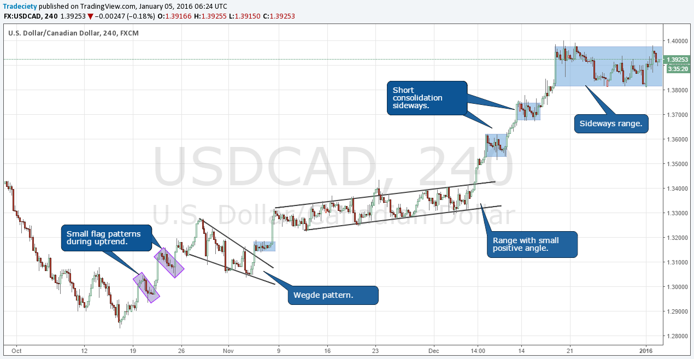

## Table of Contents

## What is Consolidated Trading?

Consolidated trading is when a company combines all its buying and selling activities into one place. This makes it easier for the company to manage its trades and keep track of everything. Instead of having different departments or locations handling their own trades, everything is done together. This can help save money and make things more organized.

By bringing all trading activities together, a company can also get better deals from suppliers. When you buy more things at once, you can often get a lower price. This is called getting a bulk discount. Also, consolidated trading can help a company see all its trading data in one place, which makes it easier to make smart decisions about what to buy and sell.

## How does Consolidated Trading benefit individual investors?

Consolidated trading can help individual investors by making it easier to buy and sell stocks. When a company consolidates its trading, it often uses one big platform where all the trades happen. This can mean lower costs for investors because the company can get better deals when it trades in large amounts. These savings can be passed on to individual investors, making it cheaper for them to trade.

Another way consolidated trading helps individual investors is by making the market more efficient. When all the trades are in one place, it's easier to see what's happening with stock prices. This can help investors make better choices about when to buy or sell. Also, having everything in one place can make the process of trading faster and smoother, which can be a big help for people who want to trade quickly.

## What are the key components of a Consolidated Trading platform?

A consolidated trading platform has several important parts that help it work well. One key part is the trading engine, which is like the heart of the platform. It handles all the buying and selling orders quickly and makes sure they happen at the right prices. Another important part is the order management system, which keeps track of all the orders and makes sure they are filled correctly. The platform also needs a good user interface, which is what investors see and use to make their trades. It should be easy to use and understand, so people can make their trades without any trouble.

Another key component is the data feed, which gives the platform all the information it needs about stock prices and market conditions. This data needs to be fast and accurate so that investors can make good decisions. The platform also needs strong security measures to keep everyone's information and money safe. This includes things like encryption and firewalls to protect against hackers. Lastly, a consolidated trading platform often has reporting and analytics tools. These tools help investors see how their trades are doing and make better choices about what to do next.

## Can you explain the process of consolidating trades?

Consolidating trades means bringing all the buying and selling activities of a company into one place. Imagine a company that used to have different departments or locations doing their own trades. Now, instead of that, they decide to do all their trades through one big platform. This process starts with setting up a central trading system where everyone in the company can send their orders. The system collects all these orders and handles them together, which can help save money and make things more organized.

Once the central trading system is set up, the company needs to make sure everyone knows how to use it. They might need to train their employees on the new platform. As orders come in, the system matches buyers with sellers and makes the trades happen. This can lead to better deals because the company can buy and sell in larger amounts. Over time, the company can keep an eye on all its trades in one place, which makes it easier to see how things are going and make smart decisions about what to buy and sell next.

## What are the risks associated with Consolidated Trading?

One risk of consolidated trading is that it can make a company too dependent on one trading platform. If something goes wrong with the platform, like a technical glitch or a cyber attack, it can stop all the company's trading at once. This can be a big problem because the company might lose money or miss out on important trades. It's like putting all your eggs in one basket; if the basket breaks, you lose everything.

Another risk is that consolidated trading can make it harder to see what's happening with individual trades. When all the trades are mixed together, it can be tough to keep track of where the money is coming from and going to. This can lead to mistakes or even fraud if someone in the company is not honest. It's important for the company to have good checks and balances in place to make sure everything is done right.

## How does Consolidated Trading impact market liquidity?

Consolidated trading can help make the market more liquid. Liquidity means how easy it is to buy or sell something without the price changing a lot. When a company does all its trading in one place, it can trade bigger amounts at once. This can make it easier for other people to buy and sell too, because there are more trades happening. It's like having a big pool of water instead of many small puddles; it's easier to swim in a big pool.

But, consolidated trading can also have some problems with liquidity. If one big company is doing a lot of trading in one place, it might make the prices move around more. This can scare some people away from trading, because they don't want to buy or sell when the prices are jumping around. So, while consolidated trading can make things more liquid by having more trades, it can also make the market a bit unpredictable at times.

## What are the regulatory considerations for Consolidated Trading?

When a company does consolidated trading, they have to follow certain rules set by the government. These rules are there to make sure trading is fair and safe for everyone. One big rule is that the company has to report all their trades in a clear way. This helps the government keep an eye on what's happening and make sure no one is cheating. The company also has to make sure their trading platform is safe from hackers and other bad things that could mess up the trades.

Another important thing is that the company needs to be careful not to control the market too much. If one company does too much trading in one place, it might make it hard for other people to buy and sell. The government has rules to stop this from happening. They want to make sure the market stays open and fair for everyone. So, the company has to follow these rules and work with the government to make sure their consolidated trading is good for everyone.

## How do Consolidated Trading strategies differ from traditional trading strategies?

Consolidated trading strategies focus on bringing all the buying and selling activities of a company into one place. This means using one big platform to handle all the trades, instead of having different departments or locations do their own trading. By doing this, the company can get better deals when buying and selling in large amounts, which can save money. It also makes it easier to keep track of all the trades and make smart decisions based on all the data in one place. This approach can make trading more efficient and organized, but it relies heavily on the performance of the central platform.

Traditional trading strategies, on the other hand, often involve different parts of a company handling their own trades separately. Each department or location might use its own trading system, which can lead to less coordination and higher costs. While this method can offer more flexibility and allow for specialized trading strategies tailored to specific needs, it can also be more complicated to manage. Tracking and analyzing trades across multiple systems can be challenging, and it might be harder to get the best prices because the company isn't trading in large, consolidated amounts.

In summary, consolidated trading aims to streamline and optimize trading by centralizing it, which can lead to cost savings and better decision-making. Traditional trading, while more fragmented, allows for customized approaches but can be less efficient and more costly. Both strategies have their own set of advantages and challenges, and the choice between them depends on the company's specific needs and goals.

## What technological tools are essential for effective Consolidated Trading?

For effective consolidated trading, a strong trading engine is key. This is the main part of the trading platform that quickly handles all the buying and selling orders. It makes sure that trades happen at the right prices and in the right amounts. Another important tool is the order management system, which keeps track of all the orders and makes sure they are filled correctly. A good user interface is also essential because it's what traders use to make their trades. It should be easy to use so that people can buy and sell without any trouble.

Another crucial tool is the data feed, which provides the platform with all the information about stock prices and market conditions. This data needs to be fast and accurate so that traders can make good decisions. Security measures are also vital to keep everyone's information and money safe. This includes things like encryption and firewalls to protect against hackers. Finally, reporting and analytics tools help traders see how their trades are doing and make better choices about what to do next. All these tools together make consolidated trading effective and efficient.

## How can one analyze the performance of Consolidated Trading strategies?

To analyze the performance of consolidated trading strategies, you can look at how much money the company is saving. When a company does all its trading in one place, it can often get better prices because it's buying and selling in bigger amounts. You can compare the costs before and after using consolidated trading to see if there are savings. Another way to analyze performance is by looking at how easy it is to manage trades. With everything in one place, it should be simpler to keep track of orders and make decisions. If the company finds it easier to manage its trades, that's a good sign that the consolidated trading strategy is working well.

You can also use data from the trading platform to see how well the strategy is doing. The platform can give you reports and charts that show how trades are performing. Look for things like how quickly trades are happening, how often the platform is down, and how much the prices are moving around. If trades are happening quickly and the platform is reliable, that's a good sign. Also, if the prices are not jumping around too much, it means the market is stable, which is good for trading. By looking at all these things together, you can get a clear picture of how well the consolidated trading strategy is working.

## What advanced techniques can be used to optimize Consolidated Trading?

To make consolidated trading even better, companies can use something called algorithmic trading. This means using computer programs to make trades automatically, based on rules set by the company. These programs can look at lots of information really fast and make smart choices about when to buy or sell. This can help the company get the best prices and make more money. Also, companies can use something called machine learning to make their trading even smarter. Machine learning is when computers learn from past trades to make better decisions in the future. This can help the company keep getting better at trading over time.

Another way to optimize consolidated trading is by using high-frequency trading. This means making a lot of trades very quickly, sometimes in just a few seconds. High-frequency trading can help the company take advantage of small changes in prices and make more money. But it needs very fast computers and good internet connections to work well. Also, companies can use risk management tools to make sure they don't lose too much money. These tools can help the company see how much risk they are taking and make safer choices about trading. By using these advanced techniques, companies can make their consolidated trading even more effective.

## What future trends are expected to influence Consolidated Trading?

In the future, technology will play a big role in changing how consolidated trading works. More and more, companies will use artificial intelligence (AI) and machine learning to make their trading smarter. These technologies can look at a lot of information very quickly and make good choices about when to buy or sell. This can help companies get better prices and make more money. Also, as the internet gets faster and more reliable, companies can use high-frequency trading more. This means making a lot of trades in just a few seconds, which can help companies take advantage of small changes in prices.

Another trend that will influence consolidated trading is the focus on making things safer and more secure. As more trading happens online, there will be a bigger need for strong security measures to keep hackers out. Companies will use better encryption and other tools to make sure their trading platforms are safe. Also, governments might make new rules to make sure trading is fair and safe for everyone. These rules could change how companies do their consolidated trading, so they will need to keep up with the new laws and make sure they follow them.

## References & Further Reading

[1]: [Ballocchi, G. (2017). Quantitative Investment: An Introduction to the Possibilities for Active Management. CFA Institute Research Foundation.](https://bcs.wiley.com/he-bcs/Books?action=index&bcsId=12261&itemId=1119743621)  

[2]: ["Advances in Financial Machine Learning"](https://www.amazon.com/Advances-Financial-Machine-Learning-Marcos/dp/1119482089) by Marcos Lopez de Prado

[3]: ["High-Frequency Trading: A Practical Guide to Algorithmic Strategies and Trading Systems"](https://www.amazon.com/High-Frequency-Trading-Practical-Algorithmic-Strategies/dp/0470563761) by Irene Aldridge

[4]: ["Quantitative Trading: How to Build Your Own Algorithmic Trading Business"](https://www.amazon.com/Quantitative-Trading-Build-Algorithmic-Business/dp/1119800064) by Ernest P. Chan

[5]: ["Machine Learning for Algorithmic Trading"](https://www.amazon.com/Machine-Learning-Algorithmic-Trading-alternative/dp/1839217715) by Stefan Jansen

[6]: Nicolosi, G., & Nicola, C. (2020). ["The Impact of High-Frequency Trading on Market Microstructure: An Empirical Investigation."](https://pages.stern.nyu.edu/~bdonefer/presscites/HFTMMI.pdf) 

[7]: Durbin, M. (2010). ["All About High-Frequency Trading."](https://www.mhebooklibrary.com/doi/book/10.1036/9780071743457) McGraw Hill.