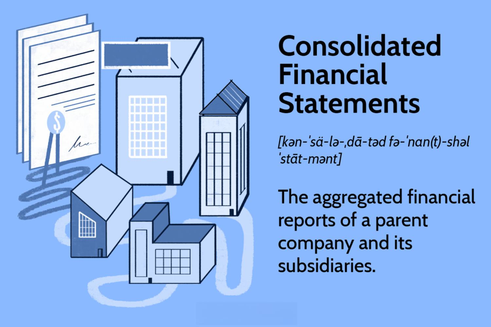

Consolidation finance and algorithmic trading are pivotal areas in the modern financial landscape. These fields, when effectively integrated, streamline operations and significantly boost profitability. As businesses and financial institutions seek to optimize their processes, understanding the intricacies of consolidation and the transformative nature of algorithmic trading becomes imperative.

Consolidation in finance involves the combination of financial statements from multiple entities, providing a comprehensive view of the financial status of the combined organization. It aids businesses in achieving financial clarity, streamlining operations, and seizing enhanced strategic opportunities. This process is particularly critical in mergers and acquisitions, allowing companies to leverage economies of scale, increase market share, and merge expertise and technologies.



On the other hand, algorithmic trading, also known as algo trading, uses computer programs to execute trading orders under a pre-defined set of instructions. This method of trading is instrumental in executing orders at speeds and frequencies unattainable by human traders. It is widely adopted by hedge funds, pension funds, and other institutional traders for its ability to reduce costs, improve market liquidity, and manage risks more effectively. By processing vast amounts of data in real-time, algorithmic trading provides a competitive edge and enhances market efficiency.

Understanding these concepts equips business owners, financial experts, and traders with the necessary tools to optimize their financial and trading operations. As we explore these subjects, expert insights will illuminate the potential these strategies hold for boosting financial management and trading efficiency. The analysis presented here aims to provide a clear understanding of why financial consolidation is critical for maintaining financial health and how algorithmic trading is reshaping market activities. Join us as we unpack these complex topics through detailed exploration and insight.

## Table of Contents

## Understanding Consolidation in Finance

Consolidation in finance is a critical process that involves unifying the financial statements of two or more entities into a single, coherent financial representation. This process is typically a central component of mergers and acquisitions (M&A), aiming to provide a holistic view of the financial health of the newly formed business entity. It encompasses the integration of assets, liabilities, equity, and other financial items from the participating companies, resulting in a consolidated balance sheet that serves as a comprehensive overview of the combined financial standing.

One of the primary benefits of financial consolidation is achieving improved financial clarity. By consolidating financial statements, organizations can eliminate redundancies and provide stakeholders with a clear overview of the financial situation that enhances transparency. This clarity simplifies the assessment of financial performance, risks, and opportunities, which is pivotal for strategic decision-making.

Furthermore, financial consolidation streamlines operations by unifying disparate accounting systems and practices. This integration is not merely a financial necessity but also a strategic opportunity. Companies that undergo consolidation can better leverage economies of scale, allowing them to expand market share and combine resources, expertise, and technology more efficiently. This can translate into significant cost savings, a more formidable competitive position, and enhanced innovation capacity.

In addition to these strategic advantages, financial consolidation is essential for ensuring regulatory compliance. By producing a unified set of financial statements, companies can more easily meet regulatory requirements, which often demand transparent and consolidated reporting frameworks. This helps mitigate legal risks and build confidence among regulators, investors, and other stakeholders.

Moreover, the consolidated financial data supports better decision-making abilities for companies. A unified financial view aids in more accurate forecasting and budgeting, enabling management to allocate resources judiciously and pursue strategic objectives with greater confidence. It also facilitates effective performance benchmarking across different segments of the consolidated entity, thereby driving internal efficiencies.

In summary, financial consolidation is a multifaceted process that not only enhances operational efficiency and strategic planning but also fortifies a company’s position in the market. It aligns financial practices with broader corporate goals, paving the way for sustained growth and innovation.

## The Role of Algorithmic Trading in Modern Markets

Algorithmic trading, frequently termed 'algo trading,' leverages computer programs to execute trading orders based on pre-defined criteria. This approach allows for transactions to be executed with precision and at speeds unattainable by human traders. Algorithms can be designed to follow any strategy, from trailing stop losses and [market making](/wiki/market-making) to [trend following](/wiki/trend-following) and [arbitrage](/wiki/arbitrage).

The core advantage of [algorithmic trading](/wiki/algorithmic-trading) lies in its ability to process massive data sets and capture market opportunities instantaneously. Programs can scan multiple exchanges and analyze varying market conditions in real-time to identify optimal entry and [exit](/wiki/exit-strategy) points. For instance, high-frequency trading ([HFT](/wiki/high-frequency-trading-strategies)), a subset of algorithmic trading, capitalizes on small price changes and executes millions of trades within fractions of a second. This capability is crucial for maintaining [liquidity](/wiki/liquidity-risk-premium) across markets.

Algorithmic trading is widely employed by institutional investors such as hedge funds, asset managers, and pension funds. The primary objectives include optimizing transaction costs, enhancing order management, and mitigating risks related to price fluctuations. By minimizing the need for manual interventions, algo trading reduces human error and lowers operating costs. Its inherent precision in executing complex strategies allows for superior capital management and risk assessment.

Despite its advantages, algorithmic trading entails specific risks. The absence of discretion means that a poorly coded algorithm can lead to substantial financial losses if market conditions change rapidly or unexpectedly. Furthermore, algorithm-induced market anomalies, like the Flash Crash of 2010, underscore the potential systemic risks associated with algos operating without human oversight. Market [volatility](/wiki/volatility-trading-strategies) remains a persistent challenge, and while algorithms can adapt quickly, their responses may amplify market movements.

In terms of development, crafting an efficient trading algorithm requires a deep understanding of financial markets and strong programming skills. Here's a basic illustration using Python, which can serve as a foundation for an algorithmic trading strategy:

```python
import yfinance as yf  # For more datasets, visit: https://paperswithbacktest.com/datasets
import numpy as np

# Download historical data for the chosen financial instrument
data = yf.download('AAPL', start='2023-01-01', end='2023-10-01')

# Simple Moving Average (SMA) strategy
data['SMA_20'] = data['Close'].rolling(window=20).mean()
data['SMA_50'] = data['Close'].rolling(window=50).mean()

# Generate buy/sell signals
data['Signal'] = 0  # Neutral
data.loc[data['SMA_20'] > data['SMA_50'], 'Signal'] = 1  # Buy signal
data.loc[data['SMA_20'] < data['SMA_50'], 'Signal'] = -1  # Sell signal

# Trading signal logic
def trading_strategy(df):
    buy_signals = df[df['Signal'] == 1].index
    sell_signals = df[df['Signal'] == -1].index
    return buy_signals, sell_signals

buy_signals, sell_signals = trading_strategy(data)
```

This script implements a straightforward moving average strategy where a short-term average (20 days) crossing above a long-term average (50 days) generates a buy signal, and the opposite condition triggers a sell signal.

In conclusion, while algorithmic trading significantly enhances trading capabilities and market efficiency, it demands rigorous oversight, robust risk management frameworks, and continuous adaptation to evolving market conditions. These factors are essential to mitigate risks and leverage the full potential of technology-driven trading strategies.

## How Business Finances Benefit from Consolidation and Algo Trading

Businesses can achieve significant financial efficiencies by integrating consolidation strategies and algorithmic trading. Consolidation allows companies to unify their financial statements, offering a comprehensive view that aids in strategic planning and capital allocation. By merging financial data, businesses can identify synergies across different segments, optimize resource distribution, and streamline operations. This comprehensive overview is critical for making informed decisions, evaluating performance metrics, and enhancing financial clarity. 

Algorithmic trading, or algo trading, optimizes the buying and selling of securities by leveraging computer programs to execute trades at speeds and frequencies beyond human capability. This automation leads to better pricing strategies, reduced transaction costs, and enhanced portfolio management. Algorithmic trading also allows for the instant analysis of vast datasets, resulting in improved risk management and liquidity provisioning.

When consolidation and algorithmic trading are combined, businesses experience reduced costs, improved asset management, and expanded market intelligence. Cost reductions stem from operational efficiencies and better economies of scale achieved through consolidation. Simultaneously, algorithmic trading reduces the bid-ask spread and improves market depth, offering enhanced market insights and trading strategies.

For businesses to fully leverage these benefits, staying abreast of technological advancements is crucial. As financial technologies evolve, they provide tools for further improving transaction efficiency, risk assessment, and decision-making processes. Investing in cutting-edge technology and skilled personnel ensures businesses remain competitive in the dynamic financial environment.

## Challenges and Considerations

While the benefits of financial consolidation and algorithmic trading are substantial, businesses must address several challenges to harness these strategies effectively.  

Consolidation, which involves combining financial statements from multiple entities, can be a complex process due to the intricate accounting and regulatory requirements it entails. The integration of different financial systems demands meticulous due diligence and a thorough understanding of the financial and operational landscape of each involved entity. For example, discrepancies in accounting methods between merging entities must be reconciled to maintain accuracy and compliance with financial reporting standards. Companies often require the expertise of financial consultants and auditors to navigate these complexities and ensure that the consolidated financial statements provide a true and fair view of the combined operations.

Algorithmic trading, while potentially transformative, places significant demands on technology infrastructure and expertise. Implementing effective algo trading systems necessitates a substantial upfront investment in technology, including high-speed data processing capabilities and robust trading platforms. Expertise in data analysis and financial markets is also crucial, as the algorithms must be designed to identify and capitalize on market opportunities while managing risk. This integration of technology and finance demands a multidisciplinary approach involving software developers, data scientists, and financial analysts.

Moreover, algorithmic trading poses unique risks that businesses must manage carefully. The rapid execution of trades, while advantageous, can lead to significant losses if the algorithms are not designed with adequate safeguards. System failures, such as those caused by technical glitches or server outages, can disrupt trading activities and lead to financial losses. Additionally, the programming of algorithms itself is complex, requiring rigorous testing and validation to prevent erroneous trades that could arise from coding errors or incorrect market assumptions. 

Balancing these challenges against the benefits requires strategic planning and risk management. Businesses must weigh the potential efficiency gains and competitive advantages of consolidation and algorithmic trading against the costs and resources required to implement and maintain these systems. A critical component of this balance is ongoing evaluation and adaptation, ensuring that financial strategies remain aligned with technological advancements and market conditions. Successful integration of these practices can lead to optimized financial operations and a strengthened market position, but it requires a commitment to overcoming the inherent challenges and considerations.

## Case Studies

Exploring real-world examples can provide insights into the practical applications of consolidation and algorithmic trading. A prominent example is the merger between JPMorgan Chase & Co. and Bank One Corporation, which was announced in 2004. This consolidation illustrated both the advantages and complexities of merging large financial entities. The strategic benefits included increased market share, expanded product offerings, and enhanced operational efficiencies through unified technology platforms and human capital. However, the merger also presented challenges, such as integrating diverse corporate cultures and aligning disparate IT systems, which required careful management and strategic planning.

In algorithmic trading, the journey of Renaissance Technologies serves as a notable case study. RenTech, a [hedge fund](/wiki/hedge-fund-trading-strategies) known for its Medallion Fund, leveraged complex mathematical models and sophisticated algorithms to analyze market data. The firm's success in executing thousands of trades per second exemplifies the potential of algorithmic strategies to achieve superior returns. Using vast volumes of historical and real-time data, Renaissance Technologies managed to extract patterns and correlations previously invisible to human traders. However, their approach also underscores the need for specialized expertise in mathematical finance and computer science to mitigate the inherent risks associated with algorithmic trading.

These examples highlight the strategic acumen and technological prowess essential for navigating financial consolidation and algorithmic trading. Both require careful consideration of integration challenges and potential market behaviors, emphasizing the need for robust strategic and operational frameworks to achieve successful outcomes.

## Conclusion

Consolidation finance and algorithmic trading are integral components of contemporary financial strategies, enhancing efficiency and profitability levels for businesses. These tools serve as the backbone for optimizing financial operations, enabling companies to streamline processes, achieve better financial clarity, and capitalize on strategic opportunities. By consolidating financial data and employing advanced algorithms for trading, organizations can gain a unified view of their financial health and improve decision-making frameworks.

Despite the myriad benefits, challenges remain. Effective implementation requires a deep understanding of complex accounting principles, regulatory compliance, and technological infrastructure. Organizations must be equipped to handle potential pitfalls, such as the intricacies of accounting during consolidation and the risks of system failures in algorithmic trading. 

The evolving financial landscape demands adaptability. Businesses that successfully integrate consolidation and algorithmic trading into their core strategies are positioned to secure stronger financial positions. This adaptability is crucial as future advances in technology continue to revolutionize these sectors, unlocking new opportunities for growth and presenting fresh challenges that require innovative solutions. As these technologies advance, the landscape of finance is set to be increasingly dominated by those who can swiftly and effectively harness their potential, ensuring sustained competitiveness and strategic advantage.

## References & Further Reading

[1]: ["International Financial Statement Analysis"](https://www.amazon.com/International-Financial-Statement-Institute-Investment/dp/1119628059) by Thomas R. Robinson, Elaine Henry, Wendy L. Pirie, Michael A. Broihahn

[2]: DeLong, J. B., & Becht, M. (2014). ["Systemic Risks in Global Banking: What Available Data Can Tell Us and What More Data Is Needed?"](https://en.wikipedia.org/wiki/2024_Iowa_Hawkeyes_football_team) ECB Working Paper No. 1726.

[3]: Aldridge, I. (2013). ["High-Frequency Trading: A Practical Guide to Algorithmic Strategies and Trading Systems"](https://www.amazon.com/High-Frequency-Trading-Practical-Algorithmic-Strategies/dp/1118343506).

[4]: Shleifer, A., & Vishny, R. W. (2003). ["Stock Market Driven Acquisitions"](https://www.sciencedirect.com/science/article/pii/S0304405X03002113). Journal of Financial Economics.

[5]: Fabozzi, F. J., Focardi, S. M., & Rachev, S. T. (2014). ["The Basics of Financial Econometrics: Tools, Concepts, and Asset Management Applications"](https://onlinelibrary.wiley.com/doi/book/10.1002/9781118856406)