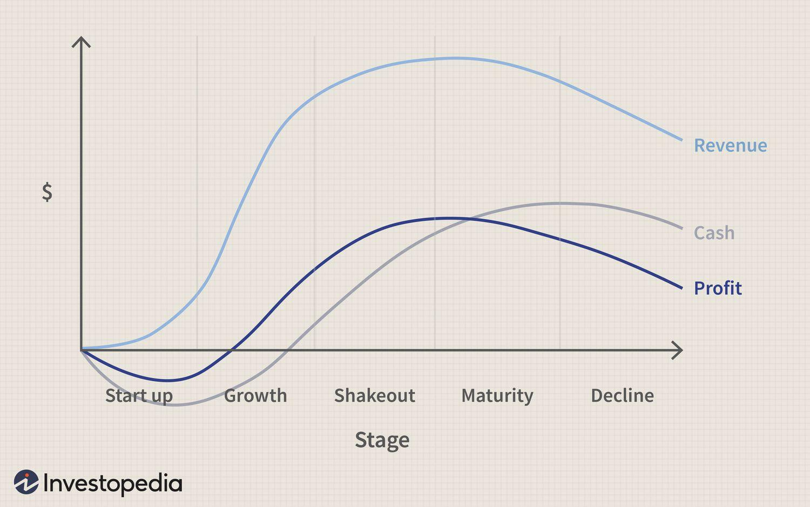

## Table of Contents

## What is the consolidation phase in finance?

The consolidation phase in finance is a period when a stock or market's price moves sideways, without a clear upward or downward trend. This happens after a big price move, either up or down. During consolidation, the price stays within a certain range, which means it doesn't go much higher or lower than it did before. This phase can last for a short time or a long time, depending on the market.

Consolidation is important because it can show that the market is taking a break. It's like the market is catching its breath before deciding where to go next. Traders and investors watch this phase closely because it can signal if the price will continue in the same direction or reverse. If the price breaks out of the consolidation range, it might mean a new trend is starting.

## Why is the consolidation phase important for investors?

The consolidation phase is important for investors because it helps them understand what might happen next with a stock or the market. When a stock's price moves sideways during consolidation, it's like the market is taking a break after a big move. This pause gives investors a chance to think about what they want to do next. They can decide if they want to keep their investments or sell them, depending on whether they think the price will go up or down after the consolidation.

Investors also watch the consolidation phase closely because it can give clues about future price movements. If the price breaks out of the consolidation range and starts moving up, it might mean the stock will keep going up. But if the price breaks down and starts moving down, it could mean the stock will keep falling. By paying attention to these signs, investors can make smarter choices about when to buy or sell, helping them make more money or avoid losing money.

## How can you identify when a market is in a consolidation phase?

You can tell a market is in a consolidation phase when the price of a stock or the whole market stops going up or down a lot and starts moving sideways. This means the price stays in a certain range and doesn't make big jumps or drops. If you look at a price chart, you'll see that the highs and lows of the price are pretty close together, and it looks like the price is just bouncing around within a small area.

This phase can last for a short time or a long time. It usually happens after the price has moved a lot in one direction, either up or down. During consolidation, the market seems to be taking a break, and it's hard to tell which way the price will go next. But if you see the price start to break out of this range, either going above the top of the range or below the bottom, it could mean the market is about to start a new trend.

## What are the common characteristics of a consolidation phase?

A consolidation phase is when the price of a stock or the whole market stops going up or down a lot and starts moving sideways. This means the price stays in a certain range and doesn't make big jumps or drops. You can see this on a price chart where the highs and lows of the price are pretty close together. It looks like the price is just bouncing around within a small area.

This phase can last for a short time or a long time. It usually happens after the price has moved a lot in one direction, either up or down. During consolidation, the market seems to be taking a break, and it's hard to tell which way the price will go next. But if you see the price start to break out of this range, either going above the top of the range or below the bottom, it could mean the market is about to start a new trend.

## How long does a typical consolidation phase last?

A consolidation phase can last for different amounts of time. It might be just a few days, or it could go on for weeks or even months. It all depends on what's happening in the market and how big the price move was before the consolidation started.

There's no set time for how long a consolidation phase will last. Sometimes, if the market is very active, the phase might be short. Other times, if things are calm and steady, it might take longer for the market to decide where to go next. Investors need to keep an eye on how long the consolidation is lasting to guess what might happen next with the price.

## What strategies should investors use during a consolidation phase?

During a consolidation phase, investors can use different strategies to make the most of the situation. One good idea is to wait and watch. Since the price isn't moving a lot, it's a good time to look at the market closely and see if anything changes. Investors can use this time to learn more about the stock or the market and get ready for when the price starts moving again. They might also want to set up alerts for when the price breaks out of the consolidation range, so they know right away if a new trend is starting.

Another strategy is to trade within the range. Since the price is moving sideways, investors can buy when the price is near the bottom of the range and sell when it's near the top. This can help them make small profits while they wait for the next big move. But they need to be careful because the price can suddenly break out of the range, and they might lose money if they're not ready for that.

Some investors might also choose to use this time to adjust their portfolios. If they think the consolidation phase might last a while, they could move some of their money into safer investments or diversify their holdings. This way, they're not putting all their eggs in one basket and can be ready for whatever happens next in the market.

## How does the consolidation phase affect different asset classes?

The consolidation phase can affect different asset classes in various ways, but the main idea is the same: the price stops moving a lot and starts to move sideways. For stocks, this might mean that after a big rise or fall, the stock price stays within a certain range for a while. Investors in stocks might use this time to watch and wait, or they might trade within the range to make small profits. For bonds, consolidation might look a bit different because bond prices are often influenced by interest rates and economic news. But if bond prices start to move sideways, it could mean the market is taking a break and waiting for new information.

In the case of commodities like gold or oil, the consolidation phase can also happen after big price moves. Traders in commodities might see this as a time to reassess their positions and prepare for the next big move. For currencies in the forex market, consolidation often happens when there's no major news driving the market. Traders might use this time to trade within the range or wait for a breakout that could signal a new trend. No matter the asset class, the consolidation phase is a time for investors and traders to be patient and ready for what might happen next.

## What are the risks associated with trading during a consolidation phase?

Trading during a consolidation phase can be risky because the price isn't moving much. If you try to buy low and sell high within the range, you might make small profits, but there's also a chance you could lose money if the price suddenly breaks out of the range. When the price breaks out, it can go up or down fast, and if you're not ready, you might end up selling at a loss or missing out on a big gain.

Another risk is that the consolidation phase might last longer than you expect. If you think it will end soon and you keep trading, you could lose money on small trades over time. Also, if you're not watching the market closely, you might miss important signs that the price is about to break out. This means you need to be patient and keep an eye on the market all the time, which can be hard and stressful.

## Can technical analysis help in predicting the end of a consolidation phase?

Yes, technical analysis can help in predicting the end of a consolidation phase. Traders use different tools like trend lines, support and resistance levels, and chart patterns to see when the price might break out of the range. For example, if the price keeps hitting the top of the range and bouncing back, but then suddenly breaks through that top, it might mean the price is going to keep going up. On the other hand, if the price keeps hitting the bottom of the range and then suddenly drops below it, it could mean the price is going to keep going down.

Technical indicators like the Relative Strength Index (RSI) or moving averages can also give clues about when the consolidation phase might end. If the RSI starts to move out of its normal range, it might signal that the price is about to break out. Moving averages can show if the price is starting to trend in one direction. By watching these signs, traders can get a better idea of when the consolidation phase might end and get ready for the next big move in the market.

## How do macroeconomic factors influence the duration and outcome of a consolidation phase?

Macroeconomic factors can have a big impact on how long a consolidation phase lasts and what happens next. Things like interest rates, inflation, and economic growth can make the market move. If there's good news about the economy, like lower interest rates or higher growth, it might push the price out of the consolidation range sooner. But if there's bad news, like high inflation or a slowing economy, the consolidation phase might last longer because people are unsure about what will happen next.

These factors can also affect whether the price goes up or down after the consolidation phase ends. For example, if the economy is doing well and interest rates are low, investors might feel more confident and start buying, which can push the price up. On the other hand, if the economy is struggling and interest rates are high, investors might start selling, which can push the price down. So, by keeping an eye on these big economic changes, investors can get a better idea of what might happen after the consolidation phase ends.

## What historical examples illustrate successful navigation of consolidation phases?

One good example of navigating a consolidation phase well is what happened with Apple's stock in 2016. After a big rise in 2015, Apple's stock price started to move sideways for about six months. Investors who watched closely saw that the price was staying between $92 and $105. Some of them decided to buy when the price was near the bottom of that range and sell when it got close to the top. They made small profits while waiting for the next big move. When Apple announced good news about their new iPhone in late 2016, the stock price broke out of the range and started going up again. Investors who were ready for this made even bigger profits.

Another example is the S&P 500 in early 2020. After a quick drop because of the start of the COVID-19 pandemic, the market went into a consolidation phase. The S&P 500 stayed in a range for a few weeks, moving between 2,200 and 2,500. Smart investors used this time to look at the bigger picture. They saw that the government was planning to help the economy with money, and they thought the market would go up again. When the S&P 500 broke out of the range and started going up, these investors were ready and made good money. Both examples show how paying attention to what's happening during a consolidation phase can help investors do well when the market starts moving again.

## How do advanced traders use options and derivatives during consolidation phases to manage risk and enhance returns?

Advanced traders often use options and derivatives during consolidation phases to manage risk and possibly make more money. They might buy options that let them buy or sell a stock at a certain price. For example, if a stock is moving sideways between $50 and $60, a trader might buy a call option with a strike price of $55. If the stock price stays in that range, the option won't be worth much, but it gives the trader the right to buy the stock at $55 if it suddenly goes up. This way, they can make money if the stock breaks out of the range and goes up, but they don't lose a lot if the stock stays the same or goes down.

They also use derivatives like futures contracts to hedge their bets. If a trader thinks the consolidation phase might end soon and the price might go down, they might sell a futures contract. This means they agree to sell the stock at a set price in the future. If the price does go down, they can still sell it at the higher price they agreed on, which helps them lose less money. By using these tools, advanced traders can protect themselves from big losses and also take advantage of small price movements within the range, making the most of the consolidation phase.

## References & Further Reading

[1]: John J. Murphy. ["Technical Analysis of the Financial Markets: A Comprehensive Guide to Trading Methods and Applications."](https://archive.org/details/technicalanalysi0000murp) New York Institute of Finance, 1999.

[2]: Marcos Lopez de Prado. ["Advances in Financial Machine Learning."](https://www.amazon.com/Advances-Financial-Machine-Learning-Marcos/dp/1119482089) Wiley, 2018.

[3]: David Aronson. ["Evidence-Based Technical Analysis: Applying the Scientific Method and Statistical Inference to Trading Signals."](https://www.amazon.com/Evidence-Based-Technical-Analysis-Scientific-Statistical/dp/0470008741) Wiley, 2006.

[4]: Stefan Jansen. ["Machine Learning for Algorithmic Trading."](https://github.com/stefan-jansen/machine-learning-for-trading) Packt Publishing, 2020.

[5]: Ernest P. Chan. ["Quantitative Trading: How to Build Your Own Algorithmic Trading Business."](https://www.amazon.com/Quantitative-Trading-Build-Algorithmic-Business/dp/0470284889) Wiley, 2008.

[6]: Bergstra, J., Bardenet, R., Bengio, Y., & Kégl, B. (2011). ["Algorithms for Hyper-Parameter Optimization."](https://dl.acm.org/doi/10.5555/2986459.2986743) Advances in Neural Information Processing Systems 24.

[7]: Coursera. ["Algorithmic Trading and Finance Models with Python, R, and Stata Essential Training."](https://www.linkedin.com/learning/algorithmic-trading-and-finance-models-with-python-r-and-stata-essential-training-2019)

[8]: TradingView. ["Consolidation Patterns and Breakouts."](https://www.tradingview.com/script/8ivF6HJP-Consolidation-and-Breakout-Inside-Bars/)