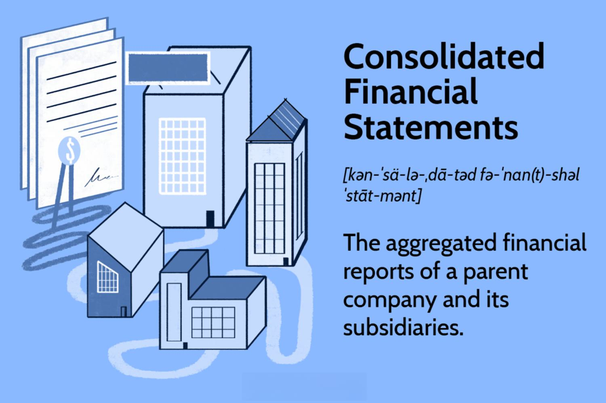

In the complex world of financial trading, the consolidation phase is a crucial concept that reflects periods of indecision in the market. This phase is marked by an asset’s price fluctuating within a narrow range, lacking any clear directional trend. During consolidation, the forces of supply and demand reach a temporary equilibrium, causing price movements to stabilize. This condition often precedes significant price volatility as markets prepare to breakout in one direction or another, making it a focal point of interest for traders.

Understanding the consolidation phase is essential for traders, particularly those employing algorithmic strategies, as it presents unique opportunities and challenges in navigating the financial markets. Algorithmic trading, which utilizes computer programs to execute trades based on pre-set criteria, can be significantly enhanced by accurately identifying consolidation phases. These algorithms can monitor real-time market data, recognizing patterns that suggest consolidation, and prepare for subsequent trading actions.



This article examines how the consolidation phase plays a significant role in algorithmic trading, providing practical examples to illustrate its impact. By effectively identifying and responding to periods of market consolidation, traders can develop strategies that improve the timing and precision of their trades, ultimately enhancing profitability and risk management.

## Table of Contents

## What is the Consolidation Phase?

The consolidation phase in financial markets is a period during which the price of an asset fluctuates within a bounded range, without displaying a clear upward or downward trend. This phenomenon typically reflects a balance between buying and selling pressures, where neither bulls nor bears dominate. During such phases, the market is essentially in a state of equilibrium, which can serve as a precursor to significant price movements once this balance is disrupted.

Identifying a consolidation phase is crucial for traders as it enables them to anticipate potential breakouts. This period can manifest visually on price charts through patterns like rectangles, triangles, or flags. These patterns indicate a halt in price movement, providing traders with an essential cue to watch for ensuing market shifts. Recognizing consolidation areas allows traders to adjust their strategies in anticipation of breakouts, thereby minimizing risks and positioning themselves for potential gains.

For traders, a precise understanding of consolidation can be supported by technical analysis tools and indicators. Tools such as moving averages or the Bollinger Bands can help in identifying the boundaries of the consolidation range, offering insights into when a market might exit this phase and begin trending. Engaging with these technical indicators equips traders to make informed decisions and strategically time their entry and exit points in response to evolving market dynamics.

## Importance of the Consolidation Phase in Finance

The consolidation phase in financial markets, while appearing dormant, is a pivotal period that often precedes substantial price movements. It signifies a time when the forces of supply and demand reach equilibrium, causing prices to oscillate within a defined range. Understanding and recognizing this phase is crucial for traders who aim to exploit subsequent price swings effectively.

Anticipating potential breakouts from a consolidation phase is a key strategy for traders seeking to capitalize on market shifts. During consolidation, prices typically move sideways, lacking a clear upward or downward trend. The eventual [breakout](/wiki/breakout-trading) from this pattern can often indicate the beginning of a new trend, offering lucrative opportunities for trading. For example, a trader monitoring a consolidation pattern can position themselves to take advantage of a breakout by employing limit orders to enter trades just outside the established range.

Strategizing entry and [exit](/wiki/exit-strategy) points within the consolidation phase is another important aspect for traders. By analyzing the price range and [volume](/wiki/volume-trading-strategy) changes during consolidation, traders can set boundaries for their trades, minimizing risk while maximizing potential returns. For instance, a trader might observe a narrowing price range accompanied by decreasing volume, signaling a potential breakout. By aligning their entry point with the breakout level and setting stop-loss orders just beyond the consolidation boundary, traders can safeguard their positions against unexpected market movements.

The consolidation phase also offers an opportunity to refine trading algorithms, particularly in the context of [algorithmic trading](/wiki/algorithmic-trading). Algorithms can be programmed to identify the start and end of consolidation phases by analyzing historical price data and integrating various technical indicators. These automated systems can adjust trading strategies dynamically, ensuring trades are executed at optimal moments.

Overall, the consolidation phase is more than just a period of price stagnation; it is a critical juncture that sets the stage for future market activity. By effectively leveraging this phase, traders can enhance their decision-making capabilities, leading to more profitable trading outcomes.

## Algorithmic Trading and the Consolidation Phase

Algorithmic trading uses sophisticated computer systems and complex algorithms to facilitate the rapid execution of trades based on pre-programmed criteria. This technological advancement in trading offers the ability to process information and perform numerous tasks with speed and precision that greatly surpasses human capabilities.

A crucial aspect of algorithmic trading is the identification and utilization of market phases, such as the consolidation phase. During periods of consolidation, an asset's price remains confined within a specific range, neither trending upward nor downward markedly, reflecting market indecision. Such phases, when accurately identified, can be instrumental in developing trading strategies that anticipate potential breakouts.

To incorporate the consolidation phase into algorithmic trading strategies, these algorithms can be programmed to monitor specific indicators such as price patterns and volume changes. For example, when prices oscillate within a narrow range, remaining relatively stable, an algorithm might flag this as a consolidation phase. Here, the algorithm can prepare for potential breakout scenarios by dynamically adjusting its trading strategy.

In practical terms, coding this functionality can involve defining range boundaries and employing statistical or [machine learning](/wiki/machine-learning) models to identify consolidation patterns. Here's a simplified example using Python to illustrate how this might be approached:

```python
import pandas as pd
import numpy as np

def detect_consolidation(prices, window=20, threshold=0.01):
    rolling_std = prices.rolling(window=window).std()
    return rolling_std < threshold

# Sample price data
prices = pd.Series([100, 100.5, 101, 100.8, 100.2, 100.1, 100.05, 100, 101, 100.9, 100.7, 100.6])

# Identify consolidation phases
consolidation = detect_consolidation(prices)
print(consolidation)
```

In this code, `detect_consolidation` is a function that identifies whether the price movements are within a certain standard deviation threshold over a specified window, indicating a possible consolidation phase.

Algorithmic systems equipped with these capabilities can offer significant advantages. Upon detecting consolidation, they can adjust positions accordingly, either preparing for breakouts by setting stop-loss and take-profit levels or engaging in low-risk trades within the established range. The key to successful algorithmic trading lies in the ability to adapt and respond to market signals seamlessly, leveraging the consolidation phase as a strategic tool amidst an ever-fluctuating financial landscape.

## Examples of Consolidation in Algorithmic Trading

In algorithmic trading, identifying consolidation patterns like triangles, flags, or wedges is crucial for anticipating price movements. These patterns often signify periods where supply and demand forces are nearly balanced, indicating potential breakouts once an asset's price decisively moves above or below the range.

Advanced algorithms are employed to detect these consolidation phases by analyzing market data in real-time. For instance, triangles, whether ascending, descending, or symmetrical, indicate a market squeeze that could lead to an abrupt breakout once either the support or resistance line is breached. Flags, characterized by brief periods of consolidation following a large price movement, often signal continuation in the direction of the preceding trend.

Changes in volume and [volatility](/wiki/volatility-trading-strategies) are key indicators used by algorithms to confirm consolidation phases. A decrease in trading volume typically accompanies a consolidation phase and peaks during breakouts. This relationship can be used to predict the end of consolidation and the start of a new trend. Algorithms programmed to monitor these metrics can automatically adjust trading strategies. For example, they may reduce exposure during consolidation phases to manage risk and increase it as volume rises and a breakout appears imminent.

A practical implementation in Python might involve using libraries such as pandas for data manipulation and NumPy for numerical calculations. Consider a scenario where moving averages are used to identify potential consolidation phases:

```python
import pandas as pd
import numpy as np

# Sample price data
data = pd.DataFrame({
    'close': [100, 102, 101, 103, 102, 105, 100, 98, 101, 102, 104, 103]
})

# Calculate short and long moving averages
short_window = 3
long_window = 5
data['short_mavg'] = data['close'].rolling(window=short_window).mean()
data['long_mavg'] = data['close'].rolling(window=long_window).mean()

# Detect consolidation phase
data['in_consolidation'] = np.where(
    (data['short_mavg'] - data['long_mavg']).abs() < 0.5, 1, 0
)

print(data)
```

This script calculates moving averages over a short and a long window. It identifies potential consolidation phases when the difference between these averages is minimal.

Algorithms also need to remain adaptive to changing market conditions, updating to refine consolidation pattern detection continuously. By exploiting these patterns, algorithmic trading systems aim to predict and benefit from price movements post-consolidation, optimizing profitability while managing inherent risks.

## Case Study: Algorithmic Trading Strategy During Consolidation

A prominent [hedge fund](/wiki/hedge-fund-trading-strategies) leveraged algorithmic trading by identifying consolidation patterns within the FTSE 100 index, a prominent barometer of UK stock market performance. The hedge fund employed sophisticated algorithms that detected these consolidation phases—periods when prices move within a bounded range without establishing a clear trend. By focusing on this volatility, the fund was able to capitalize on minor price movements, which are often indicative of forthcoming market dynamics.

The algorithm operated by monitoring the intraday price movements and volume data of the securities within the FTSE 100. It identified consolidation patterns, such as rectangles or triangles, where the price action remained confined within horizontal or converging boundaries. The precise identification of these patterns allowed the hedge fund to implement a strategy that profited from both significant breakouts and minor fluctuations within these ranges.

To maximize efficiency, the hedge fund integrated a combination of machine learning techniques and traditional technical analysis tools. Machine learning models, such as Support Vector Machines (SVMs) or Long Short-Term Memory Networks (LSTMs), were instrumental in learning intricate patterns from historical data. This learning was complemented by technical analysis indicators, such as Moving Averages (MA) and Relative Strength Index (RSI), to identify the beginning and end of consolidation phases accurately.

Below is a simplified Python code snippet illustrating how such an algorithm might detect consolidation using moving averages and a machine learning classifier:

```python
import numpy as np
import pandas as pd
from sklearn.svm import SVC
from ta.trend import SMAIndicator

# Load price data
data = pd.read_csv('ftse_100_prices.csv')
data['sma'] = SMAIndicator(data['close'], window=20).sma_indicator()

# Calculate price boundaries for consolidation
data['upper'] = data['sma'] * 1.01
data['lower'] = data['sma'] * 0.99

# Data preparation for SVM classifier
X = data[['close', 'sma']].values
y = ((data['close'] > data['lower']) & (data['close'] < data['upper']))

# Train Support Vector Machine classifier
svm = SVC(kernel='linear')
svm.fit(X, y)

# Predict consolidation phase
data['consolidation'] = svm.predict(X)

# Trading signal
data['signal'] = np.where(data['consolidation'], 'Hold', 'Trade')

print(data.tail())
```

This code executes a simple version of the strategy by utilizing moving averages to set price boundaries and a Support Vector Machine (SVM) to identify consolidation phases. The trading signal, generated from the model's output, indicates whether to hold or trade based on the phase's presence.

By adeptly incorporating both machine learning and technical analysis, the hedge fund could adjust its strategies to align with real-time market signals, effectively navigating the complex landscape of the FTSE 100 index. This dynamic adjustment ensured consistent profits from both false breakouts—where a price briefly moves beyond established boundaries without a sustained trend—and true breakouts that herald substantial price shifts. The successful implementation of this strategy underscores the vital role that identifying and responding to consolidation phases plays in modern algorithmic trading.

## Consolidation Phases and Technical Indicators

In financial markets, the consolidation phase is often identified and analyzed through the application of technical indicators. These indicators, such as moving averages, Bollinger Bands, and the Relative Strength Index (RSI), are crucial tools integrated into trading algorithms to gauge consolidation phases and predict potential breakout points effectively.

Moving averages are commonly used to smooth out price data by creating a constantly updated average price. This forms the baseline for identifying consolidation zones. The two most employed types are the simple moving average (SMA) and the exponential moving average (EMA). During consolidation, prices typically hover around these averages, providing a clear visual representation of price stability. For instance, an EMA can offer more sensitivity to recent price movements, which is useful for detecting subtle shifts during consolidation.

Bollinger Bands consist of a middle band being a moving average and two outer bands representing standard deviations from this average. When the market consolidates, Bollinger Bands tend to contract, indicating low volatility; conversely, they expand during breakouts due to increased volatility. This contraction during consolidation provides traders with a visual cue that a breakout might be forthcoming, assisting in setting strategic entry and exit points.

The RSI measures the speed and change of price movements and typically ranges from 0 to 100. An RSI below 30 can indicate an oversold condition, while an RSI above 70 suggests an overbought condition. During consolidation phases, the RSI resides in a middle range, reflecting the equilibrium between buying and selling pressures. As such, the RSI can alert traders when a consolidation phase might end and a breakout may occur.

Integrating these indicators into algorithmic trading enables dynamic risk management and more informed decision-making. Algorithms can be programmed to detect the signature patterns of these indicators that signify consolidation, such as narrowing Bollinger Bands or moving averages converging towards current price levels. This allows algorithms to signal the most opportune times to initiate or alter trading positions based on potential breakouts, thus maximizing profitability and minimizing risk. 

By leveraging these technical indicators, traders are better equipped to identify and respond to consolidation phases, ensuring trading decisions are grounded in validated market data. This ensures that any automated trading strategy remains attuned to the nuances of market conditions, adapting strategies accordingly.

## Challenges and Risks Involved with Trading During Consolidation

Predicting when a consolidation phase will transition into a breakout is a primary challenge in financial trading. During consolidation, prices often fluctuate within a tight range, creating a balance between buying and selling pressures. However, this equilibrium can be deceptive, leading traders to anticipate a breakout that may not materialize immediately. Algorithmic strategies must be finely tuned to discern genuine breakouts from mere price fluctuations within the consolidation range.

False breakouts, where the price temporarily breaches the consolidation boundary without sustaining the movement, pose a significant risk. These false signals can lead traders to enter or exit positions prematurely, potentially incurring losses. For instance, a trader relying on an algorithm to signal when to buy or sell might react to a false breakout, only for the price to revert back into the consolidation range. To mitigate this risk, algorithms often incorporate filters, such as adjusting the volatility threshold or using confirming technical indicators, to validate the strength of a breakout signal.

Algorithmic systems require constant updates to remain effective amidst ever-evolving market conditions. Financial markets are influenced by numerous factors such as economic indicators, geopolitical events, and changes in market sentiment, all of which can alter the typical characteristics of consolidation phases. Regularly updating trading algorithms ensures that they can adapt to new patterns or anomalies in market behavior. This may involve incorporating machine learning techniques to recognize and learn from the changing dynamics of consolidation phases, thus enhancing the predictive power and reliability of the algorithm. Regular [backtesting](/wiki/backtesting) on historical data can also help refine these systems to reduce the incidence of false signals and improve overall trading performance.

## Conclusion

The consolidation phase is integral to financial trading and serves a significant role in shaping algorithmic trading strategies. It is a period characterized by an equilibrium between supply and demand, where market prices move within a confined range. For traders, understanding and accurately identifying these phases is crucial, as it sets the groundwork for executing strategic trades with precision.

Recognizing consolidation phases enables traders to anticipate potential breakouts, which are often followed by significant price movements. This anticipation allows for the optimization of entry and exit points, ultimately aiming to minimize risks and enhance returns. By incorporating algorithmic trading strategies that respond dynamically to market conditions, traders can leverage the patterns that emerge during consolidation to their advantage.

Algorithmic trading, in particular, benefits greatly from the consolidation phase by employing pre-defined criteria to monitor and analyze these periods. Algorithms can be structured to detect shifts in volume, volatility, and other technical indicators, all of which are indicative of a transition from consolidation to a breakout. By staying alert to these changes, traders can adjust their strategies promptly, ensuring they are well-positioned to capitalize on market movements.

The adaptability of algorithmic systems is paramount in navigating the complexities of consolidation phases. As markets are in a constant state of evolution, traders must maintain flexibility and regularly update their algorithms to align with emerging trends and data. This proactive approach allows for a more effective response to market changes, reducing the likelihood of losses from false breakouts and enhancing the trader's ability to capture profitable opportunities.

In conclusion, the consolidation phase is a cornerstone of financial trading, offering both challenges and opportunities for traders—particularly those utilizing algorithmic strategies. By mastering the identification and response to consolidation patterns, traders can achieve more reliable and successful trading outcomes, positioning themselves favorably within the volatile landscape of financial markets.

## Additional Resources

For those seeking to expand their knowledge on the consolidation phase and its applications in algorithmic trading, various resources can provide both theoretical insights and practical experience. Exploring technical analysis resources is a good starting point. Books such as "Technical Analysis of the Financial Markets" by John J. Murphy offer comprehensive guidance on identifying patterns like consolidation phases. Additionally, seminars and courses dedicated to algorithmic trading can provide in-depth understanding and hands-on experience. Websites like Coursera and edX offer courses from leading universities and institutions, which cover essential topics, including pattern recognition and breakout strategies.

Following renowned trading platforms such as MetaTrader or TradingView can further enhance one's understanding of consolidation phases. These platforms offer tools and charts that help in visualizing consolidation patterns. They also provide live data and simulation environments to test strategies in real-time market conditions.

Interactive simulation tools are invaluable for practical learning. Platforms like QuantConnect and QuantInsti offer environments where traders can practice algorithmic strategies, including reacting to consolidation phases without financial risk. These tools often include historical data and backtesting capabilities, allowing users to refine algorithms and strategies before applying them to live trading.

By utilizing these resources, individuals can enhance their ability to identify, analyze, and respond to consolidation phases, improving their overall trading strategies and outcomes.

## References & Further Reading

[1]: John J. Murphy. ["Technical Analysis of the Financial Markets: A Comprehensive Guide to Trading Methods and Applications."](https://archive.org/details/technicalanalysi0000murp) New York Institute of Finance, 1999.

[2]: Marcos Lopez de Prado. ["Advances in Financial Machine Learning."](https://www.amazon.com/Advances-Financial-Machine-Learning-Marcos/dp/1119482089) Wiley, 2018.

[3]: David Aronson. ["Evidence-Based Technical Analysis: Applying the Scientific Method and Statistical Inference to Trading Signals."](https://www.amazon.com/Evidence-Based-Technical-Analysis-Scientific-Statistical/dp/0470008741) Wiley, 2006.

[4]: Stefan Jansen. ["Machine Learning for Algorithmic Trading."](https://github.com/stefan-jansen/machine-learning-for-trading) Packt Publishing, 2020.

[5]: Ernest P. Chan. ["Quantitative Trading: How to Build Your Own Algorithmic Trading Business."](https://www.amazon.com/Quantitative-Trading-Build-Algorithmic-Business/dp/0470284889) Wiley, 2008.

[6]: Bergstra, J., Bardenet, R., Bengio, Y., & Kégl, B. (2011). ["Algorithms for Hyper-Parameter Optimization."](https://dl.acm.org/doi/10.5555/2986459.2986743) Advances in Neural Information Processing Systems 24.

[7]: Coursera. ["Algorithmic Trading and Finance Models with Python, R, and Stata Essential Training."](https://www.linkedin.com/learning/algorithmic-trading-and-finance-models-with-python-r-and-stata-essential-training-2019)

[8]: TradingView. ["Consolidation Patterns and Breakouts."](https://www.tradingview.com/script/8ivF6HJP-Consolidation-and-Breakout-Inside-Bars/)