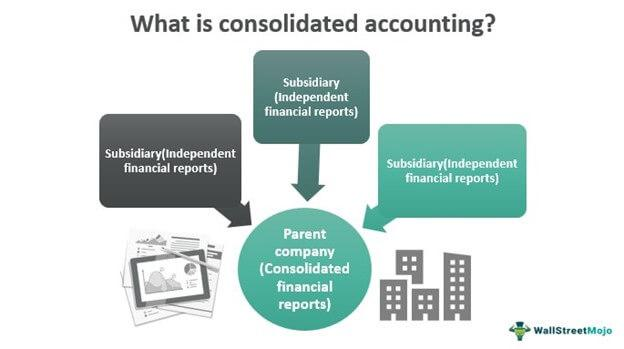

The world of finance is witnessing a paradigm shift with the increasing integration of algorithmic trading and the necessity for meticulous financial consolidation. Algorithmic trading involves using intricate algorithms to automate trading decisions, which allows for higher precision and speed compared to traditional methods. This method is particularly crucial in modern markets characterized by high volatility and vast amounts of data. Concurrently, financial consolidation, which entails amalgamating multiple financial statements to provide a clear overview of a company's total financial health, plays a critical role in ensuring transparency and informing stakeholders.

Understanding the connection between financial consolidation and algorithmic trading is vital as both disciplines rely heavily on data accuracy and quality. Consolidation affects how financial data is presented, which directly impacts the input accuracy for algorithms making crucial trading decisions. Furthermore, analyzing these connections can shed light on trading strategies, especially during periods when the market is indecisive, commonly referred to as consolidation phases in technical analysis. These periods are marked by the asset prices moving within a narrow range, with traders seeking patterns that indicate potential breakouts.



By examining both technical and accounting perspectives, this article aims to highlight how effective financial consolidation can influence and enhance algorithmic trading strategies. Mastery of this relationship is essential for traders and companies aiming to optimize their strategies and operations. As financial markets become increasingly complex, integrating consolidated financial reporting with algorithmic trading becomes indispensable for achieving favorable market outcomes and maintaining a competitive edge.

## Table of Contents

## Understanding Financial Consolidation

Financial consolidation is a fundamental process within corporate finance that involves the aggregation of multiple financial statements to present the comprehensive financial standing of an entire corporate group. This process is essential as it provides a coherent summary of a company’s financial health, encompassing all its assets, liabilities, income, and expenses. By consolidating financial statements, businesses facilitate a holistic view of their financial situation, which is pivotal for both internal management and external analysis by stakeholders.

The primary objective of financial consolidation is to reflect a unified financial reality. When a corporate group consists of a parent company and several subsidiaries, each entity typically maintains its own financial records. Consolidation requires combining these records into a single set of financial statements, which unveils the true economic position of the corporate group. This unified view is critical for corporate governance, as it allows management to make informed strategic decisions based on an accurate depiction of financial performance and operations.

Furthermore, consolidated financial statements play a crucial role in ensuring transparency and accountability. Stakeholders such as investors, creditors, and regulators rely on these statements to gauge the financial health and operational efficiency of the company. The transparency offered by consolidated accounts helps in building trust and confidence among investors, enabling them to make well-informed investment decisions. For instance, consolidated statements reveal inter-company transactions and the financial interdependencies within the corporate group, shedding light on the group's operational complexities and financial strategies.

In practice, the consolidation process involves several critical steps, including adjusting for inter-company transactions, aligning accounting policies among subsidiaries, and translating foreign currency financial statements where applicable. This ensures consistency and comparability across the corporate group’s financial data. Accounting standards such as the International Financial Reporting Standards (IFRS) and Generally Accepted Accounting Principles (GAAP) provide guidelines for financial consolidation, ensuring that reports are prepared consistently across different jurisdictions.

To capture the financial intricacies involved in the consolidation process programmatically, one might employ tools like Python for data handling and computation. Here is a simple example demonstrating how Python could be used to consolidate financial data from different subsidiaries into a single financial statement for the entire corporate group:

```python
import pandas as pd

# Sample financial data for subsidiaries
subsidiary_1 = {'Assets': 5000, 'Liabilities': 3000, 'Income': 1000, 'Expenses': 700}
subsidiary_2 = {'Assets': 7000, 'Liabilities': 4000, 'Income': 1500, 'Expenses': 900}

# Convert to DataFrames
df_sub_1 = pd.DataFrame([subsidiary_1])
df_sub_2 = pd.DataFrame([subsidiary_2])

# Consolidate financial statements
consolidated = df_sub_1.add(df_sub_2, fill_value=0)

print(consolidated)
```

This code snippet presents a simplified version of how financial data from multiple subsidiaries can be aggregated to reflect a consolidated financial position. Through processes like these, financial consolidation underscores its importance as a tool for achieving comprehensive financial reporting and ensuring informed business decisions.

## Consolidation in Technical Analysis

Consolidation is a critical concept in technical analysis, referring to a phase where the price of an asset fluctuates within a defined range. This behavior often signifies market indecisiveness, as neither buyers nor sellers possess strong enough [momentum](/wiki/momentum) to drive the price beyond established thresholds. Identifying consolidation patterns is crucial for traders as they can signal potential breakouts, allowing for strategic trading decisions.

To detect consolidation, traders utilize support and resistance levels—key price points on a chart where an asset historically stops and reverses. The support level acts as a lower boundary, where buying interest typically increases and prevents the price from declining further. Conversely, the resistance level functions as an upper boundary, where selling pressure rises, inhibiting upward price movement.

A common approach for analyzing consolidation is to observe the price bars and candlesticks that form horizontal patterns, typically between parallel support and resistance lines. When consolidation is identified, traders anticipate an impending [breakout](/wiki/breakout-trading)—when the price moves decisively above resistance or below support. Breakouts often signal the start of a new trend direction, and traders aim to enter or [exit](/wiki/exit-strategy) positions at these points to maximize potential gains.

During consolidation periods, market [volatility](/wiki/volatility-trading-strategies) is typically reduced, posing a challenge for traders seeking significant price movements. Understanding these phases mitigates the risk of premature trades based on false breakouts, which occur when the price temporarily penetrates support or resistance levels but retreats back into the consolidation range.

An effective way to automate the detection of consolidation patterns is through programming, using languages like Python. For instance, a simple script can be written to identify trading ranges based on historical price data:

```python
import pandas as pd

# Sample data: a DataFrame 'df' with 'Close' prices
# Example: df = pd.read_csv('price_data.csv')

def find_consolidation(df, window=20):
    df['Rolling_Max'] = df['Close'].rolling(window=window).max()
    df['Rolling_Min'] = df['Close'].rolling(window=window).min()
    df['Difference'] = df['Rolling_Max'] - df['Rolling_Min']

    # Identify consolidation when the difference is within a small range
    threshold = 0.02  # Example threshold
    consolidation_mask = (df['Difference'] / df['Close']) < threshold

    return df[consolidation_mask]

# Usage
# consolidation_periods = find_consolidation(df)
```

By recognizing and understanding consolidation patterns, traders are better equipped to strategize during periods of low volatility, waiting for breakout opportunities to initiate trades with increased confidence and reduced risk.

## Algorithmic Trading and Consolidation

Algorithmic trading leverages sophisticated algorithms to automatically execute trades according to predetermined criteria. This technological advancement necessitates access to precise and timely financial data to ensure the accuracy of trading decisions. The integration of [algorithmic trading](/wiki/algorithmic-trading) with market data streamlines trading processes, reduces transaction costs, and enhances execution speed.

Consolidation periods pose particular challenges for algorithmic trading strategies, especially if the algorithms are not calibrated to manage stagnant price movements efficiently. During consolidation, markets exhibit limited price fluctuations, commonly trading in a narrow range. This scenario can confound momentum-based algo trading strategies, which thrive on substantial price movements to trigger buy or sell orders. Algorithms designed without the capability to identify these consolidation patterns might produce suboptimal results, triggering false signals or executing trades with minimal profit prospects.

To optimize performance, it is crucial for algorithmic traders to incorporate pattern recognition capabilities in their strategies. Such adaptability can be achieved by embedding technical indicators that signal consolidation phases, enabling the algorithm to adjust its trading approach accordingly. For instance, the Average True Range (ATR) or Bollinger Bands can be used to detect periods of low volatility, indicating potential consolidation. Here's a simple example in Python for calculating the ATR to identify consolidation:

```python
import pandas as pd

def calculate_atr(data, period=14):
    # Calculate True Range (TR)
    data['previous_close'] = data['close'].shift(1)
    data['high_low'] = data['high'] - data['low']
    data['high_pc'] = abs(data['high'] - data['previous_close'])
    data['low_pc'] = abs(data['low'] - data['previous_close'])
    data['tr'] = data[['high_low', 'high_pc', 'low_pc']].max(axis=1)

    # Calculate ATR
    atr = data['tr'].rolling(window=period).mean()
    return atr

# Example usage with a pandas DataFrame 'df' with columns 'high', 'low', and 'close'
df['ATR'] = calculate_atr(df)
```

Recognizing these patterns allows algorithms to pause trading during indecisive markets or switch to strategies that capitalize on range-bound trading, such as mean reversion strategies. The aptitude to modify algorithmic strategies in real-time based on market conditions ensures enhanced trading efficiency and profitability.

The adaptability of algorithmic strategies to consolidation signals can be a crucial determinant of trading success. As algorithmic trading continues to evolve, the ability to seamlessly integrate technical analysis signals with robust trading algorithms stands as a significant advantage in navigating modern financial markets.

## Accounting Standards and Their Impact on Algo Trading

Adherence to rigorous accounting standards such as the International Financial Reporting Standards (IFRS) and Generally Accepted Accounting Principles (GAAP) plays a crucial role in ensuring the accuracy and reliability of financial data used in algorithmic trading. These standards provide a framework that dictates how financial statements should be prepared and presented, ensuring consistency, transparency, and comparability across different organizations.

For algorithmic trading systems, which rely heavily on real-time data analysis and automated decision-making processes, the integrity of financial data is paramount. Accurate and reliable financial statements allow algorithms to make informed trading decisions based on current market conditions. Implementing IFRS or GAAP ensures that all relevant financial information is disclosed in a timely and transparent manner, which is essential for maintaining market efficiency and investor trust. 

The use of precise and transparent financial data is critical when algorithms assess market trends, evaluate risks, or recognize trading opportunities. Consider an algorithm designed to trade equity based on earnings announcements. If the financial data submitted is unaudited or inaccurate, the algorithm may make suboptimal trading decisions leading to significant financial losses. For example, if earnings are overstated due to non-compliance with accounting standards, an algorithm might anticipate positive market sentiment and enter into a buying position, only to face a subsequent market correction when the true earnings are revealed.

Conversely, non-compliance with these standards can lead to unreliable data, which may skew trading outcomes adversely. Inconsistent or misleading financial information can trigger inappropriate responses from trading algorithms, as they perform calculations and generate signals based on the assumption that the input data is precise. To mitigate these risks, firms must prioritize compliance with accounting standards, as well as invest in robust data verification processes to ensure the consistency and accuracy of financial information fed to their trading systems.

Moreover, advancements in technology can further augment the role of accounting standards in algorithmic trading. Machine learning and [artificial intelligence](/wiki/ai-artificial-intelligence) can be harnessed to continually audit and validate the input data against established standards, flagging anomalies or inconsistencies for further human review. This blend of technological innovation and strict adherence to accounting standards represents an opportunity to enhance the reliability of algorithmic trading systems, aligning financial strategies with the true economic reality depicted by rigorously prepared financial statements.

## Challenges and Opportunities in Consolidation and Algo Trading

Ensuring the accuracy of consolidated financial statements within complex corporate structures poses a significant challenge. These structures often involve multiple subsidiaries, cross-border operations, and intricate financial arrangements that can lead to discrepancies in reporting. Each entity may have its own accounting system, and varying local accounting standards can introduce inconsistencies when these statements are consolidated. This complexity underscores the necessity for robust systems and methodologies to ensure that financial data is accurate and reliable, a critical component for both corporate governance and external analysis.

Advancements in technology, particularly in [machine learning](/wiki/machine-learning), present significant opportunities for enhancing the accuracy of financial data. Machine learning algorithms can automate the reconciliation of accounts by identifying discrepancies in disparate accounting entries across subsidiaries. For example, anomaly detection algorithms can be deployed to flag unusual transactions that may require further investigation, thereby reducing the risk of errors.

```python
import pandas as pd
from sklearn.ensemble import IsolationForest

# Example: Detecting anomalies in financial transactions
data = pd.read_csv('financial_data.csv')  # hypothetical dataset
model = IsolationForest(contamination=0.01)
data['is_anomaly'] = model.fit_predict(data[['transaction_amount']])

anomalies = data[data['is_anomaly'] == -1]
```

By training models on historical data, patterns indicative of errors or fraud can be more effectively spotted, enhancing the integrity of financial statements. Such automation allows accountants to focus on analysis rather than data validation, improving both the efficiency and quality of financial reporting.

Algorithmic trading can benefit significantly from precise financial data. Strategies that leverage consolidated financial statements have access to a comprehensive view of a corporate group’s financial health. This information is critical in developing models that predict market movements based on corporate performance indicators.

Opportunities exist to deploy sophisticated algorithms capable of processing large datasets in real time, making use of financial disclosures to adjust trading strategies dynamically. For instance, integrating periodic consolidated financial data releases into trading algorithms can provide traders with a competitive edge, allowing them to hedge risks or capitalize on market inefficiencies promptly.

In sum, while the complexity of financial consolidation presents significant challenges, it simultaneously offers opportunities when paired with advanced technologies. Employing machine learning and leveraging accurate financial information are essential for optimizing trading strategies and facilitating more informed investment decisions.

## Conclusion

As financial markets grow more sophisticated, integrating consolidated financial reporting with algorithmic trading becomes increasingly vital. Effective management and understanding of financial consolidation can significantly enhance trading strategies and yield improved market outcomes. By providing a comprehensive overview of a company's financial position, consolidated reports allow for informed decision-making, which is crucial when developing algorithmic trading strategies. 

The precision of financial data plays a pivotal role in successful algorithmic trading. Accurate and transparent financial information ensures that trading algorithms can make reliable decisions based on current market dynamics. This precision is imperative to maintain effective trading operations, particularly during periods characterized by consolidation in technical analysis. During these times of market indecisiveness, algorithms must be adept at recognizing these signals to avoid pitfalls and optimize trading opportunities effectively.

Moreover, adapting to technical analysis signals is critical for future success in the financial landscape. Traders and algorithms must be attuned to patterns such as support and resistance levels that characterize consolidation periods. This understanding enables them to anticipate potential breakouts and tailor their strategies accordingly. As machine learning and other technological advancements continue to evolve, there is immense potential to further refine the accuracy of consolidated information, thereby enhancing both financial reporting and algorithmic trading efficacy.

In conclusion, the interplay between financial consolidation and algorithmic trading offers a dynamic frontier for financial innovation. Managing consolidation effectively and leveraging precise financial data are indispensable for developing adept trading strategies. These elements, coupled with an acute awareness of market signals, are fundamental to succeeding in increasingly complex financial markets. Ensuring this integration will contribute to more robust and responsive financial operations, aligning with the ever-evolving demands of today's and tomorrow's financial landscapes.

## References & Further Reading

[1]: Bergstra, J., Bardenet, R., Bengio, Y., & Kégl, B. (2011). ["Algorithms for Hyper-Parameter Optimization."](https://dl.acm.org/doi/10.5555/2986459.2986743) Advances in Neural Information Processing Systems 24.

[2]: Marcos Lopez de Prado. ["Advances in Financial Machine Learning."](https://www.amazon.com/Advances-Financial-Machine-Learning-Marcos/dp/1119482089) Wiley, 2018.

[3]: David Aronson. ["Evidence-Based Technical Analysis: Applying the Scientific Method and Statistical Inference to Trading Signals."](https://www.amazon.com/Evidence-Based-Technical-Analysis-Scientific-Statistical/dp/0470008741) John Wiley & Sons, 2006.

[4]: Stefan Jansen. ["Machine Learning for Algorithmic Trading."](https://github.com/stefan-jansen/machine-learning-for-trading) 2nd Edition, Packt Publishing, 2020.

[5]: Ernest P. Chan. ["Quantitative Trading: How to Build Your Own Algorithmic Trading Business."](https://www.amazon.com/Quantitative-Trading-Build-Algorithmic-Business/dp/0470284889) John Wiley & Sons, 2008.