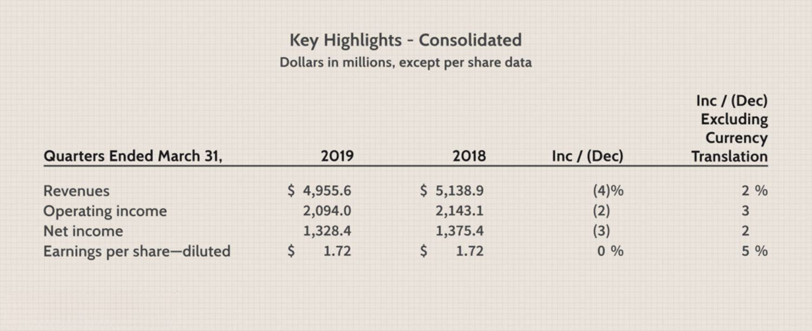

In the complex world of finance, understanding currency dynamics is crucial for businesses and investors alike. The fluctuations in currency values can significantly impact the financial performance of companies operating across different regions. This underscores the need for robust mechanisms to analyze and manage these variations to provide clear insights into operational performance and facilitate informed decision-making.

This article explores constant currency financial analysis, currency conversion, and algorithmic trading. Constant currency financial analysis serves as a tool to neutralize the effects of currency fluctuations, allowing investors and businesses to assess performance without the noise of exchange rate volatility. Such analysis is particularly beneficial for multinational companies as it provides a consistent basis for evaluating financial results across different periods.



Currency conversion is another critical area, essential for facilitating international trade and finance. This involves converting one currency into another to accommodate global transactions. Various methods for currency conversion will be examined, including manual calculations and the utilization of advanced digital tools. The role of technology and fintech in enhancing the accuracy and efficiency of these processes forms an integral part of modern financial practices.

Algorithmic trading emerges as a sophisticated approach in the currency exchange markets, using automated strategies to execute trades at optimal prices. By leveraging algorithms, traders can analyze extensive datasets and exploit trading opportunities more effectively. As artificial intelligence and machine learning technologies continue to evolve, their integration into algorithmic trading could further transform currency markets by enhancing predictive capabilities and decision-making processes.

By understanding these concepts, individuals and businesses can make more informed financial decisions. Keeping abreast of the latest best practices in financial analysis and trading strategies is essential due to the ever-evolving nature of global markets. Through mastering these processes, participants in the financial ecosystem can optimize their operations, minimize costs, and maximize value in currency exchange, contributing to more efficient and transparent international financial transactions.

## Table of Contents

## Understanding Constant Currency Financial Analysis

Constant currency financial analysis is a vital approach employed by multinational companies to mitigate the volatility introduced by fluctuating foreign exchange rates. This technique involves recalibrating financial statements from different periods by applying a consistent exchange rate, thereby enabling a more authentic comparison that focuses on the organization's operational results rather than external currency movements.

To achieve constant currency reporting, businesses initially determine a baseline exchange rate, often derived from a specific date or an average rate over a designated period. Subsequently, this constant rate is applied across all periods in question to translate foreign currency transactions and balances, thereby eliminating the distortion caused by changes in currency rates.

For example, consider a company with significant operations in the Eurozone reporting in U.S. dollars (USD). If the baseline exchange rate is set at 1 EUR = 1.1 USD, this rate will consistently be used to convert Euro-denominated results into USD across all reporting periods. Therefore, any variance in financial performance over time can be more accurately attributed to changes in the company's business operations rather than the fluctuating exchange rate between the Euro and the U.S. dollar.

The formula for calculating constant currency figures can be expressed as:
$$
\text{Constant Currency Amount} = \text{Local Currency Amount} \times \text{Constant Exchange Rate}
$$

Constant currency reporting is particularly crucial for stakeholders seeking clarity in assessing a company’s performance. By segregating operational performance from currency effects, analysts, investors, and management can discern genuine growth patterns and performance trends. This method augments the transparency and comparability of financial statements, particularly in a volatile foreign exchange environment, and is a standard practice in financial disclosures from globally active corporations.

An example is how corporations, such as Procter & Gamble or Nestlé, rely on constant currency metrics in their earnings releases to communicate their operational performance without the noise of currency market [volatility](/wiki/volatility-trading-strategies). These reports allow investors to evaluate an entity's performance dynamics, unaffected by external currency fluctuations, facilitating informed investment decisions. As global markets become increasingly interconnected, mastering the nuances of constant currency financial analysis becomes indispensable for accurate financial planning and evaluation.

## Currency Conversion: Methods and Tools

Currency conversion serves as a cornerstone for both international trade and finance, facilitating transactions across different currencies. Understanding the methods and tools available for currency conversion is crucial for entities involved in global operations. 

### Manual Calculations and Exchange Rates

The foundation of currency conversion lies in the use of exchange rates, which denote the value of one currency relative to another. Traditional methods involve manual calculations based on these rates. To convert an amount from one currency to another, the basic formula is:

$$
\text{Converted Amount} = \text{Original Amount} \times \text{Exchange Rate}
$$

For instance, if USD 1 is equivalent to EUR 0.85, converting USD 100 to euros would require multiplying 100 by 0.85, yielding EUR 85.

### Digital Tools and Software Solutions

In recent years, the reliance on digital tools for currency conversion has surpassed manual methods due to their accuracy, speed, and efficiency. Numerous platforms and applications provide real-time exchange rate data, allowing for instant conversions. These tools often feature advanced functionalities including historical rate analysis, alerts for specific rate changes, and integrated payment solutions.

### Optimizing Currency Conversion Processes

Businesses and individuals aim to optimize currency conversion processes by minimizing associated costs such as transaction fees and unfavorable exchange rates. One key strategy is to conduct conversions at optimal times, leveraging favorable market conditions. Additionally, engaging with financial service providers that offer competitive rates and low transaction fees can significantly reduce conversion expenses.

### Role of Technology and Fintech

Technology and fintech innovations play an essential role in enhancing currency conversion accuracy and efficiency. Algorithms used in fintech applications can analyze large datasets to predict currency movements and suggest the best times for conversion. Additionally, blockchain technology is being explored for its potential to provide secure and transparent currency conversion processes.

Consider a Python script example to fetch real-time rates:

```python
import requests

def get_exchange_rate(base_currency, target_currency):
    url = f'https://api.exchangerate-api.com/v4/latest/{base_currency}'
    response = requests.get(url)
    data = response.json()
    return data['rates'][target_currency]

# Example usage
rate = get_exchange_rate('USD', 'EUR')
converted_amount = 100 * rate
print(f"Converted Amount: {converted_amount:.2f} EUR")
```

This script fetches the latest exchange rate between two specified currencies and calculates the converted amount for a given base currency amount.

In conclusion, the integration of technology and modern tools into the currency conversion process not only enhances precision but also reduces the barriers and costs associated with international transactions. This shift toward digital solutions in currency exchange reflects the growing importance of accurate and efficient conversion mechanisms in today's interconnected global economy.

## Algorithmic Trading in Currency Exchange

Algorithmic trading is a pivotal component of modern financial markets, known for its ability to handle and process substantial volumes of data at high speeds to execute trades efficiently. This method employs sophisticated algorithms to automate the decision-making process in currency exchange markets, executing trades at optimal prices while minimizing human intervention.

### How Algorithmic Trading Works

Algorithmic trading leverages a combination of mathematical models and computer codes to identify trading opportunities. These algorithms are designed to follow a set of predefined instructions, which may include various parameters such as price, timing, [volume](/wiki/volume-trading-strategy), and more complex factors derived from historical data analysis and statistical computations. By automating the trading process, algorithms can operate across different exchanges globally, 24/7, without fatigue or human error.

While the underlying logic of most algorithms remains proprietary, they generally follow these steps:
1. **Data Collection**: Gathering historical and real-time market data.
2. **Analysis**: Applying statistical techniques to identify patterns or signals.
3. **Decision-Making**: Using these signals to decide when to buy or sell.
4. **Execution**: Placing trades electronically.

A simple Python example for a Moving Average Crossover strategy might look like this:

```python
import numpy as np

def moving_average(data, window_size):
    return np.convolve(data, np.ones(window_size), 'valid') / window_size

def moving_average_crossover(prices, short_window=5, long_window=20):
    short_ma = moving_average(prices, short_window)
    long_ma = moving_average(prices, long_window)
    signals = np.where(short_ma > long_ma, 1, 0)  # 1 represents a buy signal
    return signals
```

### Benefits of Algorithmic Trading

- **Efficiency**: Automating trading decisions allows for executing tasks much faster than a human could, capturing even fleeting trading opportunities.
- **Accuracy**: Reduces errors caused by manual intervention and enhances the precision of trade execution.
- **Cost-Effectiveness**: Lowers transaction costs by optimizing timing and volume of trades.
- **Adaptability**: Algorithms can be adjusted to adapt to different market conditions with relatively minor modifications.

### Potential Risks

Despite its advantages, [algorithmic trading](/wiki/algorithmic-trading) carries inherent risks:
- **Market Volatility**: High-speed trading can exacerbate market swings, contributing to events like flash crashes.
- **Technical Failures**: Systemic glitches or bugs in the algorithm can lead to unintended trading strategies with significant financial consequences.
- **Regulatory Scrutiny**: The rapid nature of algorithmic trading has led to increased governmental oversight, which might add complexity to its implementation.

### AI and Machine Learning Integration

The integration of AI and [machine learning](/wiki/machine-learning) is emerging as a transformative [factor](/wiki/factor-investing) in algorithmic trading. These technologies enhance traditional algorithms by empowering them to learn from new data patterns, improve decision-making frameworks, and optimize trading strategies continuously. Machine learning can utilize vast amounts of data to develop predictive models that anticipate market trends more accurately, adapting strategies in real time.

AI-powered algorithms enhance scalability and robustness, offering a competitive edge in increasingly complex and fragmented global markets. As machine learning technologies advance, their adoption in algorithmic trading systems is expected to grow, potentially reshaping currency markets by providing deeper insights and more sophisticated solutions.

In summary, algorithmic trading in currency markets stands as a beacon of innovation, where efficiency and technology converge. The integration of AI and machine learning looks set to further empower these systems, offering exciting prospects for enhanced trading strategies and market interactions.

## Real-World Examples and Applications

Real-world examples significantly demonstrate the practical uses of constant currency financial analysis and algorithmic trading. Companies with international operations, like McDonald's and Tesla, frequently employ constant currency reporting to articulate their financial performance more accurately and transparently, uninfluenced by volatile exchange rate movements.

**McDonald's and Constant Currency Reporting**

McDonald's Corporation, a global fast-food giant, operates extensively internationally, exposing it to currency fluctuations that can obscure its true operational performance. To mitigate this, McDonald's issues financial reports in constant currency terms. By doing so, the company provides stakeholders with a clearer picture of underlying business trends without the distortion caused by exchange rate movements. In its quarterly earnings announcements, McDonald's illustrates the impact of these fluctuations by presenting comparable growth figures under constant currency conditions. This practice aids investors in assessing the company's genuine performance by focusing on organic growth rather than currency-driven changes.

**Tesla and Financial Clarity Through Constant Currency**

Similarly, Tesla, known for its electric vehicles and alternative energy solutions, uses constant currency reporting to maintain financial clarity for its investors. Given Tesla's international sales footprint, exchange rates can significantly impact its revenue and profitability. In its financial statements, Tesla separates the effects of currency fluctuations from organic sales growth, offering a purer assessment of market dynamics and operational efficiency. This approach assists both the company and its investors in better planning and decision-making by understanding the actual factors driving financial outcomes.

**Algorithmic Trading in Currency Exchange: Practical Applications**

Algorithmic trading also plays a crucial role in the currency exchange markets, enhancing precision and speed in trading transactions. A notable case study in this context comes from investment banks and hedge funds, which deploy algorithmic trading strategies to capitalize on currency market inefficiencies. Algorithms in these institutions utilize large sets of historical and real-time market data to identify patterns and execute trades at speeds unachievable by manual trading. 

For example, algorithmic trading can be used to perform [arbitrage](/wiki/arbitrage), where an algorithm might detect and exploit price discrepancies of a currency across different markets until the price equilibrium is reached. A simple Python representation of an algorithm seeking arbitrage opportunities might look like this:

```python
def find_arbitrage_opportunities(prices):
    for pair in prices:
        for market1 in prices[pair]:
            for market2 in prices[pair]:
                if market1 != market2:
                    price_diff = prices[pair][market1] - prices[pair][market2]
                    if price_diff > transaction_cost:
                        execute_trade(pair, market1, market2, price_diff)

def execute_trade(pair, market1, market2, price_diff):
    # Execute the buy in market2 and sell in market1, pocketing the price_diff
    print(f"Arbitrage opportunity found for {pair} between {market1} and {market2}: {price_diff}")

# Sample market data
market_prices = {
    'EUR/USD': {'Market A': 1.1100, 'Market B': 1.1120},
    'USD/JPY': {'Market A': 110.45, 'Market B': 110.30},
}

transaction_cost = 0.0005
find_arbitrage_opportunities(market_prices)
```

In practical terms, such strategies have been pivotal for achieving greater efficiency and profitability in foreign exchange markets. The integration of AI and machine learning further enhances these capabilities by improving predictive analytics, thus anticipating market movements more effectively.

Overall, the implementation of constant currency analysis and algorithmic trading stands as a testament to the importance of leveraging sophisticated financial tools and strategies to navigate and succeed in the global market landscape.

## Conclusion

Mastering constant currency financial analysis and leveraging algorithmic trading are pivotal to enhancing financial decision-making. These practices enable more accurate assessment of business performance by eliminating the distortions caused by currency fluctuations. This accuracy is crucial for multinational entities where even minor exchange rate changes can significantly impact reported earnings.

Algorithmic trading further streamlines the currency exchange process by utilizing automated strategies that can swiftly process and react to market conditions. These algorithms not only ensure optimal trade execution but also reduce human errors and emotional biases in trading decisions, thereby minimizing costs and maximizing value.

For businesses and investors, staying informed about advancements in these areas is essential. As global markets become increasingly interconnected, the dynamics of currency exchange are subject to rapid and complex changes. By adopting the latest practices in constant currency analysis and algorithmic trading, stakeholders can better mitigate risks associated with currency volatility and protect their financial interests.

The ongoing evolution of financial technology, including enhancements in [artificial intelligence](/wiki/ai-artificial-intelligence) and machine learning, promises to further elevate the efficiency and transparency of international financial operations. These technologies are poised to offer more sophisticated tools for analyzing market trends, predicting currency movements, and executing trades with unparalleled precision. As such, continued engagement with these technological advancements will be beneficial for optimizing financial strategies in an ever-changing global financial landscape.

## References & Further Reading

[1]: Bergstra, J., Bardenet, R., Bengio, Y., & Kégl, B. (2011). ["Algorithms for Hyper-Parameter Optimization."](https://dl.acm.org/doi/10.5555/2986459.2986743) Advances in Neural Information Processing Systems 24.

[2]: ["Advances in Financial Machine Learning"](https://www.amazon.com/Advances-Financial-Machine-Learning-Marcos/dp/1119482089) by Marcos Lopez de Prado

[3]: ["Evidence-Based Technical Analysis: Applying the Scientific Method and Statistical Inference to Trading Signals"](https://www.amazon.com/Evidence-Based-Technical-Analysis-Scientific-Statistical/dp/0470008741) by David Aronson

[4]: ["Machine Learning for Algorithmic Trading"](https://github.com/stefan-jansen/machine-learning-for-trading) by Stefan Jansen

[5]: ["Quantitative Trading: How to Build Your Own Algorithmic Trading Business"](https://www.amazon.com/Quantitative-Trading-Build-Algorithmic-Business/dp/1119800064) by Ernest P. Chan