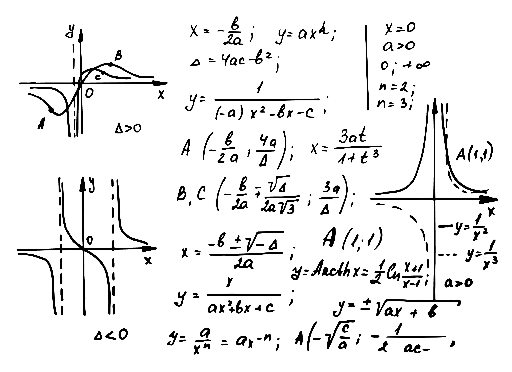

In today's dynamic economic landscape, understanding the real value of economic indicators requires adjusting for inflation. Inflation distorts the nominal value of money, complicating the comparison of financial performance across different time periods. Inflation-adjusted values, also known as constant dollar measures, provide a more accurate reflection of financial data by accounting for changes in purchasing power. This methodological adjustment allows economists, policymakers, and investors to gain a clearer and more meaningful picture of economic performance over time.

Constant dollar measures are critical in assessing the true state of an economy. By neutralizing the impact of inflation, these metrics reveal the actual growth rates and trends in various economic sectors. For instance, without adjusting for inflation, a rise in gross domestic product (GDP) might falsely suggest increased productivity, when, in reality, it could merely reflect rising prices. Constant dollar calculations ensure that such analyses reflect genuine economic growth.



In the context of algorithmic trading, the significance of constant dollar economic measures becomes even more pronounced. Algorithmic trading strategies rely on precise data inputs to make automated trading decisions. The use of inflation-adjusted values ensures these algorithms accurately assess market conditions, rather than making decisions based on nominal values distorted by inflation. By incorporating constant dollar measures, traders can develop more effective strategies, minimize risk, and optimize trading outcomes.

Central to the process of inflation adjustment is the Consumer Price Index (CPI), which is a commonly used measure of inflation. The CPI tracks changes in the price level of a basket of consumer goods and services, providing a basis for adjusting nominal values to constant values. By applying the CPI, nominal dollar values can be converted into constant dollars, allowing for accurate historical financial comparisons and forecasting.

This article explores the significance of constant dollar economic measures within the algorithmic trading framework. It will discuss key concepts like inflation adjustment and how constant dollar measures, anchored by the CPI, impact economic analysis. The role of these measures in refining algorithmic trading strategies will also be highlighted, demonstrating their importance in making informed trading decisions.

## Table of Contents

## Understanding Inflation and Constant Dollar Measures

Inflation represents the rate at which the general level of prices for goods and services rises, subsequently eroding the purchasing power of money. As a result, nominal financial figures, which are unadjusted for inflation, can provide misleading representations of economic performance over time. To counteract this, economists and analysts adjust nominal values to constant dollars, which reflect purchasing power relative to a base year, offering a precise measure of real growth.

The constant dollar measure serves as a critical economic metric by adjusting figures for inflation, thereby facilitating accurate comparisons across different time periods. This adjustment is crucial for distinguishing between nominal growth—growth inflated by rising prices—and real growth, which genuinely reflects an increase in value or output.

A primary tool used in calculating inflation-adjusted values is the Consumer Price Index (CPI). The CPI tracks changes in the price level of a basket of consumer goods and services over time. By using this index, economists can convert nominal dollar values to constant dollar values, achieving an accurate representation of financial history.

The conversion process entails using the following formula to adjust nominal values:

$$
\text{Constant Dollar Value} = \frac{\text{Nominal Dollar Value}}{\text{CPI Index Value}} \times 100
$$

Here, the CPI index value is expressed relative to a base period, typically set at 100. This formula ensures that the resulting value reflects the purchasing power of the base year rather than the nominal, potentially misleading, dollar value of the current period.

In practice, incorporating inflation-adjusted values involves regularly updating economic data sets with CPI values. Python, a versatile programming language, can be employed for this task using libraries such as `pandas`. Below is a basic example of how nominal data might be adjusted to constant dollar terms using a hypothetical CPI dataset:

```python
import pandas as pd

# Sample data: nominal GDP and CPI values
data = {'Year': [2020, 2021, 2022],
        'Nominal_GDP': [2100, 2300, 2500],
        'CPI': [100, 105, 110]}

# Creating a DataFrame
df = pd.DataFrame(data)

# Adding a column for constant dollar GDP
df['Constant_Dollar_GDP'] = df['Nominal_GDP'] / df['CPI'] * 100

print(df)
```

In this example, the constant dollar GDP is computed by adjusting the nominal GDP figures with their respective CPI values, standardizing them to the purchasing power of the base year (2020 in this case). This approach enables a clear and comprehensive financial comparison, enhancing economic analysis by neutralizing the distorting effects of inflation.

By understanding and employing constant dollar measures through tools like the CPI, analysts can attain a more reliable and meaningful evaluation of economic performance, trends, and policies over time.

## Importance of Inflation-Adjusted Values in Economics

Inflation-adjusted economic measures are essential for assessing the true state of economic growth and productivity, as they account for the eroding effects of inflation on purchasing power. By converting nominal values to constant dollar values, these measures provide a more accurate reflection of economic health and allow for more meaningful comparisons across different time periods.

Governments frequently utilize constant dollar measurements to analyze changes in Gross Domestic Product (GDP), wages, and other pivotal economic indicators. For example, when assessing GDP growth over several years, it is crucial to adjust these figures for inflation to ascertain if the economy is genuinely expanding in terms of goods and services produced, devoid of price level changes. Without inflation adjustment, a rise in GDP could merely reflect inflation rather than actual economic growth, leading to misguided policy decisions.

In the business sector, inflation-adjusted measures enable companies to effectively compare financial performance over time by removing inflationary distortions. This practice allows businesses to discern whether improvements in revenue stem from genuine growth in sales [volume](/wiki/volume-trading-strategy) or merely from rising prices. For instance, a company might see its revenues increase by 5% from one year to the next, but if the inflation rate during that period was also 5%, the company's real growth would be static. Using constant dollars, businesses can assess their real profitability and make informed strategic decisions.

Individual investors benefit significantly from inflation-adjusted values as well. Constant dollar measures reveal the real appreciation or depreciation of investments by stripping away inflation's impact. For example, imagine an investor holding a stock that has appreciated from $100 to $110 over a year while the inflation rate was 3%. Although the stock's nominal return appears to be 10%, its real return, which considers inflation, is only approximately 6.8%. Calculating real returns is vital for investors aiming to understand the true increase in their purchasing power and gauging the actual performance of their investment portfolios over time.

Such inflation-adjusted insights equip governments, businesses, and individual investors with a precise understanding of their economic realities, thereby facilitating more informed decision-making and strategic planning. Without these measures, economic analyses might lead to overestimations of growth and prosperity, masking underlying issues that necessitate attention and adjustment.

## Algorithmic Trading and Inflation-Adjusted Metrics

Algorithmic trading relies on sophisticated, data-driven strategies that require precise and inflation-adjusted data to optimize performance and manage risks effectively. By implementing constant dollar values, traders can accurately assess real market trends, which aids in making well-informed trading decisions free from the distortions caused by inflation.

Utilizing constant dollar values in algorithms involves converting nominal data into real terms, which helps to identify genuine market movements over time. For instance, the formula for converting nominal dollars ($N_t$) to constant dollars ($C_t$) is:

$$

C_t = \frac{N_t}{CPI_t} \times CPI_{base}
$$

where $N_t$ is the nominal value in a given year, $CPI_t$ is the Consumer Price Index in the same year, and $CPI_{base}$ is the CPI in the base year. This conversion provides a basis for evaluating economic data in a consistent monetary value over different timeframes.

In [algorithmic trading](/wiki/algorithmic-trading), parameterized strategies leverage such inflation-adjusted data, meaning they can be fine-tuned to extract insights for optimizing buy and sell signals. For example, when traders use moving averages or other technical indicators, constant dollar measures ensure these signals adjust for inflation, thus reflecting the true market value.

The integration of constant dollar calculations into automated trading platforms is facilitated by using advanced data streams and scripting capabilities. Many trading platforms, like TradingView or MetaTrader, provide APIs and scripting environments where inflation adjustments can be programmed directly into trading algorithms.

A simple Python script, for example, can fetch CPI data and adjust price data in real-time to ensure strategies operate with inflation-consistent values:

```python
import pandas as pd
import numpy as np

def inflation_adjust(df, cpi_data):
    # Assume df contains 'Year' and 'Nominal_Price' columns
    # cpi_data is a DataFrame containing 'Year' and 'CPI' columns
    df = df.merge(cpi_data, on='Year')
    cpi_base = df['CPI'].iloc[0] # Taking the CPI of the first year as base
    df['Constant_Price'] = df['Nominal_Price'] * (cpi_base / df['CPI'])
    return df

# Example usage
price_data = pd.DataFrame({
    'Year': [2020, 2021, 2022],
    'Nominal_Price': [100, 105, 110]
})

cpi_data = pd.DataFrame({
    'Year': [2020, 2021, 2022],
    'CPI': [250, 260, 270]
})

adjusted_data = inflation_adjust(price_data, cpi_data)
print(adjusted_data)
```

This capability to dynamically adjust trading strategies ensures that trading decisions are grounded in accurate reflections of economic conditions, leading to potentially better returns and more robust risk management.

By adopting constant dollar frameworks, traders can develop systematic strategies that respond proactively to real economic trends rather than being skewed by ephemeral inflationary pressures. This adjustment not only improves the quality of the input data but also enhances the calibration of trading algorithms to facilitate more precise execution in the financial markets.

## Implementing Constant Dollar Adjustments in Trading Strategies

Traders can enhance their trading strategies by incorporating inflation-adjusted price indicators. This involves a careful process of adjusting nominal dollar values to constant dollar values using reliable economic data sources such as the Consumer Price Index (CPI). By doing so, traders can ensure that their strategies account for real economic changes rather than merely nominal fluctuations.

The adjustment process utilizes the CPI, a widely recognized measure of inflation, to convert historical nominal prices into constant prices. The formula for adjusting a nominal value to a constant dollar value is:

$$
\text{Constant Dollar Value} = \frac{\text{Nominal Value}}{\text{CPI Index Value at Nominal Date}} \times \text{CPI Index Value at Reference Date}
$$

This calculation helps traders remove the inflationary component from nominal price changes, thereby presenting a clearer picture of genuine price trends over time.

Moreover, platforms like TradingView offer open-source scripts that facilitate the implementation of inflation adjustments within trading algorithms. By integrating such scripts, traders can automatically update and apply CPI data to historical price data, thus maintaining the integrity of their analysis and trading decisions. Below is a simple Python script example that demonstrates how these adjustments might be implemented:

```python
import pandas as pd

def adjust_for_inflation(data, cpi_data, base_year):
    """
    Adjusts nominal prices for inflation using CPI data.

    Parameters:
    - data: DataFrame containing 'Date' and 'Nominal Price' columns.
    - cpi_data: DataFrame containing 'Date' and 'CPI' columns.
    - base_year: int representing the year to use as a reference point for constant dollars.

    Returns:
    - DataFrame with an additional 'Constant Price' column.
    """
    # Merge dataframes on Date
    merged = pd.merge(data, cpi_data, on='Date')

    # Find CPI for the base year
    base_cpi = cpi_data[cpi_data['Date'].dt.year == base_year]['CPI'].iloc[0]

    # Calculate constant price
    merged['Constant Price'] = (merged['Nominal Price'] / merged['CPI']) * base_cpi

    return merged

# Example usage:
# nominal_data = pd.DataFrame({'Date': [...], 'Nominal Price': [...]})
# cpi_data = pd.DataFrame({'Date': [...], 'CPI': [...]})
# adjusted_data = adjust_for_inflation(nominal_data, cpi_data, base_year=2023)
```

Traders benefit from dynamically updating base values in their algorithms as economic data changes. This adaptability helps maintain the accuracy of trading decisions over time. By integrating inflation-adjusted metrics into trading processes, traders can refine their strategies and better anticipate real market trends, making informed decisions that reflect true economic conditions rather than transient, inflation-induced price changes.

## Conclusion

Inflation-adjusted values are indispensable tools for accurately assessing economic measures across different timeframes. By adjusting for inflation, these values strip away the distortions caused by changing price levels, providing a clearer picture of economic trends and realities. This level of accuracy is crucial for traders who depend on precise data to develop effective algorithmic trading strategies. Constant dollar adjustments enable traders to gain deeper insights into genuine market conditions, which in turn enhances decision-making processes and boosts the potential for profit. 

Incorporating inflation-adjusted metrics into trading systems helps capture the true impact of price movements, free from inflationary distortions. Traders benefit from refining their algorithms with constant dollar values, which clarify the actual performance of financial instruments over time. As such, algorithmic models that utilize these adjustments can more accurately respond to market signals, optimizing both buy and sell strategies.

For investors and traders alike, leveraging constant dollar economic measures is not merely beneficial but essential. By basing decisions on these accurate reflections of economic realities, they are better positioned to navigate financial markets smartly. In summary, the integration of inflation-adjusted values facilitates more informed and strategic financial decisions, ultimately leading to improved market outcomes.

## References & Further Reading

[1]: ["Advances in Financial Machine Learning"](https://www.amazon.com/Advances-Financial-Machine-Learning-Marcos/dp/1119482089) by Marcos Lopez de Prado

[2]: ["Evidence-Based Technical Analysis: Applying the Scientific Method and Statistical Inference to Trading Signals"](https://www.amazon.com/Evidence-Based-Technical-Analysis-Scientific-Statistical/dp/0470008741) by David Aronson

[3]: ["Machine Learning for Algorithmic Trading"](https://github.com/stefan-jansen/machine-learning-for-trading) by Stefan Jansen

[4]: ["Quantitative Trading: How to Build Your Own Algorithmic Trading Business"](https://www.amazon.com/Quantitative-Trading-Build-Algorithmic-Business/dp/1119800064) by Ernest P. Chan

[5]: ["How to Use the Consumer Price Index for Escalation: Handbook of Methods"](https://www.bls.gov/cpi/factsheets/escalation.htm) by the U.S. Bureau of Labor Statistics

[6]: ["Understanding the Consumer Price Index: Answers to Some Questions"](https://books.google.com/books/about/Understanding_the_Consumer_Price_Index_A.html?id=rtKnrvHJ8UYC) by the U.S. Bureau of Labor Statistics

[7]: ["The Little Book of Common Sense Investing: The Only Way to Guarantee Your Fair Share of Stock Market Returns"](https://www.amazon.com/Little-Book-Common-Sense-Investing/dp/1119404509) by John C. Bogle

[8]: ["The Great Inflation and Its Aftermath: The Past and Future of American Affluence"](https://archive.org/details/greatinflationi00samu) by Robert J. Samuelson