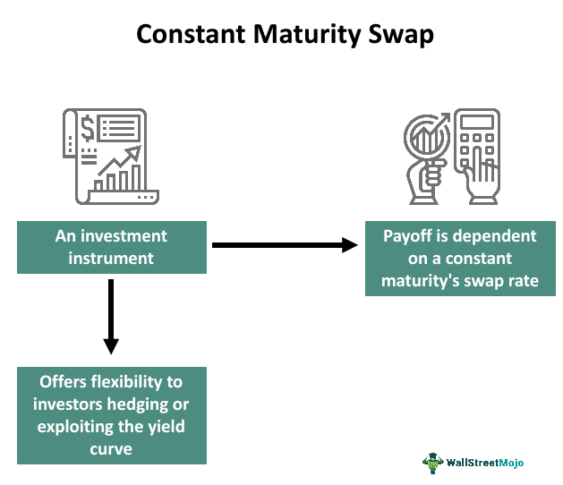

## Table of Contents

## What is a Constant Maturity Swap (CMS)?

A Constant Maturity Swap (CMS) is a type of financial agreement where one party pays a fixed interest rate and the other pays a floating interest rate. The special thing about a CMS is that the floating rate is based on a long-term interest rate, like a 10-year government bond rate, instead of a short-term rate like the usual 3-month LIBOR.

This makes CMS different from regular interest rate swaps because the floating rate in a CMS changes with the long-term rate, which can be less predictable. People and companies use CMS to manage their interest rate risk, especially when they want to protect themselves against changes in long-term rates. It's like a tool that helps them plan better for the future by locking in or betting on long-term interest rates.

## How does a CMS differ from a regular interest rate swap?

A Constant Maturity Swap (CMS) and a regular interest rate swap both involve an agreement between two parties to exchange interest payments. In a regular interest rate swap, one party pays a fixed interest rate, and the other pays a floating rate that usually follows a short-term rate like the 3-month LIBOR. This helps businesses and investors manage their exposure to short-term interest rate changes.

On the other hand, a CMS is unique because the floating rate it uses is based on a long-term [interest rate](/wiki/interest-rate-trading-strategies), such as the 10-year government bond rate. This means that instead of tracking short-term rate changes, a CMS follows the movements of long-term rates. This makes CMS a useful tool for those who want to hedge against or speculate on long-term interest rate movements, offering a different kind of protection or opportunity compared to regular interest rate swaps.

## What are the key components of a CMS?

A Constant Maturity Swap (CMS) has a few main parts that make it work. One part is the fixed rate leg, which is just like the fixed rate in a regular swap. One party agrees to pay a set interest rate over the life of the swap. This rate doesn't change and gives the other party a steady payment they can count on.

The other big part is the floating rate leg. But in a CMS, this floating rate is special because it's based on a long-term interest rate, like the 10-year government bond rate. This rate can go up or down depending on what's happening in the bond market. The party paying the floating rate has to adjust their payments based on these long-term rate changes. Together, these parts help manage the risk of long-term interest rate changes.

## Who typically uses CMS and for what purposes?

Banks, big companies, and investors are the ones who usually use Constant Maturity Swaps (CMS). They use CMS to manage their risk when it comes to long-term interest rates. For example, a bank might use a CMS to make sure they can still make money on their loans even if long-term rates go down. Or a company might use it to protect itself from higher borrowing costs if long-term rates go up.

Investors also use CMS to try and make money by betting on where they think long-term interest rates are headed. If they think rates are going to go up, they might use a CMS to get payments that increase with those rates. On the other hand, if they think rates are going to drop, they might use a CMS to lock in higher payments before the rates fall. It's like a way for them to guess and hopefully profit from future rate changes.

## How is the CMS rate determined?

The CMS rate is figured out by looking at the yield of a long-term government bond, like a 10-year bond. This rate is checked at set times, usually every three or six months, to see what the new floating rate should be for the next period. The exact way to find the CMS rate can be a bit different depending on what the people making the swap agree on, but it's always based on these long-term bond yields.

When it's time to reset the CMS rate, people look at the current yield of the long-term bond. They might use the yield from a specific day, or they might use an average over a few days to smooth out any sudden jumps. This new rate then becomes the floating rate that one side of the swap has to pay until the next reset. This way, the CMS rate stays connected to what's happening with long-term interest rates in the market.

## What are the risks associated with CMS?

Using a Constant Maturity Swap (CMS) comes with some risks that people need to think about. One big risk is interest rate risk. Since the floating rate in a CMS is based on long-term interest rates, if these rates move a lot, it can change the payments a lot too. If rates go up, the person paying the floating rate might have to pay a lot more, which could be tough if they weren't ready for it. If rates go down, the person getting the floating rate might get less money than they expected.

Another risk is basis risk. This happens because the long-term rate used in the CMS might not move in the same way as other rates that someone might be trying to hedge against. For example, if someone uses a CMS to protect against changes in their loan rates, but those loan rates follow a different kind of rate, the CMS might not help as much as they hoped. This mismatch can leave them still exposed to rate changes.

Lastly, there's also the risk of counterparty risk. This is the chance that the other person in the swap might not be able to make their payments. If the bank or company on the other side of the CMS runs into money troubles, they might not be able to pay what they owe. This could leave the other party in a tough spot, especially if they were counting on those payments to manage their own finances.

## Can you explain the mechanics of a CMS with an example?

Let's say there's a bank that wants to protect itself from long-term interest rates going down. They enter into a Constant Maturity Swap (CMS) with a big company. In this swap, the bank agrees to pay a fixed interest rate of 3% every year to the company. On the other hand, the company agrees to pay the bank a floating rate based on the 10-year government bond yield, which is checked every six months.

At the start of the swap, the 10-year bond yield is 4%. So, for the first six months, the company pays the bank 4% while the bank pays the company 3%. After six months, they check the 10-year bond yield again, and it's gone down to 3.5%. Now, the company pays the bank 3.5% for the next six months, but the bank still pays the company the same 3%. This way, the bank is protected because even if long-term rates keep dropping, they still get payments based on those rates from the company.

## How do CMS spreads impact the valuation of a CMS?

CMS spreads are the difference between the CMS rate and another benchmark rate, like the swap rate. This spread can change over time and it's really important for figuring out how much a CMS is worth. When the CMS spread gets bigger, it means the CMS rate is higher compared to the benchmark rate. This can make the CMS more valuable for the person who gets to pay the fixed rate and receive the CMS rate, because they're getting a higher payment.

On the other hand, if the CMS spread gets smaller, it means the CMS rate isn't as high compared to the benchmark rate. This can make the CMS less valuable for the same person, because they're not getting as much of a benefit from the floating rate payments. So, keeping an eye on CMS spreads is key to understanding and predicting the value of a CMS over time.

## What role does convexity play in CMS pricing?

Convexity is a big deal when it comes to pricing Constant Maturity Swaps (CMS). It's all about how the CMS rate changes when interest rates go up or down. When interest rates move, the CMS rate doesn't just change in a straight line. It bends or curves, and this bending is what we call convexity. Because of this, when interest rates go up a lot, the CMS rate might go up even more than you'd expect. And when rates go down a lot, the CMS rate might not drop as much as you'd think. This can make the CMS more valuable or less valuable depending on what's happening with rates.

To figure out how much a CMS is worth, you have to think about this convexity. If you don't, you might get the price wrong. When interest rates are really low, the convexity can make the CMS more valuable because the rate won't drop as much as a straight-line guess would say. But when rates are high, the convexity can make the CMS even more valuable because the rate can jump up a lot. So, people who price CMS have to use special math to account for this bending effect and make sure they're getting the value right.

## How are CMS options used in financial markets?

CMS options are used in financial markets to give people more ways to manage their risk or to bet on where they think long-term interest rates are going. A CMS option is like a regular option, but it's tied to a Constant Maturity Swap rate. This means it gives the person who buys it the right, but not the obligation, to enter into a CMS at a set rate in the future. If someone thinks long-term rates are going to go up, they might buy a CMS call option to get a better deal on the floating rate later. If they think rates are going down, they might buy a CMS put option to lock in a higher rate now.

These options are popular with banks, big companies, and investors who want to protect themselves from big swings in long-term interest rates. For example, a bank might use CMS options to make sure they can still make money on their loans even if long-term rates drop. An investor might use them to try and make money by betting on where they think rates are headed. By using CMS options, these groups can have more control over their exposure to interest rate changes and can plan better for the future.

## What are the advanced hedging strategies for CMS?

One advanced way to hedge CMS is by using CMS spread options. This is like buying insurance that pays off if the difference between the CMS rate and another rate, like a swap rate, gets bigger or smaller than expected. If someone is worried that the CMS rate might not move in line with other rates they care about, they can use a CMS spread option to protect themselves. For example, if they think the CMS rate will go up a lot more than the swap rate, they might buy a spread option that pays out if that happens. This way, they can make money from the option to offset any losses from the CMS.

Another strategy is to use CMS caps and floors. A CMS cap is like a ceiling on how high the CMS rate can go, and a CMS floor is like a floor on how low it can go. If someone is worried about the CMS rate going too high, they can buy a cap to limit their payments. If they're worried about it going too low, they can buy a floor to make sure they still get a certain minimum payment. By using caps and floors, people can make their CMS payments more predictable and less risky. This is helpful for banks and companies that need to plan their finances carefully.

A third strategy involves using swaptions, which are options on interest rate swaps. Someone might use a swaption to hedge their CMS by locking in the right to enter into a regular interest rate swap at a future date. If the CMS rate moves in a way they didn't expect, they can use the swaption to switch to a regular swap that might be more favorable. This gives them more flexibility and can help them manage their risk better. By combining CMS with swaptions, they can create a more complete hedging plan that covers different possible scenarios.

## How do regulatory changes affect CMS trading and valuation?

Regulatory changes can have a big impact on how people trade and value Constant Maturity Swaps (CMS). For example, after the financial crisis, rules like the Dodd-Frank Act in the U.S. made it so that more swaps had to be traded on public exchanges and cleared through central clearinghouses. This made CMS trading more transparent and safer, but it also meant more costs and paperwork for the people trading them. These new rules can change how much people are willing to pay for a CMS because they have to think about these extra costs and the risk of not being able to trade as easily.

Another way regulations affect CMS is by changing how banks and big companies have to handle their risk. New rules might make them hold more money in reserve or limit how much risk they can take on. This can make them less interested in trading CMS or might make them want to use CMS in different ways to meet the new rules. For example, if a bank has to keep more money on hand, they might use CMS to hedge their long-term interest rate risk in a way that fits within these new limits. All these changes can make CMS more or less valuable depending on how the rules shake out.

## References & Further Reading

[1]: ["Interest Rate Swaps and Other Derivatives"](http://students.aiu.edu/submissions/profiles/resources/onlineBook/N2D3C5_Interest_Rate_Swaps_and_Their_Derivatives.pdf) by Howard Corb

[2]: Hull, J. C. (2018). ["Options, Futures, and Other Derivatives,"](https://www.semanticscholar.org/paper/Options%2C-Futures%2C-and-Other-Derivatives-Hull/89bdee500c8623864fc9eb7a471546aa713acc44) Pearson Education.

[3]: ["Swaps and Other Derivatives"](https://www.investopedia.com/ask/answers/060215/what-difference-between-derivatives-and-swaps.asp) by Richard Flavell

[4]: Brigo, D., Mercurio, F. (2006). ["Interest Rate Models - Theory and Practice: With Smile, Inflation and Credit,"](https://link.springer.com/book/10.1007/978-3-662-04553-4) Springer Finance.

[5]: ["Algorithmic Trading and DMA: An Introduction to Direct Access Trading Strategies"](https://www.amazon.com/Algorithmic-Trading-DMA-introduction-strategies/dp/0956399207) by Barry Johnson

[6]: ["Swap Secrets: The Big Bank's 'Secret Sauce' for Interest Rate Management"](https://southstatecorrespondent.com/banker-to-banker/loan-hedging/how-large-banks-are-using-interest-rate-swaps/) by Sean Hayden

[7]: ["The Changing Role of LIBOR: Trends and Implications"](https://www.oliverwyman.com/our-expertise/insights/2019/sep/the-libor-transition-banks-face-risks-and-opportunities.html) by Douglas J. Elliott, The Brookings Institution.