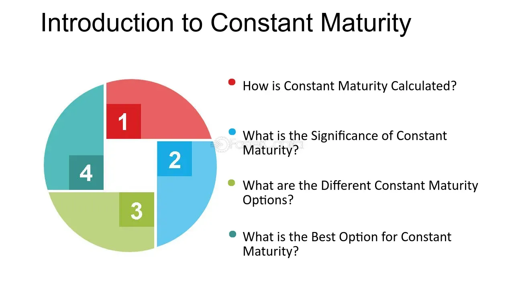

## Table of Contents

## What is the Constant Maturity Concept in Treasury Securities?

The Constant Maturity Concept in Treasury Securities refers to a way of measuring the yield of Treasury securities over a specific period, usually one year. Instead of looking at the yield of a single bond, it looks at the average yield of all Treasury securities that have a certain time left until they mature. For example, the constant maturity rate for a one-year Treasury might be the average yield of all Treasury securities that will mature in one year.

This concept is useful because it gives investors a clearer picture of what they can expect to earn from Treasury securities over time. It helps smooth out the ups and downs that can happen with individual bonds. By using the constant maturity rate, investors can make better decisions about where to put their money, knowing the average return they might get from Treasury securities with a specific maturity period.

## How does the Constant Maturity Treasury (CMT) rate differ from other Treasury yields?

The Constant Maturity Treasury (CMT) rate is different from other Treasury yields because it looks at the average yield of all Treasury securities that have the same time left until they mature. For example, if you want to know the one-year CMT rate, you would look at the average yield of all Treasury securities that will mature in one year. This is different from other Treasury yields, which might focus on the yield of a single bond or a specific type of Treasury security.

Other Treasury yields, like the yield on a specific 10-year Treasury bond, give you the return for that one bond at that one moment. These yields can go up and down a lot because they are tied to one bond. The CMT rate, on the other hand, smooths out these ups and downs by averaging the yields of many different securities. This makes the CMT rate a more stable and reliable measure of what investors can expect to earn over a certain period, which is why it's useful for making investment decisions.

## What are the common maturities used in the Constant Maturity Concept?

The Constant Maturity Concept uses several common maturities to help investors understand the average yield of Treasury securities over different periods. The most frequently used maturities are 1-month, 3-month, 6-month, 1-year, 2-year, 3-year, 5-year, 7-year, 10-year, 20-year, and 30-year. These maturities give investors a good range of options to see how Treasury yields change over different lengths of time.

Each of these maturities represents the average yield of all Treasury securities that will mature at that specific time. For example, the 1-year CMT rate is the average yield of all Treasury securities that will mature in one year. This helps investors compare the returns they might get from short-term investments, like a 1-month or 3-month Treasury, to longer-term investments, like a 10-year or 30-year Treasury. By looking at these different maturities, investors can make better decisions about where to put their money based on their investment goals and how long they want to invest for.

## How is the Constant Maturity Treasury rate calculated?

The Constant Maturity Treasury (CMT) rate is calculated by taking the average yield of all Treasury securities that will mature at a specific time. For example, to find the 1-year CMT rate, you look at all the Treasury securities that will mature in one year and then calculate the average yield of those securities. This average gives investors a good idea of what they can expect to earn from their investments over that period.

The calculation involves using a method called linear interpolation. This means that if there isn't a Treasury security that exactly matches the desired maturity, the CMT rate is estimated by looking at the yields of the two Treasury securities with maturities closest to the desired one. For instance, if you want the 5-year CMT rate but there's no 5-year bond, you would use the yields of the closest maturities, like a 4-year and a 6-year bond, to estimate the 5-year rate. This helps make the CMT rate a smooth and reliable measure of Treasury yields over different periods.

## Why is the Constant Maturity Treasury rate important for investors?

The Constant Maturity Treasury rate is important for investors because it gives them a clear idea of what they can expect to earn from their investments over different periods of time. Instead of looking at the yield of just one bond, the CMT rate shows the average yield of all Treasury securities that will mature at the same time. This helps investors see the bigger picture and understand how their money might grow over time, whether they're investing for a short period like a month or a longer period like 30 years.

By using the CMT rate, investors can make better decisions about where to put their money. It helps them compare the returns they might get from short-term investments to longer-term ones. For example, if the 1-year CMT rate is higher than the 5-year rate, an investor might choose to invest for one year to get a better return. The CMT rate also smooths out the ups and downs that can happen with individual bonds, making it a more reliable way to plan their investments.

## How can the Constant Maturity Treasury rate be used to assess economic conditions?

The Constant Maturity Treasury rate can be used to assess economic conditions because it gives us a good idea of what investors think about the economy's future. When the CMT rate goes up, it usually means investors are feeling more confident and expect the economy to do well. They might think there will be more growth or higher inflation, so they want a higher return on their investments. On the other hand, if the CMT rate goes down, it might mean investors are worried about the economy slowing down or facing other problems, so they're okay with lower returns.

Economists and policymakers also look at the differences between CMT rates for different maturities, like the spread between the 2-year and 10-year rates. This can tell them a lot about what investors expect for the future. For example, if the spread gets smaller or even turns negative (which is called an inverted yield curve), it might be a sign that investors think the economy might go into a recession soon. By keeping an eye on these rates, people who make decisions about the economy can get a sense of where things are headed and make plans accordingly.

## What are the limitations of using the Constant Maturity Treasury rate as an economic indicator?

The Constant Maturity Treasury rate can give us a good idea about what investors think about the economy, but it has some limitations. One big limitation is that it only looks at Treasury securities. This means it doesn't show us what's happening with other kinds of investments like stocks or corporate bonds. So, it might not give us the full picture of the economy. Also, the CMT rate can be affected by things that have nothing to do with the economy, like changes in government policies or global events. This can make it hard to know if the CMT rate is really showing us what's happening with the economy or if it's just reacting to something else.

Another limitation is that the CMT rate can be slow to change. Because it's an average of many different Treasury securities, it might not show new economic trends as quickly as other indicators. This means that by the time the CMT rate starts to change, the economy might already be moving in a different direction. Plus, the CMT rate is based on what investors expect to happen in the future, not what's happening right now. This can make it tricky to use the CMT rate to understand current economic conditions because it's more about what investors think might happen down the road.

## How do changes in the Constant Maturity Treasury rate affect mortgage rates?

Changes in the Constant Maturity Treasury rate can have a big impact on mortgage rates. When the CMT rate goes up, it usually means that banks and lenders will charge more interest on new mortgages. This happens because the CMT rate is a good guide for what lenders can expect to earn from their money, and if they can get a higher return from Treasury securities, they'll want to charge more for loans too. So, if you're looking to buy a house and the CMT rate is high, you might end up paying more in interest on your mortgage.

On the other hand, when the CMT rate goes down, mortgage rates usually follow. Lenders will lower the interest they charge on new mortgages because they can't get as much from Treasury securities. This can make it a good time to buy a house or refinance your mortgage because you'll pay less in interest. But remember, the CMT rate is just one part of what affects mortgage rates. Other things like the economy, inflation, and what the Federal Reserve does can also play a big role.

## What role does the Constant Maturity Treasury rate play in financial derivatives?

The Constant Maturity Treasury rate is important for financial derivatives because it helps set the price of these products. Financial derivatives like [interest rate](/wiki/interest-rate-trading-strategies) swaps and options often use the CMT rate as a reference point. For example, in an interest rate swap, one party might agree to pay a fixed rate while the other pays a floating rate that's based on the CMT rate. This means that if the CMT rate goes up, the floating rate will go up too, and the party paying the floating rate will have to pay more.

In options and other derivatives, the CMT rate can help figure out how much the option is worth. Traders look at the CMT rate to guess where interest rates might go in the future, which can change the price of the option. If the CMT rate is expected to rise, the price of an option that benefits from higher interest rates might go up. So, the CMT rate is a key piece of information that helps people in the financial markets make decisions about buying and selling derivatives.

## How can investors use the Constant Maturity Treasury rate to manage interest rate risk?

Investors can use the Constant Maturity Treasury rate to manage interest rate risk by keeping an eye on how it changes. If the CMT rate is going up, it means that interest rates are likely to rise too. So, investors might choose to lock in lower rates now by buying fixed-rate bonds or by getting a fixed-rate mortgage. This way, if rates do go up later, they won't have to pay more interest. On the other hand, if the CMT rate is going down, it might be a good time to take advantage of lower rates by borrowing money or refinancing loans, because they'll pay less in interest.

Another way investors can use the CMT rate is by using financial products like interest rate swaps. In an interest rate swap, one party agrees to pay a fixed rate while the other pays a floating rate that's based on the CMT rate. If an investor thinks the CMT rate will go up, they might want to be the one paying the fixed rate, so they know exactly how much they'll pay no matter what happens to interest rates. If they think the CMT rate will go down, they might choose to pay the floating rate, so they can benefit from lower interest payments. By using the CMT rate and these financial tools, investors can protect themselves from big changes in interest rates.

## What are some advanced strategies for trading based on the Constant Maturity Treasury rate?

One advanced strategy for trading based on the Constant Maturity Treasury rate is to use interest rate futures. These are contracts that let you buy or sell Treasury securities at a set price in the future. If you think the CMT rate will go up, you might sell these futures now. That way, if the rate does go up, the price of the futures will go down, and you can buy them back cheaper later. On the other hand, if you think the CMT rate will go down, you might buy these futures now. If the rate goes down, the price of the futures will go up, and you can sell them for a profit later. This strategy can help you make money from changes in the CMT rate without having to buy or sell actual Treasury securities.

Another strategy is to use options on Treasury securities. Options give you the right, but not the obligation, to buy or sell a security at a set price before a certain date. If you think the CMT rate will go up, you might buy a call option on a Treasury security. This means you can buy the security at a lower price later if the rate goes up, which can be profitable. If you think the CMT rate will go down, you might buy a put option. This lets you sell the security at a higher price later if the rate goes down, which can also make you money. Using options can help you manage the risk of trading based on the CMT rate because you don't have to follow through with the trade if it doesn't go your way.

## How have historical trends in the Constant Maturity Treasury rate influenced long-term investment strategies?

Historical trends in the Constant Maturity Treasury rate have had a big impact on how people plan their long-term investments. When the CMT rate is low for a long time, like it was in the years after the 2008 financial crisis, investors often look for other places to put their money where they can get a better return. This can mean buying more stocks or investing in real estate. Low CMT rates also make it cheaper to borrow money, so people might take out loans to invest in things that could grow in value over time. On the other hand, when the CMT rate is high, investors might feel more comfortable putting their money in Treasury securities because they can earn a good return without taking as much risk.

Looking at past trends in the CMT rate also helps investors plan for the future. For example, if the CMT rate has been going up over the years, investors might expect it to keep going up and adjust their strategies accordingly. They might choose to lock in lower rates now by buying fixed-rate bonds or getting a fixed-rate mortgage, so they don't have to pay more interest later. If the CMT rate has been going down, investors might take advantage of lower rates by borrowing money or refinancing loans. By understanding how the CMT rate has changed in the past, investors can make smarter choices about where to put their money for the long term.

## References & Further Reading

[1]: Fabozzi, F. J. (2007). ["Fixed Income Analysis."](https://books.google.com/books/about/Fixed_Income_Analysis.html?id=lujLawVLS3YC) CFA Institute Investment Series.

[2]: ["Advances in Financial Machine Learning"](https://www.amazon.com/Advances-Financial-Machine-Learning-Marcos/dp/1119482089) by Marcos Lopez de Prado

[3]: ["Building Winning Algorithmic Trading Systems, + Website: A Trader's Journey From Data Mining to Monte Carlo Simulation to Live Trading"](https://www.amazon.com/Building-Winning-Algorithmic-Trading-Systems/dp/1118778987) by Kevin Davey

[4]: ["Machine Trading: Deploying Computer Algorithms to Conquer the Markets"](https://www.amazon.com/Machine-Trading-Deploying-Computer-Algorithms/dp/1119219604) by Ernest P. Chan

[5]: ["Interest Rate Risk Modeling: The Fixed Income Valuation Course"](https://www.wiley.com/en-us/Interest+Rate+Risk+Modeling%3A+The+Fixed+Income+Valuation+Course-p-9780471737445) by Sanjay K. Nawalkha, Gloria M. Soto, Natalia A. Beliaeva