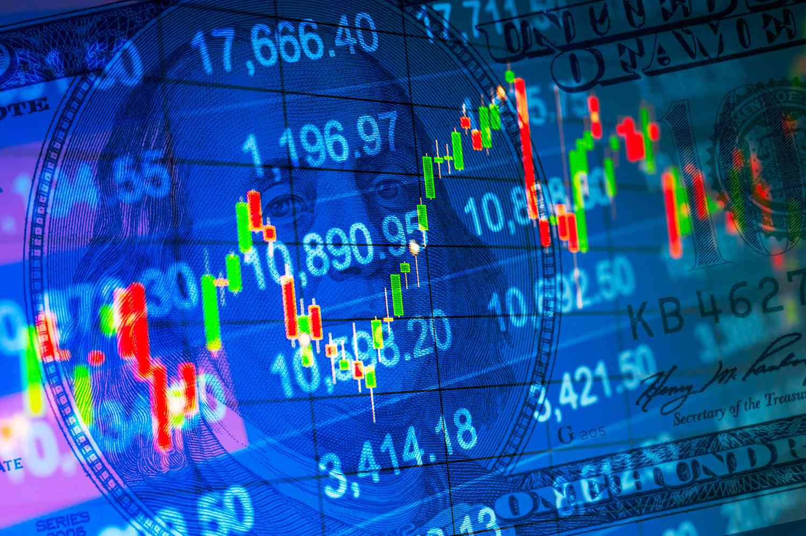

The world of finance is both intricate and intriguing, particularly when it comes to instruments such as Treasury securities. These securities, issued by the federal government, serve as essential tools for financing national operations and managing monetary policy. Treasury securities form a backbone of the financial system, influencing a wide range of economic activities from government funding to market liquidity.

This article will explore the complex interplay between Treasury securities, constant maturity, and algorithmic trading. Constant maturity, a concept employed by the Federal Reserve, refers to the adjustment of yield curves to reflect a consistent investment horizon, typically one, five, or ten years. This harmonization allows investors and policymakers to make more accurate financial comparisons and predictions, establishing a benchmark for assessing market behavior and forecasting economic trends.



In the financial sector, constant maturity enhances the utility of Treasury securities by providing a normalized measure of yield across varying maturities. This normalization is crucial for market participants who rely on consistent metrics to gauge investment health and risk. By smoothing out short-term volatility inherent in individual securities, constant maturity yields offer a stable reference point for comparative analysis.

Real-world applications extend beyond theoretical frameworks. Algorithmic trading, a modern trading strategy, uses sophisticated computer programs to execute trades based on a set of market signals. By leveraging constant maturity data, these algorithms optimize trading strategies, finding the most profitable opportunities more efficiently than traditional methods. This interplay between advanced technology and financial instruments represents an evolution in trading practices, underscoring the importance of data-driven decision making in contemporary markets.

Throughout this article, we will examine how these elements interact to shape financial dynamics, providing insights into the mechanisms and implications of their use.

## Table of Contents

## Understanding Treasury Securities and Constant Maturity

Treasury securities are fundamental components of the financial system, representing debt instruments issued by the federal government to fund its fiscal activities. These securities come in various forms, including Treasury bills (T-bills), Treasury notes (T-notes), and Treasury bonds (T-bonds), each with varying maturities and interest rates. The diversity in maturities allows the government to manage its financing needs while providing investors with a range of options depending on their investment time horizon and risk appetite.

Constant maturity, a vital concept introduced by the Federal Reserve, plays a crucial role in standardizing yield calculations across different maturities of Treasury securities. This concept is encapsulated in the Constant Maturity Treasury (CMT) rates, which reflect the yield of a theoretical Treasury security with a fixed maturity, such as one-year or ten-year, regardless of the varying maturities in the market. The Federal Reserve achieves this by interpolating the yields of actual, currently traded Treasury securities.

The primary function of the constant maturity adjustment is to facilitate financial comparisons and enhance market predictions. By providing a stable benchmark across different maturities, constant maturity yields enable more accurate assessments of [interest rate](/wiki/interest-rate-trading-strategies) trends and economic forecasts. This normalization of yields allows for consistent valuation and comparison of financial instruments, aiding investors, analysts, and policymakers in making informed decisions.

In mathematical terms, the process of determining constant maturity yields involves interpolation techniques. For example, if one requires a yield for a seven-year constant maturity, the rates for surrounding maturities, such as five and ten years, would be interpolated to derive a theoretical seven-year constant maturity rate. This is often accomplished using linear or spline interpolation methods.

Overall, understanding Treasury securities and the concept of constant maturity is essential for comprehending the broader dynamics of financial markets, as well as for the effective deployment of financial instruments in portfolio management and strategic planning.

## Examples and Applications of Treasury Securities and Constant Maturity

Constant maturity yields are pivotal in determining interest rates for various lending products, including personal loans and mortgages. By providing a standardized measure of yield across different maturities, constant maturity allows for a clearer assessment of long-term interest rate trends. This standardization is particularly useful when setting interest rates for fixed-rate and adjustable-rate mortgages (ARMs).

In the context of ARMs, constant maturity Treasury (CMT) rates serve as benchmarks to which the adjustable rates are typically tied. For example, a common ARM might be set at a fixed rate for a specified period, after which the interest rate adjusts annually based on the CMT. This link to the CMT ensures that the ARM reflects current market conditions, providing a balance between risk for lenders and potentially lower initial payments for borrowers.

Beyond personal finance, businesses also rely heavily on constant maturity data. Corporate bonds are frequently priced and valued in relation to Treasury securities, where the yield spread—the difference between yields on Treasuries and corporate bonds—serves as a crucial indicator of risk and return. Investors and corporations alike monitor these yield spreads closely to make informed decisions about financing and investment. 

For example, consider a corporate bond that needs to be priced. The spread, often expressed in basis points, reflects the additional yield investors require compared to a similarly termed Treasury security. This spread accounts for factors such as credit risk, market demand, and [liquidity](/wiki/liquidity-risk-premium). By using the consistent baseline provided by treasury constant maturity rates, investors can assess whether a corporate bond offers a sufficient risk-adjusted return.

Here is a simple Python example that demonstrates how one might use constant maturity data to evaluate corporate bonds:

```python
def calculate_yield_spread(treasury_yield, corporate_yield):
    yield_spread = corporate_yield - treasury_yield
    return yield_spread

# Example usage
treasury_yield = 0.025  # 2.5% constant maturity yield
corporate_yield = 0.035 # 3.5% yield on a corporate bond

spread = calculate_yield_spread(treasury_yield, corporate_yield)
print(f"The yield spread is: {spread:.2%}")
```

In this example, the yield spread is calculated as 1%, or 100 basis points, indicating the premium an investor would earn for holding the corporate bond instead of a risk-free Treasury security.

Overall, these applications underscore the essential role played by constant maturity yields in financial markets, ensuring that both consumer interest rates and corporate financing strategies align with prevailing economic conditions.

## Algorithmic Trading and Treasury Securities

Algorithmic trading is a method of executing trades using pre-programmed instructions that account for variables such as timing, price, and [volume](/wiki/volume-trading-strategy). It allows traders to make rapid decisions and execute large numbers of trades efficiently. A notable application is in the trading of Treasury securities, where [algorithmic trading](/wiki/algorithmic-trading) can effectively leverage constant maturity yield data to optimize trading strategies.

Constant maturity yields represent the average yield of treasury securities adjusted to a consistent maturity date. This normalization allows traders to make more accurate comparisons across securities with different maturity dates. In this context, algorithmic trading strategies benefit significantly because they can evaluate and respond to yield curve changes rapidly. By accessing real-time yield data, algorithms are capable of determining the most advantageous Treasury maturities for investment.

To optimize yield curve trades, trading algorithms process a vast amount of market data to identify patterns or signals indicative of future yield movements. The efficiency of these algorithms stems from their ability to analyze this data far more quickly than a human trader. For example, they may use [machine learning](/wiki/machine-learning) techniques to predict shifts in yield curves. Using Python, one might implement a simple algorithm to analyze yield curve data as follows:

```python
import numpy as np
from sklearn.linear_model import LinearRegression

# Example data for Treasury yield curve (maturities in years, yields in percentage)
maturities = np.array([1, 2, 3, 5, 7, 10, 20, 30]).reshape(-1, 1)
yields = np.array([0.15, 0.2, 0.25, 0.35, 0.45, 0.6, 0.8, 1.0])

# Using Linear Regression to model the yield curve
model = LinearRegression()
model.fit(maturities, yields)

# Predicting yields for a continuous range of maturities
future_maturities = np.arange(1, 31, 0.5).reshape(-1, 1)
predicted_yields = model.predict(future_maturities)

# Output the predictions for future trades
for maturity, predicted_yield in zip(future_maturities.flatten(), predicted_yields):
    print(f"Maturity: {maturity} years, Predicted Yield: {predicted_yield:.2f}%")
```

In this example, linear regression is used to model the relationship between maturity and yield. However, real-world applications may employ more sophisticated modeling techniques, such as artificial neural networks, to capture nonlinear relationships within the data.

The speed and precision of trading algorithms enable market participants to capitalize on the smallest yield differentials, often measured in basis points, enhancing their return on investment. By implementing these algorithms, financial institutions are better positioned to adapt to dynamic market conditions, ensuring optimal portfolio strategies and improved resource allocation.

Thus, algorithmic trading, through its integration of constant maturity yield data, stands as a pivotal tool in the contemporary trading landscape, offering traders a competitive edge in the Treasury securities market.

## Case Study: Algorithmic Trading Using Constant Maturity Data

An illustrative case involves a trading firm that effectively utilizes constant maturity yields to refine its algorithmic trading strategies. Constant maturity yields are crucial for understanding the shifts in the yield curve, which represent interest rates in the financial markets across different maturity dates. By analyzing these yields, the firm can make more informed decisions on when and where to invest in Treasury securities.

The firm implements a systematic approach by integrating constant maturity data into their algorithmic trading systems. The primary advantage of using constant maturity yields is their stability and reliability in depicting market conditions over time. This stability allows the firm to anticipate shifts in the yield curve based on historical patterns and predictive analytics derived from the yield data.

To maximize returns, the firm employs sophisticated algorithms capable of processing real-time yield data. For instance, the algorithm might be designed to automatically execute buy or sell orders of specific Treasury securities when the predicted yield curve deviates from the observed one. By continuously monitoring the yield data, the algorithm can adjust the portfolio's composition dynamically, thereby optimizing positions and returns.

A simplified version of such an algorithm could be conceptualized in Python as follows:

```python
import pandas as pd
import numpy as np

# Assume 'yield_data' is a DataFrame containing real-time constant maturity yields
# Historical averages of yields for predictive analytics
historical_averages = yield_data.rolling(window=30).mean()

# Function to determine if an investment strategy should be executed
def analyze_yield_curves(real_time_data, historical_averages):
    if real_time_data.iloc[-1] > historical_averages.iloc[-1]:
        return "Buy Long-term Treasuries"
    elif real_time_data.iloc[-1] < historical_averages.iloc[-1]:
        return "Sell Long-term Treasuries"
    else:
        return "Hold"

# Execute trading decision based on yield curve analysis
decision = analyze_yield_curves(yield_data['current_yield'], historical_averages['average_yield'])
print(decision)
```

In practice, the firm's algorithm would be more complex, incorporating additional data points and risk management strategies to refine its predictions and trading actions. These strategies might include machine learning techniques to enhance prediction accuracy or employing different models to account for changing market conditions.

Through continuous refinement of models using constant maturity data, the firm is equipped to react swiftly to market changes. This reactive capability allows for rapid repositioning within the Treasury market to exploit transient opportunities, ultimately aiming to enhance their return on investment. By leveraging such advanced data analysis and algorithmic trading methodologies, the firm showcases the practical application and benefits of using constant maturity yields in an increasingly data-driven financial environment.

## Future Trends in Treasury Securities and Algorithmic Trading

As technology continues to advance at a rapid pace, the role of algorithmic trading in financial markets is expected to become increasingly significant. Historically, algorithmic trading has been an integral part of high-frequency trading environments, where the ability to process large volumes of data and execute trades within milliseconds offers a competitive advantage. The future suggests an expansion of algorithmic trading beyond these domains, especially through the enhanced use of constant maturity yields and advanced data analytics.

Constant maturity yields provide a standardized means of comparing various Treasury securities with different maturities by normalizing interest rates to a common timeframe. This normalization is pivotal for generating consistent data inputs used in predictive analytics. As computational capabilities improve, the application of constant maturity yields in predictive algorithms is anticipated to increase, offering deeper insights into market trends and facilitating more accurate financial forecasts. Through advanced data analytics, these yields can be combined with other economic indicators to predict shifts in yield curves, thus guiding strategic investment decisions.

Artificial intelligence (AI) and machine learning (ML) are at the forefront of technological growth, with substantial potential to optimize algorithmic trading strategies in the Treasury securities market. These technologies enable the development of sophisticated models that can learn from historical data and identify patterns or anomalies, which may be indicative of future market movements. For instance, machine learning algorithms can be trained on historical Treasury yield data at various maturities to forecast future yield levels or changes in yield spreads, providing traders with actionable insights.

Here is a basic example using Python to demonstrate how one might employ a machine learning model to predict future Treasury yields based on historical constant maturity data:

```python
import pandas as pd
from sklearn.model_selection import train_test_split
from sklearn.linear_model import LinearRegression
from sklearn.metrics import mean_squared_error

# Load historical Treasury yields data
data = pd.read_csv('treasury_yields.csv')

# Select features (e.g., past yields) and target variable (future yield)
features = data.drop('future_yield', axis=1)
target = data['future_yield']

# Split into training and testing sets
X_train, X_test, y_train, y_test = train_test_split(features, target, test_size=0.2, random_state=42)

# Train a linear regression model
model = LinearRegression()
model.fit(X_train, y_train)

# Predict future yields
predictions = model.predict(X_test)

# Evaluate the model
mse = mean_squared_error(y_test, predictions)
print(f"Mean Squared Error: {mse}")
```

This simple model could be greatly enhanced by incorporating additional features such as macroeconomic indicators, sentiment analysis from financial news, or employing more complex machine learning models such as neural networks or ensemble methods.

Looking forward, the growing integration of AI and ML in Treasury securities trading will likely lead to more robust and adaptive trading strategies, capable of responding to complex financial environments with greater precision. These advancements will enable traders not only to optimize returns more effectively but also to manage risk with innovative approaches, leveraging real-time data analysis and automated decision-making processes. The future of Treasury securities and algorithmic trading, driven by technological advancements, promises a more dynamic and informed financial landscape.

## Conclusion

Understanding the intricacies of Treasury securities and constant maturity is crucial for financial professionals navigating today's markets. Treasury securities, fundamentally debt instruments issued by the U.S. government, play a pivotal role in finance, serving as benchmarks for interest rates and investment decisions. Constant maturity, an adjustment made by the Federal Reserve, helps normalize yield data, facilitating comparisons and predictions across various Treasury maturities.

Algorithmic trading, which utilizes computer algorithms to execute trades based on market signals, is continuously evolving. This evolution opens new opportunities for optimizing returns, as it leverages constant maturity yield data to inform strategies. By integrating real-time data, trading algorithms can dynamically adjust positions, maximizing returns and efficiently managing risks. This capability is particularly significant as it allows traders to capitalize on even minute movements in yield spreads.

To remain competitive, financial professionals must stay informed about trends and advancements in both algorithmic trading and Treasury securities. As technology and data processing capabilities improve, algorithmic trading is expected to become even more integral to financial markets. Additionally, the incorporation of constant maturity yields into predictive analytics will likely enhance financial forecasting. Developments in [artificial intelligence](/wiki/ai-artificial-intelligence) and machine learning will further optimize algorithmic strategies, allowing traders to better navigate the complexities of the Treasury securities market. In this dynamic financial landscape, continuous learning and adaptation are key to success, enabling professionals to harness the potential of these powerful financial tools.

## References & Further Reading

[1]: Fabozzi, F. J. (2007). ["Fixed Income Analysis."](https://books.google.com/books/about/Fixed_Income_Analysis.html?id=lujLawVLS3YC) CFA Institute Investment Series.

[2]: ["Advances in Financial Machine Learning"](https://www.amazon.com/Advances-Financial-Machine-Learning-Marcos/dp/1119482089) by Marcos Lopez de Prado

[3]: ["Building Winning Algorithmic Trading Systems, + Website: A Trader's Journey From Data Mining to Monte Carlo Simulation to Live Trading"](https://www.amazon.com/Building-Winning-Algorithmic-Trading-Systems/dp/1118778987) by Kevin Davey

[4]: ["Machine Trading: Deploying Computer Algorithms to Conquer the Markets"](https://www.amazon.com/Machine-Trading-Deploying-Computer-Algorithms/dp/1119219604) by Ernest P. Chan

[5]: ["Interest Rate Risk Modeling: The Fixed Income Valuation Course"](https://www.wiley.com/en-us/Interest+Rate+Risk+Modeling%3A+The+Fixed+Income+Valuation+Course-p-9780471737445) by Sanjay K. Nawalkha, Gloria M. Soto, Natalia A. Beliaeva