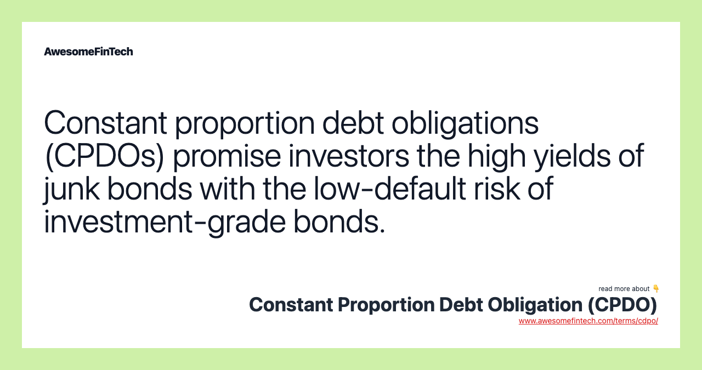

## Table of Contents

## What is a Constant Proportion Debt Obligation (CPDO)?

A Constant Proportion Debt Obligation (CPDO) is a type of financial product that was popular before the 2008 financial crisis. It is designed to give investors high returns by betting on the performance of a group of bonds, usually corporate bonds. The CPDO works by constantly adjusting its investments to keep a certain level of risk, aiming to achieve a high credit rating, like AAA, even though it invests in riskier bonds.

However, CPDOs are very complex and risky. They use a lot of borrowed money, or leverage, to try to boost returns. This means that if the bonds they invest in do not perform well, the losses can be much bigger than the initial investment. Because of their complexity and high risk, CPDOs fell out of favor after the financial crisis and are not commonly used today.

## How does a CPDO function in simple terms?

A Constant Proportion Debt Obligation (CPDO) is a fancy financial tool that tries to make money by betting on a bunch of bonds, usually from companies. It's like a bet that these bonds will do well over time. The CPDO keeps changing what it invests in to stay at a certain level of risk. It's always trying to keep a high credit rating, like AAA, even though it's dealing with riskier bonds. This is done by using a lot of borrowed money, which can make the potential profits bigger.

However, CPDOs are really tricky and risky. If the bonds they bet on don't do well, the losses can be a lot more than what was initially invested. This is because they use so much borrowed money. After the big financial crisis in 2008, people realized how dangerous CPDOs could be, and they stopped being popular. Today, you don't see them used very often because of their complexity and high risk.

## What are the key components of a CPDO?

A Constant Proportion Debt Obligation (CPDO) has a few main parts that make it work. First, it invests in a group of bonds, usually from companies. These bonds are the base of the CPDO, and the idea is to make money from how well these bonds do over time. The CPDO also uses a lot of borrowed money, or leverage, to try to make bigger profits. This means it can invest more than what was initially put in, which can lead to higher returns if things go well.

The second key part is the way the CPDO keeps adjusting its investments. It's always trying to stay at a certain level of risk, aiming to keep a high credit rating like AAA. This is done by constantly changing what it's invested in based on how the bonds are doing. If the bonds start to do worse, the CPDO might change its investments to try to keep that high rating. This constant adjusting is what makes CPDOs so complex and risky. If the bonds don't perform as expected, the losses can be much bigger because of the borrowed money used.

## What are the potential benefits of investing in a CPDO?

One potential benefit of investing in a CPDO is the chance to earn high returns. CPDOs aim to make money by betting on a group of bonds, usually from companies. They use a lot of borrowed money to try to boost these returns. If the bonds do well, the profits can be much bigger than what you would get from just investing in the bonds directly. This is because the borrowed money lets the CPDO invest more than what was initially put in.

Another benefit is that CPDOs try to keep a high credit rating, like AAA, even though they invest in riskier bonds. They do this by constantly adjusting their investments to stay at a certain level of risk. This can be attractive to investors who want to take on more risk for the chance of higher returns but still want the security of a high credit rating. However, it's important to remember that these benefits come with a lot of risk, and CPDOs are very complex financial products.

## What are the basic risks associated with CPDOs?

One big risk with CPDOs is that they use a lot of borrowed money, or leverage. This means if the bonds they invest in don't do well, the losses can be much bigger than what was initially invested. It's like betting with money you don't have, and if you lose, you still have to pay back the borrowed money plus interest. This can lead to huge losses if the market goes against the CPDO.

Another risk is the complexity of CPDOs. They are very hard to understand and predict because they keep changing their investments to try to keep a high credit rating. This constant adjusting makes them unpredictable and hard to manage. If something goes wrong with the bonds they're betting on, the CPDO might not be able to adjust fast enough to avoid big losses.

Lastly, CPDOs fell out of favor after the 2008 financial crisis because they were seen as too risky and complex. Many investors lost a lot of money on them, and regulators started to look more closely at these kinds of products. This means that investing in a CPDO today could come with not just financial risk but also the risk of regulatory changes that could affect the product's value or legality.

## How is the leverage in a CPDO managed?

In a CPDO, leverage is managed by constantly adjusting the amount of borrowed money used based on how the bonds are doing. If the bonds start to perform well, the CPDO might borrow more money to invest more and try to make bigger profits. But if the bonds start to do poorly, the CPDO will try to reduce the amount of borrowed money to lower the risk of big losses. This constant adjusting is meant to keep the CPDO at a certain level of risk while still aiming for high returns.

However, managing leverage this way can be tricky and risky. Because CPDOs use a lot of borrowed money, even small changes in the bond market can lead to big swings in the value of the CPDO. If the bonds don't do as well as expected, the CPDO might not be able to reduce its leverage fast enough to avoid huge losses. This is why CPDOs are considered very risky and complex financial products.

## What role do credit derivatives play in CPDOs?

Credit derivatives are important in CPDOs because they help manage the risk of the bonds the CPDO invests in. A credit derivative is like an insurance policy that pays out if the bonds start to do badly. By using credit derivatives, the CPDO can protect itself from losses if the bonds don't perform well. This is part of how the CPDO tries to keep a high credit rating, like AAA, even though it's dealing with riskier bonds.

However, using credit derivatives adds another layer of complexity and risk to CPDOs. If the credit derivatives don't work as expected or if the company selling them can't pay out when needed, the CPDO could still face big losses. This is why CPDOs are seen as very risky and hard to understand. They rely on a lot of different parts working together, and if any part fails, the whole thing can fall apart.

## How do CPDOs perform under different market conditions?

CPDOs can do well when the market is stable and the bonds they invest in are doing okay or getting better. In these good times, the CPDO can use its borrowed money to make bigger profits. It keeps adjusting its investments to stay at a certain level of risk and tries to keep a high credit rating, like AAA. If the bonds keep doing well, the CPDO can make a lot of money for investors.

But CPDOs can get into big trouble when the market is not stable or the bonds start to do badly. Because they use a lot of borrowed money, even small drops in the bond market can lead to big losses. The CPDO tries to adjust its investments to lower the risk, but sometimes it can't do this fast enough. If the bonds keep getting worse, the CPDO might lose a lot more money than what was initially invested. This is why CPDOs are seen as very risky, especially in tough market conditions.

## What are the regulatory considerations for CPDOs?

After the 2008 financial crisis, regulators started looking more closely at CPDOs because they were seen as too risky and complex. Many investors lost a lot of money on them, so rules were changed to make sure these kinds of products were safer. Regulators want to make sure that if people invest in CPDOs, they understand the risks and that the products are not too complicated or dangerous. This means that if you want to invest in a CPDO today, you might have to deal with more rules and checks to make sure everything is done right.

These regulatory changes can affect how CPDOs work and whether they are even allowed. Some countries might have stricter rules than others, which could make it harder to use CPDOs in those places. Also, the rules can change over time, so what's okay today might not be okay tomorrow. This adds another layer of risk for investors, as they need to keep up with any new rules that might affect their investments.

## How do CPDOs compare to other structured credit products?

CPDOs are a type of structured credit product, but they are different from others like Collateralized Debt Obligations (CDOs) and Credit Default Swaps (CDS). CPDOs are very complex and risky because they use a lot of borrowed money to bet on a group of bonds. They keep changing their investments to try to keep a high credit rating, like AAA, even though they are dealing with riskier bonds. This makes them hard to understand and predict. On the other hand, CDOs are also complex, but they work by pooling different types of debt, like loans or bonds, and then selling pieces of that pool to investors. CDOs don't adjust their investments as much as CPDOs do, and they usually don't aim for such a high credit rating.

Credit Default Swaps (CDS) are another type of structured credit product. They are like insurance policies that pay out if a bond or loan defaults. Unlike CPDOs, CDS are simpler and focus on protecting against specific risks rather than trying to make high returns. CPDOs use CDS as part of their strategy to manage risk, but they are much more complicated because they combine this with a lot of borrowed money and constant adjustments. Overall, CPDOs are seen as riskier and more complex than other structured credit products because of their use of leverage and their constant need to adjust investments to maintain a high credit rating.

## What advanced risk management strategies are used in CPDOs?

CPDOs use a few smart ways to try to manage their risks. One way is by using something called credit derivatives, which are like insurance policies that pay out if the bonds they invest in start to do badly. This helps the CPDO protect itself from big losses. Another way is by constantly changing what it's invested in. If the bonds start to do worse, the CPDO will try to adjust its investments to lower the risk. This is all done to keep a high credit rating, like AAA, even though it's dealing with riskier bonds.

But these strategies can be tricky and risky. Using credit derivatives adds more complexity because if the company selling them can't pay out when needed, the CPDO could still face big losses. Also, constantly adjusting investments means the CPDO is always trying to guess what will happen next in the market. If it guesses wrong, it might not be able to adjust fast enough to avoid huge losses. This is why CPDOs are seen as very risky and hard to understand, even with these advanced risk management strategies in place.

## What are the limitations and criticisms of CPDOs from an expert perspective?

Experts have pointed out that CPDOs have big problems because they are very hard to understand and risky. They use a lot of borrowed money to bet on bonds, and if those bonds don't do well, the losses can be much bigger than what was put in. This is because CPDOs try to keep a high credit rating, like AAA, by constantly changing what they're invested in. But this constant adjusting can make them unpredictable and hard to manage. If the market goes the wrong way, the CPDO might not be able to change its investments fast enough to avoid huge losses.

Another big criticism is that CPDOs use complex tools like credit derivatives to try to manage their risks. These are like insurance policies that pay out if the bonds start to do badly. But if the company selling these insurance policies can't pay out when needed, the CPDO could still lose a lot of money. Also, after the 2008 financial crisis, many investors lost a lot on CPDOs, which made regulators look at them more closely. Now, there are more rules and checks to make sure these products are safer, but this adds another layer of risk for investors who need to keep up with any new rules that might affect their investments.

## What are the limitations and risks of CPDOs?

Constant Proportion Debt Obligations (CPDOs) are inherently susceptible to spread [volatility](/wiki/volatility-trading-strategies), a condition where the difference between the yields of various financial instruments fluctuates. This volatility poses a substantial risk as it directly impacts the performance of CPDOs, which are designed to leverage small and stable spreads to achieve higher returns. When spread volatility increases, the strategy behind CPDOs can suffer, leading to severe financial losses for investors.

One theoretical foundation for CPDOs is the Martingale betting system, which assumes the ability to exponentially increase exposure to recover from losses. The Martingale system involves doubling down on investment after each loss, with the expectation that a win would eventually recoup all previous losses and yield a profit equal to the initial stake. Mathematically, the system can be expressed using sequences to increase the bet size as follows: 

$$
b_n = b_{n-1} \times 2
$$

where $b_n$ is the bet size at step $n$. This system presupposes unlimited capital, allowing continuous doubling without constraints. However, in practice, financial resources are finite, making the Martingale system inadequate and risky. Considerable capital is required to sustain a losing streak, and in volatile markets, spreads can widen unexpectedly, rendering the strategy ineffective and leading to catastrophic financial outcomes.

The Great Recession (2007-2009) exposed significant weaknesses in CPDOs, as the rapid deterioration of market conditions led to widespread defaults. Initially constructed with optimistic credit ratings, CPDOs faced severe criticism as their vulnerability became apparent. During the crisis, the realized spread volatility exceeded predicted levels, causing the mechanisms underpinning CPDOs to falter. The defaults triggered critical review and scrutiny over the methodologies used to rate these instruments, which were initially touted as safe and yielding above-average returns.

Credit rating agencies were criticized for assigning high ratings to CPDOs despite their intricate and risky structure. The misjudgment highlighted a fundamental oversight in risk assessment, emphasizing the need for better evaluation models that appreciate the intricacies of complex financial instruments. The CPDO debacle underscored the necessity for enhanced risk management protocols and led to calls for reform within the credit rating industry. This pursuit of understanding real-world limitations and the catastrophic consequences associated with high-risk financial products remains pivotal for the industry's advancement.

## References & Further Reading

[1]: Hu, J., & Ramaswamy, S. (2007). ["Life After Rating Downgrades: Lessons for Structured Credit Products."](https://pmc.ncbi.nlm.nih.gov/articles/PMC9405348/) Bank for International Settlements Quarterly Review.

[2]: Tavakoli, J. M. (2008). ["Structured Finance and Collateralized Debt Obligations: New Developments in Cash and Synthetic Securitization."](https://onlinelibrary.wiley.com/doi/book/10.1002/9781118268230) John Wiley & Sons.

[3]: Buehler, H., & Kempf, M. (2008). ["Constant Proportion Debt Obligations: Pricing, Rating, and Hedging."](https://www.jstor.org/stable/pdf/41431665.pdf) Lecture Notes in Economics and Mathematical Systems, Springer.

[4]: Gray, S., Mirkovic, N., & Racnok, N. (2008). ["The Collapse of the High-Yield CPDO Market."](https://psycnet.apa.org/record/2008-14474-011) University of Queensland Business School.

[5]: Gennaioli, N., Shleifer, A., & Vishny, R. (2013). ["A Model of Shadow Banking."](https://onlinelibrary.wiley.com/doi/abs/10.1111/jofi.12031) The Journal of Finance.

[6]: Brigo, D., Morini, M., & Pallavicini, A. (2013). ["Counterparty Credit Risk, Collateral and Funding: With Pricing Cases for All Asset Classes."](https://onlinelibrary.wiley.com/doi/book/10.1002/9781118818589) Wiley Finance.