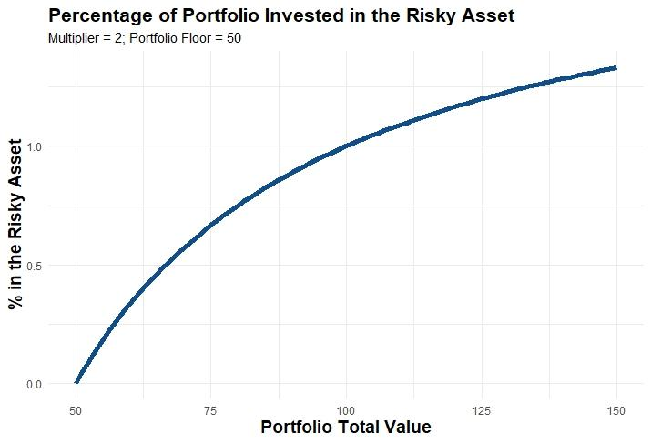

## Table of Contents

## What is Constant Proportion Portfolio Insurance (CPPI)?

Constant Proportion Portfolio Insurance (CPPI) is a strategy used by investors to protect their investments while still trying to grow them. It works by dividing the investment into two parts: a risky part, usually invested in stocks or funds, and a safe part, often in bonds or cash. The idea is to keep a certain amount of money safe, called the "floor," while using the rest to invest in riskier assets that could grow more.

The CPPI strategy adjusts the amount of money in the risky and safe parts based on how the investments are doing. If the value of the investments goes up, more money is moved into the risky part to try to make even more money. If the value goes down, money is moved back into the safe part to protect the floor. This way, the investor tries to balance the potential for growth with the need for safety.

## How does CPPI differ from traditional investment strategies?

CPPI is different from traditional investment strategies because it focuses on protecting a certain amount of money, called the floor, while still trying to grow the investment. In traditional strategies, like a simple stock and bond mix, the investor decides on a fixed split between risky and safe investments and usually sticks with it. With CPPI, the split between risky and safe investments changes all the time based on how the investments are doing. If the investments are doing well, more money goes into the risky part to try to make even more money. If the investments are doing poorly, more money goes into the safe part to protect the floor.

Another way CPPI differs is in how it reacts to market changes. Traditional strategies might rebalance the portfolio at set times, like once a year, to keep the original mix of investments. CPPI, on the other hand, adjusts the portfolio continuously. This means it can quickly move money around to either take advantage of good market conditions or protect against bad ones. This dynamic approach can help the investor stay safer during downturns and possibly make more money during upswings, but it also requires more active management and monitoring.

## What are the key components of a CPPI strategy?

The main parts of a CPPI strategy are the floor, the cushion, and the multiplier. The floor is the lowest amount of money the investor wants to keep safe. It's like a safety net that the investor doesn't want to fall below. The cushion is the extra money above the floor that the investor can use to take risks. It's the part of the money that can be put into stocks or other risky investments. The multiplier is a number that decides how much of the cushion should be put into risky investments. If the multiplier is 2, for example, then twice the cushion amount goes into risky investments.

CPPI works by always checking how much money is in the portfolio and adjusting where the money goes. If the investments are doing well and the portfolio value goes up, the cushion gets bigger. This means more money can be put into risky investments to try to make even more money. If the investments are doing poorly and the portfolio value goes down, the cushion gets smaller. This means less money goes into risky investments, and more stays in safe investments to protect the floor. This way, CPPI tries to balance the need for safety with the chance to grow the investment.

## Can you explain the concept of the 'cushion' in CPPI?

The cushion in CPPI is the extra money you have above the floor. The floor is the minimum amount of money you want to keep safe, and the cushion is what's left over after you set aside the floor. Think of the cushion as the money you can afford to take risks with. If your investments are doing well, the cushion gets bigger because your total money grows. If your investments are doing poorly, the cushion gets smaller because your total money shrinks.

The cushion is important because it decides how much money you can put into risky investments like stocks. In CPPI, you use a number called the multiplier to figure out how much of the cushion goes into risky investments. If the multiplier is 2, for example, you would put twice the amount of your cushion into risky investments. This way, the cushion helps you balance the need to keep your money safe with the chance to make more money by taking risks.

## How is the 'multiplier' used in CPPI, and what does it represent?

The multiplier in CPPI is a number that helps decide how much of your cushion you should put into risky investments. If your multiplier is 2, it means you will put twice the amount of your cushion into stocks or other risky things. If your multiplier is 3, you will put three times the amount of your cushion into risky investments. The multiplier is important because it helps you balance how much risk you want to take with your money.

The multiplier works by taking the cushion and multiplying it by this number to figure out how much money to put into risky investments. If your cushion is $10,000 and your multiplier is 2, you would put $20,000 into risky investments. But remember, you can only put as much money into risky investments as you have in total. So if your total money is less than what the multiplier says, you put in all the money you have. This way, the multiplier helps you decide how much to risk while trying to grow your money.

## What are the steps to implement a CPPI strategy?

To start using a CPPI strategy, you first need to decide on your floor, which is the minimum amount of money you want to keep safe. This could be the amount you need for something important, like buying a house or saving for retirement. Once you have your floor, you calculate your cushion, which is the extra money you have above the floor. Then, you choose a multiplier, which is a number that helps you decide how much of your cushion to put into risky investments like stocks. If your multiplier is 2 and your cushion is $10,000, you would put $20,000 into risky investments.

After setting up your floor, cushion, and multiplier, you need to keep checking your investments and adjusting them. If your investments are doing well and your total money goes up, your cushion gets bigger. This means you can put more money into risky investments to try to make even more money. If your investments are doing poorly and your total money goes down, your cushion gets smaller. This means you need to take money out of risky investments and put it into safe investments to protect your floor. You keep doing this over and over, always trying to balance the need to keep your money safe with the chance to grow it.

## What are the potential risks associated with using CPPI?

Using CPPI can be risky because it involves moving money between safe and risky investments all the time. If the market goes down a lot very quickly, you might not be able to move your money to safe investments fast enough. This could mean your money falls below the floor you set to keep safe. Also, if you use a high multiplier to try to make more money, you could lose a lot if the risky investments don't do well. It's a bit like trying to catch a falling knife; if you're not quick enough, you could get hurt.

Another risk is that CPPI needs a lot of watching and changing. You have to keep an eye on your investments and adjust them often. If you don't do this right, or if you miss a big market change, your strategy might not work as well as you hoped. Plus, moving money around a lot can cost you in fees and taxes, which can eat into your returns. So, while CPPI can help you try to grow your money while keeping some of it safe, it's not without its challenges and risks.

## How does CPPI perform in different market conditions?

CPPI can work well in markets that are going up or staying the same. When the market is going up, CPPI lets you put more money into risky investments like stocks. This can help you make more money because you're taking advantage of the good times. If the market stays the same, CPPI keeps your money safe by not moving it around too much. It tries to balance the need to grow your money with keeping it safe, which can be good when things are calm.

But CPPI can have problems when the market goes down a lot very quickly. If the market drops fast, you might not be able to move your money into safe investments quickly enough. This means your money could fall below the floor you set to keep safe. CPPI needs you to watch your investments and change them a lot, and if you miss a big market change, it might not work as well. So, while CPPI can be good in good or steady markets, it can be risky in bad markets.

## Can CPPI be used for long-term investment, and why or why not?

CPPI can be used for long-term investment, but it has some challenges. The strategy works by always trying to balance safety and growth. If the market is doing well over many years, CPPI can help you make more money by putting more into risky investments like stocks. This can be good for long-term goals like saving for retirement. But, CPPI needs a lot of watching and changing. You have to keep an eye on your investments and adjust them often, which can be hard to do over many years.

The main problem with using CPPI for the long term is that it can be risky if the market goes down a lot very quickly. If you can't move your money into safe investments fast enough, you might lose more than you planned. Also, moving money around a lot can cost you in fees and taxes, which can eat into your returns over time. So, while CPPI can work for long-term investment if you're willing to keep a close watch on it, it might not be the best choice for everyone because of the risks and the need for constant attention.

## What are some real-world examples of CPPI being used by investors or funds?

Some investors and funds have used CPPI to try to grow their money while keeping it safe. For example, some big banks and financial companies offer CPPI strategies to their clients. They might use CPPI to help people save for big things like buying a house or retiring. These banks and companies watch the markets and move the money around to try to make the most of good times and protect the money during bad times.

Another example is how some pension funds use CPPI. Pension funds need to keep a lot of money safe for people's retirement, but they also want to make that money grow. So, they might use CPPI to put some of the money into risky investments like stocks when the market is doing well, and move it back to safe investments like bonds when the market goes down. This way, they try to balance the need to keep the money safe with the chance to make more money over time.

## How can CPPI be adjusted to improve performance or reduce risk?

To improve how CPPI works or make it less risky, you can change the multiplier. The multiplier decides how much of your cushion goes into risky investments. If you use a lower multiplier, you put less money into risky things. This can make your strategy safer because you're not taking as big of a risk. But, it might also mean you don't make as much money when the market is doing well. If you use a higher multiplier, you put more money into risky things. This can help you make more money when the market is good, but it's also riskier because you could lose more if the market goes down.

Another way to adjust CPPI is to change how often you check and move your money around. If you check and adjust your investments more often, you might be able to react faster to market changes. This can help you move money into safe investments quicker if the market goes down, which can protect your floor better. But, checking and moving money around a lot can cost you more in fees and taxes. So, you have to think about how often you want to adjust your strategy to balance the need to react quickly with the costs of doing so.

## What are the advanced mathematical models used in optimizing CPPI strategies?

Advanced mathematical models used in optimizing CPPI strategies often involve using something called stochastic calculus. This is a way of figuring out how investments might change over time, taking into account that markets can be unpredictable. One common model is the Black-Scholes model, which helps predict how stock prices might move. By using this model, investors can better decide when to move money between risky and safe investments to keep their floor safe while trying to make more money. Another model is the Monte Carlo simulation, which runs many different scenarios to see how the CPPI strategy might work under different market conditions. This helps investors understand the risks and rewards of their strategy better.

Another important tool is dynamic programming, which helps find the best way to adjust the CPPI strategy over time. It looks at all the possible ways the market could go and figures out the best moves to make at each step to get the best results. This can be really helpful in figuring out the right multiplier to use and how often to adjust the portfolio. By using these advanced models, investors can make their CPPI strategy smarter and more likely to meet their goals, whether that's keeping their money safe or growing it as much as possible.

## What is CPPI and how can it be briefly explained?

Constant Proportion Portfolio Insurance (CPPI) is a portfolio management technique designed to protect investments against significant losses while still allowing for growth. At the heart of CPPI is the concept of establishing a "floor" value for the portfolio, a minimum threshold that the portfolio's value should not fall below. This concept acts as a risk management buffer, ensuring that the portfolio maintains a certain level of value even during adverse market conditions.

The CPPI strategy employs a dynamic allocation mechanism between risky assets, such as stocks, and conservative assets, such as bonds or money market instruments. The allocation decision is primarily driven by two critical components: the multiplier and the cushion. 

The cushion is calculated as the difference between the current portfolio value (PV) and the established floor value (F), expressed mathematically as:

$$
\text{Cushion} = PV - F
$$

This cushion represents the buffer that can be exposed to risky investments. The size of the cushion corresponds to how much the portfolio can afford to invest in riskier assets without breaching the floor value. 

The multiplier (m) is a predefined [factor](/wiki/factor-investing) that determines the aggressiveness of the investment approach. A higher multiplier indicates a more aggressive stance, increasing the proportion of the cushion allocated to risky assets. The investment in risky assets ($R$) can be calculated using the formula:

$$
R = m \times \text{Cushion}
$$

This formula implies that the portion of the portfolio allocated to risky assets is directly proportional to the cushion and the chosen multiplier. The remaining part of the portfolio is invested in conservative assets to maintain the floor.

In essence, CPPI allows investors to participate in the growth potential of risky investments while simultaneously maintaining a safeguard against drastic declines in portfolio value. This balancing act of risk and protection is achieved by continuously adjusting asset allocation based on the portfolio's current performance relative to its floor value.

## What are the mechanics and how do you calculate CPPI?

Constant Proportion Portfolio Insurance (CPPI) is structured around dynamically allocating assets between risky investments and conservative holdings. This dynamic allocation is achieved through the calculation of the "cushion" and application of a "multiplier". 

At the heart of CPPI is the concept that investments in risky assets are proportional to the cushion. The cushion is defined mathematically as:

$$

\text{Cushion} = \text{Portfolio Value} - \text{Floor Value} 
$$

Here, the portfolio value represents the current value of the entire portfolio, while the floor value is a pre-set minimum value below which the portfolio should not fall. This ensures a protective layer against significant losses.

Once the cushion is determined, the amount allocated to risky assets is calculated by applying a multiplier, which is a key parameter of the CPPI strategy. Mathematically, the investment in risky assets can be represented as:

$$

\text{Investment in Risky Assets} = \text{Multiplier} \times \text{Cushion} 
$$

The multiplier is selected based on the investor's risk appetite and prevailing market conditions. A higher multiplier increases potential gains but also amplifies exposure to risks. Conversely, a lower multiplier tends to provide greater protection but limits upside potential.

The choice of the multiplier is crucial. For instance, in volatile markets, a conservative multiplier could mitigate risks associated with sudden market drops, while in stable environments, a more aggressive multiplier might capitalize on growth opportunities.

In summary, the CPPI mechanism revolves around calculating the cushion and determining the proportion of the portfolio that should be invested in risky assets using a pre-defined multiplier. This structure offers a systematic approach to balancing risk and securing potential returns, allowing investors to dynamically respond to market fluctuations.

## What are the benefits and challenges of CPPI?

Constant Proportion Portfolio Insurance (CPPI) is a financial strategy that offers a structured method for managing investment risks while capitalizing on potential gains. This approach allows for the dynamic adjustment of asset allocation to respond to changing market conditions, providing a degree of protection against significant losses. One of CPPI's primary benefits is its ability to auto-adjust the allocation between risky and conservative assets without requiring the use of options, thereby simplifying the portfolio management process and reducing associated complexities.

The automatic reallocation feature of CPPI is pivotal in managing downside risk. By maintaining a floor value, the strategy ensures that the portfolio's value does not fall below a certain threshold. The allocation to risky assets is determined by the formula:

$$
\text{Investment in Risky Assets} = \text{Multiplier} \times (\text{Portfolio Value} - \text{Floor Value})
$$

This equation demonstrates how CPPI inherently protects against portfolio depreciation while allowing upside potential as the market appreciates.

Despite its strengths, CPPI is not without challenges. Transaction costs pose a substantial consideration, as the strategy requires frequent rebalancing of the portfolio to adhere to the underlying rules, particularly in volatile markets. These costs can erode returns and must be carefully managed to maximize the effectiveness of the strategy.

Another challenge is gap risk, which occurs when market movements are too rapid for the strategy to effectively respond. This risk is particularly pronounced during turbulent market conditions where asset prices can change swiftly, potentially causing the portfolio to breach its floor level.

Furthermore, the implementation of CPPI is highly dependent on real-time data availability and processing capabilities. Accurate and timely data feeds are necessary for the strategy to function as intended, necessitating robust technological infrastructure and systems capable of processing large volumes of information without delays.

In summary, CPPI offers investors a systematic approach to manage risks while harvesting potential market advances. However, its successful implementation requires careful attention to transactional efficiency, technological infrastructure, and the inherent challenges posed by volatile markets.

## References & Further Reading

For those interested in exploring Constant Proportion Portfolio Insurance (CPPI) in greater depth, several foundational works and resources can aid in understanding and implementing the strategy. Key theoretical contributions by Fischer Black and André Perold lay the groundwork for the CPPI strategy, illustrating its dynamic approach to asset allocation and risk management. Their seminal work helps to understand the mathematical underpinnings and practical implications of CPPI's core principles.

In addition to these foundational texts, a wealth of academic journal articles expand on various aspects of CPPI. These articles often incorporate empirical studies, simulations, and case analyses that demonstrate the strategy's performance relative to market conditions and investor sentiment. They also analyze modifications to the classical CPPI model, including the application of different multipliers and floors, offering insights into how these variables influence portfolio outcomes.

For practitioners interested in implementing CPPI using technology, exploring documentation from algorithmic trading platforms like Alpaca is advisable. These platforms often offer comprehensive guides and APIs that facilitate the automation of CPPI strategies. Such resources include practical examples and code snippets, typically in Python, that show how to automate portfolio rebalancing efficiently.

Moreover, a variety of investment strategy [books](/wiki/algo-trading-books) provide broader contexts into which CPPI fits, comparing it with other portfolio insurance strategies and exploring its integration with modern trading technologies.

In summary, the blend of theoretical works, empirical research, and practical resources creates a robust framework for understanding CPPI, enabling investors and researchers to leverage its potential in financial markets effectively.

