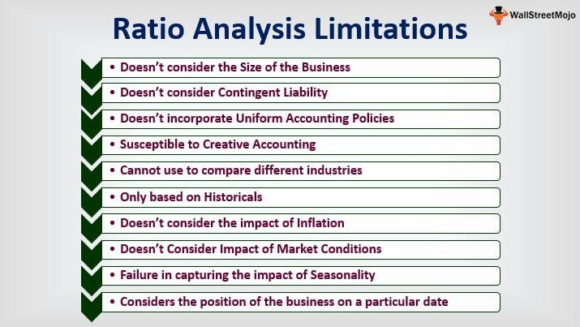

## Table of Contents

## What is a Constant Ratio Plan?

A Constant Ratio Plan is a type of investment strategy where you keep a fixed percentage of your money in different types of investments. For example, you might decide to always have 60% of your money in stocks and 40% in bonds. The main idea is to keep this ratio the same over time, even if the value of the stocks or bonds goes up or down.

To maintain the constant ratio, you need to buy or sell investments regularly. If the value of your stocks goes up a lot, they might become more than 60% of your portfolio. To fix this, you would sell some stocks and buy more bonds until you are back to the 60/40 split. This strategy helps you manage risk and keep your investment plan steady, but it requires you to keep an eye on your investments and make adjustments often.

## How does a Constant Ratio Plan work?

A Constant Ratio Plan is a way to manage your investments by keeping a set percentage of your money in different types of investments, like stocks and bonds. For example, you might decide to always have 60% of your money in stocks and 40% in bonds. The goal is to keep this 60/40 split the same, no matter what happens in the market. This means if the value of your stocks goes up a lot, they might become more than 60% of your total investments. To fix this, you would sell some of your stocks and use that money to buy more bonds until you're back to the 60/40 split.

To make this plan work, you need to check your investments regularly and make changes when needed. If the value of your stocks drops and they become less than 60% of your portfolio, you would buy more stocks with money from your bonds to get back to the right ratio. This strategy helps you manage risk because it forces you to sell high and buy low, which can lead to better returns over time. However, it does require you to keep an eye on your investments and be ready to make adjustments often.

## What are the main components of a Constant Ratio Plan?

A Constant Ratio Plan has two main parts: the ratio and the regular checks. The ratio is the set percentage of your money you want to keep in different types of investments, like stocks and bonds. For example, you might decide to always have 60% in stocks and 40% in bonds. This ratio is what you want to keep the same all the time. The regular checks are when you look at your investments to see if they still match your chosen ratio. If they don't, you need to make changes by buying or selling investments.

The other important part is making adjustments. If the value of your stocks goes up a lot, they might become more than 60% of your total money. To fix this, you would sell some stocks and buy more bonds until you're back to the 60/40 split. If the value of your stocks drops and they become less than 60%, you would buy more stocks with money from your bonds to get back to the right ratio. This strategy helps you manage risk because it makes you sell high and buy low, which can lead to better returns over time. But, it does mean you need to keep an eye on your investments and be ready to make changes often.

## What are the benefits of using a Constant Ratio Plan?

Using a Constant Ratio Plan can help you manage your investments better. It makes you keep a set percentage of your money in different types of investments, like stocks and bonds. This can help you balance risk because you're not putting all your money in one place. If one type of investment does really well, you might end up with too much of your money in it. The plan makes you sell some of that and buy more of the other type to keep things balanced. This can help protect your money if the market goes down.

Another benefit is that it can help you make more money over time. When you follow a Constant Ratio Plan, you end up selling investments when they are doing well and buying more when they are not doing as well. This is called "selling high and buying low," which is a good way to make money in the long run. It also makes you think about your investments regularly, which can help you stay on top of what's happening in the market and make smart choices.

## Can you provide a simple example of how a Constant Ratio Plan is implemented?

Imagine you have $10,000 to invest and you decide to use a Constant Ratio Plan with a 60/40 split between stocks and bonds. At the start, you put $6,000 in stocks and $4,000 in bonds. Over time, the value of your investments changes. Let's say after a few months, your stocks do really well and go up to $7,200, while your bonds stay at $4,000. Now, your total investment is $11,200, but the stocks are now about 64% of your portfolio instead of 60%.

To fix this, you need to sell some stocks and buy more bonds to get back to the 60/40 split. You sell $400 worth of stocks, bringing your stock value back to $6,800, and use that money to buy more bonds, increasing your bond value to $4,400. Now, you're back to having 60% in stocks and 40% in bonds, with a total investment of $11,200. By doing this regularly, you keep your investments balanced and manage your risk better.

## What historical events led to the development of the Constant Ratio Plan?

The Constant Ratio Plan was developed as a way to manage investments better, especially after big ups and downs in the stock market. One of the main events that led to its development was the stock market crash of 1929, which started the Great Depression. This crash showed people how risky it can be to have all your money in one type of investment. After this, investors started looking for ways to spread out their money and reduce risk. The Constant Ratio Plan was one of the ideas that came out of this time, as it helped people keep a balance between different types of investments.

Another event that helped shape the Constant Ratio Plan was the economic changes during and after World War II. During the war, many people had to rethink their investment strategies because of the uncertainty in the economy. After the war, as the economy started to grow again, investors wanted a way to keep their money safe while still making good returns. The Constant Ratio Plan became more popular because it offered a way to do this by regularly adjusting investments to maintain a set ratio. This approach helped investors feel more secure and in control of their money during times of economic change.

## Who were the key figures in the development of the Constant Ratio Plan?

The Constant Ratio Plan was developed by people who wanted to make investing safer and more balanced. One key figure was Benjamin Graham, who is often called the father of value investing. He wrote a lot about how to invest wisely and came up with ideas that helped shape the Constant Ratio Plan. Graham believed in spreading out investments to reduce risk, and his work after the 1929 stock market crash helped many people understand the importance of balancing their portfolios.

Another important person was Harry Markowitz, who developed the idea of Modern Portfolio Theory in the 1950s. His work showed how you could use math to figure out the best way to spread your money across different investments. This idea fit well with the Constant Ratio Plan because it also focused on keeping a balance between different types of investments. Markowitz's theories helped make the Constant Ratio Plan more popular and gave investors a scientific way to manage their money.

## How has the Constant Ratio Plan evolved over time?

The Constant Ratio Plan started as a simple way to balance investments after big events like the 1929 stock market crash. People wanted to keep their money safe, so they looked for ways to spread it out. The plan let them keep a set percentage of their money in different types of investments, like stocks and bonds. Over time, as more people learned about it, the plan got more popular. It helped investors feel more in control because they could adjust their investments regularly to keep the balance they wanted.

As time went on, the Constant Ratio Plan got better with new ideas and technology. In the 1950s, Harry Markowitz came up with Modern Portfolio Theory, which used math to help figure out the best way to spread out investments. This made the Constant Ratio Plan even more useful because it gave people a scientific way to manage their money. Today, with computers and the internet, it's easier to keep track of investments and make changes quickly. This means more people can use the Constant Ratio Plan to keep their investments balanced and manage risk better.

## What are the common criticisms or limitations of the Constant Ratio Plan?

One common criticism of the Constant Ratio Plan is that it can be hard to keep up with. You have to check your investments all the time and make changes to keep the right balance. This can take a lot of work and time, and if you don't do it right, your plan won't work well. Also, it can cost you money because every time you buy or sell investments, you might have to pay fees. These costs can add up and eat into your returns.

Another limitation is that the Constant Ratio Plan might not be the best choice for everyone. It works well for people who want to keep their investments balanced and are okay with making changes often. But if you like to buy investments and hold onto them for a long time without changing them, this plan might not be right for you. Also, the plan doesn't think about what's happening in the market right now. Sometimes, it might make sense to have more money in one type of investment because it's doing really well or because the economy is changing. The Constant Ratio Plan doesn't let you do that because it's all about keeping the same balance all the time.

## How does the Constant Ratio Plan compare to other investment strategies?

The Constant Ratio Plan is different from other investment strategies because it makes you keep a set percentage of your money in different types of investments, like stocks and bonds. For example, if you choose a 60/40 split, you always have to keep 60% of your money in stocks and 40% in bonds. This is different from a Buy and Hold strategy, where you buy investments and keep them for a long time without changing them. The Constant Ratio Plan makes you check your investments often and make changes to keep the balance you want. This can help you manage risk better because you're not putting all your money in one place.

Another strategy that's different from the Constant Ratio Plan is Dollar-Cost Averaging. With Dollar-Cost Averaging, you put the same amount of money into an investment at regular times, no matter what the price is. This can help you buy more when prices are low and less when prices are high. The Constant Ratio Plan is more about keeping a balance between different types of investments, while Dollar-Cost Averaging is about spreading out your investment over time. Both strategies can help you manage risk, but they do it in different ways. The Constant Ratio Plan might be better if you want to keep a specific balance, while Dollar-Cost Averaging might be easier if you want to invest without thinking about it too much.

## What advanced techniques can be used to optimize a Constant Ratio Plan?

To make a Constant Ratio Plan work better, you can use something called rebalancing bands. Instead of always trying to keep the exact same balance, like 60% stocks and 40% bonds, you set a range where you're okay with the balance being. For example, you might be fine if your stocks are between 55% and 65% of your money. This means you don't have to make changes as often, which can save you time and money on fees. Another way to optimize is by using tax-efficient rebalancing. This means thinking about how selling and buying investments might affect your taxes. You can sell investments that have gone down in value to get a tax break, or hold onto investments that have gone up to avoid paying taxes right away.

You can also use computer programs and math to make your Constant Ratio Plan better. These programs can look at a lot of data quickly and help you figure out the best times to make changes to your investments. They can also help you see how different balances might work out over time. Another advanced technique is to use different types of investments within each part of your plan. For example, instead of just having stocks, you could have stocks from different countries or different industries. This can help spread out your risk even more and make your plan work better in different situations.

## Can you discuss any case studies where the Constant Ratio Plan was successfully applied in real-world scenarios?

One real-world example of a successful Constant Ratio Plan was used by a big university's endowment fund. They decided to keep a 70/30 split between stocks and bonds. Over the years, they checked their investments every three months and made changes to keep the balance right. When the stock market did really well, they sold some stocks and bought more bonds to keep the 70/30 split. This helped them make good returns while keeping their risk low. Even when the market went down, their plan helped them stay balanced and not lose too much money.

Another example is a family who used the Constant Ratio Plan to save for their kids' college education. They chose a 60/40 split between stocks and bonds and checked their investments every six months. When the stock market went up, they sold some stocks and bought more bonds to keep the balance. This helped them grow their savings while keeping things safe. By the time their kids went to college, they had enough money to pay for it, and they felt good knowing they had managed their risk well with the Constant Ratio Plan.

## What is Algorithmic Trading and how does it relate to the Constant Ratio Plan?

Algorithmic trading, often referred to as algo trading, involves the use of sophisticated algorithms to automate the trading process. This technology-driven approach leverages speed and precision, executing trades based on predetermined criteria. The integration of [algorithmic trading](/wiki/algorithmic-trading) with investment strategies like the Constant Ratio Plan can significantly enhance the strategy's effectiveness.

The Constant Ratio Plan focuses on maintaining a fixed asset allocation by systematically rebalancing a portfolio. Generally, this involves buying underperforming assets and selling outperforming ones to restore the portfolio's predefined target allocation. Periodic rebalancing is a core component of this strategy, demanding timely and accurate adjustments to maintain optimal asset distribution.

Algorithms can automate the rebalancing process of the Constant Ratio Plan, ensuring adherence to the target allocation without the need for continuous human intervention. Automation not only minimizes human error but also allows for the execution of trades at the most favorable times, based on real-time market data. For instance, algorithmic systems can be programmed to monitor market fluctuations and initiate rebalancing when portfolio deviations exceed a specified threshold.

The mathematical foundation of this automation can be expressed through algorithms that determine when rebalancing should occur. A simple representation might include monitoring the deviation of asset weights from their target proportions:

$$
\text{Deviation} = \left| \frac{\text{Current Weight} - \text{Target Weight}}{\text{Target Weight}} \right|
$$

When the deviation exceeds a predefined limit, rebalancing actions are triggered.

Python code could be employed to implement such logic, as shown in the following example:

```python
def check_rebalance(portfolio, target_allocation, threshold):
    for asset, current_weight in portfolio.items():
        target_weight = target_allocation[asset]
        deviation = abs((current_weight - target_weight) / target_weight)

        if deviation > threshold:
            # Trigger rebalancing action
            rebalance_portfolio(portfolio, target_allocation)

def rebalance_portfolio(portfolio, target_allocation):
    # Simulate rebalancing logic
    for asset, target_weight in target_allocation.items():
        portfolio[asset] = target_weight
    print("Portfolio rebalanced to target allocation.")
```

By implementing automated rebalancing, investors benefit from enhanced precision and adherence to strategic objectives, allowing them to capitalize on market inefficiencies. Furthermore, integrating these advanced computational tools with algo trading platforms facilitates the management of large-scale portfolios, enhancing scalability and efficiency.

Overall, the synergy between algorithmic trading and the Constant Ratio Plan is evident. By harnessing the power of algorithms, investors can achieve improved execution speed, reduced costs, and disciplined adherence to investment strategies, ultimately optimizing financial outcomes in a competitive market landscape.

## References & Further Reading

[1]: Perold, A. F., Sharpe, W. F., & Treynor, J. L. (1988). ["Dynamic Strategies for Asset Allocation."](https://www.jstor.org/stable/4479087) Financial Analysts Journal, 44(1), 16-27.

[2]: Sharpe, William F. (1976). ["Imputing Expected Security Returns From Portfolio Composition."](https://www.jstor.org/stable/pdf/2329873.pdf) Journal of Financial and Quantitative Analysis, 11(3).

[3]: ["Portfolio Management Formulas: Mathematical Trading Methods for the Futures, Options, and Stock Markets"](https://archive.org/details/portfoliomanagem0000vinc) by Ralph Vince

[4]: Malkiel, B. G. (2003). ["A Random Walk Down Wall Street: The Time-Tested Strategy for Successful Investing."](https://yourknowledgedigest.org/wp-content/uploads/2020/04/a-random-walk-down-wall-street.pdf) W. W. Norton & Company.

[5]: Estrada, J. (2006). ["The Cost of Equity in Emerging Markets: A Downside Risk Approach."](https://people.duke.edu/~charvey/Teaching/BA456_2002/Estrada.pdf) International Journal of Finance & Economics, 11(3), 251-268.