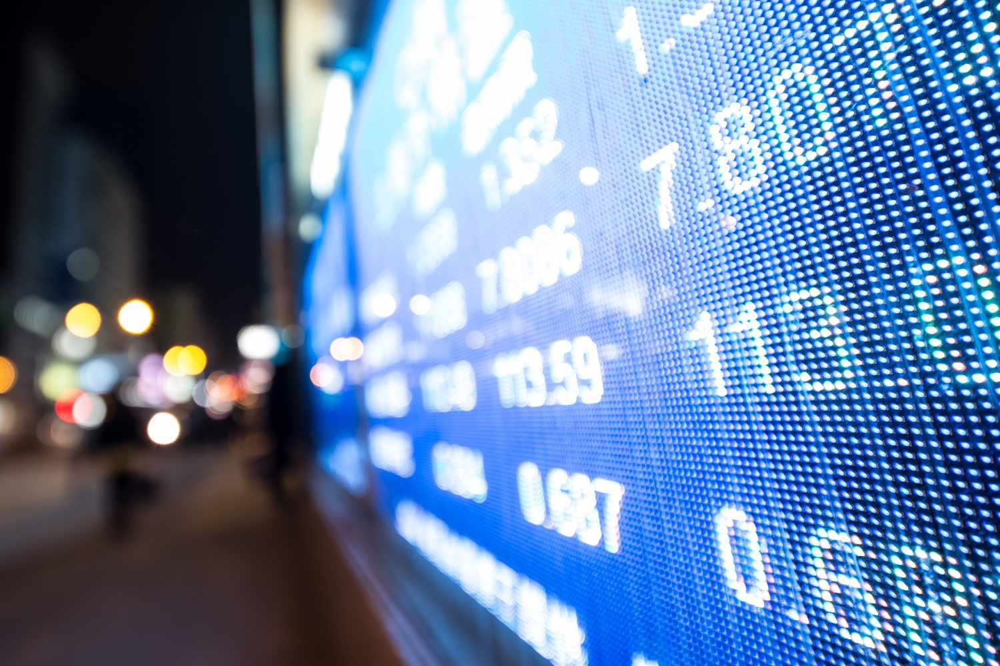

In the ever-evolving financial landscape, understanding yield calculations and algorithmic trading is crucial for investors seeking to optimize their portfolio strategies. Yield metrics, such as the constant yield method, are vital in bond valuation and influence investment decisions by providing a measure of the income generated from fixed-income securities relative to their price or face value. The constant yield method provides a more precise indication of return by accounting for the time value of money through discounted cash flow analysis, contrasting simpler approaches like current yield or coupon yield, which may not fully capture a bond's potential return over its lifetime.

Algorithmic trading, on the other hand, enhances market efficiency by executing trades at speeds and precision unachievable by human traders. It utilizes advanced computer algorithms to analyze large datasets, identify trading opportunities, and execute orders in fractions of a second. This rapid execution capability can help reduce transaction costs and improve liquidity, both critical elements for maintaining efficient and stable financial markets. The incorporation of artificial intelligence and machine learning technologies further advances algo trading by enabling adaptive strategies that better predict and react to market trends.



This article explores how merging yield calculation methods with algorithmic trading strategies can significantly enhance investment returns. By integrating these two elements, investors can make informed decisions quickly, reacting to changes in market conditions with greater agility, and improving the risk-reward profile of their investment portfolios. The synergy of precise yield calculations and the rapid execution of algo trading provides a compelling framework for navigating today's complex financial markets.

## Table of Contents

## Understanding Yield Calculations

Yield calculations are a fundamental aspect of evaluating the profitability of fixed-income securities, such as bonds. These calculations enable investors to understand the potential returns on their investments and make data-driven decisions. Two prominent methods for calculating yields are the constant yield method and the ratable accrual method. Each offers distinct perspectives on how bond yields can be assessed and interpreted.

The constant yield method, also known as the yield to maturity (YTM), focuses on the discounted present value of a bond's future cash flows. This method assumes that all future interest payments received are reinvested at the same rate as the bond's current yield. The formula for the constant yield method can be expressed as:

$$
P = \sum_{t=1}^{N} \frac{C}{(1 + Y)^t} + \frac{F}{(1 + Y)^N}
$$

Where:  
- $P$ is the price of the bond.  
- $C$ is the periodic coupon payment.  
- $F$ is the face value of the bond.  
- $Y$ is the yield to maturity.  
- $N$ is the total number of periods until maturity.  
- $t$ is the time period of a particular cash flow.

This calculation provides a comprehensive picture of the bond’s potential earnings if held until maturity, factoring in all interest payments and the redemption of the principal.

On the other hand, the ratable accrual method differs in its approach by allocating the bond's income over its lifetime based on interest earned rather than cash flow received. This method is particularly useful for understanding income generation over specific accounting periods, rather than focusing solely on the overall yield. The ratable accrual method often aligns better with accounting practices, where earnings are accrued evenly over time.

Both methods offer valuable insights into bond yields, enabling investors to tailor their strategies according to their desired level of precision and timeframe. The constant yield method is beneficial for long-term investors focused on the comprehensive returns of a bond. Meanwhile, the ratable accrual method provides a steady view of earnings over distinct periods, which can be advantageous for accounting and tax purposes.

Understanding these yield calculation methods aids investors in selecting the most appropriate bonds for their portfolios, thus optimizing their returns. By analyzing the yield to maturity through the constant yield method or focusing on periodic income with the ratable accrual method, investors can align their fixed-income investments with broader financial goals.

## The Constant Yield Method

The constant yield method is a technique used to determine the present value of a bond's future cash flows by applying a constant [interest rate](/wiki/interest-rate-trading-strategies), primarily referred to as the yield to maturity (YTM). This method provides a more accurate assessment of a bond's yield compared to basic yield calculations such as the coupon yield. While coupon yield simply takes into account the annual coupon payment in relation to the bond's current market price, the constant yield method considers the total returns expected over the bond's life.

In essence, the constant yield method involves discounting each of the bond's future cash flows, including both interest payments and the principal repayment, back to their present value at the bond’s yield to maturity. The sum of these discounted cash flows equates to the bond's current market price. This method is essential for investors seeking to understand the intrinsic value of a bond, beyond the nominal interest it pays annually.

Mathematically, the present value of the bond’s cash flows can be calculated using the formula:

$$

PV = \sum_{t=1}^{n} \frac{C}{(1 + YTM)^t} + \frac{F}{(1 + YTM)^n} 
$$

Where:
- $PV$ is the present value of the bond,
- $C$ is the coupon payment,
- $F$ is the face value of the bond,
- $t$ represents each time period, and
- $n$ is the number of periods until maturity.

Understanding the components of the constant yield method, particularly the yield to maturity, is essential for investors. Yield to maturity represents the internal rate of return on a bond, assuming the investor holds the bond until it matures and that all interim cash flows are reinvested at the same rate.

In practice, the constant yield method allows for more accurate comparisons between different bonds. By accounting for all future cash flows adjusted for their present value, this method enables investors to better understand the time value of money in relation to their investment, ultimately aiding in more informed decision-making.

## Algorithmic Trading Overview

Algorithmic trading uses computer algorithms to execute trading strategies with speed and efficiency, transforming the financial markets by automating processes that were traditionally manual. These algorithms analyze vast datasets at speeds much faster than the human brain, enabling investors to capitalize on market movements within fractions of a second.

One primary advantage of [algorithmic trading](/wiki/algorithmic-trading) is its ability to enhance market [liquidity](/wiki/liquidity-risk-premium). By enabling rapid execution of trades, algorithms ensure a constant presence of buy and sell orders, thereby narrowing the bid-ask spread. This liquidity boost not only benefits the individual trader but also contributes to market stability and efficiency as a whole. Additionally, algorithmic trading significantly reduces transaction costs by minimizing the manual intervention required in trade execution and increasing the [volume](/wiki/volume-trading-strategy) of trades executed per unit of time.

Algorithmic trading strategies often incorporate methods from [statistics](/wiki/bayesian-statistics) and [machine learning](/wiki/machine-learning) to refine decision-making. The integration of [artificial intelligence](/wiki/ai-artificial-intelligence) (AI) and machine learning is particularly transformative. Algorithms equipped with machine learning capabilities can analyze historical data to predict future market movements and adapt to changing market conditions in real-time. For instance, by using [reinforcement learning](/wiki/reinforcement-learning), a subset of machine learning, algorithms can improve their prediction accuracy over time by learning from past successes and failures.

Below is an example snippet in Python, illustrating the basic framework of an algorithmic trading strategy using machine learning:

```python
import numpy as np
import pandas as pd
from sklearn.ensemble import RandomForestClassifier
from sklearn.model_selection import train_test_split

# Load historical market data
data = pd.read_csv('market_data.csv')

# Feature extraction
# Example: price differences, moving averages
data['PriceDiff'] = data['Price'].diff()
data['MovingAverage'] = data['Price'].rolling(window=5).mean()

# Define target variable: upward or downward movement
data['Target'] = np.where(data['Price'].shift(-1) > data['Price'], 1, 0)

# Prepare dataset
X = data[['PriceDiff', 'MovingAverage']].dropna()
y = data['Target'].dropna()

# Split data into training and test sets
X_train, X_test, y_train, y_test = train_test_split(X, y, test_size=0.2, random_state=42)

# Training the model
model = RandomForestClassifier(n_estimators=100, random_state=42)
model.fit(X_train, y_train)

# Predicting market movement
predictions = model.predict(X_test)
```

This code demonstrates how machine learning models like Random Forest can be employed for predicting market movements based on historical data. Such algorithms, when combined with fast execution engines, enable traders to perform high-frequency trades, capitalizing on even the smallest price discrepancies.

The adaptability of these algorithms to diverse market conditions makes them an essential tool in modern trading. As technology continues to advance, the reliance on algorithmic trading is expected to grow, further revolutionizing the financial industry's landscape.

## Integrating Yield Calculations with Algo Trading

Integrating yield calculations with algorithmic trading can significantly enhance investment performance by merging analytical precision with computational efficiency. Yield calculations such as the constant yield method provide a detailed assessment of an asset's profitability over its lifetime by measuring the bond's yield to maturity. These calculations become instrumental when integrated with algorithmic trading strategies, which depend on high-speed data processing and decision-making.

Automating the yield calculation process is a critical step in this integration, as it ensures that investment decisions are based on accurate, up-to-date information, thereby reducing the likelihood of human error. Automated systems can quickly adapt to changes in market conditions by recalculating yields in real-time, allowing for more dynamic and responsive trading strategies.

For instance, an algorithm could be designed in Python to assess the yield to maturity (YTM) of a bond automatically, updating continuously as new market data comes in:

```python
def calculate_ytm(face_value, price, coupon_rate, years_to_maturity):
    ytm = (coupon_rate + (face_value - price) / years_to_maturity) / ((face_value + price) / 2)
    return ytm

# Example usage:
face_value = 1000
price = 950
coupon_rate = 0.05  # 5%
years_to_maturity = 10

ytm = calculate_ytm(face_value, price, coupon_rate, years_to_maturity)
print(f"The Yield to Maturity is: {ytm:.2%}")
```

This code allows traders to handle bonds with different characteristics efficiently, ensuring that yield calculations seamlessly integrate into an algorithmic trading system. Such integration facilitates continuous portfolio optimization by allowing algorithms to quickly assess and reallocate assets based on updated yield metrics, thus enhancing the portfolio's overall return.

Moreover, integrating yield calculations with algorithmic trading provides a robust risk management framework. By continuously analyzing yield data, algorithms can identify potential risks and adjust strategies accordingly, ensuring that portfolios remain aligned with investment goals and risk tolerance levels. This proactive approach to risk management can help mitigate potential losses during periods of market [volatility](/wiki/volatility-trading-strategies) and uncertainty.

Ultimately, the successful integration of yield calculations with algorithmic trading not only optimizes returns but also enhances the precision and reliability of investment strategies. By leveraging automation and advanced computational techniques, investors can stay ahead in an increasingly complex and dynamic financial landscape.

## Challenges and Considerations

Market volatility is a significant challenge for yield investing and algorithmic trading. Yield investing, which focuses on [earning](/wiki/earning-announcement) returns from fixed-income securities, is susceptible to interest rate fluctuations. Changes in market conditions can influence bond prices and affect yield calculations, leading to potential discrepancies between expected and actual returns. Moreover, high volatility can cause abrupt movements in asset prices, complicating the execution of algorithmic trading strategies that rely on stable market conditions to predict trends accurately.

Regulatory constraints also present a challenge. Financial markets are subject to regulations designed to ensure stability, fairness, and transparency. Algorithmic trading is heavily scrutinized due to concerns about market manipulation and flash crashes, leading to stringent compliance requirements. Traders and investors must navigate these rules, which can differ significantly across jurisdictions, increasing the complexity of executing automated strategies seamlessly.

Technological limitations can hinder the effectiveness of yield calculations and algorithmic trading. The speed at which data is processed and trades are executed depends on technological infrastructure. Inadequate technology can delay data analytics and trade execution, reducing the potential gains from algorithmic trading. Additionally, developing sophisticated algorithms that integrate yield calculations requires expertise in quantitative finance and computer science, posing a barrier for some investors.

Staying updated with market trends is essential for overcoming these challenges. Market dynamics and regulatory environments are continually evolving, necessitating regular monitoring and adaptation. Leveraging cutting-edge technology, such as artificial intelligence and machine learning, can help traders and investors adapt more quickly to changes. These technologies enhance the ability to analyze vast datasets, uncover patterns, and adjust strategies proactively.

For example, using Python, investors can create algorithms leveraging libraries like NumPy and Pandas for data analysis and Scikit-learn for machine learning. This integration allows for the development of predictive models that can anticipate market movements and optimize strategies in real-time, thus overcoming some of the inherent challenges of both yield investing and algorithmic trading. Here's a simple Python snippet to illustrate setting up a basic predictive model:

```python
import numpy as np
import pandas as pd
from sklearn.model_selection import train_test_split
from sklearn.ensemble import RandomForestRegressor

# Sample data preparation
data = pd.read_csv('market_data.csv')
X = data[['feature1', 'feature2', 'feature3']]
y = data['target']

# Train-test split
X_train, X_test, y_train, y_test = train_test_split(X, y, test_size=0.2, random_state=42)

# Model training
model = RandomForestRegressor(n_estimators=100, random_state=42)
model.fit(X_train, y_train)

# Model prediction
predictions = model.predict(X_test)
```

This model could be integrated into larger systems that perform real-time trading, continuously learning from new data to adjust investment decisions optimally. Adapting to market changes through such technological advancements can mitigate the challenges posed by volatility, regulation, and technical constraints.

## Conclusion

Integrating yield calculations with algorithmic trading creates a powerful synergy for optimizing investment outcomes. Yield calculations, such as the constant yield method, provide investors with detailed insights into the potential returns of fixed-income securities. This method offers a more nuanced perspective by focusing on the discounted value of future cash flows, thus allowing investors to make well-informed decisions grounded in financial fundamentals.

Algorithmic trading complements this approach by introducing speed and accuracy to the investment process. By employing complex algorithms and leveraging computational power, trades can be executed at high velocities that are impossible for manual trading. This results not only in enhanced market efficiency but also in reduced transaction costs, thus further bolstering potential returns.

To capitalize on the combined benefits of yield calculations and algorithmic trading, continuous learning and adaptation to technological advancements are crucial. The integration of artificial intelligence and machine learning into trading algorithms can further augment their predictive accuracy and adaptability to market fluctuations. This adaptability is essential, as it allows investors to adjust strategies in real time, leveraging vast datasets and evolving market conditions to fine-tune portfolios for risk management and return maximization.

Overall, the convergence of traditional yield calculation methods with state-of-the-art algorithmic trading systems provides a comprehensive framework for investors aiming to maximize their financial gains. By marrying these methodologies, investors can achieve a balance of insight, speed, and precision, positioning themselves advantageously within the complex global markets.

## References & Further Reading

[1]: ["Advances in Financial Machine Learning"](https://www.amazon.com/Advances-Financial-Machine-Learning-Marcos/dp/1119482089) by Marcos Lopez de Prado

[2]: ["Machine Learning for Algorithmic Trading"](https://github.com/stefan-jansen/machine-learning-for-trading) by Stefan Jansen

[3]: ["Quantitative Trading: How to Build Your Own Algorithmic Trading Business"](https://www.amazon.com/Quantitative-Trading-Build-Algorithmic-Business/dp/1119800064) by Ernest P. Chan

[4]: ["Evidence-Based Technical Analysis: Applying the Scientific Method and Statistical Inference to Trading Signals"](https://www.amazon.com/Evidence-Based-Technical-Analysis-Scientific-Statistical/dp/0470008741) by David Aronson

[5]: ["Fixed Income Securities: Tools for Today's Markets"](https://www.amazon.com/Fixed-Income-Securities-Markets-Finance/dp/1119835550) by Bruce Tuckman and Angel Serrat

[6]: ["Algorithmic Trading and DMA: An introduction to direct access trading strategies"](https://www.amazon.com/Algorithmic-Trading-DMA-introduction-strategies/dp/0956399207) by Barry Johnson