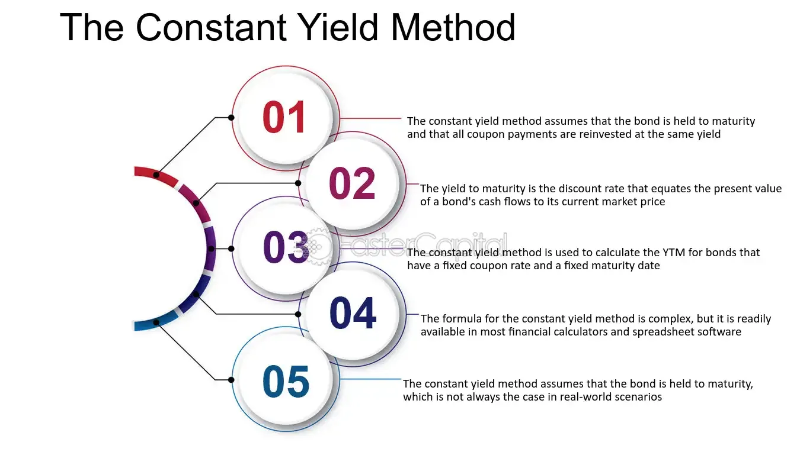

## Table of Contents

## What is the Constant Yield Method?

The Constant Yield Method is a way to figure out how much interest you earn on a bond over time. It's used when the bond is bought at a discount or a premium, meaning you pay less or more than the bond's face value. This method helps spread out the difference between the price you paid and the bond's face value evenly over the time until the bond matures. By doing this, you can calculate the interest income for each year more accurately.

Think of it like this: if you buy a bond for less than its face value, you'll earn more interest over time because the bond will be worth more when it matures. The Constant Yield Method makes sure that the extra interest you earn is spread out evenly each year. This way, your tax reports and financial statements show a steady increase in interest income, rather than a big jump at the end. It's a fair and systematic way to handle the interest from bonds bought at different prices.

## Why is the Constant Yield Method important in finance?

The Constant Yield Method is important in finance because it helps investors and companies figure out how much interest they earn on bonds over time. When you buy a bond for less or more than its face value, this method spreads out the difference evenly until the bond matures. This makes it easier to know how much interest income you get each year. It's like making sure you don't get a big surprise at the end but instead see steady growth in your earnings.

This method is also important for keeping financial records and tax reports accurate. By using the Constant Yield Method, you can show a steady increase in interest income on your financial statements. This helps everyone understand how the bond's value is growing over time. It's a fair way to handle the interest from bonds, making it easier for investors to plan their finances and for companies to report their earnings correctly.

## How does the Constant Yield Method differ from other amortization methods?

The Constant Yield Method is different from other amortization methods because it spreads out the difference between the bond's purchase price and its face value evenly over the bond's life. For example, if you buy a bond for less than its face value, you'll earn more interest over time. The Constant Yield Method makes sure this extra interest is added to your income smoothly each year. Other methods, like the Straight-Line Method, might not do this as smoothly. The Straight-Line Method just divides the total interest by the number of years until the bond matures, which can lead to uneven interest income.

Another way the Constant Yield Method differs is how it handles the interest rate. It uses the bond's yield to maturity, which is the total interest rate you'll earn if you hold the bond until it matures. This means the interest income you report each year is based on this rate, making it more accurate for tax and financial reporting. In contrast, other methods might use a simpler calculation that doesn't consider the bond's yield to maturity, which can make the interest income less accurate. By using the Constant Yield Method, you get a clearer picture of how your bond investment is growing over time.

## What are the basic steps to calculate using the Constant Yield Method?

To calculate using the Constant Yield Method, start by finding the bond's yield to maturity. This is the total interest rate you'll earn if you keep the bond until it matures. You can use a financial calculator or a spreadsheet to figure this out. Next, find out how much of the bond's face value you'll get back each year. This is called the annual accretion. To do this, take the difference between the bond's face value and what you paid for it, then spread it out evenly over the time until the bond matures. The annual accretion will be bigger each year because you're adding it to the bond's value.

After you know the annual accretion, you can figure out the interest income for each year. Take the bond's value at the start of the year, multiply it by the yield to maturity, and you get the interest income for that year. Add the annual accretion to the bond's value at the start of the year, and that becomes the bond's new value for the next year. Keep doing this for each year until the bond matures. This way, you'll see how the bond's value grows and how much interest income you get each year.

## Can you explain the formula used in the Constant Yield Method?

The Constant Yield Method uses a formula to figure out how much interest you earn on a bond each year. The main part of the formula is the bond's yield to maturity, which is the total interest rate you'll earn if you hold the bond until it matures. You take the bond's value at the start of the year and multiply it by this yield to maturity. This gives you the interest income for that year. Then, you add something called the annual accretion, which is the difference between the bond's face value and what you paid for it, spread out evenly over the time until the bond matures. The annual accretion gets bigger each year because you're adding it to the bond's value.

So, for each year, you start with the bond's value from the beginning of that year. You multiply this value by the yield to maturity to find the interest income for that year. Then, you add the annual accretion to this value, and that becomes the new value of the bond for the next year. You keep doing this for each year until the bond matures. This way, you can see how the bond's value grows over time and how much interest income you get each year. It's a fair and systematic way to handle the interest from bonds bought at different prices.

## What are the key components needed to apply the Constant Yield Method?

To use the Constant Yield Method, you need to know a few important things. First, you need the bond's yield to maturity. This is the total interest rate you'll earn if you keep the bond until it matures. You can find this out using a financial calculator or a spreadsheet. Second, you need the bond's face value and the price you paid for it. The difference between these two numbers is important because you'll spread it out over the time until the bond matures.

Once you have these numbers, you can start figuring out the interest income for each year. You take the bond's value at the start of the year and multiply it by the yield to maturity to find the interest income for that year. Then, you add the annual accretion, which is the difference between the bond's face value and what you paid for it, spread out evenly over the time until the bond matures. This annual accretion gets bigger each year because you're adding it to the bond's value. You keep doing this for each year until the bond matures, so you can see how the bond's value grows and how much interest income you get each year.

## How do you determine the yield rate in the Constant Yield Method?

To find the yield rate in the Constant Yield Method, you need to know the bond's face value, the price you paid for it, and how long until the bond matures. The yield rate is the total interest rate you'll earn if you hold the bond until it matures. You can use a financial calculator or a spreadsheet to figure this out. The idea is to see what interest rate makes the bond's future payments equal to what you paid for it today. This rate is called the yield to maturity, and it's important because it helps you know how much interest you'll earn over time.

Once you have the yield to maturity, you can use it to calculate the interest income for each year. You start with the bond's value at the beginning of the year and multiply it by the yield to maturity. This gives you the interest income for that year. Then, you add the annual accretion, which is the difference between the bond's face value and what you paid for it, spread out evenly over the time until the bond matures. This way, you can see how the bond's value grows and how much interest income you get each year until the bond matures.

## What are common challenges faced when applying the Constant Yield Method?

One common challenge when using the Constant Yield Method is figuring out the yield to maturity. This can be tricky because it involves using a financial calculator or a spreadsheet to find the right interest rate that makes the bond's future payments equal to what you paid for it today. If you don't have the right tools or if you make a mistake in your calculations, you might end up with the wrong yield rate, which can mess up your interest income calculations for each year.

Another challenge is keeping track of the bond's value and the annual accretion over time. The annual accretion is the difference between the bond's face value and what you paid for it, spread out evenly over the time until the bond matures. You need to add this to the bond's value each year, and it gets bigger each time. If you don't keep good records or if you miss a step, you might not get the right numbers for your interest income and the bond's growing value.

## How does the Constant Yield Method handle changes in interest rates?

The Constant Yield Method doesn't change how it works even if interest rates go up or down. It uses the bond's yield to maturity, which is the total interest rate you'll earn if you keep the bond until it matures. This yield rate stays the same from the time you buy the bond until it matures. So, even if interest rates in the market change, the way you calculate your interest income with the Constant Yield Method doesn't change.

This can be good because it gives you a steady way to figure out your interest income each year. But it can also be a challenge if interest rates go up a lot. If that happens, new bonds might offer higher interest rates, and your bond might not seem as good a deal anymore. Still, the Constant Yield Method keeps your calculations the same, so you know exactly how much interest income you'll get each year until your bond matures.

## Can you provide an example of the Constant Yield Method applied to a bond?

Let's say you buy a bond for $950 that has a face value of $1,000 and matures in 5 years. The bond's yield to maturity is 6%. To use the Constant Yield Method, you start with the bond's value at the beginning of the first year, which is $950. You multiply this by the yield to maturity (6%) to find the interest income for the first year. So, $950 times 6% gives you $57 in interest income for the first year. Then, you add the annual accretion, which is the difference between the face value and what you paid, spread out over 5 years. The difference is $50 ($1,000 - $950), so the annual accretion is $10 ($50 divided by 5 years). You add this $10 to the bond's value, making it $960 at the start of the second year.

For the second year, you take the new bond value of $960 and multiply it by the yield to maturity (6%) to find the interest income. So, $960 times 6% gives you $57.60 in interest income for the second year. You add the annual accretion again, which is still $10, making the bond's value $970 at the start of the third year. You keep doing this for each year until the bond matures. By the end of the fifth year, the bond's value will be $1,000, and you'll have earned interest income each year based on the bond's growing value and the constant yield to maturity. This way, you can see how the bond's value grows and how much interest income you get each year until it matures.

## What are the tax implications of using the Constant Yield Method?

When you use the Constant Yield Method, it can affect how you report your interest income on your taxes. This method helps you spread out the difference between what you paid for a bond and its face value evenly over the time until the bond matures. This means you report a little bit of the extra interest you earn each year, instead of all at once at the end. By doing this, you can keep your tax reports more accurate and avoid a big surprise when the bond matures.

For example, if you buy a bond for less than its face value, you'll earn more interest over time. The Constant Yield Method makes sure this extra interest is added to your income smoothly each year. This can help you plan your taxes better because you know how much interest income you'll have to report each year. It's a fair way to handle the interest from bonds, making it easier for you to stay on top of your taxes and financial planning.

## How can software tools assist in implementing the Constant Yield Method?

Software tools can make using the Constant Yield Method a lot easier. They can do the math for you, so you don't have to worry about making mistakes with the calculations. These tools can figure out the bond's yield to maturity, which is the total interest rate you'll earn if you keep the bond until it matures. They can also keep track of the bond's value and the annual accretion, which is the difference between the bond's face value and what you paid for it, spread out evenly over time. This way, you can see how much interest income you get each year without doing all the work yourself.

Using software tools also helps you stay organized. They can keep all your records in one place, so you can easily see how your bond's value is growing and how much interest income you've earned over time. This is really helpful when it comes to doing your taxes because you can report your interest income accurately each year. Plus, these tools can update automatically if anything changes, making sure your calculations are always up to date.

## What is the process for understanding yield calculations?

Yield calculations are a fundamental aspect of evaluating the profitability of fixed-income securities, such as bonds. These calculations enable investors to understand the potential returns on their investments and make data-driven decisions. Two prominent methods for calculating yields are the constant yield method and the ratable accrual method. Each offers distinct perspectives on how bond yields can be assessed and interpreted.

The constant yield method, also known as the yield to maturity (YTM), focuses on the discounted present value of a bond's future cash flows. This method assumes that all future interest payments received are reinvested at the same rate as the bond's current yield. The formula for the constant yield method can be expressed as:

$$
P = \sum_{t=1}^{N} \frac{C}{(1 + Y)^t} + \frac{F}{(1 + Y)^N}
$$

Where:  
- $P$ is the price of the bond.  
- $C$ is the periodic coupon payment.  
- $F$ is the face value of the bond.  
- $Y$ is the yield to maturity.  
- $N$ is the total number of periods until maturity.  
- $t$ is the time period of a particular cash flow.

This calculation provides a comprehensive picture of the bond’s potential earnings if held until maturity, factoring in all interest payments and the redemption of the principal.

On the other hand, the ratable accrual method differs in its approach by allocating the bond's income over its lifetime based on interest earned rather than cash flow received. This method is particularly useful for understanding income generation over specific accounting periods, rather than focusing solely on the overall yield. The ratable accrual method often aligns better with accounting practices, where earnings are accrued evenly over time.

Both methods offer valuable insights into bond yields, enabling investors to tailor their strategies according to their desired level of precision and timeframe. The constant yield method is beneficial for long-term investors focused on the comprehensive returns of a bond. Meanwhile, the ratable accrual method provides a steady view of earnings over distinct periods, which can be advantageous for accounting and tax purposes.

Understanding these yield calculation methods aids investors in selecting the most appropriate bonds for their portfolios, thus optimizing their returns. By analyzing the yield to maturity through the constant yield method or focusing on periodic income with the ratable accrual method, investors can align their fixed-income investments with broader financial goals.

## What is the Constant Yield Method?

The constant yield method is a technique used to determine the present value of a bond's future cash flows by applying a constant [interest rate](/wiki/interest-rate-trading-strategies), primarily referred to as the yield to maturity (YTM). This method provides a more accurate assessment of a bond's yield compared to basic yield calculations such as the coupon yield. While coupon yield simply takes into account the annual coupon payment in relation to the bond's current market price, the constant yield method considers the total returns expected over the bond's life.

In essence, the constant yield method involves discounting each of the bond's future cash flows, including both interest payments and the principal repayment, back to their present value at the bond’s yield to maturity. The sum of these discounted cash flows equates to the bond's current market price. This method is essential for investors seeking to understand the intrinsic value of a bond, beyond the nominal interest it pays annually.

Mathematically, the present value of the bond’s cash flows can be calculated using the formula:

$$

PV = \sum_{t=1}^{n} \frac{C}{(1 + YTM)^t} + \frac{F}{(1 + YTM)^n} 
$$

Where:
- $PV$ is the present value of the bond,
- $C$ is the coupon payment,
- $F$ is the face value of the bond,
- $t$ represents each time period, and
- $n$ is the number of periods until maturity.

Understanding the components of the constant yield method, particularly the yield to maturity, is essential for investors. Yield to maturity represents the internal rate of return on a bond, assuming the investor holds the bond until it matures and that all interim cash flows are reinvested at the same rate.

In practice, the constant yield method allows for more accurate comparisons between different bonds. By accounting for all future cash flows adjusted for their present value, this method enables investors to better understand the time value of money in relation to their investment, ultimately aiding in more informed decision-making.

## References & Further Reading

[1]: ["Advances in Financial Machine Learning"](https://www.amazon.com/Advances-Financial-Machine-Learning-Marcos/dp/1119482089) by Marcos Lopez de Prado

[2]: ["Machine Learning for Algorithmic Trading"](https://github.com/stefan-jansen/machine-learning-for-trading) by Stefan Jansen

[3]: ["Quantitative Trading: How to Build Your Own Algorithmic Trading Business"](https://www.amazon.com/Quantitative-Trading-Build-Algorithmic-Business/dp/1119800064) by Ernest P. Chan

[4]: ["Evidence-Based Technical Analysis: Applying the Scientific Method and Statistical Inference to Trading Signals"](https://www.amazon.com/Evidence-Based-Technical-Analysis-Scientific-Statistical/dp/0470008741) by David Aronson

[5]: ["Fixed Income Securities: Tools for Today's Markets"](https://www.amazon.com/Fixed-Income-Securities-Markets-Finance/dp/1119835550) by Bruce Tuckman and Angel Serrat

[6]: ["Algorithmic Trading and DMA: An introduction to direct access trading strategies"](https://www.amazon.com/Algorithmic-Trading-DMA-introduction-strategies/dp/0956399207) by Barry Johnson