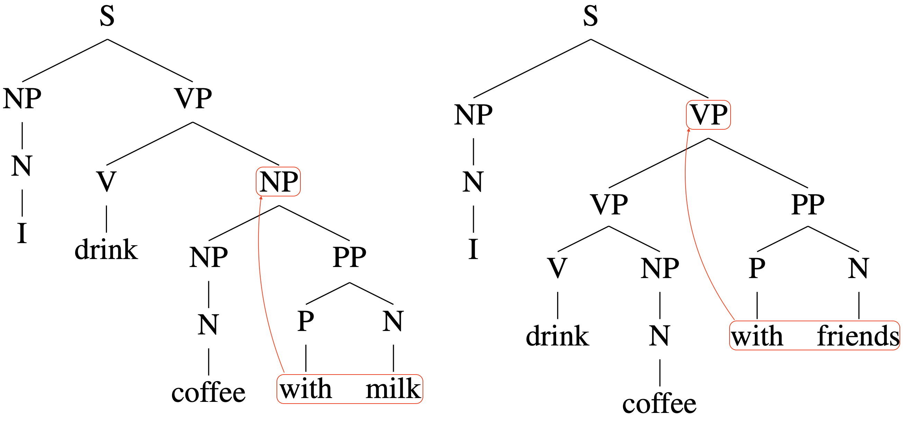

## Table of Contents

## What is constituency parsing in the context of natural language processing?

Constituency parsing is a way to break down a sentence into smaller parts, called constituents, to understand its structure. It's like taking apart a puzzle to see how all the pieces fit together. In natural language processing, this helps computers understand the meaning of sentences better. For example, a sentence like "The cat sat on the mat" can be broken down into phrases like "The cat" (a noun phrase) and "sat on the mat" (a verb phrase).

This type of parsing uses a tree-like structure, called a parse tree, to show how the sentence is organized. The tree starts with the whole sentence at the top and branches out into smaller and smaller parts until it reaches individual words at the bottom. This helps in figuring out which words go together and how they relate to each other. For instance, in the sentence "The cat sat on the mat," "on the mat" is a prepositional phrase that tells us where the cat sat. By understanding these relationships, computers can better process and interpret human language.

## How does constituency parsing differ from dependency parsing?

Constituency parsing and dependency parsing are two different ways to understand the structure of sentences in natural language processing. Constituency parsing looks at how a sentence can be broken down into smaller parts, called constituents. These parts are grouped together in a tree-like structure, where each branch shows how words or phrases are related to each other. For example, in the sentence "The cat sat on the mat," constituency parsing would show that "The cat" is a noun phrase and "sat on the mat" is a verb phrase. This helps to see the hierarchical structure of the sentence.

On the other hand, dependency parsing focuses on the relationships between individual words in a sentence. Instead of grouping words into phrases, it creates a network of dependencies where each word is connected to another word that it depends on. In the same sentence, "The cat sat on the mat," dependency parsing would show that "cat" depends on "sat," and "on" depends on "sat," while "mat" depends on "on." This approach is more about understanding the direct connections between words rather than the overall structure of the sentence.

Both methods have their uses. Constituency parsing is good for understanding the overall structure and can be helpful in tasks like machine translation or text summarization. Dependency parsing, with its focus on word-to-word relationships, is often used in tasks like information extraction or sentiment analysis. Each method provides a different perspective on how sentences are organized and understood.

## What are the basic components of a constituency parse tree?

A constituency parse tree is made up of nodes and edges. The nodes represent words or groups of words, called constituents. At the top of the tree, there's a single node called the root node, which represents the whole sentence. As you move down the tree, the nodes get smaller and smaller until you reach the leaves, which are the individual words of the sentence. The edges connect these nodes and show how the smaller parts fit together to make the bigger parts.

Each node in the tree is labeled with a part of speech or a phrase type. For example, a node might be labeled as a noun (N), a verb (V), a noun phrase (NP), or a verb phrase (VP). These labels help show the role of each part in the sentence. The structure of the tree follows certain grammar rules, like how a noun phrase can be made up of a determiner and a noun, or how a sentence can be made up of a noun phrase and a verb phrase. By looking at the tree, you can see how the sentence is put together and understand its meaning better.

## What are some common algorithms used for constituency parsing?

One common algorithm for constituency parsing is the CKY (Cocke-Kasami-Younger) algorithm. It's used for parsing sentences based on context-free grammars. The CKY algorithm works by filling in a chart, which is a table where each cell represents a possible constituent in the sentence. It starts from the bottom of the chart and works its way up, checking if smaller parts can be combined into larger parts according to the grammar rules. This method is efficient and can handle ambiguity in sentences, making it a popular choice for parsing.

Another approach is the Recursive Descent Parsing, which is simpler but can be less efficient. This method uses a set of recursive functions, each representing a rule in the grammar. It tries to match the input sentence against these rules, moving from left to right. If a rule matches, it calls other functions to match the rest of the sentence. This can be straightforward to implement but may struggle with left-recursive grammars and can be slow for complex sentences.

A more modern approach is the use of neural networks, specifically models like the LSTM (Long Short-Term Memory) or Transformer-based models. These models learn to predict the structure of a sentence from examples, rather than relying on predefined grammar rules. They can handle a wide variety of sentence structures and are often more accurate than traditional algorithms, especially for languages with complex grammar. However, they require large amounts of training data and computational power.

## How do machine learning models approach constituency parsing?

Machine learning models approach constituency parsing by learning from examples. Instead of using fixed grammar rules, these models look at lots of sentences and their parse trees. They try to find patterns in how words and phrases are put together. A common type of model used for this is called a [neural network](/wiki/neural-network). These models can be trained on large datasets to predict the structure of new sentences they haven't seen before. They learn to recognize which words go together and how they fit into the overall sentence structure.

One popular method is using models like Long Short-Term Memory (LSTM) or Transformer-based models. These models are good at understanding the context of words in a sentence. They can look at the whole sentence at once and figure out how to break it into smaller parts. For example, an LSTM model can process the sentence "The cat sat on the mat" and predict that "The cat" is a noun phrase and "sat on the mat" is a verb phrase. These models need a lot of data to train on, but once trained, they can be very accurate at parsing new sentences.

## What datasets are commonly used for training constituency parsing models?

One of the most commonly used datasets for training constituency parsing models is the Penn Treebank. This dataset contains a large collection of sentences from the Wall Street Journal, along with their parse trees. Researchers use these sentences and trees to teach models how to break down new sentences into their parts. The Penn Treebank is popular because it has a lot of examples and covers a wide range of sentence structures, which helps the models learn well.

Another dataset that is often used is the English Web Treebank. This dataset includes sentences from the internet, which can be more varied and informal than the sentences in the Penn Treebank. Using the English Web Treebank helps models learn to parse sentences that people might use in everyday conversations or on social media. By training on different kinds of sentences, the models can become better at understanding and parsing a wide variety of language.

## What are the challenges faced when training a constituency parser?

Training a constituency parser can be tricky because it needs a lot of data to learn from. The parser has to understand how different words and phrases fit together in sentences, which can be hard when the sentences are complex or use unusual structures. Sometimes, the data used for training might not cover all the ways people can say things, so the parser might struggle with sentences it hasn't seen before. Also, getting good data can be expensive and time-consuming because someone has to label each sentence with its correct parse tree.

Another challenge is that constituency parsing can be slow, especially for long or complicated sentences. The parser has to try many different ways to break down a sentence before finding the right one, which can take a lot of computing power. This can make it hard to use the parser in real-time applications where speed is important. Researchers are always trying to find ways to make parsers faster and more accurate, but it's a tough problem to solve.

## How can the performance of a constituency parser be evaluated?

To evaluate the performance of a constituency parser, researchers often use a metric called the F1 score. The F1 score is a way to measure how well the parser's guesses match the correct parse trees. It looks at two things: precision, which is how many of the parser's guesses were right, and recall, which is how many of the correct answers the parser found. The F1 score combines these two numbers into one score that shows how good the parser is overall. A higher F1 score means the parser is doing a better job at breaking down sentences into their parts.

Another way to check a parser's performance is by using a dataset that has already been labeled with correct parse trees. Researchers can run the parser on this dataset and compare its results to the correct answers. If the parser's parse trees match the correct ones closely, it means the parser is working well. Sometimes, people also look at specific parts of sentences, like noun phrases or verb phrases, to see if the parser is good at identifying those. By looking at different parts and using different metrics, researchers can get a full picture of how well the parser is doing.

## What are some advanced techniques used to improve the accuracy of constituency parsing?

One advanced technique to improve the accuracy of constituency parsing is using neural networks, especially models like Long Short-Term Memory (LSTM) or Transformer-based models. These models can learn from a lot of example sentences and their parse trees. By looking at these examples, the models can figure out patterns in how words and phrases fit together. This helps them make better guesses about the structure of new sentences they haven't seen before. Researchers often train these models on big datasets like the Penn Treebank to make them more accurate.

Another technique is called ensemble methods, where multiple parsers are used together to make a final decision. Each parser might have a different way of breaking down sentences, and by combining their guesses, the final parse tree can be more accurate. For example, if one parser thinks "The cat sat on the mat" should be broken down one way, and another parser thinks it should be broken down differently, an ensemble method can look at both and choose the best answer. This can help catch mistakes that a single parser might make and improve the overall accuracy of the parsing.

## How does the choice of features impact the performance of a constituency parser?

The choice of features can really change how well a constituency parser works. Features are the little bits of information the parser uses to guess how a sentence should be broken down. For example, if a parser looks at the part of speech of each word, like whether it's a noun or a verb, it can make better guesses about how words fit together. Other features might include the position of words in the sentence or special markers that show how words relate to each other. Using the right features helps the parser understand the structure of sentences better, which leads to more accurate parsing.

Sometimes, using more features can make the parser more accurate, but it can also make it slower. If a parser tries to look at too many things at once, it might take longer to figure out the best way to break down a sentence. So, it's important to choose features that are helpful without making the parser too slow. By finding the right balance, researchers can make sure the parser works well and quickly, which is important for using it in real-life situations where speed matters.

## What role does context play in constituency parsing, and how can it be modeled?

Context is super important in constituency parsing because it helps the parser understand how words fit together in a sentence. When a parser looks at a sentence, it doesn't just see the words one by one; it also sees how those words relate to each other. For example, in the sentence "The cat sat on the mat," the word "sat" tells us something about what the cat did, and "on the mat" tells us where it happened. By looking at the context, the parser can figure out that "The cat" is a noun phrase and "sat on the mat" is a verb phrase. This makes the parser's guesses about the sentence structure more accurate.

To model context, parsers often use special methods like Long Short-Term Memory (LSTM) or Transformer models. These models are good at remembering what came before and after each word in a sentence. They can look at the whole sentence at once and figure out how the words connect to each other. For example, an LSTM model can process the sentence and understand that "on the mat" goes with "sat" because of their positions and meanings. By using these models, parsers can get a better sense of the context and make smarter decisions about how to break down sentences into their parts.

## What are the current state-of-the-art models for constituency parsing, and what makes them effective?

The current state-of-the-art models for constituency parsing often use Transformer-based architectures, like the BERT (Bidirectional Encoder Representations from Transformers) model. These models are effective because they can look at the whole sentence at once and understand the context of each word really well. They learn from huge amounts of text data and can figure out how words and phrases fit together in different sentences. This makes them good at parsing even tricky or unusual sentences. For example, a BERT-based parser can understand that in the sentence "The cat sat on the mat," "The cat" is a noun phrase and "sat on the mat" is a verb phrase, by looking at the context of each word.

Another effective model is the Self-Attentive Parser, which also uses attention mechanisms to focus on different parts of the sentence. This model can weigh the importance of each word and its relationship to others, which helps it make better guesses about the sentence structure. By paying attention to the context and the connections between words, these models can achieve high accuracy in constituency parsing. They are often trained on large datasets like the Penn Treebank, which helps them learn a wide variety of sentence structures and improve their performance.