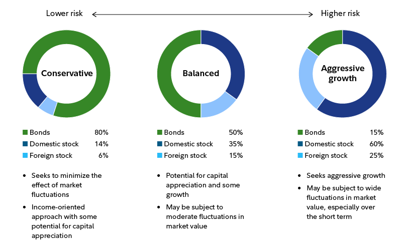

## Table of Contents

## What is an ETF and how does it work?

An ETF, or Exchange-Traded Fund, is a type of investment that works a lot like a mutual fund but trades on a stock exchange like a stock. It's a basket of securities, like stocks, bonds, or commodities, that you can buy or sell throughout the day at market prices. This makes it easy for people to invest in a wide range of assets without having to buy each one separately.

ETFs are popular because they offer a simple way to diversify your investments. For example, if you want to invest in the technology sector, you can buy an ETF that holds shares of many tech companies instead of buying each company's stock one by one. This can help spread out risk and make it easier to manage your portfolio. Plus, ETFs usually have lower fees than actively managed mutual funds, which can save you money over time.

## Why should someone consider building an all-ETF portfolio?

Building an all-ETF portfolio can be a smart move for many people because it's easy and can save you money. ETFs usually have lower fees than other types of funds, like mutual funds. This means you get to keep more of your money over time. Plus, since ETFs trade like stocks, you can buy and sell them anytime during the trading day, which gives you more control over your investments.

Another big reason to consider an all-ETF portfolio is that it helps you spread out your risk. By investing in different ETFs, you can own a little bit of a lot of different companies or types of investments. This is called diversification, and it can help protect your money if one part of the market goes down. It's like not putting all your eggs in one basket. So, an all-ETF portfolio can be a simple way to build a strong, diversified investment plan.

## How do you choose the right ETFs for a diversified portfolio?

To pick the right ETFs for a diversified portfolio, you first need to think about your goals and how much risk you're okay with. Do you want to grow your money over a long time, or are you saving for something you'll need soon? Are you okay with big ups and downs in your investments, or do you prefer something more steady? Once you know your goals and risk level, you can start looking at ETFs that match what you're looking for. For example, if you want to grow your money over time, you might pick ETFs that focus on stocks. If you want something more stable, you might choose ETFs that invest in bonds.

Next, think about spreading your money across different types of investments. This means picking ETFs that cover different parts of the market, like stocks from different countries, different sizes of companies, or different industries. For example, you might choose an ETF that focuses on U.S. stocks, another that looks at international stocks, and another that invests in bonds. This way, if one part of the market goes down, the other parts might help balance it out. Also, look at the fees of the ETFs. Lower fees mean you keep more of your money over time. By choosing ETFs wisely, you can build a portfolio that fits your goals and helps you manage risk.

## What are the key factors to consider when selecting ETFs?

When you're picking ETFs, it's important to think about what you want to achieve with your money. Are you saving for a long time, like for retirement, or do you need the money sooner? This will help you decide if you should go for ETFs that focus on growth, like stock ETFs, or ones that are more stable, like bond ETFs. Also, consider how much risk you're comfortable with. If big changes in your investments make you nervous, you might want to pick ETFs that are less likely to go up and down a lot.

Another thing to think about is spreading your money across different types of investments. This means picking ETFs that cover different parts of the market, like stocks from different countries or different industries. This can help protect your money if one part of the market goes down. Also, pay attention to the fees of the ETFs. Lower fees mean you get to keep more of your money over time. By choosing ETFs that match your goals and help you manage risk, you can build a strong portfolio.

## How much should you allocate to different asset classes in an ETF portfolio?

Deciding how much money to put into different types of investments in your ETF portfolio depends on your goals and how much risk you're okay with. If you're saving for a long time, like for retirement, you might want to put more money into stock ETFs because they can grow a lot over time. But if you need the money sooner, you might want to put more into bond ETFs because they're usually more stable. A common way to start is by using the "60/40" rule, which means putting 60% of your money into stock ETFs and 40% into bond ETFs. But you can change this based on what you want and how much risk you're comfortable with.

As you get older or your goals change, you might need to adjust how much you have in different types of ETFs. For example, if you're getting closer to when you need the money, you might want to move some of your money from stock ETFs to bond ETFs to make your portfolio more stable. It's also a good idea to spread your money across different parts of the market, like stocks from different countries or different industries. This can help protect your money if one part of the market goes down. By keeping an eye on your portfolio and making changes when you need to, you can make sure it stays in line with your goals and how much risk you're okay with.

## What are the costs associated with ETFs and how do they impact returns?

ETFs have some costs that can affect how much money you make from them. The main cost is the expense ratio, which is a small percentage of your money that the ETF charges every year to cover its costs. This fee is taken out of your investment, so the lower the expense ratio, the more money you get to keep. Another cost can be trading commissions, but many brokers now offer commission-free trading for ETFs, so you might not have to pay this if you choose the right broker. There can also be small costs when the ETF buys or sells its investments, but these are usually pretty small and don't affect your returns much.

These costs can add up over time and eat into your returns. For example, if you invest $10,000 in an ETF with a 0.25% expense ratio, you'll pay $25 a year in fees. Over 20 years, that's $500, and that money could have been growing in your investment instead. So, it's a good idea to pick ETFs with low expense ratios to keep more of your money. But remember, while costs are important, they're not the only thing to think about. You also need to make sure the ETFs you choose fit your investment goals and help you spread out your risk.

## How often should you rebalance an ETF portfolio?

You should rebalance your ETF portfolio about once a year, but you can do it more often if you want to. Rebalancing means adjusting your investments to make sure they still match your goals and how much risk you're okay with. If some of your ETFs have grown a lot and others haven't, your portfolio might not be as balanced as it used to be. By rebalancing, you sell some of the ETFs that have grown a lot and buy more of the ones that haven't, to get back to your original plan.

Sometimes, big changes in the market or in your life might mean you need to rebalance more often. For example, if the stock market goes up a lot, your stock ETFs might become a bigger part of your portfolio than you planned. Or if you're getting closer to when you need the money, you might want to move some of your money from stock ETFs to bond ETFs to make your portfolio more stable. By keeping an eye on your portfolio and rebalancing when you need to, you can make sure it stays in line with your goals and how much risk you're okay with.

## What are the tax implications of investing in ETFs?

When you invest in ETFs, you need to think about taxes. ETFs can be more tax-friendly than mutual funds because of how they work. When you sell an ETF, you might have to pay capital gains tax on any profit you make. If you hold the ETF for more than a year, you'll pay long-term capital gains tax, which is usually lower than the short-term capital gains tax you pay if you sell it in less than a year. Also, ETFs often have lower capital gains distributions than mutual funds, which means you might not have to pay as much in taxes each year.

Another thing to think about is dividends. If the ETFs you own pay dividends, you'll have to pay taxes on those too. The tax rate on dividends can be different depending on whether they're qualified or non-qualified dividends. Qualified dividends are usually taxed at a lower rate, similar to long-term capital gains. Non-qualified dividends are taxed at your regular income tax rate. By understanding these tax rules, you can make smarter choices about which ETFs to buy and when to sell them to keep more of your money.

## How can you use ETFs to achieve specific investment goals, such as income or growth?

If your goal is to grow your money over time, you should look at ETFs that focus on stocks. Stock ETFs, especially those that invest in companies that are growing fast, can help your money grow a lot. For example, ETFs that invest in technology or emerging markets can be good choices for growth. These ETFs might go up and down a lot, but over many years, they can help your investments get bigger. Just remember, with more growth potential comes more risk, so make sure you're okay with that.

If you want to get regular income from your investments, you should think about ETFs that pay dividends or invest in bonds. Dividend ETFs give you a part of the profits from the companies they hold, and this can give you a steady stream of money. Bond ETFs, especially those that focus on high-quality bonds, can also give you regular income and are usually less risky than stock ETFs. By choosing the right ETFs, you can set up your portfolio to give you the income you need while still keeping some of your money safe.

## What are some advanced strategies for optimizing an ETF portfolio?

One advanced strategy for optimizing an ETF portfolio is to use sector rotation. This means changing which parts of the market you invest in based on where the economy is in its cycle. For example, if you think the economy is going to grow a lot, you might put more money into ETFs that focus on sectors like technology or consumer goods. But if you think the economy might slow down, you could move some of your money into ETFs that invest in more stable sectors like utilities or healthcare. By doing this, you can try to take advantage of different parts of the market at different times and maybe get better returns.

Another strategy is to use tax-loss harvesting. This means selling ETFs that have gone down in value to get a tax break, and then buying similar ETFs to keep your portfolio balanced. For example, if one of your ETFs loses value, you can sell it and use the loss to lower your taxes. Then, you can buy another ETF that's similar but not exactly the same, so you don't run into what's called the "wash-sale" rule. This can help you save money on taxes and keep your portfolio in line with your goals.

A third strategy is to use leverage or inverse ETFs to try to get bigger returns or protect your portfolio. Leveraged ETFs aim to give you returns that are two or three times what the market does, but they're also a lot riskier. Inverse ETFs, on the other hand, go up when the market goes down, so they can help you make money if you think the market is going to fall. These kinds of ETFs can be useful, but they're more complicated and risky, so you need to understand them well before you use them. By using these strategies wisely, you can try to make your ETF portfolio work better for you.

## How do you monitor and evaluate the performance of your ETF portfolio?

To keep an eye on your ETF portfolio, you should check it regularly, maybe once every few months or at least once a year. Look at how each ETF is doing compared to the market or a benchmark like the S&P 500. You can do this by looking at the ETF's returns over time. Also, think about how the ETFs are doing compared to your goals. Are they helping your money grow or giving you the income you need? If some ETFs are doing much better or worse than others, you might need to make some changes to keep your portfolio balanced.

Another way to evaluate your ETF portfolio is by looking at how much risk you're taking. Are the ETFs you picked still fitting with how much risk you're okay with? If the market changes a lot, or if your goals change, you might need to adjust your portfolio. Also, keep an eye on the fees you're paying. High fees can eat into your returns over time, so if you find ETFs with lower fees that still fit your goals, it might be a good idea to switch. By regularly checking and adjusting your portfolio, you can make sure it keeps working well for you.

## What are the common pitfalls to avoid when constructing an all-ETF portfolio?

When you're building an all-ETF portfolio, one big mistake to avoid is not spreading your money out enough. If you put all your money into just a few ETFs or into ETFs that are too similar, you're not really diversifying your investments. This can be risky because if one part of the market goes down, your whole portfolio could be affected. So, make sure to pick ETFs that cover different parts of the market, like stocks from different countries or different industries, to help protect your money.

Another common pitfall is not paying attention to fees. ETFs have costs, like the expense ratio, which is a small percentage of your money that the ETF charges every year. These fees can add up over time and eat into your returns. So, it's a good idea to choose ETFs with low fees to keep more of your money. Also, don't forget to think about taxes. Selling ETFs can lead to capital gains taxes, and if you're not careful, you might end up paying more in taxes than you need to. By being aware of these common mistakes, you can build a stronger, more effective ETF portfolio.

## References & Further Reading

[1]: Hill, J. M., Nadig, D., & Hougan, M. L. (2015). ["A Comprehensive Guide to Exchange-Traded Funds (ETFs) for Investment Advisors."](https://www.cfainstitute.org/sites/default/files/-/media/documents/book/rf-publication/2015/rf-v2015-n3-1-pdf.pdf) CFA Institute Research Foundation.

[2]: Narang, R. K. (2013). ["Inside the Black Box: The Simple Truth About Quantitative Trading."](https://onlinelibrary.wiley.com/doi/book/10.1002/9781118267738) John Wiley & Sons.

[3]: Johnson, B. (2009). ["Algorithmic Trading & DMA: An Introduction to Direct Access Trading Strategies."](https://archive.org/details/algorithmictradi0000john) 4Myeloma Press.

[4]: Gastineau, G. L. (2002). ["Exchange-Traded Funds Manual."](https://archive.org/details/exchangetradedfu0000gast) John Wiley & Sons.

[5]: Latimore, D. (2020). ["ETF Investment Strategies: Best Practices from Leading Experts on Constructing a Winning ETF Portfolio."](https://archive.org/details/etfinvestmentstr0000ulla) CFA Institute Research Foundation.