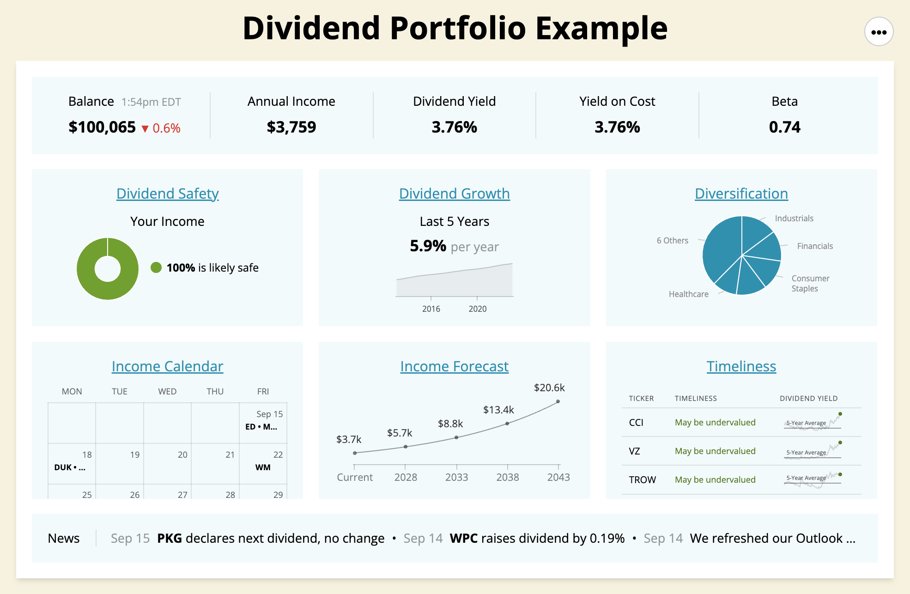

## Table of Contents

## What is a dividend and how does it work?

A dividend is a payment that a company gives to its shareholders, usually from its profits. When a company makes money, it can choose to share some of that money with the people who own its stock. This payment is called a dividend. Companies usually pay dividends a few times a year, and the amount can change based on how well the company is doing.

Dividends work by the company announcing a dividend and setting a date when they will pay it. If you own the stock on a certain date, called the record date, you will get the dividend. The company will then send the money to your bank account or mail you a check. Some investors like dividends because they provide a steady income, while others might choose to reinvest the dividends to buy more stock and potentially grow their investment over time.

## Why should someone consider building a growth-oriented dividend portfolio?

Building a growth-oriented dividend portfolio can be a smart move for someone looking to grow their money over time. This type of portfolio focuses on companies that not only pay dividends but also have a strong potential for increasing their earnings and, in turn, their dividend payments. By choosing companies that are expected to grow, you can benefit from both the regular income from dividends and the potential for the stock price to go up. This dual benefit can help your investment grow faster than if you just focused on the dividend payments alone.

Another reason to consider a growth-oriented dividend portfolio is the power of compounding. When you reinvest the dividends you receive into buying more shares of the same company, you can own more stock over time. As the company grows and pays higher dividends, those dividends get reinvested again, leading to even more shares and more dividends. This cycle can significantly increase the value of your investment over the long term. It's like planting a seed that grows into a tree, which then produces more seeds, leading to a whole forest of growth.

## What are the key differences between growth stocks and dividend stocks?

Growth stocks and dividend stocks are two different ways to invest in the stock market. Growth stocks are shares in companies that are expected to grow quickly. These companies usually reinvest their profits back into the business to help it grow even more. Because of this, they often don't pay dividends. Instead, investors buy [growth stocks](/wiki/growth-stocks) hoping that the stock price will go up a lot over time. This can lead to big gains if the company does well, but it can also be riskier because the stock price can fall if the company doesn't grow as expected.

On the other hand, dividend stocks are shares in companies that regularly pay out part of their profits to shareholders. These companies are often more established and stable, and they use dividends to share their success with investors. People who invest in dividend stocks are usually looking for a steady income from their investments. While dividend stocks might not grow as quickly as growth stocks, they can provide a more predictable return and can be less risky. Some investors like to reinvest their dividends to buy more shares, which can help their investment grow over time.

Both types of stocks have their place in an investment portfolio. Growth stocks can offer the potential for big returns, while dividend stocks can provide regular income and stability. The choice between them depends on your investment goals, how much risk you're willing to take, and how long you plan to keep your money invested. A balanced approach, including both growth and dividend stocks, can help you build a strong and diverse portfolio.

## How do you identify companies with a strong potential for dividend growth?

To identify companies with strong potential for dividend growth, you need to look at their history and financial health. A company that has consistently increased its dividends over many years is a good sign. This shows that the company is stable and committed to sharing its profits with shareholders. You should also check the company's payout ratio, which is the percentage of earnings paid out as dividends. A lower payout ratio means the company is keeping more money to reinvest in the business, which can lead to higher future dividends.

Another important [factor](/wiki/factor-investing) is the company's earnings growth. If a company is growing its earnings year after year, it is more likely to increase its dividends. Look at the company's financial statements and analyst reports to see if earnings are trending upward. Also, consider the company's industry and overall market conditions. Companies in growing industries or those that are well-positioned in their markets are more likely to have the ability to raise dividends. By combining these factors, you can find companies that are good candidates for dividend growth.

## What financial metrics should be considered when selecting dividend stocks for growth?

When [picking](/wiki/asset-class-picking) dividend stocks for growth, one key metric to look at is the dividend yield. This is the percentage of the stock's price that the company pays out in dividends each year. A higher yield can mean more income, but be careful because a very high yield might mean the stock price has fallen a lot, which could be a warning sign. Another important metric is the payout ratio, which shows how much of the company's earnings are paid out as dividends. A lower payout ratio means the company is keeping more money to grow the business, which can lead to higher dividends in the future.

You should also look at the company's earnings growth. If a company is making more money each year, it's more likely to increase its dividends. Check the company's financial statements and analyst reports to see if earnings are going up. Another thing to consider is the company's debt level. A company with too much debt might have trouble paying dividends if things get tough. By looking at these metrics, you can find companies that are likely to grow their dividends over time, helping your investment grow too.

## How can diversification be achieved within a growth-oriented dividend portfolio?

To build a growth-oriented dividend portfolio, you can spread your money across different kinds of companies and industries. This is called diversification. Instead of putting all your money into one company or one type of business, you can invest in several companies that pay dividends and have the potential to grow. For example, you might choose to invest in companies from sectors like technology, healthcare, and consumer goods. This way, if one sector doesn't do well, the others might help balance things out and keep your portfolio growing.

Another way to diversify within a growth-oriented dividend portfolio is by choosing companies of different sizes. You can invest in large, well-established companies that have a long history of paying and growing their dividends. At the same time, you can also look at smaller companies that might have more room to grow their earnings and dividends. By mixing these different types of companies, you can reduce the risk of your portfolio while still aiming for growth. This approach helps you take advantage of different opportunities and can make your investment more stable over time.

## What role does sector allocation play in constructing a growth-oriented dividend portfolio?

Sector allocation is really important when you're building a growth-oriented dividend portfolio. It means choosing which parts of the economy you want to invest in. Different sectors, like technology, healthcare, or energy, can grow at different speeds and have different risks. By spreading your money across several sectors, you can make your portfolio more balanced. This way, if one sector doesn't do well, the others might help keep your investment growing. For example, if you put all your money in tech stocks and the tech industry has a bad year, your whole portfolio could suffer. But if you also have some money in healthcare or consumer goods, those sectors might do better and help balance things out.

Picking the right sectors can also help you find companies that are likely to grow their dividends. Some sectors, like utilities or consumer staples, are known for paying steady dividends because they have stable earnings. But they might not grow as fast. On the other hand, sectors like technology or healthcare might have more potential for growth, but their dividends might not be as predictable. By mixing sectors that offer both growth and stability, you can build a portfolio that not only pays dividends but also has a good chance of increasing those dividends over time. This can help your investment grow faster and be more secure in the long run.

## How often should a growth-oriented dividend portfolio be rebalanced?

A growth-oriented dividend portfolio should be rebalanced about once a year. This means checking your investments to make sure they are still in line with your goals. Over time, some of your stocks might grow faster than others, which can change the balance of your portfolio. By rebalancing once a year, you can sell some of the stocks that have grown a lot and buy more of the ones that haven't grown as much. This helps keep your portfolio diversified and focused on growth.

However, you might need to rebalance more often if something big happens, like a big change in the stock market or if one of your companies stops paying dividends. It's good to keep an eye on your portfolio and make changes if needed. But don't rebalance too often, because it can cost money and time. Once a year is usually enough to keep your growth-oriented dividend portfolio on track.

## What are the tax implications of investing in dividend stocks?

When you invest in dividend stocks, you need to think about taxes. The money you get from dividends is usually considered income, and you have to pay taxes on it. The tax rate on dividends can be different depending on how much money you make in a year. If you're in a lower tax bracket, you might pay a lower rate on your dividends, but if you're in a higher tax bracket, you might pay more. It's important to know this so you can plan how much of your dividend money you'll keep after taxes.

Another thing to consider is that the tax rules can be different for dividends from different types of companies. For example, dividends from regular companies are often taxed at a lower rate than dividends from real estate investment trusts (REITs) or some other kinds of investments. Also, if you hold onto your stocks for a long time, you might get a special tax break on the dividends. It's a good idea to talk to a tax advisor to understand how these rules apply to your situation and to find ways to pay less in taxes.

## How can one use dividend reinvestment plans (DRIPs) to enhance portfolio growth?

Dividend reinvestment plans, or DRIPs, let you use the money you get from dividends to buy more shares of the same company instead of taking the cash. This can help your investment grow faster over time. When you reinvest your dividends, you get more shares, and those shares can pay dividends too. This means you can keep buying more and more shares, making your investment bigger and bigger. It's like a snowball that gets bigger as it rolls down a hill. By using DRIPs, you can take advantage of compounding, which is when your money grows not just from the original investment but also from the reinvested earnings.

DRIPs can also help you buy more shares without spending extra money. Many companies let you buy shares through their DRIPs at a lower price than the current market price, and some even let you buy shares without paying any fees. This can make your investment grow even faster. Plus, by reinvesting your dividends, you can buy more shares over time, even if you're not adding new money to your investment. This can be a great way to build your portfolio and reach your financial goals without having to put in more money out of your pocket.

## What advanced strategies can be employed to optimize a growth-oriented dividend portfolio?

One advanced strategy to optimize a growth-oriented dividend portfolio is to use a technique called dividend capture. This involves buying a stock just before the ex-dividend date and then selling it after you've received the dividend. The goal is to earn the dividend without holding onto the stock for a long time. This can be tricky because you need to time your buys and sells carefully, and you also need to consider any transaction costs and taxes. But if done right, it can help you earn more dividends and grow your portfolio faster.

Another strategy is to focus on companies that have a history of not just paying dividends, but also regularly increasing them. These are called dividend aristocrats or dividend kings. By choosing these companies, you can benefit from both the steady income from dividends and the potential for those dividends to grow over time. This can lead to higher returns as your reinvested dividends buy more shares, and those shares pay even more dividends. It's like planting a tree that grows bigger and produces more fruit each year, helping your investment grow steadily.

A third strategy is to use options to enhance your returns. For example, you can sell covered calls on your dividend stocks. This means you agree to sell your shares at a certain price in the future, and in return, you get a premium. If the stock price stays below that price, you keep the premium and the stock, and you can still collect the dividend. This can add extra income to your portfolio. However, using options can be risky and requires a good understanding of how they work, so it's important to learn about them before trying this strategy.

## How do macroeconomic factors influence the performance of a growth-oriented dividend portfolio?

Macroeconomic factors like interest rates, inflation, and economic growth can really affect how well a growth-oriented dividend portfolio does. When interest rates go up, it can be harder for companies to borrow money to grow their business. This might slow down their earnings growth, which can make it tougher for them to keep raising their dividends. On the other hand, when interest rates are low, companies can borrow more easily, which can help them grow faster and pay bigger dividends. Inflation also matters because it can make the money you get from dividends worth less over time. If inflation is high, you might need bigger dividend increases just to keep up with the rising prices.

Economic growth is another big factor. When the economy is doing well, companies usually make more money, and they might be able to pay higher dividends. But if the economy slows down or goes into a recession, companies might struggle to keep up their earnings, and they might cut or stop their dividends. It's also important to think about how different sectors of the economy are doing. For example, if the tech sector is booming, tech companies might grow their dividends faster, but if the energy sector is struggling, energy companies might not be able to raise their dividends as much. By keeping an eye on these macroeconomic factors, you can make better choices about which stocks to include in your growth-oriented dividend portfolio.

## What is Understanding Dividend Growth?

Dividend growth is a fundamental aspect for investors focused on generating income, as it provides insight into a company's financial health and investment potential. Consistent increases in dividends suggest that a company is not only stable but also has a strong cash flow and profit margins sufficient to return capital to shareholders. Thus, tracking dividend growth becomes an essential part of evaluating potential income-focused investments.

### Consistent Dividend Increases and Financial Health

When a company consistently raises its dividends, it signals financial robustness and an optimistic outlook on its earnings. Companies that can afford to increase their dividends regularly usually possess solid business models and have a track record of effective management. Such growth in dividends also reflects the company's confidence in maintaining or increasing its earnings over time.

### Calculation of Dividend Growth Rate

The dividend growth rate is a key metric that helps investors assess how quickly a company is increasing its dividend payments. This rate can be calculated using the formula:

$$
\text{Dividend Growth Rate} = \left( \frac{\text{Dividend in Year N}}{\text{Dividend in Year 0}} \right)^{\frac{1}{N}} - 1
$$

where:
- $\text{Dividend in Year N}$ is the dividend at the end of the period.
- $\text{Dividend in Year 0}$ is the initial dividend.
- $N$ is the number of years over which the growth is calculated.

This formula provides a compound annual growth rate (CAGR) of dividends, allowing investors to compare the dividend growth of various companies, even if the time periods are different.

### Dividend Growth Models for Stock Valuation

Models like the Gordon Growth Model (GGM) are widely used for valuing stocks based on their dividend growth. The GGM assumes a company will grow its dividends at a constant rate in perpetuity. The formula is expressed as:

$$
\text{Price} = \frac{\text{Dividend per Share} \times (1 + g)}{r - g}
$$

where:
- $\text{Price}$ is the current stock price.
- $\text{Dividend per Share}$ is the dividend expected in the next period.
- $g$ is the growth rate of the dividend.
- $r$ is the required rate of return.

This model is particularly effective for companies with stable, predictable dividend growth patterns. Investors use this formula to estimate the fair value of a stock and determine if it is overvalued or undervalued compared to its current market price.

In conclusion, understanding dividend growth integrates a critical analysis of a company's ability to sustain and enhance shareholder value through regular payouts. For income-focused investors, this involves a detailed assessment of financial health, a quantitative evaluation using growth rates, and deploying models like GGM to formulate well-informed investment decisions.

## What are the essentials of investment calculation?

Sound financial calculations provide a strong foundation for making informed investment decisions. A key metric is the Compound Annual Growth Rate (CAGR), which measures the mean annual growth rate of an investment over a specified time period longer than one year. It is calculated with the formula:

$$

CAGR = \left( \frac{\text{Ending Value}}{\text{Beginning Value}} \right)^{\frac{1}{n}} - 1 
$$

where $n$ denotes the number of years. CAGR is particularly useful for comparing the growth of investments or analyzing the performance of portfolio components over time, offering a smoothed annual rate of growth, ignoring volatility effects within the period.

Dividend yield, another critical metric, evaluates the return on investment relative to its current price. It is calculated as:

$$

\text{Dividend Yield} = \frac{\text{Annual Dividends per Share}}{\text{Current Share Price}} 
$$

This ratio helps investors understand how much cash per share they can expect in dividends, illustrating the income-generating potential of a stock. A higher dividend yield can indicate a potentially undervalued stock or a mature company with consistent cash flow distribution.

Tax implications on dividends must also be considered, as they can significantly impact net returns. Many jurisdictions tax dividends at a different rate compared to capital gains, affecting the overall profitability of dividend-focused strategies. Investors should be aware of whether dividends are categorized as qualified or ordinary, as this classification influences the rate at which they are taxed. For instance, qualified dividends may benefit from lower tax rates similar to long-term capital gains in the United States.

By integrating these calculation essentials into their strategies, investors can achieve a balanced view of potential growth and income from their investments, accounting for both market performance and taxation impacts.

## What are some case studies and practical applications?

### Johnson & Johnson's Successful Dividend Growth Strategy

Johnson & Johnson is often cited as a paragon of reliable dividend growth, making it a standout example for income-focused investors. The company's commitment to consistently increasing dividends is underscored by its record of over five decades of dividend hikes, which qualifies it as a Dividend King. This achievement signals financial resilience and robust operational performance. The company's ability to generate steady free cash flow enables it to return value to shareholders regardless of the broader economic environment. The formula for calculating the dividend growth rate is essential in evaluating such success and is expressed as: 

$$
\text{Dividend Growth Rate} = \left( \frac{\text{Dividend at End of Period}}{\text{Dividend at Start of Period}} \right)^{\frac{1}{n}} - 1
$$

where $n$ is the number of years. Johnson & Johnson's consistent dividend growth reflects its strong financial health and is considered a benchmark for companies aspiring to establish a similar reputation.

### Warren Buffett's Investment Calculations

Warren Buffett, regarded as one of the most successful investors, places significant emphasis on sound financial calculations. His investment approach underscores the importance of understanding intrinsic value, which involves meticulous analysis of a company's financial statements. Buffett utilizes metrics like the price-to-earnings ratio, return on equity, and debt-to-equity ratio to make informed investment decisions. Buffett's methodology highlights the importance of long-term investment strategies and the benefit of reinvestment to maximize compound interest effects over time. His principles align with the notion that well-informed financial strategies are central to achieving superior returns.

### Renaissance Technologies and Algorithmic Trading Precision

Renaissance Technologies is renowned for its pioneering use of [algorithmic trading](/wiki/algorithmic-trading), a stark contrast to traditional investment methods. The firm employs complex mathematical models and algorithms to exploit market inefficiencies, a testament to the power of data-driven strategies. These algorithms analyze vast sets of market data to identify potential trading opportunities, executing trades with split-second precision to capitalize on pricing anomalies. Momentum and mean-reversion strategies are commonly deployed, capitalizing on short-term movements and statistical averages, respectively. The success of Renaissance Technologies elucidates the potential of algorithmic trading to achieve exceptional returns and has inspired many hedge funds and financial institutions to adopt similar approaches.

### Valuable Insights for Investors

Each case—Johnson & Johnson's dividend strategy, Warren Buffett's investment calculations, and Renaissance Technologies' algorithmic trading—offers distinct lessons for investors. Johnson & Johnson exemplifies the power of a consistent dividend growth strategy for income stability, essential for investors seeking reliable dividend income. Warren Buffett’s principles advocate for thorough financial analysis to guide long-term value investing, emphasizing the importance of fundamental metrics. Meanwhile, Renaissance Technologies demonstrates the efficacy of leveraging technology and quantitative models to gain an edge in financial markets. These examples illustrate that a blend of strategies can enhance investment outcomes and stress the importance of aligning investment tactics with individual financial objectives.

## References & Further Reading

### Books on Dividend Investing and Algorithmic Trading Strategies

1. **"The Intelligent Investor" by Benjamin Graham**  
   This classic text is essential for understanding value investing and provides insights into dividend investing strategies. Graham's principles of stock evaluation and risk management serve as a foundation for income-focused investors.

2. **"Dividends Still Don't Lie: The Truth About Investing in Blue Chip Stocks and Winning in the Stock Market" by Kelley Wright**  
   This book explains how investors can use dividend trends to identify profitable stocks. Wright emphasizes the importance of dividend yields and historical trends for assessing investment value.

3. **"Algorithmic Trading: Winning Strategies and Their Rationale" by Ernie Chan**  
   Ernie Chan provides a comprehensive guide to developing and implementing algorithmic trading strategies. The book covers quantitative techniques used for portfolio management and automated trading systems.

4. **"Machine Trading: Deploying Computer Algorithms to Conquer the Markets" by Ernie Chan**  
   This book focuses on using [machine learning](/wiki/machine-learning) and data science techniques for designing effective trading algorithms. Chan illustrates how to utilize these technologies to achieve precision in trading.

### Articles and Case Studies Highlighting Successful Applications

1. **"Dividend Growth Investing: A Proven Strategy" from Forbes**  
   This article covers the benefits and effectiveness of dividend growth investing, showcasing companies with consistent dividend increases and how investors can utilize these metrics to enhance portfolio performance.

2. **"The Rise of Algorithmic Trading: Pros and Cons" published by Investopedia**  
   A detailed article that explores the impact of algorithmic trading on market dynamics and highlights specific cases where algorithms have outperformed manual trading methods.

3. **Case Study: "Renaissance Technologies – The Quantitative Powerhouse"**  
   This case study examines the success of Renaissance Technologies, a leading firm in algorithmic trading, providing insights into the company's strategies and technological advancements. [Reference: Financial Times]

### Resources for Deeper Exploration into Financial Strategies

1. **Coursera's "Financial Markets" Course**  
   This online [course](/wiki/best-algorithmic-trading-courses), offered by Yale University, covers the fundamentals of financial markets, including dividend investing and the application of quantitative finance in investment strategies.

2. **"Quantitative Finance for Dummies" by Steve Bell**  
   A beginner-friendly guide that introduces quantitative finance concepts, including risk management techniques and the development of trading algorithms.

3. **Bloomberg Terminal**  
   A professional tool offering comprehensive data and analytics for market research, enabling investors to explore dividend trends, perform investment calculations, and backtest algorithmic trading strategies.

By exploring these resources, investors can gain a deeper understanding of dividend growth, algorithmic trading, and financial strategies essential for optimizing portfolio performance.

