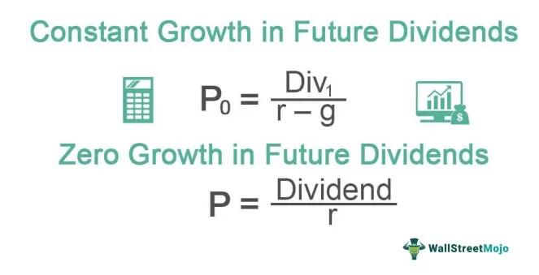

Investment strategies have significantly evolved as a result of technological advancements in recent years. Historically, investors relied on fundamental analysis and personal expertise to make decisions. However, the introduction of innovative technologies has transformed how portfolios are managed today.

Dividend portfolio management represents a timeless strategy that has long been favored by income-focused investors. By focusing on companies that offer regular dividend payouts, investors can secure a stable and ongoing income stream. This strategy capitalizes on the financial health and profitability of companies, as businesses able to increase dividends consistently are often viewed as stable and financially sound.



With the advent of modern computational capabilities, algorithmic trading has further revolutionized investment strategies by introducing unprecedented levels of precision and efficiency in portfolio management. Utilizing advanced algorithms, this method enables automated trading decisions based on complex mathematical models and extensive market data analysis. Algorithmic trading strategies often focus on short-term market inefficiencies and execute trades at speeds and volumes unattainable by human traders, thereby maximizing profit potential through precise and efficient trade execution.

This article aims to explore the intersection of traditional dividend-based investment growth and the cutting-edge role of algorithmic trading. Understanding both approaches gives investors comprehensive insights into enhancing portfolio performance and aligning investment strategies with evolving market dynamics. By integrating these methodologies, investors can benefit from both stable income avenues and cutting-edge technological advancements in trading.

## Table of Contents

## Understanding Dividend Growth

Dividend growth is a fundamental aspect for investors focused on generating income, as it provides insight into a company's financial health and investment potential. Consistent increases in dividends suggest that a company is not only stable but also has a strong cash flow and profit margins sufficient to return capital to shareholders. Thus, tracking dividend growth becomes an essential part of evaluating potential income-focused investments.

### Consistent Dividend Increases and Financial Health

When a company consistently raises its dividends, it signals financial robustness and an optimistic outlook on its earnings. Companies that can afford to increase their dividends regularly usually possess solid business models and have a track record of effective management. Such growth in dividends also reflects the company's confidence in maintaining or increasing its earnings over time.

### Calculation of Dividend Growth Rate

The dividend growth rate is a key metric that helps investors assess how quickly a company is increasing its dividend payments. This rate can be calculated using the formula:

$$
\text{Dividend Growth Rate} = \left( \frac{\text{Dividend in Year N}}{\text{Dividend in Year 0}} \right)^{\frac{1}{N}} - 1
$$

where:
- $\text{Dividend in Year N}$ is the dividend at the end of the period.
- $\text{Dividend in Year 0}$ is the initial dividend.
- $N$ is the number of years over which the growth is calculated.

This formula provides a compound annual growth rate (CAGR) of dividends, allowing investors to compare the dividend growth of various companies, even if the time periods are different.

### Dividend Growth Models for Stock Valuation

Models like the Gordon Growth Model (GGM) are widely used for valuing stocks based on their dividend growth. The GGM assumes a company will grow its dividends at a constant rate in perpetuity. The formula is expressed as:

$$
\text{Price} = \frac{\text{Dividend per Share} \times (1 + g)}{r - g}
$$

where:
- $\text{Price}$ is the current stock price.
- $\text{Dividend per Share}$ is the dividend expected in the next period.
- $g$ is the growth rate of the dividend.
- $r$ is the required rate of return.

This model is particularly effective for companies with stable, predictable dividend growth patterns. Investors use this formula to estimate the fair value of a stock and determine if it is overvalued or undervalued compared to its current market price.

In conclusion, understanding dividend growth integrates a critical analysis of a company's ability to sustain and enhance shareholder value through regular payouts. For income-focused investors, this involves a detailed assessment of financial health, a quantitative evaluation using growth rates, and deploying models like GGM to formulate well-informed investment decisions.

## Investment Calculation Essentials

Sound financial calculations provide a strong foundation for making informed investment decisions. A key metric is the Compound Annual Growth Rate (CAGR), which measures the mean annual growth rate of an investment over a specified time period longer than one year. It is calculated with the formula:

$$

CAGR = \left( \frac{\text{Ending Value}}{\text{Beginning Value}} \right)^{\frac{1}{n}} - 1 
$$

where $n$ denotes the number of years. CAGR is particularly useful for comparing the growth of investments or analyzing the performance of portfolio components over time, offering a smoothed annual rate of growth, ignoring volatility effects within the period.

Dividend yield, another critical metric, evaluates the return on investment relative to its current price. It is calculated as:

$$

\text{Dividend Yield} = \frac{\text{Annual Dividends per Share}}{\text{Current Share Price}} 
$$

This ratio helps investors understand how much cash per share they can expect in dividends, illustrating the income-generating potential of a stock. A higher dividend yield can indicate a potentially undervalued stock or a mature company with consistent cash flow distribution.

Tax implications on dividends must also be considered, as they can significantly impact net returns. Many jurisdictions tax dividends at a different rate compared to capital gains, affecting the overall profitability of dividend-focused strategies. Investors should be aware of whether dividends are categorized as qualified or ordinary, as this classification influences the rate at which they are taxed. For instance, qualified dividends may benefit from lower tax rates similar to long-term capital gains in the United States.

By integrating these calculation essentials into their strategies, investors can achieve a balanced view of potential growth and income from their investments, accounting for both market performance and taxation impacts.

## The Role of Algorithmic Trading

Algorithmic trading, commonly known as algo trading, automates the process of buying and selling financial instruments using sophisticated software applications. This technology has become a critical component of modern financial markets, offering precision and efficiency that manual trading cannot provide. By leveraging mathematical models and complex algorithms, traders can execute high-frequency trades with remarkable speed and accuracy.

One of the primary benefits of [algorithmic trading](/wiki/algorithmic-trading) is the ability to analyze large volumes of market data to identify and capitalize on trading opportunities. Algorithms use quantitative analysis to detect patterns and trends that may not be readily apparent to human traders. This capability allows for the execution of thousands of trades in a fraction of a second, maximizing the potential for profit while minimizing human error.

Efficiency is further enhanced through the minimization of latency, the delay between the initiation and execution of a trade. Algorithms are designed to operate with minimal delay, ensuring that trades are executed at the best possible prices. This is typically achieved through direct market access (DMA) and co-location services, which position trading systems in proximity to financial exchanges.

Specific strategies employed in algorithmic trading include [momentum](/wiki/momentum) and mean-reversion. Momentum strategies capitalize on the continuation of existing market trends, assuming that asset prices will continue in the same direction. For example, an algorithm might be programmed to buy stocks that show a rising trend and sell those in a declining trajectory. In contrast, mean-reversion strategies operate on the principle that asset prices will revert to their mean or average over time. Algorithms executing this strategy will buy undervalued stocks and sell overvalued ones, based on statistical analysis.

Here is a simple Python example illustrating a basic momentum trading strategy using historical stock price data:

```python
import pandas as pd
import numpy as np

# Assume 'data' is a Pandas DataFrame with historical stock prices
data['Returns'] = data['Close'].pct_change()
data['Signal'] = np.where(data['Returns'] > 0, 1, 0)  # Buy signal for positive returns

# Calculate Strategy Returns
data['Strategy Returns'] = data['Signal'].shift(1) * data['Returns']

# Cumulative returns
cumulative_returns = (1 + data['Strategy Returns']).cumprod()

print(f"Cumulative Returns from Momentum Strategy: {cumulative_returns[-1]}")
```

This example highlights how simple algorithms can be used to generate buy and sell signals based on returns over time. It is important to note, however, that real-world algorithmic trading strategies are often far more complex, incorporating multiple data sources and analytical techniques.

In conclusion, algorithmic trading significantly enhances trading outcomes by ensuring efficient order execution and leveraging sophisticated strategies like momentum and mean-reversion. This technology continues to redefine the landscape of financial markets, providing traders with powerful tools to optimize their investment portfolios.

## Case Studies and Practical Applications

### Johnson & Johnson's Successful Dividend Growth Strategy

Johnson & Johnson is often cited as a paragon of reliable dividend growth, making it a standout example for income-focused investors. The company's commitment to consistently increasing dividends is underscored by its record of over five decades of dividend hikes, which qualifies it as a Dividend King. This achievement signals financial resilience and robust operational performance. The company's ability to generate steady free cash flow enables it to return value to shareholders regardless of the broader economic environment. The formula for calculating the dividend growth rate is essential in evaluating such success and is expressed as: 

$$
\text{Dividend Growth Rate} = \left( \frac{\text{Dividend at End of Period}}{\text{Dividend at Start of Period}} \right)^{\frac{1}{n}} - 1
$$

where $n$ is the number of years. Johnson & Johnson's consistent dividend growth reflects its strong financial health and is considered a benchmark for companies aspiring to establish a similar reputation.

### Warren Buffett's Investment Calculations

Warren Buffett, regarded as one of the most successful investors, places significant emphasis on sound financial calculations. His investment approach underscores the importance of understanding intrinsic value, which involves meticulous analysis of a company's financial statements. Buffett utilizes metrics like the price-to-earnings ratio, return on equity, and debt-to-equity ratio to make informed investment decisions. Buffett's methodology highlights the importance of long-term investment strategies and the benefit of reinvestment to maximize compound interest effects over time. His principles align with the notion that well-informed financial strategies are central to achieving superior returns.

### Renaissance Technologies and Algorithmic Trading Precision

Renaissance Technologies is renowned for its pioneering use of algorithmic trading, a stark contrast to traditional investment methods. The firm employs complex mathematical models and algorithms to exploit market inefficiencies, a testament to the power of data-driven strategies. These algorithms analyze vast sets of market data to identify potential trading opportunities, executing trades with split-second precision to capitalize on pricing anomalies. Momentum and mean-reversion strategies are commonly deployed, capitalizing on short-term movements and statistical averages, respectively. The success of Renaissance Technologies elucidates the potential of algorithmic trading to achieve exceptional returns and has inspired many hedge funds and financial institutions to adopt similar approaches.

### Valuable Insights for Investors

Each case—Johnson & Johnson's dividend strategy, Warren Buffett's investment calculations, and Renaissance Technologies' algorithmic trading—offers distinct lessons for investors. Johnson & Johnson exemplifies the power of a consistent dividend growth strategy for income stability, essential for investors seeking reliable dividend income. Warren Buffett’s principles advocate for thorough financial analysis to guide long-term value investing, emphasizing the importance of fundamental metrics. Meanwhile, Renaissance Technologies demonstrates the efficacy of leveraging technology and quantitative models to gain an edge in financial markets. These examples illustrate that a blend of strategies can enhance investment outcomes and stress the importance of aligning investment tactics with individual financial objectives.

## Conclusion

In investment portfolio management, employing diverse strategies significantly enhances overall performance. Combining dividend growth with precise investment calculations and algorithmic trading leads to an optimized approach that yields stable and potentially higher returns. Dividend growth provides investors with a predictable income stream and indicates the financial health and future potential of companies. Calculating investment metrics like the Compound Annual Growth Rate (CAGR) and dividend yield offers a solid foundation for making informed decisions regarding stock selection and portfolio adjustments.

Algorithmic trading, with its ability to process large volumes of data and execute trades with minimal latency, further refines investment strategies by identifying patterns and opportunities that humans might overlook. It employs techniques like momentum trading and mean-reversion to capture market inefficiencies, thereby enhancing returns.

Continuous learning remains a critical component in the fast-evolving financial markets. Investors must stay informed about new technologies and methodologies to maintain a competitive edge. This approach allows them to adapt to changes and capitalize on emerging trends effectively.

Ultimately, personal financial goals should guide the tailoring of investment strategies. By aligning these strategies with individual objectives, investors can achieve greater success and satisfaction in their financial pursuits. Whether focused on income generation, capital appreciation, or a balanced combination, a well-rounded approach that integrates diverse investment techniques is most likely to deliver optimal results.

## References & Further Reading

### Books on Dividend Investing and Algorithmic Trading Strategies

1. **"The Intelligent Investor" by Benjamin Graham**  
   This classic text is essential for understanding value investing and provides insights into dividend investing strategies. Graham's principles of stock evaluation and risk management serve as a foundation for income-focused investors.

2. **"Dividends Still Don't Lie: The Truth About Investing in Blue Chip Stocks and Winning in the Stock Market" by Kelley Wright**  
   This book explains how investors can use dividend trends to identify profitable stocks. Wright emphasizes the importance of dividend yields and historical trends for assessing investment value.

3. **"Algorithmic Trading: Winning Strategies and Their Rationale" by Ernie Chan**  
   Ernie Chan provides a comprehensive guide to developing and implementing algorithmic trading strategies. The book covers quantitative techniques used for portfolio management and automated trading systems.

4. **"Machine Trading: Deploying Computer Algorithms to Conquer the Markets" by Ernie Chan**  
   This book focuses on using [machine learning](/wiki/machine-learning) and data science techniques for designing effective trading algorithms. Chan illustrates how to utilize these technologies to achieve precision in trading.

### Articles and Case Studies Highlighting Successful Applications

1. **"Dividend Growth Investing: A Proven Strategy" from Forbes**  
   This article covers the benefits and effectiveness of dividend growth investing, showcasing companies with consistent dividend increases and how investors can utilize these metrics to enhance portfolio performance.

2. **"The Rise of Algorithmic Trading: Pros and Cons" published by Investopedia**  
   A detailed article that explores the impact of algorithmic trading on market dynamics and highlights specific cases where algorithms have outperformed manual trading methods.

3. **Case Study: "Renaissance Technologies – The Quantitative Powerhouse"**  
   This case study examines the success of Renaissance Technologies, a leading firm in algorithmic trading, providing insights into the company's strategies and technological advancements. [Reference: Financial Times]

### Resources for Deeper Exploration into Financial Strategies

1. **Coursera's "Financial Markets" Course**  
   This online [course](/wiki/best-algorithmic-trading-courses), offered by Yale University, covers the fundamentals of financial markets, including dividend investing and the application of quantitative finance in investment strategies.

2. **"Quantitative Finance for Dummies" by Steve Bell**  
   A beginner-friendly guide that introduces quantitative finance concepts, including risk management techniques and the development of trading algorithms.

3. **Bloomberg Terminal**  
   A professional tool offering comprehensive data and analytics for market research, enabling investors to explore dividend trends, perform investment calculations, and backtest algorithmic trading strategies.

By exploring these resources, investors can gain a deeper understanding of dividend growth, algorithmic trading, and financial strategies essential for optimizing portfolio performance.

