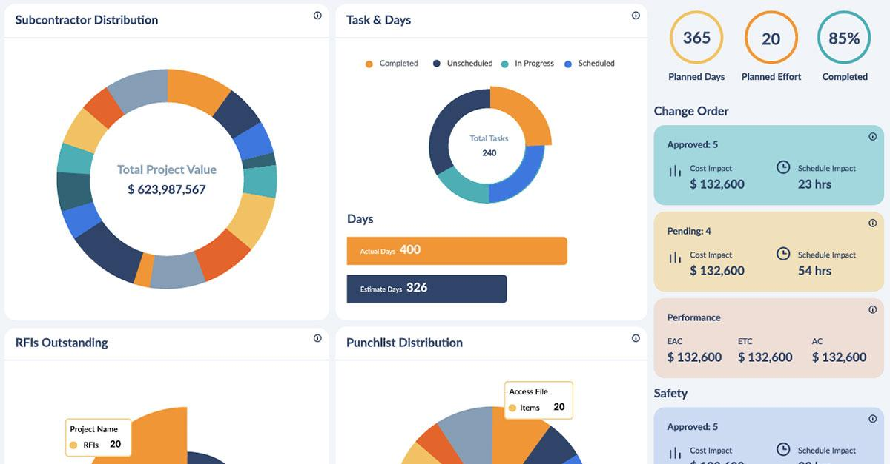

Algorithmic trading, the practice of utilizing computer algorithms to execute trades in financial markets, has witnessed significant growth over the past decades. As the trading landscape becomes more competitive, traders are continually seeking out innovative data sources that can provide an edge beyond traditional financial metrics like stock prices, earnings reports, or interest rates. One emerging area of interest is the use of construction activity indicators, which offer early signals of economic shifts.

Construction activity indicators, such as building permits and architecture billings, hold significant potential for traders aiming to enhance their strategies. These indicators are considered leading signals for broader economic health, offering insights into future infrastructure developments and economic conditions. They provide valuable data on how the economy might perform, as construction spending is a substantial component of Gross Domestic Product (GDP).



The integration of construction data into trading strategies represents a strategic move for algorithmic traders. It allows them to gain improved predictive accuracy and performance by leveraging real-time and predictive insights. For example, a sudden increase in building permits may signal an upcoming surge in economic activity, enabling traders to adjust their positions accordingly—potentially gaining a competitive advantage by anticipating market movements before they are reflected in traditional economic indicators.

In this article, we explore how construction data can be effectively integrated into algorithmic trading models, the types of construction data available, and the benefits and challenges associated with their use. By understanding and utilizing these indicators, traders and investors can achieve greater insights and potentially more profitable outcomes in the financial markets.

## Table of Contents

## Understanding Construction Activity Indicators

Construction activity indicators, including building permits and architecture billings, are crucial tools for assessing both the current state and potential future direction of an economy. These indicators are considered leading signals of economic health, as they often provide early warnings or confirmations of broader economic trends. The rationale behind this is partly due to the substantial role that construction spending plays in contributing to a country's Gross Domestic Product (GDP).

Building permits are one of the most direct indicators of upcoming construction activity. When a significant number of building permits are issued, it generally indicates that there will soon be a surge in construction activity, as these permits are a prerequisite for beginning most construction projects. This uptick in activity can be interpreted as a sign of economic optimism, reflecting increasing demand for residential, commercial, or industrial spaces. Historically, periods of rising building permits have coincided with economic expansion phases, making this indicator particularly valuable for investors and analysts.

Similarly, architecture billings present another dimension of construction-related economic health. The Architecture Billings Index (ABI), for instance, measures the demand for design services, providing insights into anticipated construction activity over the next 9 to 12 months. An increase in architecture billings suggests that developers are planning new projects, implying future growth in the construction sector. This forward-looking aspect makes architecture billings a key tool for forecasting market trends.

The significance of these indicators is highlighted by their influence on various sectors beyond construction. For instance, an increase in building permits and architecture billings can lead to higher demand for construction materials and related services, impacting industries such as manufacturing and retail. Consequently, these indicators are closely monitored by businesses, governments, and financial markets to align strategies with anticipated economic conditions.

In conclusion, construction activity indicators provide vital insight into the economic landscape. By offering early signals of economic shifts, they enable investors and analysts to make informed decisions, anticipate market trends, and forecast future economic health with greater precision.

## The Role of Construction Data in Algorithmic Trading

Algorithmic traders are increasingly incorporating construction data into their trading strategies due to its potential to reveal market trends and uncover investment opportunities. The ability of construction indicators to provide timely insights into economic conditions is particularly valuable. By analyzing these indicators, traders can swiftly respond to economic shifts, often securing a first-mover advantage over competitors.

The integration of construction data involves the use of various technological tools. Satellite imagery and geolocation patterns are commonly used to evaluate the progress of construction projects. For example, satellite images can be processed using [machine learning](/wiki/machine-learning) algorithms to detect changes in landscape and infrastructure development over time. This data allows traders to forecast potential market movements by evaluating the pace and scale of construction activities. Geolocation data can also reveal patterns of human activity surrounding construction sites, providing additional context that informs trading decisions.

For instance, traders can employ the following Python snippet to analyze satellite images and extract features indicative of construction activity progress:

```python
from skimage import io, filters
import numpy as np

# Load satellite image
image = io.imread('construction_site_image.tif')

# Apply edge detection filter
edges = filters.sobel(image)

# Calculate the percentage of changed area
changed_area_percentage = np.sum(edges > threshold) / edges.size
print(f"Changed area percentage: {changed_area_percentage * 100:.2f}%")
```

In this script, an edge detection filter is applied to a satellite image to identify changes over time. These changes are quantified to estimate the extent of construction activity, offering insights into economic trends potentially impacting financial markets.

The application of construction data in [algorithmic trading](/wiki/algorithmic-trading) enhances the ability to anticipate shifts in the market accurately. As traders refine their methods and leverage technological advancements, the integration of this [alternative data](/wiki/best-alternative-data) source will likely continue to play a pivotal role in strategic decision-making.

## Types of Construction Data and Their Applications

Alternative construction data sources have become pivotal in enhancing the capabilities of algorithmic trading by providing a more granular and timely understanding of economic activities. These data sources include satellite images, geo-location data, and public records like building permits, each offering unique insights into construction activities that can be leveraged for trading decisions.

Satellite imagery is one of the most powerful tools available to traders today, allowing them to monitor construction project progress in real time. By analyzing these images, traders can gain immediate insights into the pace and scale of ongoing construction activities. For instance, substantial progress in a commercial construction project could signal future economic growth in the area, potentially impacting related asset prices. Advanced image processing techniques and machine learning models can be employed to assess construction sites' activity levels by analyzing changes in the satellite imagery over time. 

```python
# Example: Using Python to analyze satellite images for construction activity
from satellite_image_analysis import process_images, detect_changes

def analyze_construction_progress(images_before, images_after):
    changes = detect_changes(images_before, images_after)
    progress_level = process_images(changes)
    return progress_level

images_before = load_images('path/to/before_images')
images_after = load_images('path/to/after_images')
progress = analyze_construction_progress(images_before, images_after)
print("Construction progress level:", progress)
```

Geo-location data further complements satellite imagery by providing insights into the movement patterns around construction sites. This data can be gleaned through mobile signals or GPS data to assess the flow of workers and materials to and from construction sites. Significant changes in these patterns could offer early indicators of shifts in local economic activities and influence asset valuations in those regions.

Public records, such as building permits, play a crucial role by providing foresight into future construction activities. Building permits are usually filed before construction begins, serving as a leading indicator of future economic development. Traders can analyze trends in the issuance of these permits to forecast the rise or decline in regional construction activities, adjusting their portfolios accordingly. An increase in building permits could, for instance, precede a real estate boom, while a decrease might signal economic slowdown.

Together, these diverse types of construction data can effectively inform traders of impending regional economic changes. By analyzing the progress and potential of construction activities through these alternative data sources, traders can anticipate shifts in demand for resources, labor, and real estate, ultimately influencing related asset pricing. As these data types provide a more nuanced picture of construction dynamics, they become invaluable tools for traders seeking to gain a competitive advantage in the financial markets.

## Benefits of Using Construction Data in Trading

Incorporating construction data into trading strategies offers distinct advantages for investors seeking to refine their market predictions and capitalize on economic trends. This data provides precise indicators of both current economic activity and future infrastructure development, thereby serving as a valuable asset for enhancing the predictive accuracy of trading algorithms.

One of the significant benefits of using construction data is its ability to offer earlier insights into potential market shifts. Construction activities, including building permits, new housing starts, and architectural billings, often precede broader economic changes. This forward-looking aspect allows traders to anticipate economic expansions or contractions before they are reflected in traditional financial metrics. For instance, an increase in building permits may indicate upcoming economic growth, signaling potential investment opportunities in sectors such as construction materials, real estate, and related industries.

Case studies have demonstrated the practical applications of leveraging construction data in the trading domain. Hedge funds, for example, have successfully utilized construction permit data to optimize their portfolio strategies. By analyzing trends in permit issuance, these funds have been able to forecast real estate market movements with greater accuracy, resulting in more informed investment decisions. This strategic advantage can lead to significant financial gains as traders position themselves ahead of market trends.

Additionally, incorporating construction data into trading algorithms can refine the performance of these models. By integrating data sets that reflect real-time and anticipatory economic indicators, traders can enhance the precision of their predictive models. This approach can be particularly effective when combined with machine learning techniques, allowing for the development of algorithms that can dynamically adjust to evolving market conditions.

In summary, the use of construction data in trading strategies provides an enriched, data-driven approach to market analysis. By offering early warnings of economic changes and allowing for more informed decision-making, this data not only bolsters the predictive capability of trading algorithms but also grants investors the potential for more profitable trading outcomes. As the availability and sophistication of construction data continue to grow, its role in shaping trading strategies is likely to expand, offering even more nuanced insights into market dynamics.

## Challenges in Implementing Construction Data

Integrating construction data into trading models presents several challenges that traders and financial analysts must overcome to effectively harness its potential. One primary challenge is sourcing reliable data. Construction data can originate from diverse sources such as government publications, proprietary databases, satellite imagery, and public records. Each of these sources may vary in terms of frequency, granularity, and accuracy, which can impact the reliability of the insights derived from the data. Ensuring data accuracy is paramount, as inaccuracies can lead to erroneous forecasts and suboptimal trading decisions. Data validation processes must be implemented to verify the integrity of the data, filtering out noise and inconsistencies that could distort analytical outcomes.

Another significant challenge lies in the integration of new data types into existing trading infrastructure. Trading platforms traditionally designed to handle financial metrics may not be equipped to process non-standardized data like satellite imagery or geolocation patterns. This requires developing new data processing techniques and modifying existing infrastructure to accommodate and analyze diverse data sets efficiently.

Traders must also cultivate a deep expertise in interpreting construction-related data to maximize its utility. Unlike traditional financial indicators, construction data can be more obscure and may require specialized knowledge to decipher relevant patterns and trends. This necessitates a multidisciplinary approach, blending skills from construction analysis, data science, and finance.

The implementation of construction data into trading models is resource-intensive. Substantial investment is needed in data analytics tools, machine learning algorithms, and skilled personnel to interpret and apply construction data effectively in trading strategies. Additionally, the dynamic nature of construction data, subject to frequent updates and revisions, demands continuous monitoring and adjustment to maintain the accuracy and efficacy of predictions.

In conclusion, while the integration of construction data offers the potential for enhanced market insights and predictive accuracy, traders face significant hurdles in the form of data sourcing, accuracy assurance, infrastructure adaptation, and expertise development. Those who successfully navigate these challenges are better positioned to leverage construction data for competitive advantage in algorithmic trading.

## Case Studies and Real-World Applications

Hedge funds and tech startups have increasingly turned to construction data to enhance their trading strategies, underscoring its practical utility in anticipating market shifts. One notable application is the use of construction permit data by hedge funds to predict real estate trends. By analyzing permit approvals, these funds can forecast the pace of housing developments and commercial projects, allowing them to adjust their portfolios for potential gains. For example, an increase in residential building permits might signal an impending rise in housing supply, which could suppress prices, leading funds to short related real estate investments.

Tech companies have also utilized satellite imagery to monitor large-scale construction projects, offering traders unique insights. High-resolution satellite images enable the assessment of construction progress at various stages, from groundbreaking to completion. This real-time data can influence investment decisions by providing a clearer picture of infrastructure developments, potentially affecting related sectors such as construction equipment manufacturers, raw materials suppliers, and even regional economic conditions. 

An example of such an application is the monitoring of infrastructure projects like highways or bridges. Traders can use this information to predict increased regional economic activity, influencing stock positions in transportation or logistics firms expected to benefit from improved connectivity. Moreover, by integrating machine learning algorithms, tech startups can systematically analyze patterns in satellite imagery, improving the speed and accuracy of predictions based on construction data.

These case studies clearly illustrate the tangible benefits of construction data in trading, highlighting its role in enhancing predictive models and enabling more informed decision-making.

## Future Prospects of Construction Data in Algo Trading

As technology continues to advance, the utilization of construction data within algorithmic trading is set to broaden, delivering more precise and actionable insights. This progression is anticipated to be driven by several key developments, primarily focusing on the enhancement of AI models and data processing capabilities.

Future developments are likely to include the implementation of advanced machine learning algorithms and [artificial intelligence](/wiki/ai-artificial-intelligence) systems capable of interpreting the increasingly complex datasets derived from construction activities. These AI models can process extensive amounts of structured and unstructured data, such as satellite images, building permits, and geolocation information, with greater accuracy and speed than ever before. By using techniques such as computer vision and natural language processing, traders can gain more nuanced understandings of construction trends and economic conditions.

Moreover, the integration of real-time data analytics is expected to redefine how traders interpret construction indicators. With the continuous inflow of data, models can dynamically adjust to reflect current trends, allowing for more timely and informed trading decisions. For instance, Python libraries such as TensorFlow or PyTorch could facilitate the development of convolutional neural networks that analyze satellite imagery, enabling the detection of progress in construction projects and potential market impacts more effectively.

Additionally, the future may see the emergence of predictive analytics tools designed to forecast not just market trends but also the economic implications of large-scale infrastructure developments. Sophisticated data models could simulate various economic scenarios, offering traders insights into potential market behaviors based on ongoing and future construction activities.

These advancements present significant opportunities for traders to refine their strategies, ensuring they maintain a competitive edge in fast-evolving markets. Traders who harness these technological enhancements will likely benefit from earlier detection of economic shifts, more accurate market predictions, and the ability to leverage data-driven insights for more strategic decision-making. The evolving landscape of construction data analytics signifies a transformative shift in the way algorithmic trading strategies are devised, potentially leading to more informed and profitable outcomes.

## Conclusion

Construction activity indicators serve as essential tools for algorithmic trading, offering traders the ability to gain early insights into market dynamics and economic conditions. These indicators, which encompass data such as building permits and architecture billings, enable traders to anticipate shifts in the economy that traditional financial metrics might miss. The integration of such data into trading strategies allows traders and investors to not only enhance the accuracy of predictive models but also potentially secure a competitive edge in the financial markets.

Despite the significant potential benefits, challenges persist in the effective use of construction data. The process of data integration can be complex and requires a thorough understanding of both the data itself and the mechanics of trading algorithms. Ensuring data reliability and accuracy remains a critical task, as does the development of advanced methodologies for interpreting and applying this data effectively within trading models.

Nevertheless, those who navigate these challenges successfully can leverage construction data to produce more refined insights, leading to improved market forecasts and more profitable trading outcomes. As technology continues to evolve, the opportunities to enhance the utility of construction data in algorithmic trading will likely expand, presenting traders with ongoing possibilities to refine their strategies and maintain their competitive advantage.

## References & Further Reading

[1]: Sherer, P. (2017). ["Predictive Indicators for Economic Monitoring: Construction Statistics."](https://www.academia.edu/44029254/Construction_Cost_Predication_Model_Using_Macro_Economic_Indicators)

[2]: ["Advances in Financial Machine Learning"](https://www.amazon.com/Advances-Financial-Machine-Learning-Marcos/dp/1119482089) by Marcos Lopez de Prado

[3]: ["Monitoring Land Cover Dynamics Using Satellite Images: A Case Study in the United States"](https://www.researchgate.net/publication/347768670_Land_Use_Land_Cover_Change_Detection_using_LANDSAT_images_A_Case_Study) in IEEE Transactions on Geoscience and Remote Sensing

[4]: ["Machine Learning for Algorithmic Trading"](https://github.com/stefan-jansen/machine-learning-for-trading) by Stefan Jansen

[5]: ["Quantitative Trading: How to Build Your Own Algorithmic Trading Business"](https://www.amazon.com/Quantitative-Trading-Build-Algorithmic-Business/dp/1119800064) by Ernest P. Chan