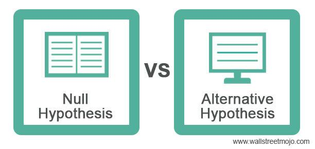

Algorithmic trading is increasingly reliant on innovative data sources to maintain a competitive advantage. Traditional datasets, primarily based on historical market data and economic indicators, have long served as the backbone for trading strategies. However, the emergence of alternative data is significantly altering this landscape, offering new dimensions of insight that traditional financial metrics often overlook. Among the various types of alternative data, construction-related information stands out for its ability to provide early signals of economic activity and infrastructure developments, which are pivotal for informed trading decisions.

The application of construction-related alternative data in trading is gaining traction due to its potential to unveil patterns and trends ahead of official economic reports. This type of data includes diverse sources such as satellite imagery of construction sites, geolocation patterns of construction machinery, and real-time analysis of labor force dynamics. By incorporating these non-traditional data points into algorithmic models, traders can gain a more nuanced understanding of market conditions, identify investment opportunities earlier, and enhance the predictive accuracy of their trading algorithms.

In this article, we explore the transformative impact that construction alternative data can have on trading strategies. By highlighting its unique strengths, we aim to demonstrate how it offers algo traders insights that extend beyond conventional financial metrics. Our examination provides a foundation for understanding the value of construction data as a resource in the fast-paced, ever-evolving domain of algorithmic trading, inviting traders to capitalize on the opportunities it presents for achieving a competitive edge.

## Table of Contents

## What is Alternative Data?

Alternative data refers to non-traditional data sources that investors use to uncover investment opportunities that might not be apparent from conventional data. These sources extend beyond classic financial metrics, embracing diverse datasets such as consumer transactions, satellite imagery, social media trends, and other unconventional channels. The pivotal element of [alternative data](/wiki/best-alternative-data) lies in its ability to reveal hidden signals not easily detected by traditional data points. This ability enables investors to gain unique insights that enhance the precision and depth of their trading strategies.

In the construction sector, alternative data presents novel opportunities for analysis. For instance, geolocation patterns of construction vehicles can provide insights into specific areas experiencing growth or activity surges. This data, gathered through GPS technologies, aids in identifying which locales are seeing increased construction efforts, indicating economic development prospects. Similarly, data regarding permitting activities can offer an early indication of upcoming construction projects, reflecting potential shifts in the real estate market or infrastructure expansion. Real-time analytics on labor force allocation further complements this picture, providing a comprehensive view of manpower distribution across different construction sites, which can signal workforce demands and project progress.

Grasping the fundamentals of alternative data is crucial for comprehending its substantial influence on trading strategies. When incorporated effectively, these new data sources can uncover untapped potential, providing traders with a competitive edge by enabling earlier, more informed decision-making. The integration of alternative data into investment strategies represents a significant evolution of financial analysis, leveraging data that goes beyond traditional boundaries to offer more nuanced and actionable insights.

## The Role of Construction Data in Algo Trading

Construction data offers crucial insights that can significantly benefit [algorithmic trading](/wiki/algorithmic-trading) strategies by providing earlier and more precise indicators of economic activities, infrastructure developments, and real estate market trends. By incorporating construction data, traders are equipped with the ability to gauge the status and trajectory of economic growth much sooner than traditional economic reports would allow.

For instance, leveraging satellite imagery can provide real-time observations of construction sites, allowing traders to monitor the progress of large-scale projects. Firms like Planet and Maxar Technologies offer high-resolution satellite images that traders can analyze to determine the rate of advancement on construction projects. A rapid increase in construction activity might signal an impending boost in regional economic activity, potentially influencing asset prices linked to that region.

In addition to satellite imagery, web scraping techniques can extract data regarding building permit issuances from local government websites. This data provides foresight into future construction activities and anticipated economic growth areas. An increase in building permit applications may indicate upcoming urban development or expansion, which traders could use to adjust their positions on relevant stocks or commodities that might be impacted by such developments.

By integrating these construction data points into trading algorithms, predictive accuracy can be enhanced, enabling algorithmic traders to spot investment opportunities that traditional metrics might overlook. For example, algorithms designed to identify correlations between construction data and economic indicators can preemptively adjust portfolios based on expected shifts in the market.

Specific case studies illustrate the tangible benefits of utilizing construction data in trading decisions. One notable example is the use of construction permit data by hedge funds to better forecast real estate sector performance. By tracking permit approvals, funds are able to anticipate housing market trends and adjust their investment strategies accordingly.

Incorporating construction data into algo trading not only enhances predictive capability but also provides a broader understanding of market dynamics, ultimately leading to more informed and potentially profitable trading decisions.

## Types of Construction Data

Construction data can be categorized into various types, each providing distinct insights essential for enhancing trading models. Some of the primary categories include satellite imagery, geo-location data, and public records.

**Satellite Imagery:** Satellite imagery offers a bird's-eye view of construction projects on a large scale and in real-time. Traders utilize this data to observe the progress and completion rates of significant construction endeavors. Monitoring these developments can unveil timelines and project phases that may not be reflected in conventional reports, allowing traders to make informed predictions regarding economic activities. For instance, the completion rate of major infrastructure projects can act as an indicator of potential growth spikes in related sectors.

**Geo-Location Data:** This data type pertains to the tracking of construction equipment via GPS and other location-based technologies. By monitoring the movement and density of construction machinery, traders can infer the intensity of construction activities and identify potential resource bottlenecks or shifts in construction focus. This information can forecast trends in resource allocation and construction productivity, providing valuable signals for strategic trading decisions.

**Public Records:** Public records, including datasets such as building permits and zoning applications, provide foresight into future construction trends and potential economic growth areas. Building permits, often available through municipal databases, indicate planned construction activities and investments. These records can serve as leading indicators of urban expansion and infrastructure development, offering traders the opportunity to anticipate economic changes ahead of formal financial indicators.

Each type of construction data holds unique advantages and can be tailored to meet specific needs in trading models. Satellite imagery provides macro-level insights into project completions; geo-location data offers granular details on activity levels; public records serve as early indicators of planned developments. By harnessing these diverse data sources, traders can build more agile and responsive trading algorithms that improve investment decision-making in ever-fluid markets.

## Benefits of Using Construction Data in Trading

Incorporating construction data into trading strategies offers distinct advantages by revealing trends and patterns that traditional datasets might overlook. This data allows traders to glean earlier insights into market movements and shifts in the economic landscape. By analyzing various construction metrics, traders can adjust their strategies proactively, thereby gaining a significant edge in decision-making.

For instance, construction data can serve as an early indicator of macroeconomic changes. Urban expansion or substantial investments in infrastructure often precede economic growth phases. By monitoring construction projects and associated activities, traders can forecast these developments more accurately than they could with conventional financial data alone. This predictive capability enables traders to better position their portfolios in anticipation of economic upturns or downturns.

Moreover, construction data enhances risk assessment by providing foresight into potential market fluctuations arising from large-scale construction activities. The ability to anticipate these changes allows traders to mitigate risks and make informed decisions in volatile markets. For example, an unexpected halt in major urban construction projects could signal economic slowdowns, allowing traders to recalibrate their risk portfolios accordingly.

Utilizing construction data ultimately strengthens the robustness and precision of algorithmic trading programs. By integrating this alternative data source, algorithms can generate more accurate predictive models, improving the overall performance of trading strategies. This integration not only refines the trading models but also adds a layer of strategic depth that is indispensable in today's rapidly evolving markets.

In summary, construction data provides traders with early warnings and strategic insights, which are invaluable for maintaining a competitive advantage. Its ability to forecast macroeconomic trends and enhance risk assessment underscores its importance as a transformative tool in the future of algorithmic trading.

## Challenges in Implementing Construction Data

Integrating construction data into trading algorithms comes with several challenges that must be addressed to harness its full potential.

Firstly, data quality and consistency can vary significantly, impacting the reliability of predictions. Construction data often originates from multiple sources, such as satellite imagery, public records, and sensor outputs. Each source may adhere to different collection standards, resulting in datasets that may include incomplete records, outliers, or discrepancies. For example, satellite images used to monitor construction progress can be affected by weather conditions, leading to inconsistent imagery quality across time periods. Additionally, building permit records may have errors or omissions, particularly when collected from different jurisdictions with varying standards for data entry.

Secondly, there are technical challenges associated with processing and analyzing large volumes of construction data. Construction datasets can be vast and multiform, requiring significant computational power for storage, processing, and analysis. Efficiently managing such vast datasets requires sophisticated data infrastructure and optimization algorithms. For instance, processing daily satellite images for an entire city demands robust computational resources to handle gigabytes of data while maintaining the ability to perform real-time or near-real-time analysis.

Moreover, identifying relevant data points and integrating them into existing trading algorithms necessitates expertise and innovation. Traders must discern which aspects of the construction data are most indicative of market trends or economic conditions. This involves a deep understanding of both the data content and the market dynamics. Developing models that effectively incorporate these data points into trading strategies is a non-trivial task that requires custom algorithm design and potential [machine learning](/wiki/machine-learning) applications to extract actionable insights from raw data.

Addressing these challenges requires the deployment of robust data processing frameworks. Technologies such as cloud computing can provide the necessary infrastructure for handling large datasets, while machine learning algorithms can assist in cleaning, processing, and extracting meaningful patterns from the data. Traders must also possess a keen understanding of both the data characteristics and the trading environment to ensure that construction data is used effectively and adds value to algorithmic trading strategies.

## Case Studies and Real-World Applications

In recent years, the use of construction data in algorithmic trading has been demonstrated through practical applications and case studies, revealing its potential to enhance trading strategies significantly. This section highlights notable examples of how construction-related alternative data has been successfully leveraged in the financial sector.

### Hedge Fund Utilization of Construction Permit Data

One prominent case involves a [hedge fund](/wiki/hedge-fund-trading-strategies) that integrated construction permit data to gain an edge in predicting property market trends. By analyzing the [volume](/wiki/volume-trading-strategy) and type of permits issued across different regions, the fund was able to identify emerging real estate markets and anticipate housing demand surges. This foresight allowed the fund to optimize its real estate investment portfolio, capitalizing on areas poised for growth before traditional data signals indicated such trends.

The methodology involved using machine learning algorithms to parse permit data recorded in public records and geolocation analytics to assess construction activity. By correlating permit issuance with macroeconomic indicators and historical price movements, the fund improved its predictive accuracy, leading to a measurable impact on its portfolio performance.

### Tech Startup Leveraging Satellite Imagery

Another compelling example is a technology startup that harnessed satellite imagery to predict economic developments associated with infrastructure projects. By analyzing high-resolution images of construction sites, the startup could assess factors such as project scale, completion rates, and equipment utilization in real-time. This data proved invaluable for traders seeking to gauge the impact of large-scale infrastructure developments on regional economic growth and commodity demand.

The startup employed advanced image processing techniques to identify key features in satellite images, such as the number and type of cranes or progress in land excavation. Such granular insights enabled traders to adjust their positions in commodities markets, particularly those linked to construction materials like steel and copper, thereby enhancing their trading strategies.

### Cross-Sector Applications and Future Integration

These case studies underscore the versatility and power of construction data in shaping investment strategies. For instance, integrating construction data with social media sentiment analysis or consumer purchasing behavior could provide even deeper insights into market dynamics. The ability to foresee economic shifts through the lens of construction activity offers traders new opportunities to refine their algorithms and improve decision-making processes.

Understanding these real-world applications equips traders with the knowledge to incorporate similar models into their practices. As technology advances, the integration of multi-source alternative data will likely become a standard practice, furthering the predictive capabilities and competitive advantage of algorithmic trading strategies.

## Future Prospects of Construction Data in Algo Trading

As technology advances, the scope and utility of construction data in algorithmic trading are anticipated to grow significantly. Real-time data access will likely become more prevalent, allowing traders to integrate construction data with minimal latency. This immediacy can lead to faster decision-making processes, enhancing the responsiveness of trading algorithms to market shifts.

Improved analytics capabilities will also play a pivotal role in future developments. Enhanced machine learning algorithms and data processing techniques are expected to provide deeper insights from construction data. For instance, natural language processing (NLP) techniques applied to construction reports and news could offer real-time sentiment analysis and trend predictions. Similarly, advancements in computer vision technologies could allow for more precise and automated interpretations of satellite and drone imagery, capturing nuances in construction activity that were previously undetectable.

The integration of construction data with other alternative data sources bares further potential, promising a more expansive view of market conditions. For example, combining construction data with economic indicators, such as retail foot traffic or supply chain analytics, could provide a holistic perspective on economic health and development trends. This multi-dimensional analysis might reveal correlations between construction activity and broader economic phenomena, offering traders unique insights into market dynamics.

Regulatory considerations will increasingly shape the landscape of using construction data in trading. As data privacy laws evolve and expand globally, traders must adopt compliant data usage practices to ensure ethical and legal operations. This might include obtaining licenses for data use, securing permissions for drone flights over private construction projects, or navigating restrictions on data sharing across borders.

Looking forward, the role of construction data in algorithmic trading is poised to accelerate innovation and refine investment strategies. By harnessing the capabilities of advanced data analytics, traders can develop intricate models that predict economic developments with greater accuracy. The trend toward data-driven decision-making will continue to grow, with construction data offering a unique vantage point for identifying investment opportunities and managing risk. Embracing these data sources will place traders at the forefront of market innovation, offering a competitive edge in the dynamic world of finance.

## Conclusion

Construction alternative data emerges as a promising frontier in algorithmic trading, providing unique insights and competitive advantages that traditional financial data often overlook. By harnessing construction data, traders can access previously unavailable information, enabling them to make more informed decisions and anticipate market trends.

Challenges in the integration of construction data into trading strategies do exist, such as issues related to data quality, processing volumes, and the incorporation of relevant data into existing algorithms. However, overcoming these challenges can result in significant advancements, leading to more sophisticated and adaptive trading models. Successful integration hinges on robust data processing frameworks and a thorough understanding of both data characteristics and market dynamics.

As data technologies continue to evolve, the scope and utility of construction data are expected to expand. Enhanced real-time data access and advanced analytics will improve the speed and accuracy of trading algorithms, providing traders with the tools needed to better forecast market conditions. Furthermore, combining construction data with other alternative data sources could offer more comprehensive insights, allowing for a holistic understanding of market dynamics.

Traders who proactively incorporate these new data sources into their strategies are likely to gain a competitive edge, being able to identify opportunities and mitigate risks more effectively than their peers. Understanding and leveraging construction data is crucial for staying competitive in the fast-evolving world of algorithmic trading, ensuring that traders remain at the forefront of market innovation. As technologies advance, the potential applications for construction data will grow, promising exciting possibilities that could redefine investment strategies.

## References & Further Reading

[1]: ["Advances in Financial Machine Learning"](https://www.amazon.com/Advances-Financial-Machine-Learning-Marcos/dp/1119482089) by Marcos Lopez de Prado

[2]: ["Quantitative Trading: How to Build Your Own Algorithmic Trading Business"](https://books.google.com/books/about/Quantitative_Trading.html?id=j70yEAAAQBAJ) by Ernest P. Chan

[3]: ["Satellite Imagery, Financial Forecasting, and Natural Disasters"](https://www.smithsonianmag.com/innovation/how-satellites-and-big-data-are-predicting-behavior-hurricanes-and-other-natural-disasters-180970893/) by René Carmona, Martha G., and Stefan Pichler, Journal of Financial Stability

[4]: ["Machine Learning for Algorithmic Trading"](https://github.com/PacktPublishing/Machine-Learning-for-Algorithmic-Trading-Second-Edition) by Stefan Jansen

[5]: Leonard, M., "Using Alternative Data in Algorithmic Trading," [CFA Institute Research Foundation](https://rpc.cfainstitute.org/en/research-foundation)

[6]: ["Evidence-Based Technical Analysis: Applying the Scientific Method and Statistical Inference to Trading Signals"](https://www.amazon.com/Evidence-Based-Technical-Analysis-Scientific-Statistical/dp/0470008741) by David Aronson