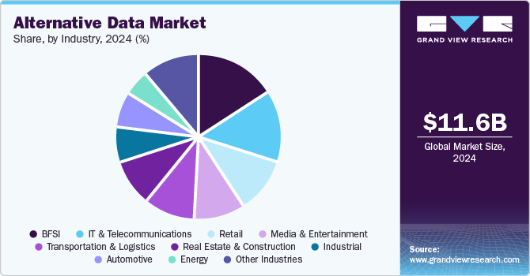

## Table of Contents

## What is construction alternative data?

Construction alternative data refers to unique and non-traditional data sources that provide insights into the construction industry. This type of data can include information from satellite imagery, social media posts, job postings, and even sensor data from construction sites. By analyzing this data, companies can gain a better understanding of construction projects, trends, and market conditions that are not easily visible through traditional data sources like financial reports or government statistics.

Using construction alternative data can help businesses make more informed decisions. For example, by monitoring satellite images, a company can track the progress of a construction project and estimate when it will be completed. This can be useful for investors who want to know when a new building will start generating revenue. Additionally, analyzing job postings can reveal which skills are in high demand, helping companies to better plan their workforce and training programs. Overall, construction alternative data provides a more detailed and real-time view of the industry, enabling better strategic planning and decision-making.

## Why is construction alternative data important?

Construction alternative data is important because it gives us new and different information about the construction industry. This information comes from places like satellite pictures, social media, job ads, and sensors on building sites. By using this data, companies can see things that they can't see with regular reports or government numbers. This helps them understand what is really happening in construction projects and how the market is doing.

This kind of data helps businesses make smarter choices. For example, by looking at satellite images, a company can watch a building project and guess when it will finish. This is good for investors who want to know when a new building will start making money. Also, by checking job ads, companies can see which skills are needed most. This helps them plan their workers and training better. In short, construction alternative data gives a clearer and more up-to-date picture of the industry, which helps with planning and making decisions.

## What are the sources of construction alternative data?

Construction alternative data comes from many different places. One source is satellite images. These pictures from space can show how fast a building project is going and if it's on time. Another source is social media. People often post about construction projects, which can give clues about what's happening on the ground. Job postings are also a source. By looking at these, you can see what kinds of jobs are needed in the construction industry, which tells you about the skills in demand.

Sensors on construction sites are another source of alternative data. These sensors can track things like how much material is being used or how many workers are on site. This helps to understand the day-to-day progress of a project. Lastly, there are mobile apps and websites that track construction activity. These platforms can provide real-time updates and detailed information about different projects, helping to keep everyone informed about what's happening in the industry.

## How can construction alternative data be collected?

Construction alternative data can be collected in many ways. One way is by using satellite images. Companies can take pictures from space to see how a construction project is going. These pictures help them see if the project is on time or if it's moving slowly. Another way is by looking at social media. People often post pictures and updates about construction sites, which can give useful information about what's happening there. Also, job postings on websites can be checked to see what kinds of jobs are needed in the construction industry. This helps companies understand what skills are in demand.

Another source of construction alternative data is sensors placed on construction sites. These sensors can track things like how much material is being used or how many workers are on site each day. This data helps to see the day-to-day progress of a project. Mobile apps and websites that track construction activity are also important. They provide real-time updates and detailed information about different projects. By using all these sources, companies can get a full picture of what's happening in the construction industry and make better decisions.

## What are the common types of construction alternative data?

Construction alternative data includes many types of information that come from different places. One common type is satellite images. These pictures from space help companies see how fast a building project is going and if it's on time. Another type is social media posts. People often share pictures and updates about construction sites, which can give useful clues about what's happening there. Job postings are also a common type of construction alternative data. By looking at these, companies can see what kinds of jobs are needed in the construction industry, which helps them understand what skills are in demand.

Sensors on construction sites are another common type of alternative data. These sensors track things like how much material is being used or how many workers are on site each day. This helps companies see the day-to-day progress of a project. Mobile apps and websites that track construction activity also provide a lot of alternative data. They give real-time updates and detailed information about different projects. By using all these types of data, companies can get a full picture of what's happening in the construction industry and make better decisions.

## How can construction alternative data be used in project management?

Construction alternative data can help project managers a lot. By looking at satellite images, they can see how the project is going and if it's on time. This helps them know if they need to speed things up or if they're doing well. Social media posts can also show what's happening at the site. If people are talking about delays or problems, the project manager can fix them quickly. Job postings tell the manager what skills are needed, so they can hire the right people.

Sensors on the site give real-time data about how much material is used and how many workers are there. This helps the manager keep track of the project every day. Mobile apps and websites that track construction can also give updates on the project. By using all this data, the project manager can make better plans and solve problems faster. This makes the whole project run smoother and finish on time.

## What are the benefits of using construction alternative data for decision-making?

Using construction alternative data helps companies make better decisions. This data comes from places like satellite images, social media, and job postings. It gives a clear picture of what's happening on construction sites and in the industry. By looking at this data, companies can see if projects are on time, what skills are needed, and how the market is doing. This helps them plan better and make smart choices about where to invest their money and time.

Another benefit is that construction alternative data is often real-time. This means companies can react quickly to changes. For example, if satellite images show a project is behind schedule, the company can take action right away to fix it. Also, social media can show if there are problems at the site, so the company can solve them fast. Using this data helps companies stay ahead and make decisions that lead to successful projects.

## What challenges are associated with collecting and analyzing construction alternative data?

Collecting and analyzing construction alternative data can be hard because there is so much information to handle. It comes from many places like satellite images, social media, and job postings. Each type of data needs different ways to collect it. For example, getting good satellite images can be expensive and needs special tools. Also, social media data can be messy because it's not always clear or true. This means companies have to spend time and money to make sure the data they collect is useful and correct.

Another challenge is making sense of all this data. Once it's collected, it needs to be cleaned and put together in a way that makes it easy to understand. This can be a big job because the data might not fit together well. For example, satellite images might show one thing, but social media posts might say something different. Companies need special computer programs and people who know how to use them to turn this data into useful information. If they don't do this right, they might make bad decisions based on wrong or unclear data.

## How does construction alternative data integrate with existing construction management systems?

Construction alternative data can be added to existing construction management systems to make them better. This data comes from places like satellite pictures, social media, and job ads. By putting this information into the systems that construction companies already use, they can see more about what's happening on their projects. For example, a construction manager might use a program to keep track of a project's timeline and budget. With alternative data, they can also see real-time updates from satellite images to check if the project is on schedule.

Adding alternative data to these systems can be tricky, but it's worth it. The main challenge is making sure the new data fits well with what's already there. This might need special computer programs to clean and organize the data so it's easy to use. Once it's set up right, the construction management system becomes more powerful. It can give a fuller picture of the project, helping managers make smarter decisions and keep everything running smoothly.

## What are the best practices for ensuring the accuracy and reliability of construction alternative data?

To make sure construction alternative data is accurate and reliable, it's important to start with good sources. This means choosing trusted places like official satellite images or well-known social media platforms. It's also helpful to check the data from more than one source. For example, if satellite images show a project is on time, it's good to see if social media posts say the same thing. This helps to make sure the information is correct. Also, cleaning the data is key. This means taking out any wrong or unclear information so what's left is useful and true.

Another important practice is to use the right tools and people to analyze the data. Special computer programs can help sort and understand the data better. It's also good to have experts who know how to use these tools and understand construction. They can spot mistakes and make sure the data makes sense. Regularly updating and checking the data is also important. This way, any changes or new information can be added quickly, keeping the data fresh and reliable. By following these steps, companies can trust the construction alternative data they use to make their decisions.

## How can advanced analytics and machine learning enhance the value of construction alternative data?

Advanced analytics and machine learning can make construction alternative data much more useful. These technologies can look at lots of data from places like satellite images and social media to find patterns and make predictions. For example, machine learning can guess when a construction project will be done by looking at how fast it's going in the pictures from space. It can also tell if a project is going to have problems by looking at what people are saying on social media. This helps companies make better plans and fix issues before they get big.

Using these tools also helps to make sense of messy data. Sometimes, the information from different sources doesn't match up well. Advanced analytics can clean up this data and put it together in a way that's easy to understand. This means companies can see a clear picture of their projects and the whole industry. By using machine learning and advanced analytics, companies can make smarter decisions, save time, and finish their projects on time and within budget.

## What future trends are expected in the field of construction alternative data?

In the future, we can expect more use of technology like artificial intelligence and machine learning in construction alternative data. These tools will help to make sense of the huge amounts of data coming from places like satellite images and social media. They will be able to predict things like when a project will finish or if there might be delays. This will help companies plan better and make smarter decisions. Also, more sensors on construction sites will give real-time information, making it easier to keep track of what's happening every day.

Another trend will be the integration of construction alternative data with other systems, like building information modeling (BIM) and project management software. This will create a complete picture of a project, from planning to finishing. Companies will be able to see everything in one place, which will help them work more efficiently. As more people start using these tools, the construction industry will become better at using data to make decisions and solve problems. This will lead to fewer delays, lower costs, and more successful projects.

## References & Further Reading

[1]: ["Advances in Financial Machine Learning"](https://www.amazon.com/Advances-Financial-Machine-Learning-Marcos/dp/1119482089) by Marcos Lopez de Prado

[2]: ["Quantitative Trading: How to Build Your Own Algorithmic Trading Business"](https://books.google.com/books/about/Quantitative_Trading.html?id=j70yEAAAQBAJ) by Ernest P. Chan

[3]: ["Satellite Imagery, Financial Forecasting, and Natural Disasters"](https://www.smithsonianmag.com/innovation/how-satellites-and-big-data-are-predicting-behavior-hurricanes-and-other-natural-disasters-180970893/) by René Carmona, Martha G., and Stefan Pichler, Journal of Financial Stability

[4]: ["Machine Learning for Algorithmic Trading"](https://github.com/PacktPublishing/Machine-Learning-for-Algorithmic-Trading-Second-Edition) by Stefan Jansen

[5]: Leonard, M., "Using Alternative Data in Algorithmic Trading," [CFA Institute Research Foundation](https://rpc.cfainstitute.org/en/research-foundation)

[6]: ["Evidence-Based Technical Analysis: Applying the Scientific Method and Statistical Inference to Trading Signals"](https://www.amazon.com/Evidence-Based-Technical-Analysis-Scientific-Statistical/dp/0470008741) by David Aronson