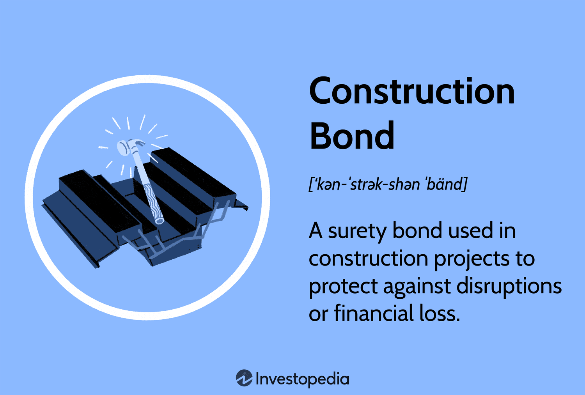

Bonds are financial instruments that play a crucial role in various economic sectors by providing security, facilitating investment, and ensuring the completion of projects. These instruments are categorized into different types depending on their purpose and the agreements they support. Surety and construction bonds, for example, are essential in creating enforceable contracts within construction and other industries, thereby ensuring accountability and financial protection. On the other hand, bonds as tradable assets in financial markets serve significant roles in the execution of investment strategies and liquidity management.

Surety bonds comprise a tripartite agreement involving a principal, an obligee, and a surety. They offer a safety net for the obligee, guaranteeing that the principal fulfills their contractual obligations. Construction bonds, as a subset of surety bonds, are designed to protect the interests of project owners by mitigating risks associated with the non-performance of contractors.



In recent years, the integration of advanced technologies such as algorithmic trading has transformed the landscape of bond trading. Algorithmic trading employs sophisticated computer algorithms to execute trades at exceptionally high speeds and volumes, revolutionizing how bond markets operate. This intersection between technology and finance has opened new avenues for optimizing investment strategies, reducing transaction costs, and enhancing market efficiency.

This article sets out to provide a comprehensive understanding of the various aspects of surety bonds and construction bonds, alongside examining their impact and relevance in the evolving domain of algorithmic trading. By exploring these topics, the article aims to illuminate the integral role bonds play in fostering economic stability and growth.

## Table of Contents

## Understanding Surety Bonds

Surety bonds play a fundamental role in various economic sectors by establishing a legally binding contract among three parties: the principal, the obligee, and the surety. The principal is the party required to perform a specific obligation, such as fulfilling the terms of a contract. The obligee is the entity that requires the bond, providing assurance that the principal will perform the obligation. The surety, typically an insurance company, guarantees that the principal will fulfill their obligations or the surety will compensate the obligee.

A surety bond functions as a risk management tool, ensuring that obligations are met while providing a layer of financial protection. It serves a dual purpose by minimizing the risk to the obligee and motivating the principal to adhere to the contract terms.

Mathematically, the liability of the surety can be expressed by defining the bond amount (B) and the completion rate (C) of the principal. If $C$ represents the fraction of the contract fulfilled by the principal (where $0 \leq C \leq 1$), the surety's potential liability $L$ is given by:

$$
L = B \times (1 - C)
$$

If the principal meets the obligation, $C = 1$ and the surety's liability is zero. Conversely, if the principal does not meet any part of the obligation ($C = 0$), the surety must cover the entire bond amount.

For businesses, surety bonds offer stability by guaranteeing that obligations will be fulfilled or compensations will be provided, which in turn enhances trust and confidence among stakeholders. They are particularly prevalent in construction projects, regulatory compliance, and various service contracts across industries.

## Construction Bonds: A Crucial Subset of Surety Bonds

Construction bonds, a significant category of surety bonds, are integral to the construction industry by providing essential financial guarantees and protections for project stakeholders. These bonds are specifically tailored to ensure that construction projects are completed according to contractual terms, safeguarding the interests of project owners and other related parties.

When entering into a construction contract, project owners, also known as obligees, require contractors, known as principals, to secure construction bonds from a third-party surety company. The surety acts as a guarantor that the contractor will fulfill its obligations under the contract. If the contractor fails to meet these obligations, the surety steps in to compensate the obligee for any resulting financial losses.

Construction bonds protect project owners against various risks associated with construction projects. These risks include delays, incomplete work, and financial insolvency of contractors. By ensuring that contractors adhere to the contract terms, construction bonds promote a stable and credible construction environment.

The functioning of construction bonds is underpinned by a tripartite agreement among the obligee, principal, and surety. This agreement is legally binding and commits the surety to fulfill the contractor’s obligations in the case of default. The use of construction bonds mitigates the financial risk for project owners, granting them the confidence to proceed with projects without the fear of substantial losses from contractor non-performance.

In conclusion, construction bonds are a vital subset of surety bonds that provide a robust framework for managing risks in construction projects. Their application ensures that project completion aligns with contract specifications, thereby protecting the financial interests of project owners and contributing to the overall stability and efficiency of the construction sector.

## Types of Construction Bonds

Construction bonds, as a subset of surety bonds, serve a pivotal role in the construction industry by ensuring that a construction project progresses smoothly and is completed as agreed. Here's an in-depth look at the primary types of construction bonds:

### Bid Bonds

Bid bonds function as a financial assurance mechanism, guaranteeing that a contractor will enter into a contract at the bid price if they are awarded the project. This type of bond protects the project owner by ensuring that the chosen contractor is capable of completing the project as proposed. Should the contractor default by not accepting the contract, the bond compensates the project owner, usually covering the cost difference until a new contractor is found. The mathematical representation of the bid bond value can be expressed as:

$$
\text{Bid Bond Value} (BBV) = \text{Bid Amount} \times \text{Percentage Rate}
$$

where the percentage rate is typically specified in the contract terms.

### Performance Bonds

Performance bonds provide a guarantee that a contractor will complete the project according to the contractual terms and specifications. These bonds are a layer of protection for the project owner against any financial loss if the contractor fails in their obligations to finish the project as agreed. In essence, it ensures fulfillment of contractual obligations, and if the contractor fails, the issuer of the performance bond steps in to cover the necessary completion costs. Performance bonds typically amount to a percentage of the total project cost:

$$
\text{Performance Bond Value} (PBV) = \text{Total Project Cost} \times \text{Performance Percentage}
$$

The performance percentage often depends on the project's complexity and the assessed risk.

### Payment Bonds

Payment bonds serve to ensure that all subcontractors, laborers, and material suppliers are paid for their work and materials. This protection ensures that there is no disruption in the project due to unpaid bills or disputes with suppliers. Payment bonds protect against liens placed on the property due to unpaid work or supplies. The value of a payment bond is generally calculated as follows:

$$
\text{Payment Bond Value} (PBV) = \text{Contractual Obligation to Subcontractors and Suppliers}
$$

In summary, each type of construction bond serves a distinct function, collectively contributing to the successful execution and financial integrity of construction projects. Understanding these types of bonds is essential for contractors, project owners, and financial stakeholders involved in construction and infrastructure development.

## Algorithmic Trading and Bonds

Algorithmic trading revolutionizes the way securities, including bonds, are traded by employing sophisticated computer algorithms to execute trades at enormous speeds and volumes. This method leverages the computational power to process vast datasets swiftly, thereby uncovering trading opportunities that are often invisible to human traders. The rise of [algorithmic trading](/wiki/algorithmic-trading) has significant implications for bond markets, directly influencing trading strategies and investment decisions.

By automating the trading process, algorithmic trading minimizes human intervention, reducing the likelihood of errors and emotional decision-making. This is particularly beneficial in bond markets, where price fluctuations can occur rapidly due to changes in interest rates, economic indicators, or market sentiment. Algorithms can instantly respond to these fluctuations, executing trades based on predefined criteria. 

One of the primary advantages of integrating algorithmic trading into bond markets is cost reduction. With the elimination of manual processes, brokerage fees are typically lowered, and trade execution becomes faster and more efficient. This efficiency translates into tighter bid-ask spreads, reducing the cost of trading for investors and enhancing overall market [liquidity](/wiki/liquidity-risk-premium). For example, an algorithm might be programmed to execute a buy order for bonds when the yield reaches a certain threshold, thus optimizing returns while minimizing risks.

Furthermore, algorithmic trading facilitates the development of complex trading strategies that can enhance investment portfolios. These strategies might involve yield curve analysis, [volatility](/wiki/volatility-trading-strategies) forecasting, or [arbitrage](/wiki/arbitrage) opportunities across different markets. For example, [statistical arbitrage](/wiki/statistical-arbitrage) techniques can identify temporary price discrepancies between related bonds, allowing traders to execute pairs trading strategies that capitalize on those discrepancies.

In the context of risk management, algorithmic trading provides tools to better assess and mitigate financial risks associated with bond trading. Algorithms can continuously monitor market conditions, adjusting trading strategies in real time to align with an investor's risk profile. This dynamic adjustment is crucial for maintaining portfolio stability, especially in volatile markets where bond prices can be highly sensitive to macroeconomic changes.

Python and other programming languages play a crucial role in algorithmic trading, providing the framework for developing and testing trading algorithms. With libraries like Pandas, NumPy, and Matplotlib, Python equips traders with the resources to analyze historical bond data, model potential trading scenarios, and visualize trading outcomes, thereby refining their strategies before execution in live markets.

Overall, the integration of algorithmic trading in bond markets represents a transformative shift towards more intelligent and responsive market operations. It not only optimizes investment strategies by reducing transaction costs and increasing efficiency but also enhances the ability to react swiftly to market developments, providing a competitive edge in the complex bond trading landscape.

## The Synergy Between Surety Bonds and Algorithmic Trading

Algorithmic trading has revolutionized the financial markets by enhancing liquidity and enabling the efficient pricing of bonds. The integration between algorithmic trading and surety bonds, specifically construction bonds, lies in the sophisticated analysis of market data that identifies patterns and potential risks, thereby allowing traders to make informed decisions.

Surety and construction bonds provide financial protection and back the fulfillment of contractual obligations. These bonds act as safety nets, ensuring the performance and payment of contracts. Their inherent characteristics of risk management and financial assurance offer valuable insights when applied to trading strategies in algorithmic trading. By understanding the dynamics of surety and construction bonds, traders can leverage this information to predict market movements and assess risks more accurately.

In the context of algorithmic trading, bonds are priced using complex models that incorporate numerous variables, including [interest rate](/wiki/interest-rate-trading-strategies) fluctuations, credit risks, and market volatility. By integrating the principles of surety and construction bonds into these models, traders are equipped with a robust framework to assess the creditworthiness of bond issuers and potential risks associated with bond portfolios.

Consider a simplified Python example illustrating how one might assess the risk of a bond portfolio using probabilistic models. By assigning probabilities to various outcomes, traders can estimate the likelihood of default and adjust their strategies accordingly.

```python
import numpy as np

def bond_default_probability(credit_score):
    # A simplified risk model based on credit score
    base = np.exp(-credit_score / 100)
    return base / (1 + base)

def portfolio_risk_analysis(bond_scores):
    # Assess risk of a portfolio of bonds
    risks = [bond_default_probability(score) for score in bond_scores]
    return np.mean(risks), np.std(risks)

bond_scores = [700, 750, 680, 720]  # Example credit scores
mean_risk, std_dev_risk = portfolio_risk_analysis(bond_scores)

print(f"Mean Default Probability: {mean_risk:.2f}")
print(f"Standard Deviation of Risk: {std_dev_risk:.2f}")
```

This code snippet models a risk assessment for a bond portfolio, using credit scores to estimate default probabilities. This type of analysis can be expanded upon by incorporating additional data such as market trends and economic indicators, providing an intricate view of potential market shifts.

Algorithmic trading's synergy with surety bonds also enhances risk prediction by enabling the use of historical data and real-time market analysis. As a result, traders can better forecast price changes and volatility. The strategic use of these bonds in algorithmic models can lead to more precise and dynamic trading strategies, ultimately improving market efficiency and stability.

## Conclusion

Bonds, whether used in construction or trading, are essential for fostering financial stability and facilitating economic growth. In the construction sector, surety bonds act as a crucial financial tool, providing assurances to project owners that contracts will be fulfilled. This not only mitigates risks associated with contractor defaults but also bolsters investor confidence, enabling more projects to proceed without significant delays or financial losses. Surety bonds like bid, performance, and payment bonds ensure that the construction lifecycle is supported by a backbone of financial security, translating to a more robust infrastructure development industry.

On the other hand, bonds in the trading sector, especially when integrated with algorithmic trading, enhance market fluidity and efficiency. Algorithmic trading leverages technology to process trades at speeds and volumes that were previously unattainable. By applying algorithms to the bond market, traders can optimize investment strategies, resulting in lower transaction costs and better price discovery. This synergy between technology and finance not only refines trading practices but also strengthens the overall financial ecosystem by enabling more precise risk management and diverse investment opportunities.

In summary, the multifaceted applications of bonds underscore their essential role across various industries. They serve as a linchpin for both physical and financial construction, thereby supporting the continuity and advancement of economic systems globally. As both sectors continue to evolve, the significance of bonds will likely expand, reflecting their adaptability and enduring importance in shaping sustainable growth and stability.

## References & Further Reading

[1]: Bergstra, J., Bardenet, R., Bengio, Y., & Kégl, B. (2011). ["Algorithms for Hyper-Parameter Optimization."](https://papers.nips.cc/paper/4443-algorithms-for-hyper-parameter-optimization) Advances in Neural Information Processing Systems 24.

[2]: ["Advances in Financial Machine Learning"](https://www.amazon.com/Advances-Financial-Machine-Learning-Marcos/dp/1119482089) by Marcos Lopez de Prado

[3]: ["Quantitative Trading: How to Build Your Own Algorithmic Trading Business"](https://www.amazon.com/Quantitative-Trading-Build-Algorithmic-Business/dp/1119800064) by Ernest P. Chan

[4]: ["Financial Risk Manager Handbook"](https://www.wiley.com/en-us/Financial+Risk+Manager+Handbook%2C+5th+Edition-p-9780470521991) by Philippe Jorion

[5]: Rubinstein, M. (1994). ["Implied Binomial Trees."](https://onlinelibrary.wiley.com/doi/abs/10.1111/j.1540-6261.1994.tb00079.x) The Journal of Finance.

[6]: ["Construction Contracting: Business and Legal Principles"](https://open.umn.edu/opentextbooks/textbooks/1219) by Richard H. Clough, Glenn A. Sears, and Keoki Sears