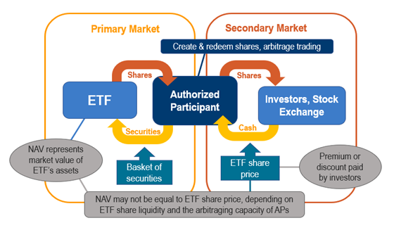

## Table of Contents

## What is an Exchange-Traded Fund (ETF)?

An Exchange-Traded Fund (ETF) is like a basket that holds a collection of different investments, such as stocks, bonds, or commodities. It's traded on a stock exchange, just like individual stocks, which means you can buy and sell it throughout the trading day at market prices. ETFs are popular because they offer an easy way to diversify your investments without having to buy each asset separately.

ETFs are managed by professionals who make sure the basket stays balanced according to its specific goals. For example, an ETF might aim to match the performance of a stock index like the S&P 500. This means it will hold the same stocks in the same proportions as the index. Because of this, ETFs can be a good choice for people who want to invest in a broad market or sector without having to pick individual stocks themselves.

## How does an ETF differ from a mutual fund?

An ETF and a mutual fund are both ways to invest in a group of assets, but they work a bit differently. An ETF trades on a stock exchange, just like a stock. This means you can buy and sell it anytime during the trading day at the current market price. A mutual fund, on the other hand, is bought and sold at the end of the trading day at a price that's calculated based on the total value of all the assets in the fund.

Another difference is how they're managed. ETFs often try to match the performance of an index, like the S&P 500, by holding the same stocks in the same amounts. This is called passive management. Mutual funds can be passively managed too, but many are actively managed, which means a professional is [picking](/wiki/asset-class-picking) and choosing investments to try to beat the market. Because of this, mutual funds can sometimes have higher fees than ETFs, which can affect your returns over time.

## What are the basic components needed to create an ETF?

To create an [ETF](/wiki/etf-trading-strategies), you first need a clear investment objective. This could be to track the performance of a specific index, like the S&P 500, or to focus on a particular sector, like technology. Once you have your objective, you need to choose the assets that will be included in the ETF. These assets could be stocks, bonds, commodities, or a mix of different types of investments. The key is to pick assets that will help the ETF meet its goal.

Next, you need a professional team to manage the ETF. This team will make sure the ETF stays true to its investment objective by regularly buying and selling assets as needed. You also need a legal structure for the ETF, which involves setting up a company or trust that will hold the assets. Finally, you need to work with a stock exchange to list the ETF so that people can buy and sell shares of it. Once all these pieces are in place, the ETF can be launched and made available to investors.

## What is the role of an authorized participant in ETF creation?

An authorized participant, or AP, is very important for creating an ETF. They are usually big financial institutions like banks or broker-dealers. Their main job is to help create and redeem shares of the ETF. When someone wants to start an ETF, the AP gathers the right mix of assets, like stocks or bonds, that match the ETF's goal. They give these assets to the ETF in exchange for new ETF shares. This process is called creation.

Once the ETF shares are created, they can be sold to the public. If people want to sell their ETF shares back, the AP steps in again. They buy the shares from investors and give them back to the ETF. In return, they get the underlying assets back from the ETF. This is called redemption. The AP's role helps keep the ETF's price in line with the value of its assets, making sure the ETF works smoothly.

## How is the creation and redemption process of ETFs managed?

The creation and redemption process of ETFs is managed by authorized participants, who are usually big financial companies. When someone wants to create new ETF shares, these authorized participants gather the right mix of assets, like stocks or bonds, that match what the ETF is supposed to hold. They then give these assets to the ETF and get new ETF shares in return. This is called the creation process. It's like trading a basket of goods for a set number of tickets that represent those goods.

Once the ETF shares are created, they can be bought and sold by regular investors on the stock exchange. If investors want to sell their ETF shares back, the authorized participants step in again. They buy the ETF shares from investors and give them back to the ETF. In return, they get the underlying assets back from the ETF. This is called the redemption process. It's like trading the tickets back for the original basket of goods. This whole process helps keep the ETF's price close to the value of its assets, making sure everything runs smoothly.

## What are the regulatory requirements for launching an ETF?

To launch an ETF, you need to follow some rules set by financial regulators. First, you have to create a detailed plan that explains what the ETF will do, what assets it will hold, and how it will be managed. This plan is called a prospectus, and it has to be approved by the Securities and Exchange Commission (SEC) in the United States, or similar regulatory bodies in other countries. The regulators make sure the ETF's goals and strategies are clear and fair to investors.

Once the prospectus is approved, you need to set up the legal structure of the ETF, which could be a trust or a company. This involves working with lawyers to make sure everything is in line with the law. After that, you need to list the ETF on a stock exchange, which also has its own set of rules and requirements. The exchange will check that the ETF meets their standards before allowing it to be traded. All these steps are important to make sure the ETF is safe and reliable for investors.

## How do ETFs track their underlying index or basket of assets?

ETFs track their underlying index or basket of assets by holding the same securities in the same proportions as the index or basket they aim to mimic. For example, if an ETF wants to track the S&P 500, it will buy all the stocks in the S&P 500 in the same amounts as they are in the index. This way, the ETF's value will move up and down with the S&P 500. To keep the ETF on track, the managers regularly check the holdings and make small changes if needed, like adding or removing stocks when the index changes.

Sometimes, ETFs use a method called sampling to track an index. Instead of buying every single stock in the index, they pick a smaller group of stocks that act a lot like the whole index. This can be a good choice when the index has too many stocks to buy them all. No matter which method they use, the goal is always the same: to make the ETF's performance as close as possible to the index or basket it's tracking.

## What are the costs associated with setting up and maintaining an ETF?

Setting up an ETF involves several costs that can add up. First, there are legal and regulatory fees. You need to work with lawyers to create the legal structure of the ETF and get it approved by the SEC or similar regulators. This can be expensive because it requires a lot of paperwork and detailed planning. Then, there are listing fees you pay to the stock exchange where the ETF will be traded. These fees cover the cost of listing and maintaining the ETF on the exchange. Finally, you might need to hire a team of professionals to manage the ETF, which adds to the initial costs.

Maintaining an ETF also comes with ongoing expenses. One of the biggest is the management fee, which is charged by the company that runs the ETF. This fee pays for the work of keeping the ETF's holdings in line with its goals. There are also trading costs every time the ETF buys or sells assets to adjust its portfolio. These costs can vary depending on how often the ETF needs to make changes. Lastly, there might be other administrative costs, like accounting and marketing, that keep the ETF running smoothly over time.

## How can market makers influence the liquidity of an ETF?

Market makers play a big role in keeping ETFs liquid. They are like middlemen who help make sure there are always buyers and sellers for an ETF. When someone wants to buy or sell an ETF, market makers step in to make the trade happen quickly. They do this by always being ready to buy or sell the ETF at a certain price. This helps keep the ETF's price stable and makes it easier for regular people to trade the ETF without waiting too long or causing big price swings.

By providing this service, market makers help keep the ETF's price close to the value of its underlying assets. If the ETF's price starts to move away from what it should be, market makers can create or redeem shares to bring it back in line. When they create shares, they add more to the market, which can increase [liquidity](/wiki/liquidity-risk-premium). When they redeem shares, they take some off the market, which can help if there are too many shares and not enough buyers. This balancing act by market makers makes the ETF more attractive to investors because they know they can trade it easily whenever they want.

## What are the different types of ETFs and how are they constructed differently?

ETFs come in different types, each built to meet different investment goals. The most common type is the index ETF, which is made to copy the performance of a specific index, like the S&P 500. To do this, the ETF buys all the same stocks as the index, in the same amounts. Another type is the sector ETF, which focuses on a particular industry, like technology or health care. These ETFs hold stocks from just that one sector. There are also commodity ETFs, which invest in things like gold or oil, and bond ETFs, which invest in different kinds of bonds. Each type of ETF is built around a different set of assets to match its specific goal.

Some ETFs are built differently to achieve their goals. Actively managed ETFs are run by professionals who pick and choose investments to try to beat the market, not just copy an index. These ETFs might change their holdings more often, which can lead to higher costs. On the other hand, smart beta ETFs use a special formula to pick their investments, aiming to do better than a plain index. They might focus on things like the size of companies or how much they pay in dividends. Each type of ETF has its own way of being put together, depending on what it's trying to do for investors.

## How do you ensure the arbitrage mechanism functions effectively in an ETF?

To make sure the [arbitrage](/wiki/arbitrage) mechanism works well in an ETF, it's important that authorized participants and market makers can create and redeem ETF shares easily. When the price of an ETF starts to move away from the value of its underlying assets, these big players step in. If the ETF's price is too high, they can create new shares by giving the ETF the right mix of assets. This adds more shares to the market, which helps bring the price back down. If the ETF's price is too low, they can redeem shares, taking them off the market and pushing the price back up. This back-and-forth keeps the ETF's price close to what it should be.

Another key part is having a lot of trading activity. When many people are buying and selling the ETF, it's easier for the arbitrage mechanism to work smoothly. This high level of trading helps keep the ETF's price in line with its net asset value (NAV). Also, clear and up-to-date information about the ETF's holdings is very important. If everyone knows what assets the ETF holds and how they're doing, it's easier for authorized participants and market makers to do their job well. All these things together help make sure the arbitrage mechanism keeps the ETF's price fair and stable.

## What advanced strategies can be used to optimize the performance of an ETF?

One advanced strategy to optimize the performance of an ETF is through smart beta investing. Smart beta ETFs use special formulas to pick their investments, focusing on things like the size of companies, how much they pay in dividends, or how much their stock prices move around. By using these formulas, the ETF tries to do better than a regular index ETF. This can help the ETF perform better over time, but it also means the ETF might need to be adjusted more often, which can lead to higher costs.

Another strategy is to use tax management techniques. Some ETFs are designed to be more tax-efficient, which means they try to reduce the taxes investors have to pay. They do this by being careful about when they buy and sell assets, to avoid triggering big tax bills. For example, they might use a method called tax-loss harvesting, where they sell assets that have gone down in value to offset gains from other investments. This can help keep more money in investors' pockets, making the ETF more attractive.

Lastly, some ETFs use leverage or inverse strategies to try to boost their performance. Leveraged ETFs aim to give investors bigger returns by using borrowed money to invest more than they normally could. Inverse ETFs, on the other hand, try to make money when the market goes down by betting against it. These strategies can lead to bigger gains, but they also come with more risk and can be more complicated to manage. They're usually best for experienced investors who understand what they're getting into.

## References & Further Reading

[1]: Ferri, R. A. (2008). ["The ETF Book: All You Need to Know About Exchange-Traded Funds."](https://www.amazon.com/ETF-Book-About-Exchange-Traded-Funds/dp/0470537469) Wiley.

[2]: Gastineau, G. L. (2002). ["The Exchange-Traded Funds Manual."](https://onlinelibrary.wiley.com/doi/book/10.1002/9781118266946) Wiley.

[3]: Madhavan, A. (2016). ["Exchange-Traded Funds and the New Dynamics of Investing."](https://academic.oup.com/book/3366) Oxford University Press.

[4]: Fabozzi, F. J., & Fuss, R. (Eds.). (2010). ["Handbook of Finance: Investment Management and Financial Management."](https://onlinelibrary.wiley.com/doi/book/10.1002/9780470404324) Wiley.

[5]: Narang, R. K. (2013). ["Inside the Black Box: A Simple Guide to Quantitative and High-Frequency Trading."](https://onlinelibrary.wiley.com/doi/book/10.1002/9781118662717) Wiley.